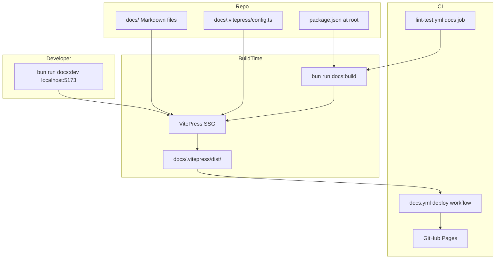
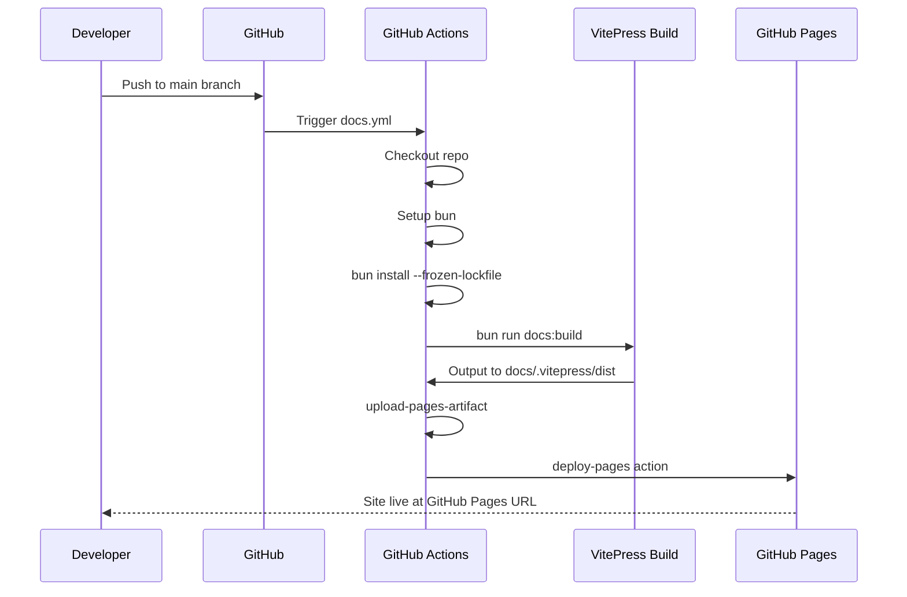
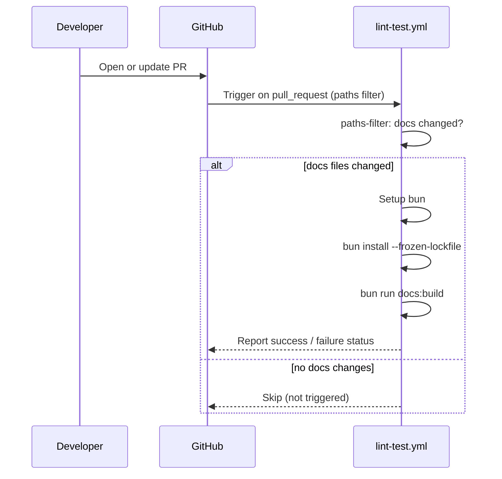

# Design Document: docs-management-vitepress

## Overview

This feature establishes a VitePress-based documentation site for the go-crypto-wallet repository. Documentation is currently scattered across `docs/`, per-directory `README.md` files, `.claude/rules/`, `.claude/skills/`, and `.claude/commands/`. The goal is to surface all of that content through a unified, navigable static site while enforcing SSOT: `.claude/rules`, `.claude/skills`, `.claude/commands`, and directory READMEs shall reference canonical content under `docs/` rather than duplicating it.

The documentation system is a static site toolchain layered on top of the existing repository. It introduces no new runtime services. The primary consumers are contributors, maintainers, and users of the wallet CLI.

### Goals

- Provide a navigable static documentation site covering architecture, chain-specific guides, usage, and AI-agent workflows
- Enforce SSOT by updating `.claude/` files and READMEs to reference `docs/` content rather than duplicate it
- Automate build and deployment via GitHub Actions on push to `main`
- Enable full-text search without external service dependencies

### Non-Goals

- Versioned documentation (single-version site reflecting current `main` branch)
- Custom VitePress theme or bespoke CSS beyond the default theme
- Auto-generated sidebar from the filesystem (manual curation used instead)
- Translation / i18n of documentation content

---

## Architecture

### Existing Architecture Analysis

The repository has no existing documentation site toolchain. Content in `docs/` is standalone Markdown used primarily by AI agents (via `.claude/rules/` references) and human contributors reading files directly. Adding VitePress is purely additive: it reads the existing `docs/` directory and produces a static site without modifying source Markdown files.

### Architecture Pattern & Boundary Map

VitePress operates as a build-time static site generator. There are no new runtime services, API boundaries, or databases.



**Architecture Integration**:

- Selected pattern: Static Site Generation (SSG) — content is compiled to HTML at build time; no server-side logic
- Domain boundaries: `docs/` owns all canonical content; VitePress config is a read-only consumer
- Existing patterns preserved: bun as package manager (consistent with `apps/`); path-filtered CI jobs (consistent with `lint-test.yml`)
- New components: `docs/.vitepress/config.ts`, root `package.json`, `docs.yml` CI workflow
- Steering compliance: `ubuntu-slim` runner, bun for JS tooling, `main` branch triggers

### Technology Stack

| Layer | Choice / Version | Role in Feature | Notes |
|-------|-----------------|-----------------|-------|
| Static site generator | VitePress ^1.6.4 | Compile Markdown to static HTML | Config in TypeScript; pin exact version in `package.json` |
| Package manager / runtime | Bun latest | Install deps, run scripts | Consistent with `apps/` and existing CI |
| Search | VitePress local (MiniSearch) | In-browser full-text search | No external service; index built at build time |
| Theme | VitePress default theme | Navigation, sidebar, ToC, dark mode | No custom CSS required |
| CI — deploy | `actions/deploy-pages@v4` | Publish to GitHub Pages | Permissions: `pages:write`, `id-token:write` |
| CI — build check | Existing `lint-test.yml` extended | PR build verification | New `docs` filter path |

Extended rationale in `research.md` — Technology Stack section.

---

## System Flows

### Documentation Build and Deploy Flow



### PR Documentation Build Check Flow



---

## Requirements Traceability

| Requirement | Summary | Components | Interfaces | Flows |
|-------------|---------|------------|------------|-------|
| 1.1 | VitePress initialized with bun | Root package.json, VitePress Config | — | Build flow |
| 1.2 | `bun run docs:dev` starts dev server | Root package.json | — | — |
| 1.3 | `bun run docs:build` builds static site | Root package.json, VitePress Config | — | Build flow |
| 1.4 | Navbar covers major areas | VitePress Config (nav) | — | — |
| 1.5 | Sidebar matches `docs/` hierarchy | VitePress Config (sidebar) | — | — |
| 2.1 | All `docs/` content browsable | VitePress Config (srcDir, sidebar) | — | — |
| 2.2 | `.claude/rules/` SSOT updates | Documentation Content (SSOT) | — | — |
| 2.3 | `.claude/skills/` SSOT updates | Documentation Content (SSOT) | — | — |
| 2.4 | `.claude/commands/` SSOT updates | Documentation Content (SSOT) | — | — |
| 2.5 | Directory README SSOT updates | Documentation Content (SSOT) | — | — |
| 2.6 | AI-agent section in site | VitePress Config (sidebar), Documentation Content | — | — |
| 3.1–3.7 | Content coverage (all sections) | VitePress Config (nav/sidebar), Documentation Content | — | — |
| 4.1 | Full-text search | VitePress Config (search: local) | — | — |
| 4.2 | Breadcrumb navigation | VitePress default theme | — | — |
| 4.3 | Overview index page | Documentation Content (docs/index.md) | — | — |
| 4.4 | Per-page table of contents | VitePress default theme | — | — |
| 5.1 | Auto-deploy on push to main | docs.yml CI Workflow | GitHub Pages API | Deploy flow |
| 5.2 | PR build check | lint-test.yml (docs job) | GitHub Checks API | PR flow |
| 5.3 | Build failure blocks PR | lint-test.yml (docs job) | GitHub Checks API | PR flow |
| 5.4 | Build output excluded from git | .gitignore | — | — |
| 6.1 | Minimal sidebar update effort | VitePress Config (sidebar) | — | — |
| 6.2 | Frontmatter support | VitePress default (built-in) | — | — |
| 6.3 | TypeScript config | VitePress Config (config.ts) | — | — |
| 6.4 | Default theme | VitePress Config (theme) | — | — |

---

## Components and Interfaces

| Component | Domain/Layer | Intent | Req Coverage | Key Dependencies | Contracts |
|-----------|-------------|--------|--------------|------------------|-----------|
| Root package.json | Toolchain | Entry point for all docs scripts | 1.1–1.3 | bun, vitepress | Batch |
| VitePress Config | Toolchain | Site metadata, nav, sidebar, search | 1.1, 1.4–1.5, 2.1, 2.6, 3.1–3.7, 4.1–4.4, 6.1–6.4 | docs/ Markdown files | Batch |
| Documentation Content | Content | Canonical source + SSOT updates | 2.1–2.6, 3.1–3.7, 4.3 | — | — |
| docs.yml CI Workflow | CI/CD | Build and deploy on push to main | 5.1, 5.3, 5.4 | bun, GitHub Pages, ubuntu-slim | Batch |
| lint-test.yml (docs job) | CI/CD | Build check on PRs touching docs | 5.2, 5.3 | bun, ubuntu-slim | Batch |
| .gitignore | Toolchain | Exclude build artifacts | 5.4 | — | — |

### Toolchain

#### Root `package.json`

| Field | Detail |
|-------|--------|
| Intent | Defines bun scripts for docs dev, build, and preview |
| Requirements | 1.1, 1.2, 1.3 |

**Responsibilities & Constraints**

- Declares `vitepress` as a pinned dev dependency (e.g., `"vitepress": "^1.6.4"`) — never use `"latest"` to ensure reproducible CI builds
- Provides scripts: `docs:dev`, `docs:build`, `docs:preview`
- Must not interfere with Go tooling (Go ignores `package.json`)

**Dependencies**

- External: `vitepress` (latest stable) — static site generator (P0)
- External: `bun` — package manager and script runner (P0)

**Contracts**: Batch [x]

##### Batch / Job Contract

- Trigger: `bun run docs:dev` (development) / `bun run docs:build` (production) / `bun run docs:preview` (preview)
- Input: Markdown files under `docs/`, config at `docs/.vitepress/config.ts`
- Output (build): Static HTML/CSS/JS in `docs/.vitepress/dist/`
- Output (dev): Hot-reloading server at `http://localhost:5173`
- Idempotency: Build is fully reproducible from source

**Implementation Notes**

- Integration: Place at repo root (not inside `apps/`); `srcDir` in config points to `docs/`
- Validation: `bun run docs:build` must succeed with zero errors in CI
- Risks: Root `package.json` is new for this Go repository; ensure Go tools (e.g., `go mod tidy`) are unaffected; verify `bun.lock` and `node_modules/` are gitignored

---

#### VitePress Config (`docs/.vitepress/config.ts`)

| Field | Detail |
|-------|--------|
| Intent | Declares site metadata, navigation bar, sidebar hierarchy, and search configuration |
| Requirements | 1.1, 1.4, 1.5, 2.1, 2.6, 3.1–3.7, 4.1, 6.1, 6.3, 6.4 |

**Responsibilities & Constraints**

- Provides `title`, `description`, `base` (set to `/go-crypto-wallet/` for GitHub Pages)
- Defines `nav` array covering: Getting Started, Architecture, Chains (BTC/BCH/ETH/XRP), Database, Guidelines, AI Agent & Dev Workflow
- Defines `sidebar` object keyed by path prefix, organizing all `docs/` content hierarchically
- Enables `search: { provider: 'local' }` for MiniSearch-based full-text search
- Written in TypeScript using `defineConfig` for type safety

**Dependencies**

- External: `vitepress` — provides `defineConfig`, `DefaultTheme` types (P0)
- Inbound: All `docs/**/*.md` files — rendered as site pages (P0)

**Contracts**: Batch [x]

##### Batch / Job Contract

- Trigger: `bun run docs:build` or `bun run docs:dev`
- Input: `docs/**/*.md`, any assets in `docs/public/`
- Output: Configured VitePress build consuming all source Markdown
- Idempotency: Config is declarative; same input always produces same site structure

**Implementation Notes**

- Integration: `base` must match the GitHub Pages deployment path; test with `bun run docs:preview` before first deploy
- Validation: All sidebar `link` values must resolve to actual `.md` files (broken links fail the build)
- Risks: Sidebar drift as new docs files are added — mitigated by documenting the sidebar update convention

##### Service Interface

```typescript
// docs/.vitepress/config.ts
import { defineConfig } from 'vitepress'

export default defineConfig({
  title: string,           // Site title shown in navbar and <title>
  description: string,     // Meta description for SEO
  base: string,            // Deployment base path, e.g. '/go-crypto-wallet/'
  cleanUrls: boolean,      // Remove .html from URLs
  themeConfig: {
    nav: NavItem[],        // Top navigation bar items
    sidebar: SidebarMulti, // Path-keyed sidebar groups
    search: {
      provider: 'local'    // MiniSearch full-text search
    },
    socialLinks: SocialLink[]
  }
})
```

---

### Content

#### Documentation Content (`docs/`)

| Field | Detail |
|-------|--------|
| Intent | Canonical source of all project documentation; updated to eliminate duplication from `.claude/` files and READMEs |
| Requirements | 2.1–2.6, 3.1–3.7, 4.3 |

**Responsibilities & Constraints**

- `docs/index.md` serves as the VitePress home page (hero layout with project overview and links to major sections)
- Existing Markdown files under `docs/` are rendered as-is; no content migration required
- SSOT enforcement: `.claude/rules/*.md`, `.claude/skills/*/SKILL.md`, `.claude/commands/*.md`, and directory-level `README.md` files that duplicate content from `docs/` are updated to reference the canonical source using relative Markdown links or cross-references
- Files in `.claude/` are not rendered by VitePress (they are outside `srcDir`); the site only surfaces `docs/` content

**Dependencies**

- Inbound: All source Markdown files in `docs/` (P0)
- Inbound: VitePress Config — determines which files appear in sidebar/nav (P0)

**Contracts**: (none — content layer, no code interfaces)

**Implementation Notes**

- Integration: Create `docs/index.md` with VitePress frontmatter (`layout: home`) and a project overview; this is the only new file required under `docs/`
- Validation (SSOT): A file in `.claude/` is considered **duplicate** when it contains a section or paragraph that is a verbatim copy (or near-copy, >50% overlap) of a section in `docs/`. Meta-instructions that merely _reference_ or _link to_ `docs/` content are not duplicates and must not be removed. For each identified duplicate: replace the duplicated body with a Markdown link to the canonical `docs/` page and a one-line summary. To prevent future re-duplication, add a note to `docs/guidelines/workflow.md` and the PR checklist convention that new guidance belongs in `docs/` first.
- Risks: SSOT updates to `.claude/` files require careful judgment (duplicated prose vs. supplementary agent instructions); prefer conservative link-and-summarize over deletion to avoid breaking AI-agent workflows

---

### CI/CD

#### `docs.yml` — Documentation Deploy Workflow

| Field | Detail |
|-------|--------|
| Intent | Build VitePress site and deploy to GitHub Pages on every push to `main` that touches `docs/` or VitePress config |
| Requirements | 5.1, 5.3 |

**Responsibilities & Constraints**

- Triggers on push to `main` with path filter: `docs/**`, `package.json`, `bun.lock`
- Uses `ubuntu-slim` runner per project convention
- Sets required GitHub Pages permissions: `contents: read`, `pages: write`, `id-token: write`
- Uses `concurrency` to cancel in-progress deploys (allow in-progress to complete for production)
- Steps: checkout → setup-bun → `bun install --frozen-lockfile` → `bun run docs:build` → `upload-pages-artifact` → `deploy-pages`

**Dependencies**

- External: `oven-sh/setup-bun@v2` — bun setup (P0)
- External: `actions/configure-pages@v5`, `actions/upload-pages-artifact@v3`, `actions/deploy-pages@v4` — GitHub Pages deploy (P0)

**Contracts**: Batch [x]

##### Batch / Job Contract

- Trigger: Push to `main` with changes to `docs/**` or `package.json` or `bun.lock`; also supports `workflow_dispatch`
- Input: Repo contents, bun lockfile
- Output: Static site deployed to GitHub Pages
- Idempotency: Re-triggering a deploy with the same commit is safe (idempotent)

**Implementation Notes**

- Integration: GitHub repository must have Pages enabled with source set to "GitHub Actions" (not a branch); one-time repo setup required
- Validation: Confirm `base` in `config.ts` matches the repo name path before first deploy
- Risks: `base` misconfiguration causes broken asset paths; mitigated by testing with `bun run docs:preview`

---

#### `lint-test.yml` — Docs Build Check Job (Extension)

| Field | Detail |
|-------|--------|
| Intent | Run `bun run docs:build` on PRs that touch documentation or VitePress config, reporting as a required status check |
| Requirements | 5.2, 5.3 |

**Responsibilities & Constraints**

- Extends the existing `lint-test.yml` workflow
- Adds a `docs` path filter: `docs/**`, `package.json`, `bun.lock`
- New `docs-build` job: setup-bun → `bun install --frozen-lockfile` → `bun run docs:build`
- If build fails, job fails and blocks PR merge (enforced via branch protection)
- Does not deploy; deploy-only responsibility belongs to `docs.yml`

**Contracts**: Batch [x]

##### Batch / Job Contract

- Trigger: `pull_request` to `main` with changes matching the `docs` path filter
- Input: `docs/**`, VitePress config, bun lockfile
- Output: GitHub Checks status (pass/fail)
- Idempotency: Re-running on same commit is safe

**Implementation Notes**

- Integration: Add `docs` entry to the `dorny/paths-filter` step; add `docs-build` job conditioned on `needs.changes.outputs.docs == 'true'`; use `ubuntu-slim` runner
- Risks: Build may pass locally but fail in CI if `bun.lock` is out of date — mitigated by `--frozen-lockfile` flag

---

### Toolchain

#### `.gitignore` Updates

| Field | Detail |
|-------|--------|
| Intent | Exclude VitePress build artifacts and `node_modules` from version control |
| Requirements | 5.4 |

**Implementation Notes**

- Add: `node_modules/`, `docs/.vitepress/dist/`, `docs/.vitepress/cache/`
- Validation: `git status` after `bun install` and `bun run docs:build` should show no untracked artifacts

---

## Error Handling

### Error Strategy

All errors in this system occur at build time, not runtime. VitePress exits with a non-zero code on any build error, which CI interprets as job failure.

### Error Categories and Responses

**Build Errors** (VitePress compile failures):

- Broken internal links → VitePress build fails with link resolution error → fix the sidebar `link` value or create the missing file
- Invalid config syntax → TypeScript compilation error → fix `config.ts`
- Missing `docs/index.md` → VitePress serves a blank root → create the index page

**CI Failures**:

- `bun install` fails → lockfile mismatch → run `bun install` locally and commit updated `bun.lock`
- `bun run docs:build` fails in CI but passes locally → environment difference → check for absolute paths or OS-specific behavior in config

**Deploy Failures**:

- GitHub Pages permissions not configured → `deploy-pages` step fails → enable Pages in repo settings with "GitHub Actions" source
- `base` mismatch → assets load with 404 → verify `base` matches `/<repo-name>/`

---

## Testing Strategy

### Build Verification

- Run `bun run docs:build` from repo root; assert zero errors and non-empty `docs/.vitepress/dist/`
- Run `bun run docs:preview` and manually verify nav, sidebar, search, and home page render correctly

### Link Integrity

- VitePress built-in link checker (enabled by default in build mode) catches all broken internal links
- Verify all sidebar `link` entries resolve to real files before merging

### CI Integration Tests

- Open a PR touching `docs/` and confirm the `docs-build` check appears and passes
- Merge to `main` and confirm `docs.yml` runs and GitHub Pages URL returns HTTP 200

### SSOT Verification

- After updating `.claude/rules/` and `.claude/commands/` files, confirm the referenced `docs/` pages exist and render in the VitePress site

---

## Security Considerations

- GitHub Actions deploy workflow uses minimal permissions (`contents: read`, `pages: write`, `id-token: write`)
- No secrets or API keys required (local search; no Algolia)
- Documentation content is public (open-source repository); no access control required

---

## Migration Strategy

No data migration is required. All existing `docs/` Markdown files are consumed as-is by VitePress. The migration concerns are operational:

1. **Phase 1**: Add `package.json` (with VitePress pinned), `docs/.vitepress/config.ts`, `docs/index.md`, `.gitignore` updates
2. **Phase 2**: Configure nav and sidebar; run `bun run docs:build` to verify all links resolve
3. **Phase 3**: Add CI workflows (`docs.yml`, extend `lint-test.yml`); verify PR check triggers correctly
4. **Phase 4** _(prerequisite gate before proceeding)_:
   - **Repo Setup**: Navigate to repository **Settings → Pages → Source** and select **"GitHub Actions"**. This one-time step is required for `actions/deploy-pages` to publish the site.
   - **Verify `base`**: Confirm `base` in `docs/.vitepress/config.ts` matches `/<repo-name>/` (e.g., `/go-crypto-wallet/`). Run `bun run docs:preview` locally to validate asset paths before the first deploy.
   - Merge to `main` and confirm the GitHub Pages URL returns HTTP 200.
5. **Phase 5**: SSOT enforcement — audit and update `.claude/rules/`, `.claude/skills/`, `.claude/commands/`, and READMEs (see Documentation Content — Implementation Notes for duplication criteria)

Rollback: Remove `package.json`, `docs/.vitepress/`, and the CI workflow; no existing files are modified in Phases 1–4.

---

## Supporting References

- Full technology research notes: `.kiro/specs/docs-management-vitepress/research.md`
- [VitePress Site Config Reference](https://vitepress.dev/reference/site-config) — `base`, `cleanUrls`, `themeConfig`
- [VitePress Default Theme Config](https://vitepress.dev/reference/default-theme-config) — `nav`, `sidebar`, `search`, `socialLinks`
- [VitePress GitHub Pages Deploy](https://vitepress.dev/guide/deploy#github-pages) — canonical workflow template
