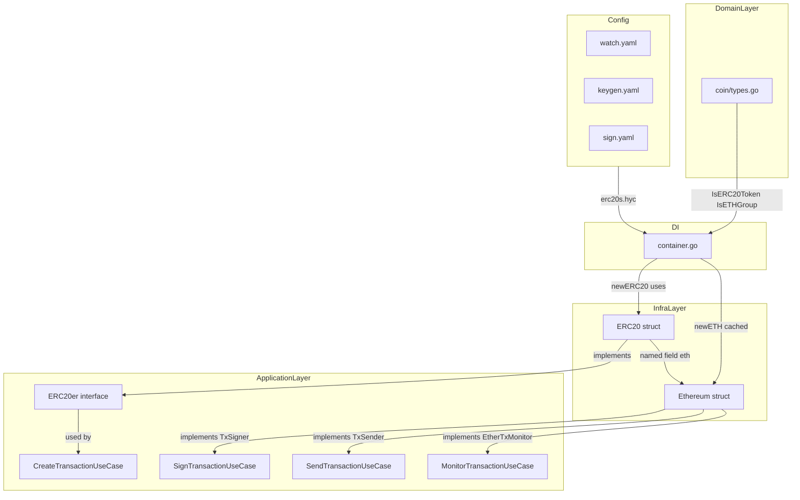
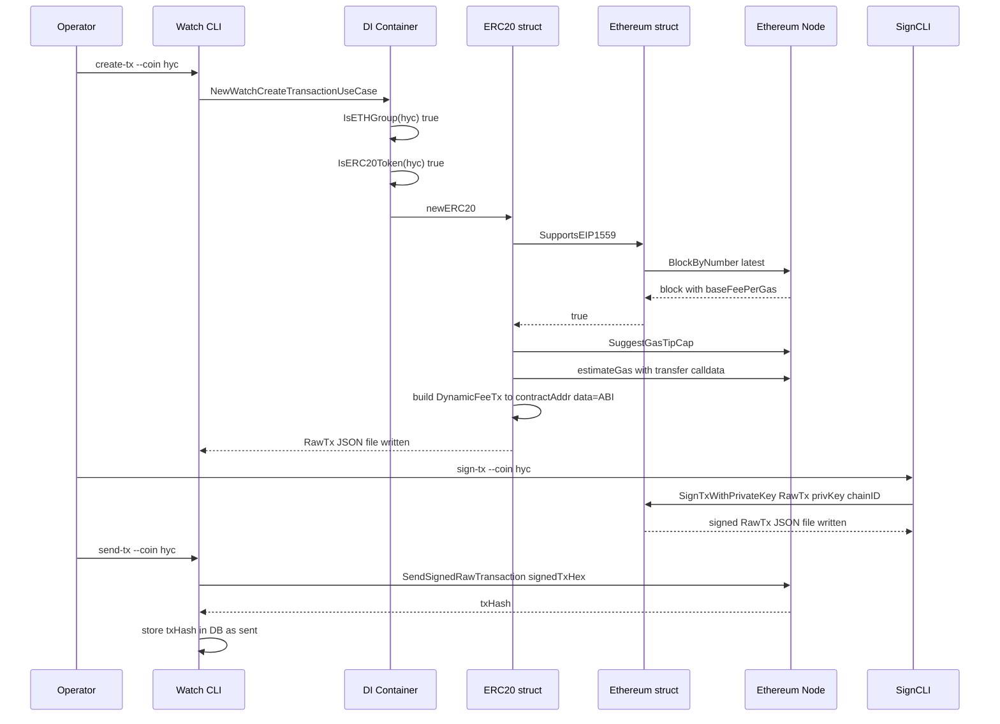

# Design Document: erc20-token-transfer

## Overview

This feature adds full ERC-20 token transfer support for the **HYC token** to the go-crypto-wallet Go application. It registers HYC in the domain type system, upgrades the ERC-20 infrastructure to support EIP-1559 (Type 2) transactions by composing the existing `Ethereum` struct, and adds HYC entries to all wallet configuration files.

The watch wallet's create/send/monitor flows already route any `IsETHGroup` coin to the ETH use cases. Adding HYC to the domain registries is therefore sufficient to activate all three watch wallet flows without any new CLI commands, use cases, or adapters.

**Users**: Watch-wallet operators, keygen/sign-wallet operators.
**Impact**: HYC token transfers will use EIP-1559 transactions on supporting networks (Anvil, post-London Ethereum), falling back to legacy on unsupporting nodes.

### Goals

- Register HYC in all three domain type registries (`CoinType`, `CoinTypeCode`, `ERC20Token`)
- Activate EIP-1559 (Type 2) transaction support for all ERC-20 token transfers
- Add HYC to wallet configuration files (keygen, sign, watch)
- Provide unit test coverage for domain registration and ERC-20 EIP-1559 paths

### Non-Goals

- Solidity contract changes (handled by `erc20-token` spec)
- New CLI commands (existing ETH commands serve HYC automatically)
- New use cases or adapters (DI routing already covers `IsETHGroup` coins)
- Support for ERC-721, ERC-1155, or other token standards
- Dynamic token registry (adding tokens without code changes)

### Design Decision: Remove Generic `CoinTypeERC20` / `ERC20 CoinTypeCode`

`CoinTypeERC20 = 9000` and `ERC20 CoinTypeCode = "erc20"` are generic placeholders introduced before specific per-token types existed. With HYT (`9001`) and HYC (`9002`) each having their own type codes, the generic "erc20" entry is ambiguous — it implies a valid coin that the system cannot actually handle end-to-end.

**Removed**:
- `CoinTypeERC20 CoinType = 9000` and its `CoinTypeCodeValue` entry
- `ERC20 CoinTypeCode = "erc20"` constant

**Updated**:
- `IsETHGroup`: `val == ETH || IsERC20Token(val.String())` (the `val == ERC20` arm is dropped)
- `key/strategy/factory.go`: `case domainCoin.ETH, domainCoin.ERC20:` → `case domainCoin.ETH:` plus an `IsETHGroup` arm for ERC-20 tokens
- All BTC-specific "not implemented" switch cases: `domainCoin.ERC20` removed from the guard list

The TODO comment on `CoinTypeERC20` already flagged it for review ("temporary values"). This change completes that review.

---

## Requirements Traceability

| Requirement | Summary | Components | Interfaces | Flows |
|-------------|---------|------------|------------|-------|
| 1.1–1.7 | HYC domain registration | `DomainCoinTypes` | `IsCoinTypeCode`, `IsERC20Token`, `IsETHGroup` | — |
| 2.1–2.5 | HYC config YAML entries | `WalletConfig` | `Ethereum.ERC20s` map | — |
| 3.1–3.6 | EIP-1559 for ERC-20 | `ERC20Infrastructure` | `ERC20er` | Create-tx flow |
| 4.1–4.5 | Create unsigned tx (watch) | `ERC20Infrastructure`, DI | `ERC20er.CreateRawTransactionEIP1559` | Create-tx flow |
| 5.1–5.6 | Sign tx offline (sign wallet) | `Ethereum.SignTxWithPrivateKey` | `TxSigner` | Sign flow |
| 6.1–6.4 | Send signed tx (watch) | Existing `SendTransactionUseCase` | `TxSender` | Send flow |
| 7.1–7.5 | Monitor tx (watch) | Existing `MonitorTransactionUseCase` | `EtherTxMonitor` | Monitor flow |
| 8.1–8.5 | Unit tests | `DomainCoinTypes`, `ERC20Infrastructure` | — | — |

---

## Architecture

### Existing Architecture Analysis

The project follows Clean Architecture with strict layer separation:

```
Interface Adapters → Application Layer → Domain Layer ← Infrastructure Layer
```

Key existing patterns relevant to this feature:

- **DI routing**: `container.go` dispatches by `CoinTypeCode` using `IsETHGroup`/`IsERC20Token` predicates. All ETH-group coins (including new ERC-20 tokens) share the same use cases.
- **`ERC20er` interface**: Defined in `application/ports/api/eth/interface.go`; implemented by `ERC20` (infrastructure). Watch wallet's `CreateTransactionUseCase` depends on this interface.
- **EIP-1559 support**: `Ethereum` struct implements full EIP-1559 detection and `DynamicFeeTx` construction. `ERC20` hardcodes `SupportsEIP1559() = false` with a TODO to embed `Ethereum`.
- **Config-driven token metadata**: `config.Ethereum.ERC20s map[ERC20Token]ERC20` is fully generic; no code changes needed to support a new token in config.

### Architecture Pattern & Boundary Map



**Key design decisions** (full rationale in `research.md`):

- **Named field composition** (`eth *eth.Ethereum` in `ERC20`): avoids accidental promotion of all `Ethereumer` methods; resolves existing TODO comment
- **DI shares `c.newETH()`**: `newERC20()` passes the cached `*eth.Ethereum` to `NewERC20` — no duplicate node connections
- **Dynamic EIP-1559 fees**: `maxFeePerGas = (baseFee × 2) + tip` — same formula as `Ethereum.CreateRawTransactionEIP1559`; config `MaxFeePerGas` acts as safety cap

### Technology Stack

| Layer | Choice / Version | Role in Feature | Notes |
|-------|------------------|-----------------|-------|
| Domain | Go 1.25 constants | HYC type registration | `types.go` additions only |
| Infrastructure | `go-ethereum` (existing) | `DynamicFeeTx` construction, fee queries | No version change |
| Config | YAML (existing) | HYC token metadata in `erc20s` map | Contract address is operator-supplied |
| DI | Existing `container.go` | Wire `*eth.Ethereum` into `NewERC20` | Minor constructor update |

---

## System Flows

### ERC-20 Token Transfer: Create → Sign → Send



**Flow decisions**: `SupportsEIP1559` is called once per `CreateRawTransactionEIP1559` invocation — no caching needed for short-lived watch processes. Legacy fallback is automatic when `baseFeePerGas` is absent in block header.

---

## Components and Interfaces

### Summary Table

| Component | Layer | Intent | Req Coverage | Key Dependencies | Contracts |
|-----------|-------|--------|--------------|-----------------|-----------|
| `DomainCoinTypes` | Domain | Register HYC in 3 type systems | 1.1–1.7 | — | Service |
| `WalletConfig` | Config | HYC metadata in YAML files | 2.1–2.5 | Deployed contract address | — |
| `ERC20Infrastructure` | Infrastructure | EIP-1559 tx creation for ERC-20 | 3.1–3.6, 4.1–4.5 | `*eth.Ethereum` (named field) | Service |
| `DIContainer` | DI | Wire `*eth.Ethereum` into `NewERC20` | 3.5, 4.1 | `newETH()` cached instance | — |

---

### Domain Layer

#### DomainCoinTypes

| Field | Detail |
|-------|--------|
| Intent | Add HYC to `CoinType`, `CoinTypeCode`, and `ERC20Token` registries in `internal/domain/coin/types.go` |
| Requirements | 1.1, 1.2, 1.3, 1.4, 1.5, 1.6, 1.7 |

**Responsibilities & Constraints**

- Add `CoinTypeERC20HYC CoinType = 9002` (temporary SLIP-0044 value, consistent with HYT = 9001)
- Add `HYC CoinTypeCode = "hyc"` and entry `HYC: CoinTypeERC20HYC` in `CoinTypeCodeValue`
- Add `TokenHYC ERC20Token = "hyc"` and entry `TokenHYC: true` in `ERC20Map`
- Domain layer has zero infrastructure dependencies — changes are pure constant additions
- Backward compatibility: existing `HYT` and `BAT` entries must remain unchanged

**Dependencies**

- None (domain layer has no outbound dependencies)

**Contracts**: Service [x]

##### Service Interface

```go
// Postconditions after additions to types.go:
IsCoinTypeCode("hyc")  // returns true
IsERC20Token("hyc")    // returns true
IsETHGroup("hyc")      // returns true (via IsERC20Token internally)
BIP44AccountPath("hyc", 0)  // returns "m/44'/9002'/0'"
```

- Preconditions: none
- Postconditions: all three validation functions return `true` for `"hyc"` input
- Invariants: existing constants `HYT = 9001`, `BAT` remain unchanged

**Implementation Notes**

- Integration: 5 additive lines in `types.go`; no callers require updates
- Validation: verified by unit tests in `internal/domain/coin/types_test.go`
- Risks: none — pure constant additions

---

### Infrastructure Layer

#### ERC20Infrastructure

| Field | Detail |
|-------|--------|
| Intent | Extend `ERC20` struct with `*eth.Ethereum` named field; implement real `SupportsEIP1559` and `CreateRawTransactionEIP1559` using EIP-1559 `DynamicFeeTx` |
| Requirements | 3.1, 3.2, 3.3, 3.4, 3.5, 3.6, 4.2, 4.3, 4.4, 4.5 |

**Responsibilities & Constraints**

- `ERC20` struct gains a private named field `eth *eth.Ethereum` — no Go promotion of Ethereum methods
- `SupportsEIP1559(ctx)` delegates to `e.eth.SupportsEIP1559(ctx)` — detects Anvil or `baseFeePerGas` in latest block
- `CreateRawTransactionEIP1559` builds `types.DynamicFeeTx` with `Data` field set to ABI-encoded `transfer(address,uint256)` calldata
- `getNonce` delegates to `e.eth.getNonce` (or calls `e.eth.GetTransactionCount` directly) — resolves existing FIXME
- The `ERC20er` interface contract is unchanged; compile-time check `var _ apieth.ERC20er = (*ERC20)(nil)` must continue to pass

**Dependencies**

- Inbound: `DI Container` → constructs `ERC20` via `NewERC20` (P0)
- Outbound: `*eth.Ethereum` named field → provides EIP-1559 detection and fee helpers (P0)
- Outbound: `*contract.Token` → ERC-20 balance queries (P1, unchanged)
- External: `go-ethereum/core/types.DynamicFeeTx` → EIP-1559 transaction struct (P0, existing dep)

**Contracts**: Service [x]

##### Service Interface

```go
// ERC20er interface (unchanged in application/ports/api/eth/interface.go):
type ERC20er interface {
    ValidateAddr(addr string) error
    FloatToBigInt(v float64) *big.Int
    GetBalance(ctx context.Context, hexAddr string, quantityTag domainETH.QuantityTag) (*big.Int, error)
    CreateRawTransaction(ctx context.Context, fromAddr, toAddr string, amount uint64, additionalNonce int) (*domainETH.RawTx, *TxCreateParams, error)
    SupportsEIP1559(ctx context.Context) bool
    CreateRawTransactionEIP1559(ctx context.Context, fromAddr, toAddr string, amount uint64, additionalNonce int) (*domainETH.RawTx, *TxCreateParams, error)
}

// ERC20 struct (modified fields):
type ERC20 struct {
    eth             *eth.Ethereum  // NEW: named field; provides EIP-1559 helpers
    client          *ethclient.Client
    tokenClient     *contract.Token
    token           domainCoin.ERC20Token
    uuidHandler     uuid.UUIDHandler
    name            string
    contractAddress string
    masterAddress   string
    decimals        int
}

// NewERC20 constructor (modified signature):
func NewERC20(
    eth             *eth.Ethereum,  // NEW parameter
    client          *ethclient.Client,
    tokenClient     *contract.Token,
    token           domainCoin.ERC20Token,
    uuidHandler     uuid.UUIDHandler,
    name            string,
    contractAddress string,
    masterAddress   string,
    decimals        int,
) *ERC20
```

`CreateRawTransactionEIP1559` behavior contract:

- When `e.eth.SupportsEIP1559(ctx)` returns `true`:
  returns `*domainETH.RawTx` with `TxHex` encoding a `types.DynamicFeeTx` (`EthTxType = 2`)
- When `e.eth.SupportsEIP1559(ctx)` returns `false`:
  falls back to `CreateRawTransaction` (legacy Type 0)
- When computed `maxFeePerGas` exceeds configured cap and cap > 0:
  returns `error`
- Preconditions: `fromAddr`, `toAddr` pass `ValidateAddr`; contract address non-empty
- Postconditions: returned `TxCreateParams.EthTxType` is `2` for EIP-1559, `0` for legacy

**Implementation Notes**

- Integration: `NewERC20` gains one new leading parameter `eth *eth.Ethereum`; `newERC20()` in `container.go` must call `c.newETH()` and pass the result
- Validation: `var _ apieth.ERC20er = (*ERC20)(nil)` compile-time check ensures interface contract
- Risks: `e.eth` could be nil if misconfigured; DI panics on startup are acceptable per coding conventions (see `di.md`)

---

### DI Container

#### DIContainer (minor update)

| Field | Detail |
|-------|--------|
| Intent | Pass cached `*eth.Ethereum` to `NewERC20` constructor; avoid duplicate node connections |
| Requirements | 3.5 |

**Implementation Notes**

- `newERC20()` calls `c.newETH().(* eth.Ethereum)` — safe because `c.newETH()` is lazy-cached; no circular init
- No routing logic changes; `IsETHGroup`/`IsERC20Token` already handle `"hyc"` once domain registration is complete
- Risks: none — existing lazy-init pattern is established

---

## Data Models

### Domain Model

No new domain entities. The additions are pure constants:

```
CoinType  (uint32)   CoinTypeERC20HYC = 9002
CoinTypeCode (string) HYC = "hyc"
ERC20Token (string)  TokenHYC = "hyc"
```

**Invariant**: `CoinTypeCodeValue[HYC].Uint32()` must equal `CoinTypeERC20HYC.Uint32()` (= 9002) for correct BIP-44 path derivation.

### Data Contracts & Integration

#### Unsigned Transaction JSON (existing schema, extended)

`TxCreateParams` returned by `CreateRawTransactionEIP1559` for ERC-20 tokens:

| Field | Type | EIP-1559 | Legacy | Notes |
|-------|------|----------|--------|-------|
| `EthTxType` | `uint8` | `2` | `0` | Distinguishes tx format for signing |
| `ChainID` | `uint64` | set | `0` | Required for EIP-155 replay protection |
| `MaxFeePerGas` | `uint64` | set (Wei) | `0` | `(baseFee × 2) + tip` |
| `MaxPriorityFeePerGas` | `uint64` | set (Wei) | `0` | From `SuggestGasTipCap` |
| `GasPrice` | `uint64` | `0` | set (Wei) | Mutually exclusive with EIP-1559 fields |
| `GasLimit` | `uint32` | set | set | From `estimateGas(data)` |

The `Data` field of the encoded transaction contains ABI-encoded `transfer(address,uint256)` calldata (method selector `0xa9059cbb`). This is unchanged from the existing legacy implementation.

---

## Error Handling

### Error Strategy

All errors are returned as Go `error` values wrapped with `fmt.Errorf("context: %w", err)` per project convention. No panics in infrastructure or use case layers.

### Error Categories and Responses

**Validation Errors** (input boundary):
- Invalid `fromAddr` or `toAddr` → `errors.New("address validation error")` — no change from existing behavior
- Zero token balance → `errors.New("balance is short to send token")` — no change

**EIP-1559 Errors** (new):
- Node does not support EIP-1559 → automatic fallback to `CreateRawTransaction`; no error returned
- `baseFeePerGas` absent in block → `errors.New("baseFeePerGas not found in block (EIP-1559 not activated)")` — inherited from `Ethereum.CreateRawTransactionEIP1559`
- Computed `maxFeePerGas` exceeds config cap → `fmt.Errorf("computed maxFeePerGas %d exceeds configured cap %d", ...)`

**Infrastructure Errors** (node connectivity):
- All node errors wrapped with context: `fmt.Errorf("fail to call %s(): %w", methodName, err)`

### Monitoring

- All existing `logger.Debug` / `logger.Info` / `logger.Warn` patterns extended to EIP-1559 fee logging (same as `Ethereum.CreateRawTransactionEIP1559`)
- No new observability infrastructure required

---

## Testing Strategy

### Unit Tests

1. **`internal/domain/coin/types_test.go`** — HYC domain registration:
   - `IsCoinTypeCode("hyc")` returns `true`
   - `IsERC20Token("hyc")` returns `true`
   - `IsETHGroup("hyc")` returns `true`
   - `BIP44AccountPath(HYC, 0)` returns `"m/44'/9002'/0'"`
   - Existing constants (`HYT`, `BAT`) unaffected

2. **`internal/infrastructure/api/eth/erc20/erc20_test.go`** — EIP-1559 infrastructure:
   - `SupportsEIP1559`: when `eth.SupportsEIP1559` returns `true`, `ERC20.SupportsEIP1559` returns `true`
   - `SupportsEIP1559`: when `eth.SupportsEIP1559` returns `false`, `ERC20.SupportsEIP1559` returns `false`
   - `CreateRawTransactionEIP1559`: when EIP-1559 supported, `TxCreateParams.EthTxType == 2` and `ChainID != 0`
   - `CreateRawTransactionEIP1559`: when EIP-1559 not supported, delegates to `CreateRawTransaction` (`EthTxType == 0`)
   - `CreateRawTransactionEIP1559`: `Data` field of encoded tx contains `0xa9059cbb` method selector

### Integration Tests

- Existing `eth_file_exchange_test.go` covers the full create→sign→send JSON file exchange pattern. Extending it with a `hyc` coin type scenario verifies end-to-end routing once domain registration is in place.

---

## Security Considerations

- Private keys are never stored in or passed through the `ERC20` struct — signing remains in `Ethereum.SignTxWithPrivateKey` (air-gapped offline operation)
- EIP-1559 `ChainID` is propagated from `e.eth.netID` into `DynamicFeeTx`, preventing cross-chain replay
- The ABI-encoded `data` field (`createTransferData`) is unchanged; no injection risk (inputs are typed `common.Address` and `*big.Int`)
- Config `contract_address` is operator-supplied; validation that it is a valid hex address occurs in `ValidateAddr` at transaction creation time
