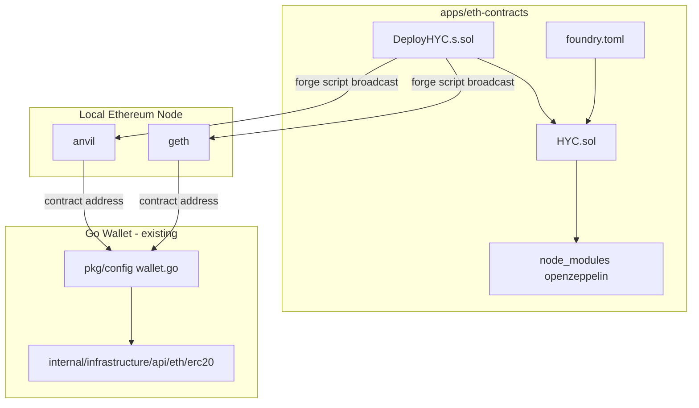
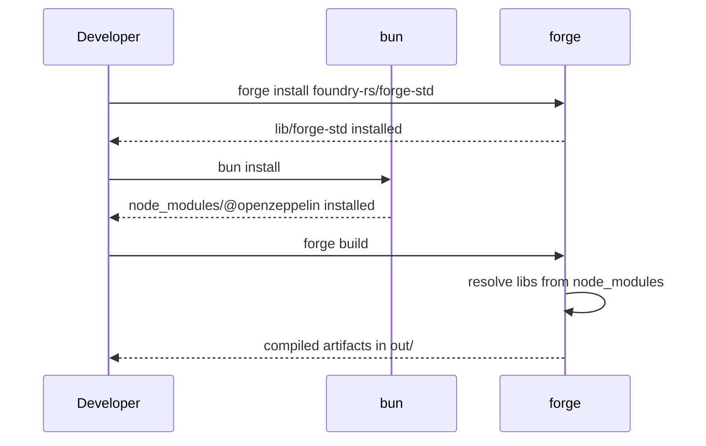
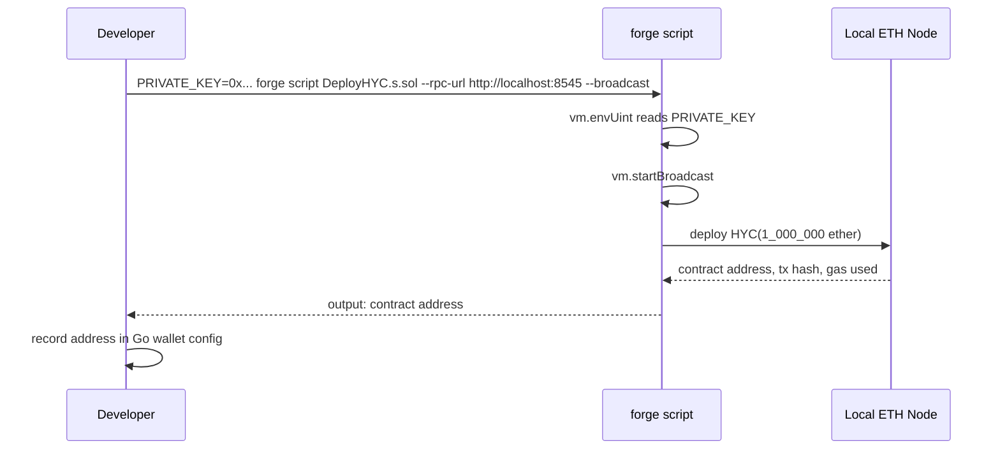

# Design Document: eth-contracts

## Overview

This feature delivers the **HYC ERC-20 token** smart contract and its Foundry-based development environment, enabling deployment to local Ethereum nodes (`anvil`, `geth`) and subsequent CLI-driven token transfers.

**Users**: Developers and wallet operators who need to deploy the HYC token to a local Ethereum environment and perform token transfers through the wallet CLI.

**Impact**: Adds a new self-contained Foundry project at `apps/eth-contracts/`. The deployed contract address becomes the integration point with the existing Go wallet configuration (`pkg/config/wallet.go`).

### Goals

- Implement a standards-compliant ERC-20 token (HYC) using OpenZeppelin v5.
- Provide a reproducible Foundry build and deployment workflow targeting local Ethereum nodes.
- Enforce code quality via solhint and dprint.

### Non-Goals

- Go CLI implementation of ERC-20 transfers (handled by existing `internal/infrastructure/api/eth/erc20/`).
- Mainnet or testnet deployment.
- Token governance, pausability, or upgradeability.

---

## Requirements Traceability

| Requirement | Summary | Components | Flows |
|-------------|---------|------------|-------|
| 1 | HYC ERC-20 contract | `HYC.sol` | — |
| 2 | Foundry build environment | `foundry.toml`, `package.json` | Build flow |
| 3 | Deployment script | `DeployHYC.s.sol` | Deploy flow |
| 4–6 | ERC-20 transfer encoding, EIP-1559, CLI | **Out of scope** — satisfied by `internal/infrastructure/api/eth/erc20/` | — |
| 7 | Dev tooling | `.solhint.json`, `dprint.json` | — |

---

## Architecture

### Architecture Pattern & Boundary Map



- **Selected pattern**: Standalone Foundry project — no cross-directory dependencies at build time.
- **Integration point**: The deployed contract address is recorded in Go wallet config after deployment. This boundary is manual (operator records the address).
- **Existing patterns preserved**: Go wallet ERC-20 infrastructure is untouched.

### Technology Stack

| Layer | Choice / Version | Role |
|-------|-----------------|------|
| Smart contract language | Solidity `^0.8.34` | HYC token and deploy script |
| Build / test framework | Foundry (latest) | Compile, test, deploy |
| ERC-20 base | OpenZeppelin Contracts `^5.6.1` | Standard ERC-20 implementation |
| Package manager | bun (fallback: pnpm) | Manages npm dependencies |
| Solidity linter | solhint `^6.0.3` | Static analysis |
| Formatter | dprint `^0.52.0` | TS/JS file formatting |
| Local node targets | anvil, geth | Deployment targets |

---

## System Flows

### Build Flow



### Deploy Flow



---

## Components and Interfaces

| Component | Layer | Intent | Req Coverage | Key Dependencies |
|-----------|-------|--------|--------------|-----------------|
| `HYC.sol` | Contract | ERC-20 token with minting | 1 | OpenZeppelin ERC20 (P0) |
| `DeployHYC.s.sol` | Script | Deploy HYC to a node | 3 | HYC.sol (P0), forge-std Script (P0) |
| `test/HYC.t.sol` | Test | Foundry unit tests for HYC contract | 1 | forge-std Test (P0), HYC.sol (P0) |
| `foundry.toml` | Config | Build configuration | 2 | — |
| `package.json` | Config | Dependency and script management | 2, 7 | bun/pnpm (P0) |
| `.solhint.json` | Tooling | Solidity lint rules | 7 | solhint (P0) |
| `dprint.json` | Tooling | JS/TS formatter config | 7 | dprint (P0) |

### Contract Layer

#### HYC.sol

| Field | Detail |
|-------|--------|
| Intent | Standard ERC-20 token; mints total supply to deployer on construction |
| Requirements | 1.1, 1.2, 1.3, 1.4, 1.5, 1.6 |

**Responsibilities & Constraints**

- Inherits all ERC-20 logic from `OpenZeppelin/ERC20.sol` — no custom transfer logic.
- Constructor accepts `uint256 initialSupply` and calls `_mint(msg.sender, initialSupply)`.
- Token metadata is immutable: name `"hiromaily Coin"`, symbol `"HYC"`, decimals `18`.

**Dependencies**

- External: `@openzeppelin/contracts/token/ERC20/ERC20.sol` — base ERC-20 (P0)

**Contracts**: State [x]

##### State Management

- State model: Standard ERC-20 mappings (`_balances`, `_allowances`) owned by the contract on-chain.
- Persistence: Ethereum state trie; immutable once deployed.
- Concurrency: Handled by Ethereum's sequential transaction model.

**Implementation Notes**

- No additional storage variables beyond OpenZeppelin base.
- `1_000_000 ether` passed to constructor equals `1_000_000 × 10^18` token units (18 decimals).

---

#### DeployHYC.s.sol

| Field | Detail |
|-------|--------|
| Intent | Foundry broadcast script that deploys HYC with a fixed initial supply |
| Requirements | 3.1, 3.2, 3.3, 3.4, 3.5, 3.6 |

**Responsibilities & Constraints**

- Reads deployer key from `PRIVATE_KEY` environment variable via `vm.envUint`.
- Wraps deployment in `vm.startBroadcast` / `vm.stopBroadcast` for actual on-chain execution.
- Compatible with both `anvil` and `geth` RPC endpoints.

**Dependencies**

- External: `forge-std/Script.sol` — Foundry scripting base (P0)
- Inbound: `HYC.sol` — contract being deployed (P0)

**Contracts**: Batch [x]

##### Batch / Job Contract

- Trigger: `forge script script/DeployHYC.s.sol --rpc-url <url> --broadcast`
- Input: `PRIVATE_KEY` env var (uint256 hex private key)
- Output: Contract address, transaction hash, gas usage printed to stdout
- Idempotency: Each run deploys a new contract instance; not idempotent by design

**Implementation Notes**

- Risk: Private key must never be committed. Add `.env` to `.gitignore`.

---

### Build Configuration Layer

#### foundry.toml

Key settings:

```toml
[profile.default]
src = "contracts"
out = "out"
libs = ["lib", "node_modules"]
solc_version = "0.8.34"
optimizer = true
optimizer_runs = 200

[lint]
exclude_lints = ["erc20-unchecked-transfer"]
```

`libs = ["lib", "node_modules"]` enables resolution of both `forge-std` (installed via `forge install foundry-rs/forge-std` into `lib/`) and `@openzeppelin/` imports (installed via bun into `node_modules/`).

#### package.json scripts

| Script | Command | Purpose |
|--------|---------|---------|
| `build` | `forge build` | Compile contracts |
| `test` | `forge test` | Run Foundry tests |
| `lint` | `solhint 'contracts/**/*.sol'` | Solidity linting (req 7.3) |
| `fmt` | `dprint fmt` | Format JS/TS files (req 7.6) |
| `deploy:local` | `forge script ... --broadcast` | Deploy to localhost:8545 |

---

## Testing Strategy

### Contract Unit Tests (Foundry)

Location: `test/` — Foundry test files (`*.t.sol`)

- Verify constructor mints `1_000_000 ether` to `msg.sender`.
- Verify `name()` returns `"hiromaily Coin"`, `symbol()` returns `"HYC"`, `decimals()` returns `18`.
- Verify `transfer(address, uint256)` updates balances correctly.
- Verify `transfer` to zero address reverts (OpenZeppelin invariant).

### Deployment Script Smoke Test

- Run `forge script DeployHYC.s.sol` with `--rpc-url http://localhost:8545` against a running anvil node.
- Assert contract address is non-zero in output.
- Assert deployer's HYC balance equals `1_000_000 ether`.

### Linting / Formatting

- `bun run lint` must exit 0 with zero solhint errors on `contracts/**/*.sol`.
- `bun run fmt` must exit 0 with no dprint formatting violations.

---

## Security Considerations

- **Private key handling**: `PRIVATE_KEY` is read from environment only. No keys in source files. `.env` must be in `.gitignore`.
- **No custom access control**: HYC has no `onlyOwner` or admin functions — standard ERC-20 only. Reduces attack surface.
- **Local-only deployment target**: No mainnet deployment in scope; no production key management required at this stage.
- **Immutable supply**: `_mint` is called only in the constructor; no inflation risk.
