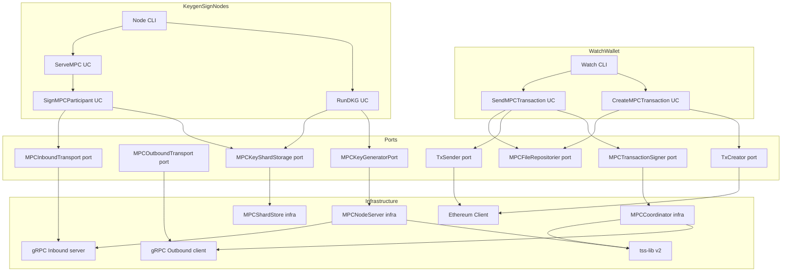
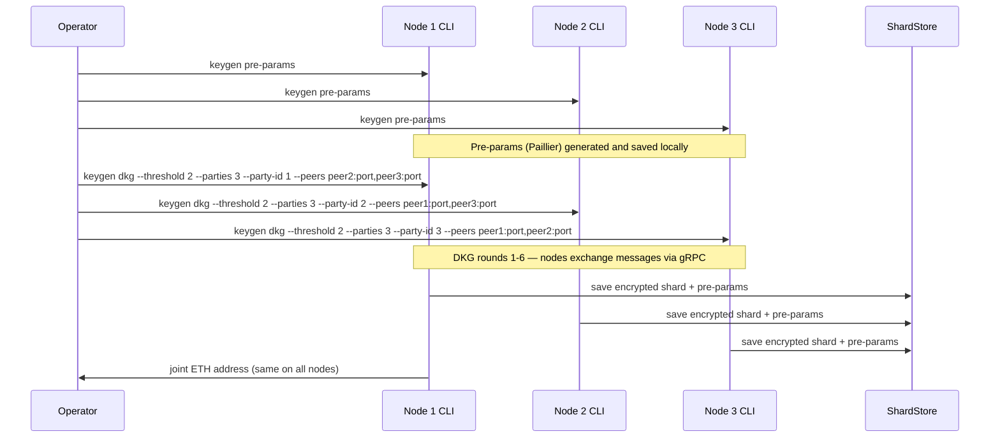
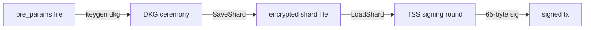

# Technical Design: ETH Multisig — MPC/TSS (Pattern 4)

## Overview

This feature adds **Ethereum E2E Pattern 4 (P4)** — a T-of-N threshold ECDSA multisig using MPC (Multi-Party Computation / TSS) — alongside the already-implemented Safe P3. P4 produces a **standard EOA-compatible ECDSA signature** broadcast via `eth_sendRawTransaction`, with no smart contract interaction and no single party ever holding the full private key.

**Users**: Wallet operators who require multisig security without smart-contract overhead or who cannot tolerate Safe's on-chain gas cost and operational complexity. **Impact**: Adds four new use cases, two new port interface groups, one new DTO, one new infrastructure package, and one new E2E pattern. Existing P1 and P3 flows are untouched.

### Goals

- Implement T-of-N Distributed Key Generation (DKG) using `tss-lib/v2`
- Implement TSS signing sessions coordinated by the Watch wallet via gRPC
- Produce a 65-byte ECDSA signature compatible with `types.Transaction.WithSignature`
- Broadcast signed transaction via existing `TxSender` port (`eth_sendRawTransaction`)
- Achieve a passing E2E test (2-of-3, local Anvil, `make eth-e2e-p4`)

### Non-Goals

- ERC-20 token MPC transfers (native ETH only)
- Key resharing / threshold changes after DKG
- Safe + MPC hybrid configuration
- BTC or XRP MPC signing
- HSM integration
- Production key backup ceremony

---

## Architecture

### Existing Architecture Analysis

The existing Clean Architecture layers for ETH are:

- **Ports** (`application/ports/api/eth/interface.go`): focused small interfaces (`TxCreator`, `TxSender`, `SafeExecuter`, etc.)
- **Infrastructure** (`infrastructure/api/eth/safe/client.go`): structs implementing ports; compile-time check via `var _ apieth.SafeClientDeps = (*SafeClient)(nil)`
- **Use cases** (`application/usecase/watch/eth/`, `application/usecase/keygen/eth/`): depend only on ports and DTOs
- **DI** (`internal/di/container.go`): wires everything; only location that references concrete infrastructure types
- **DTOs** (`application/dto/eth/`): `ETHTransactionFile` (single-sig), `ETHMultisigTransactionFile` (Safe)

P4 follows the same layering. New types are additive; no existing file is modified beyond the DI container and the wallet adapter structs.

### Architecture Pattern & Boundary Map

**Pattern**: Clean Architecture (Hexagonal / Ports & Adapters) — consistent with all existing ETH flows.

**Critical design difference from Safe P3**: Safe owners sign offline (air-gapped); MPC nodes must exchange TSS protocol messages in real time. Therefore:
- MPC nodes (Keygen/Sign wallet processes) run a **gRPC server daemon** (`keygen serve mpc`)
- The Watch wallet is the **gRPC client** that orchestrates signing sessions
- `MPCOutboundTransport` (Watch side) and `MPCInboundTransport` (Node side) ports hide gRPC behind replaceable abstractions



**Key decisions captured in the diagram**:
- `MPCTransactionSigner` port presents a single `SignTransaction(ctx, req)` call to the Watch use case; all multi-round TSS protocol complexity lives in `MPCCoordinator` (infrastructure).
- `MPCOutboundTransport` (coordinator/Watch side) and `MPCInboundTransport` (node/server side) are separate ports with clear directional semantics, making gRPC replaceable without touching use cases.
- `MPCShardStore` (infrastructure) handles all encrypted file I/O for key shards and pre-params.

### Technology Stack

| Layer | Choice / Version | Role in Feature |
|-------|-----------------|-----------------|
| CLI | Cobra (existing) | `watch create/send mpc`, `keygen dkg`, `keygen serve mpc` commands |
| Use Case | Go (existing) | Four new use cases; no new frameworks |
| TSS Library | `github.com/bnb-chain/tss-lib/v2` v2.0.1 | DKG ceremony + GG18 threshold ECDSA signing |
| Transport | gRPC (new for MPC only) | Inter-node message relay during TSS rounds |
| Key Shard Storage | AES-256-GCM + scrypt passphrase derivation | Encrypted `LocalPartySaveData` + pre-params on each node |
| Ethereum Client | `go-ethereum` v1.17.0 (existing) | Transaction construction + broadcast (reused via `TxCreator`/`TxSender` ports) |
| Testing | Anvil + existing `make eth-e2e` infra | Local 2-of-3 E2E test (P4) |

See `research.md` for library comparison and transport selection rationale.

---

## System Flows

### Flow 1: DKG Ceremony



### Flow 2: MPC Transaction Signing and Broadcast

```mermaid
sequenceDiagram
    participant W as Watch CLI
    participant N1 as MPC Node 1 gRPC server
    participant N2 as MPC Node 2 gRPC server
    participant ETH as Ethereum Node

    W->>W: watch create mpc --from 0xJoint --to 0xRecipient --amount 0.1
    Note over W: Creates ETHMPCTransactionFile (unsigned) with tx_hash

    W->>N1: keygen serve mpc (already running)
    W->>N2: keygen serve mpc (already running)

    W->>W: watch send mpc --file <unsigned_file>
    W->>N1: MPCSigningRequest{session_id, hash, party_ids, threshold}
    W->>N2: MPCSigningRequest{session_id, hash, party_ids, threshold}

    Note over N1,N2: TSS signing rounds 1-9 — nodes exchange messages via gRPC (P2P via Watch relay)

    N1-->>W: signature bytes
    W->>W: assemble 65-byte ECDSA sig, apply to raw_tx, verify sender
    W->>ETH: eth_sendRawTransaction(signed_tx)
    ETH-->>W: tx_hash
    W->>W: write signed ETHMPCTransactionFile; print tx_hash
```

**Flow-level decisions**: Watch wallet acts as message relay between nodes during TSS rounds (centralized coordinator pattern). This avoids requiring direct P2P connectivity between MPC nodes while keeping Watch as the single source of session coordination.

---

## Requirements Traceability

| Requirement | Summary | Components | Interfaces | Flows |
|-------------|---------|------------|------------|-------|
| 1.1–1.5 | TSS library integration | `MPCCoordinator` infra | `MPCTransactionSigner`, `MPCKeyGeneratorPort` | — |
| 2.1–2.7 | DKG ceremony | `RunDKGUseCase`, `MPCCoordinator`, `MPCShardStore` | `MPCKeyGeneratorPort`, `MPCKeyShardStorage` | Flow 1 |
| 3.1–3.6 | Key shard encrypted storage | `MPCShardStore` infra | `MPCKeyShardStorage` | Flow 1 |
| 4.1–4.5 | MPC port interface definitions | Port file `interfaces_mpc.go` | `MPCTransactionSigner`, `MPCKeyGeneratorPort`, `MPCKeyShardStorage`, `MPCOutboundTransport`, `MPCInboundTransport` | — |
| 5.1–5.7 | TSS signing infrastructure | `MPCCoordinator`, `MPCNodeServer` infra | `MPCTransactionSigner`, `MPCOutboundTransport`, `MPCInboundTransport` | Flow 2 |
| 6.1–6.6 | MPC transaction creation (Watch) | `CreateMPCTransactionUseCase` | `TxCreator`, `MPCFileRepositorier` | Flow 2 |
| 7.1–7.8 | MPC signing session (Node) | `ServeMPCUseCase`, `SignMPCParticipantUseCase` | `MPCKeyShardStorage`, `MPCInboundTransport` | Flow 2 |
| 8.1–8.5 | MPC transaction broadcast (Watch) | `SendMPCTransactionUseCase` | `MPCTransactionSigner`, `TxSender`, `MPCFileRepositorier` | Flow 2 |
| 9.1–9.6 | CLI commands | `watch create mpc`, `watch send mpc`, `keygen dkg`, `keygen serve mpc` CLI | — | Flow 1, 2 |
| 10.1–10.5 | DI container wiring | `container.go` | All new ports | — |
| 11.1–11.5 | E2E P4 test | `e2e-p4.sh`, Makefile | — | Flow 1+2 |

---

## Components and Interfaces

### Summary Table

| Component | Layer | Intent | Req Coverage | Key Dependencies |
|-----------|-------|--------|--------------|-----------------|
| `interfaces_mpc.go` | Ports | New MPC port interface definitions | 4.1–4.5 | None (primitives only) |
| `ETHMPCTransactionFile` DTO | App/DTO | File format for MPC transaction lifecycle | 6.3 | `domain/transaction` |
| `MPCFileRepositorier` | Ports/File | Read/write `ETHMPCTransactionFile` | 6.2, 7.5, 8.1 | `ETHMPCTransactionFile` |
| `RunDKGUseCase` | App/UseCase | Run DKG ceremony for this node | 2.1–2.7 | `MPCKeyGeneratorPort`, `MPCKeyShardStorage` |
| `ServeMPCUseCase` | App/UseCase | Start MPC node gRPC server | 7.1–7.8, 9.4 | `MPCKeyShardStorage`, `MPCInboundTransport` |
| `CreateMPCTransactionUseCase` | App/UseCase | Build unsigned Ethereum tx + write file | 6.1–6.6 | `TxCreator`, `GasEstimator`, `MPCFileRepositorier` |
| `SendMPCTransactionUseCase` | App/UseCase | Initiate TSS session + broadcast signed tx | 8.1–8.5 | `MPCTransactionSigner`, `TxSender`, `MPCFileRepositorier` |
| `MPCCoordinator` | Infrastructure | TSS coordinator (Watch side); implements `MPCTransactionSigner` | 5.1–5.7, 1.1–1.5 | `tss-lib/v2`, `MPCOutboundTransport` |
| `MPCNodeServer` | Infrastructure | TSS participant server (Node side); implements `MPCKeyGeneratorPort` | 2.1–2.7, 7.1–7.4 | `tss-lib/v2`, gRPC |
| `MPCShardStore` | Infrastructure | Encrypted shard + pre-params file I/O | 3.1–3.6 | AES-256-GCM, scrypt |
| `GRPCOutboundTransport` | Infrastructure | gRPC client implementation of `MPCOutboundTransport` (Watch-side) | 5.5 | `google.golang.org/grpc` |
| `GRPCInboundTransport` | Infrastructure | gRPC server implementation of `MPCInboundTransport` (Node-side) | 5.5, 7.1 | `google.golang.org/grpc` |
| ETH wallet adapters update | Interface-Adapters | Wire new use cases into `ETHWatch`, `ETHKeygen` | 9.1–9.6, 10.1–10.5 | New use case interfaces |

---

### Application Ports

#### `interfaces_mpc.go` — MPC Port Interface Definitions

| Field | Detail |
|-------|--------|
| Intent | Define all MPC port interfaces; no TSS or gRPC types cross this boundary |
| Requirements | 4.1, 4.2, 4.3, 4.4, 4.5 |

**Responsibilities & Constraints**

- All method signatures use only Go primitives, `context.Context`, and structs defined within this file.
- No `tss-lib`, `grpc`, or `protobuf` types appear anywhere in this file.
- Implements the Interface Segregation Principle: one interface per role.

**Service Interface**

```go
// File: internal/application/ports/api/eth/interfaces_mpc.go

// MPCSigningRequest carries parameters for a TSS signing session.
type MPCSigningRequest struct {
    SessionID string   // UUID — unique per signing invocation
    Hash      []byte   // 32-byte Keccak256 hash of the unsigned transaction
    PartyIDs  []string // Sorted IDs of all T participating nodes
    Threshold int      // T — minimum signers required
    PeerAddrs []string // gRPC addresses of all T nodes (index-matched with PartyIDs)
}

// MPCSigningResult carries the assembled ECDSA signature.
type MPCSigningResult struct {
    SessionID string // Echo of input SessionID
    Signature []byte // 65-byte ECDSA signature (r[32] || s[32] || v[1]), Ethereum-compliant
}

// MPCTransactionSigner is called by the Watch wallet to initiate a TSS signing session
// and collect the assembled 65-byte signature.
// The implementation contacts all nodes in MPCSigningRequest.PeerAddrs, relays TSS messages,
// and blocks until the signature is assembled or the context is cancelled.
type MPCTransactionSigner interface {
    SignTransaction(ctx context.Context, req MPCSigningRequest) (*MPCSigningResult, error)
}

// DKGParams carries configuration for a DKG ceremony on this node.
type DKGParams struct {
    PartyID     string   // Identifier of this node
    AllPartyIDs []string // All N party IDs (sorted, shared by all nodes)
    Threshold   int      // T
    PeerAddrs   []string // gRPC peer addresses (index-matched with AllPartyIDs excluding self)
    PreParamsPath string // Path to pre-computed pre-params file for this node
}

// DKGResult carries the output of a completed DKG ceremony.
type DKGResult struct {
    EthAddress string // Checksummed joint Ethereum address
    PublicKey  []byte // 65-byte uncompressed joint public key
    ShardPath  string // Path where the encrypted shard was saved
}

// MPCKeyGeneratorPort is called by the Keygen wallet CLI to run the DKG ceremony.
type MPCKeyGeneratorPort interface {
    RunDKG(ctx context.Context, params DKGParams) (*DKGResult, error)
    GeneratePreParams(ctx context.Context, outputPath string) error
}

// MPCKeyShardStorage is called by the MPC node to load its key shard during signing.
type MPCKeyShardStorage interface {
    LoadShard(ctx context.Context, shardPath string, passphrase string) ([]byte, error) // opaque: tss-lib LocalPartySaveData JSON
    SaveShard(ctx context.Context, shardPath string, passphrase string, data []byte) error
}

// MPCOutboundTransport is used by the Watch wallet coordinator to send TSS round messages
// to individual MPC nodes and receive their responses.
// Each call to Send targets one specific node identified by its gRPC address.
type MPCOutboundTransport interface {
    Send(ctx context.Context, peerAddr string, msg []byte) error
    Receive(ctx context.Context) (<-chan []byte, error)
    Close() error
}

// MPCInboundTransport is used by MPC node servers to accept incoming TSS messages
// from the coordinator and relay them to the local tss-lib state machine.
// Listen starts the gRPC listener; Receive exposes the inbound message channel.
type MPCInboundTransport interface {
    Listen(ctx context.Context, listenAddr string) error
    Receive(ctx context.Context) (<-chan []byte, error)
    Close() error
}

// MPCCoordinatorDeps is the composed interface for DI injection into the Watch wallet.
// Use cases MUST depend on the narrow MPCTransactionSigner interface above.
type MPCCoordinatorDeps interface {
    MPCTransactionSigner
}

// MPCNodeDeps is the composed interface for DI injection into Keygen/Sign node wallets.
// Use cases MUST depend on the narrow MPCKeyGeneratorPort interface above.
type MPCNodeDeps interface {
    MPCKeyGeneratorPort
}
```

- **Preconditions**: `Hash` must be exactly 32 bytes; `PartyIDs` must be sorted identically on all nodes.
- **Postconditions**: `MPCSigningResult.Signature` is 65 bytes, Ethereum-compliant; `types.Sender` recovers the expected address.
- **Invariants**: No TSS library types or gRPC types in this file.

**Contracts**: Service [x]

**Implementation Notes**

- Integration: `MPCCoordinator` (infrastructure) provides compile-time check: `var _ apieth.MPCCoordinatorDeps = (*MPCCoordinator)(nil)`.
- Validation: `SignTransaction` must return an error if `len(req.Hash) != 32` or `len(req.PartyIDs) < req.Threshold`.
- Risks: If a node drops mid-session, TSS protocol aborts. The port must propagate the error; no partial signature is returned.

---

### Application — DTOs

#### `ETHMPCTransactionFile`

| Field | Detail |
|-------|--------|
| Intent | File-based state carrier for the MPC transaction lifecycle |
| Requirements | 6.3, 7.2, 8.1 |

**Service Interface (Go struct)**

```go
// File: internal/application/dto/eth/mpc_transaction_file.go

// ETHMPCTransactionFile is the JSON file exchanged between wallets during a P4 MPC-TSS flow.
//
// State machine: TxType transitions from "unsigned" to "signed" when SignedTxHex is populated.
//
// File naming:
//   Unsigned: {action_type}_mpc_{uuid}.json
//   Signed:   {action_type}_mpc_{uuid}_signed.json
type ETHMPCTransactionFile struct {
    Version    int    `json:"version"`     // File format version (1)
    TxType     string `json:"tx_type"`     // "unsigned" or "signed"
    UUID       string `json:"uuid"`        // UUIDv4 generated at proposal time
    ActionType string `json:"action_type"` // "deposit", "payment", "transfer"

    // Transaction parameters
    From    string `json:"from"`     // EIP-55 checksummed sender address (joint distributed EOA)
    To      string `json:"to"`       // EIP-55 checksummed recipient
    Value   string `json:"value"`    // Wei as decimal string
    Nonce   uint64 `json:"nonce"`    // Ethereum account nonce
    GasLimit uint64 `json:"gas_limit"`
    ChainID uint64 `json:"chain_id"` // EIP-155 chain ID

    // EIP-1559 fee fields
    MaxFeePerGas         string `json:"max_fee_per_gas"`          // Wei decimal string
    MaxPriorityFeePerGas string `json:"max_priority_fee_per_gas"` // Wei decimal string

    // Signing material
    TxHash    string `json:"tx_hash"`     // 0x-prefixed Keccak256 hash of the unsigned tx (pre-image for TSS)
    RawTxHex  string `json:"raw_tx_hex"`  // 0x-prefixed RLP-encoded unsigned transaction bytes

    // Filled after TSS signing
    SignedTxHex string `json:"signed_tx_hex,omitempty"` // 0x-prefixed signed transaction bytes

    // TSS configuration
    Threshold int      `json:"threshold"` // T (minimum signers)
    PartyIDs  []string `json:"party_ids"` // All N party IDs participating in DKG
}
```

- `Validate()` method enforces: version ≥ 1; valid `tx_type`; `chain_id > 0`; valid EIP-55 addresses; `TxHash` non-empty; `len(PartyIDs) >= Threshold`.
- When `TxType == "signed"`, `SignedTxHex` must be non-empty.
- Sentinel errors follow the `ETHMultisigTransactionFile` pattern (separate named `var` block).

---

### Application — File Port

#### `MPCFileRepositorier`

| Field | Detail |
|-------|--------|
| Intent | Read and write `ETHMPCTransactionFile` to the local filesystem |
| Requirements | 6.2, 7.5, 8.1 |

```go
// File: internal/application/ports/file/mpc_file.go

type MPCFileRepositorier interface {
    ReadETHMPCJSONFile(filePath string) (*dtoeth.ETHMPCTransactionFile, error)
    WriteETHMPCJSONFile(file *dtoeth.ETHMPCTransactionFile, isSigned bool) (string, error)
    CreateMPCFilePath(actionType string, uuid string, isSigned bool) string
}
```

**Contracts**: Service [x]

---

### Application — Use Cases

#### `RunDKGUseCase`

| Field | Detail |
|-------|--------|
| Intent | Run this node's share of the DKG ceremony; save encrypted shard; export joint address |
| Requirements | 2.1, 2.2, 2.3, 2.4, 2.5, 2.6, 2.7 |

```go
// File: internal/application/usecase/keygen/interfaces.go (add)

type RunDKGInput struct {
    PartyID      string
    AllPartyIDs  []string
    Threshold    int
    PeerAddrs    []string
    PreParamsPath string
    ShardOutputPath string
    Passphrase   string
}

type RunDKGOutput struct {
    EthAddress string
    ShardPath  string
}

type RunDKGUseCase interface {
    Execute(ctx context.Context, input RunDKGInput) (RunDKGOutput, error)
}
```

**Dependencies**

- Outbound: `MPCKeyGeneratorPort` — runs DKG (P0)
- Outbound: `MPCKeyShardStorage` — saves encrypted shard (P0)

**Implementation Notes**

- Integration: If any node aborts DKG, the use case returns an error; no partial shard is saved.
- Validation: `len(AllPartyIDs) >= Threshold` enforced before calling the port.
- Risks: DKG pre-params generation time (minutes); mitigated by the `keygen pre-params` command.

---

#### `CreateMPCTransactionUseCase`

| Field | Detail |
|-------|--------|
| Intent | Build unsigned EIP-1559 transaction; compute tx hash; write `ETHMPCTransactionFile` |
| Requirements | 6.1, 6.2, 6.3, 6.4, 6.5, 6.6 |

```go
// File: internal/application/usecase/watch/interfaces.go (add)

type CreateMPCTransactionInput struct {
    FromAddress string
    ToAddress   string
    AmountEther float64
    ActionType  string
    Threshold   int
    PartyIDs    []string
}

type CreateMPCTransactionOutput struct {
    FilePath string
    UUID     string
    TxHash   string
}

type CreateMPCTransactionUseCase interface {
    Execute(ctx context.Context, input CreateMPCTransactionInput) (CreateMPCTransactionOutput, error)
}
```

**Dependencies**

- Outbound: `TxCreator` — creates EIP-1559 raw transaction (P0)
- Outbound: `GasEstimator` — fee estimation (P0)
- Outbound: `MPCFileRepositorier` — writes file (P0)
- Outbound: `pkguuid.UUIDHandler` — UUID generation (P1)

**Implementation Notes**

- Integration: Reuses existing `TxCreator` port (same as single-sig flow); no new Ethereum client interaction.
- Validation: `common.IsHexAddress(FromAddress)` and `common.IsHexAddress(ToAddress)` checked before creating tx.
- Risks: None beyond existing `CreateTransactionUseCase` risks.

---

#### `SendMPCTransactionUseCase`

| Field | Detail |
|-------|--------|
| Intent | Read unsigned file → initiate TSS session → apply 65-byte signature → broadcast |
| Requirements | 8.1, 8.2, 8.3, 8.4, 8.5 |

```go
// File: internal/application/usecase/watch/interfaces.go (add)

type SendMPCTransactionInput struct {
    FilePath  string
    PeerAddrs []string // gRPC addresses of all T signing nodes
}

type SendMPCTransactionOutput struct {
    TxHash string
}

type SendMPCTransactionUseCase interface {
    Execute(ctx context.Context, input SendMPCTransactionInput) (SendMPCTransactionOutput, error)
}
```

**Dependencies**

- Outbound: `MPCFileRepositorier` — reads file (P0)
- Outbound: `MPCTransactionSigner` — initiates TSS session (P0)
- Outbound: `TxSender` — broadcasts signed transaction (P0)

**Implementation Notes**

- Integration: After `MPCTransactionSigner.SignTransaction` returns, the use case calls `types.Transaction.WithSignature(signer, sig)` to produce a signed `*types.Transaction`, then encodes to hex and calls `TxSender.SendSignedRawTransaction`.
- Validation: Verifies `file.TxType == "unsigned"` before initiating session; verifies `types.Sender(signer, signedTx) == from` after signing.
- Risks: If TSS session times out, the unsigned file is preserved; operator can retry.

---

#### `ServeMPCUseCase`

| Field | Detail |
|-------|--------|
| Intent | Start the gRPC server that handles TSS signing participation requests |
| Requirements | 7.1, 7.2, 7.3, 7.4, 7.5, 7.6, 7.7, 7.8 |

```go
// File: internal/application/usecase/keygen/interfaces.go (add)

type ServeMPCInput struct {
    ListenAddr    string
    ShardPath     string
    Passphrase    string
    PartyID       string
    AllPartyIDs   []string
}

type ServeMPCUseCase interface {
    Serve(ctx context.Context, input ServeMPCInput) error // blocks until ctx is cancelled
}
```

**Dependencies**

- Outbound: `MPCKeyShardStorage` — loads shard at startup (P0)
- Outbound: `MPCInboundTransport` — starts gRPC listener; exposes inbound message channel (P0)

**Implementation Notes**

- Integration: The use case calls `MPCInboundTransport.Listen()` to start accepting connections, then drives the tss-lib `signing.LocalParty` state machine by reading from `MPCInboundTransport.Receive()` and responding via gRPC callbacks. The node never calls `Send(peerAddr, msg)` — it only handles inbound messages from the coordinator.
- Validation: Verifies `hash(RawTxHex) == TxHash` from the signing request before starting the TSS round.
- Risks: Passphrase provided via environment variable or CLI flag (same security posture as existing keystore password).

---

### Infrastructure

#### `MPCCoordinator` — Watch-side TSS coordinator

| Field | Detail |
|-------|--------|
| Intent | Implements `MPCTransactionSigner`; drives the TSS signing round from the Watch wallet |
| Requirements | 5.1, 5.2, 5.3, 5.4, 5.5, 5.6, 5.7, 1.1–1.5 |

**Responsibilities & Constraints**

- Contacts all T nodes via `MPCOutboundTransport`; relays TSS messages between them.
- Calls `signing.NewLocalParty` (optional — coordinator may not be a participant; can be passive relay).
- Assembles the 65-byte signature from `common.SignatureData`; adjusts `v` for EIP-155.
- NEVER reconstructs the full private key.

**Dependencies**

- External: `github.com/bnb-chain/tss-lib/v2` (P0)
- Outbound: `MPCOutboundTransport` — sends TSS messages to node peers (P0)

```go
// Compile-time checks
var _ apieth.MPCCoordinatorDeps = (*MPCCoordinator)(nil)

type MPCCoordinator struct {
    transport apieth.MPCOutboundTransport
    logger    *slog.Logger
}
```

**Contracts**: Service [x]

**Implementation Notes**

- Integration: `MPCCoordinator` opens a session, fans out the `MPCSigningRequest` to all T `PeerAddrs`, then acts as a message bus — receiving messages from each node and forwarding to the other T-1 nodes until all rounds complete.
- Validation: Adjusts `v` byte: `v_eth = v_recovery + 27` for legacy signers; uses `types.LatestSignerForChainID(chainID).SignatureValues` for EIP-1559 to handle the EIP-155 chain ID encoding.
- Risks: gRPC connection failure aborts session — use exponential backoff with a context deadline.

---

#### `MPCNodeServer` — Node-side TSS participant

| Field | Detail |
|-------|--------|
| Intent | Implements `MPCKeyGeneratorPort`; drives DKG and signing participation via the `MPCInboundTransport` listener |
| Requirements | 2.1–2.7, 7.1–7.8 |

```go
// Compile-time check
var _ apieth.MPCNodeDeps = (*MPCNodeServer)(nil)
```

**Dependencies**

- External: `github.com/bnb-chain/tss-lib/v2` (P0)
- External: `google.golang.org/grpc` (P0, implementation detail behind `MPCInboundTransport`)
- Outbound: `MPCKeyShardStorage` (P0)
- Outbound: `MPCInboundTransport` — starts listener, drives inbound message channel (P0)

**Implementation Notes**

- Each gRPC call from Watch maps to a round message in the tss-lib state machine.
- `LocalPartySaveData` (DKG output) is serialized to JSON and passed to `SaveShard`.
- Session ID (UUID) is included in every gRPC message to prevent cross-session message routing.

---

#### `MPCShardStore` — Encrypted key shard storage

| Field | Detail |
|-------|--------|
| Intent | AES-256-GCM encryption/decryption of `LocalPartySaveData` + pre-params bundle |
| Requirements | 3.1, 3.2, 3.3, 3.4, 3.5, 3.6 |

**Shard file format (JSON, encrypted)**

```json
{
  "version": 1,
  "party_id": "node-1",
  "all_party_ids": ["node-1", "node-2", "node-3"],
  "threshold": 2,
  "eth_address": "0x...",
  "pre_params": { ... },
  "save_data": { ... }
}
```

The entire JSON object is encrypted as a single AES-256-GCM ciphertext; the passphrase is derived via `scrypt(N=1<<15, r=8, p=1)` to a 32-byte key.

**Contracts**: Service [x]

**Implementation Notes**

- Validation: After decryption, verify `party_id` matches the expected node identity before returning.
- Risks: Memory-zeroing after use is best-effort in Go (no guarantee due to GC); minimize shard plaintext lifetime.

---

### Interface Adapters

#### Updated `ETHWatch` wallet adapter

Extends `ETHWatch` with two new fields and corresponding public methods:

```go
createMPCTxUseCase watchusecase.CreateMPCTransactionUseCase
sendMPCTxUseCase   watchusecase.SendMPCTransactionUseCase
```

New public methods:
- `CreateMPCTx(from, to string, amount float64, threshold int, partyIDs []string, actionType string) (string, string, error)`
- `SendMPCTx(filePath string, peerAddrs []string) (string, error)`

#### Updated `ETHKeygen` wallet adapter

Extends `ETHKeygen` with:
```go
runDKGUseCase  keygenusecase.RunDKGUseCase
serveMPCUseCase keygenusecase.ServeMPCUseCase
```

New CLI commands:
- `watch create mpc` → `CreateMPCTx`
- `watch send mpc` → `SendMPCTx`
- `keygen dkg` → `RunDKG`
- `keygen pre-params` → `GeneratePreParams` (one-time setup)
- `keygen serve mpc` → `ServeMPC` (long-running daemon)

---

## Data Models

### `ETHMPCTransactionFile` State Machine


- `TxType: "unsigned"` — created by Watch, written to file, shared with all T MPC nodes out-of-band (or referenced by path in `watch send mpc`).
- `TxType: "signed"` — written by Watch after `SendMPCTransactionUseCase` completes successfully; `SignedTxHex` is populated.

### Key Shard Data Flow



### New Directory Layout

```
internal/
├── application/
│   ├── dto/eth/
│   │   └── mpc_transaction_file.go       # NEW: ETHMPCTransactionFile + Validate()
│   ├── ports/api/eth/
│   │   └── interfaces_mpc.go             # NEW: MPCTransactionSigner, MPCKeyGeneratorPort, etc.
│   ├── ports/file/
│   │   └── mpc_file.go                   # NEW: MPCFileRepositorier
│   └── usecase/
│       ├── watch/
│       │   ├── interfaces.go             # ADD: CreateMPCTransactionUseCase, SendMPCTransactionUseCase
│       │   └── eth/
│       │       ├── create_mpc_transaction.go   # NEW
│       │       └── send_mpc_transaction.go     # NEW
│       └── keygen/
│           ├── interfaces.go             # ADD: RunDKGUseCase, ServeMPCUseCase
│           └── eth/
│               ├── run_dkg.go            # NEW
│               └── serve_mpc.go          # NEW
│
├── infrastructure/
│   ├── api/eth/
│   │   └── mpc/
│   │       ├── coordinator.go            # NEW: MPCCoordinator (Watch-side)
│   │       └── node_server.go            # NEW: MPCNodeServer (gRPC, Node-side)
│   └── storage/file/
│       └── mpc/
│           └── shard_store.go            # NEW: MPCShardStore (encrypted file I/O)
│
└── interface-adapters/
    ├── cli/
    │   ├── watch/
    │   │   └── create/mpc.go             # NEW: watch create mpc command
    │   │   └── send/mpc.go               # NEW: watch send mpc command
    │   └── keygen/
    │       └── dkg/dkg.go                # NEW: keygen dkg + pre-params commands
    │       └── serve/mpc.go              # NEW: keygen serve mpc command
    └── wallet/eth/
        ├── watch.go                      # ADD: MPC use case fields + methods
        └── keygen.go                     # ADD: DKG + serve fields + methods
```

---

## Error Handling

### Error Strategy

- Use `fmt.Errorf("context: %w", err)` throughout, consistent with project conventions.
- TSS session errors are terminal (no retry within one use case invocation); the operator re-runs.
- File not found / shard decryption failures return immediately with descriptive errors.

### Error Categories and Responses

| Error | Category | Response |
|-------|----------|----------|
| `tx_type != "unsigned"` on send | Business Logic | Return `ErrNotUnsigned`; print to stderr |
| TSS round timeout | System | Return wrapped error with session ID; unsigned file preserved |
| gRPC node unreachable | System | Return immediately; operator verifies node is running |
| Shard decryption failure | User | Return `ErrShardDecryptFailed`; check passphrase |
| Sender mismatch after signing | Business Logic | Return `ErrSenderMismatch`; do not broadcast |
| `hash(raw_tx) != tx_hash` | Business Logic | Return `ErrTxHashMismatch`; abort signing |

### Monitoring

- All TSS round messages logged at DEBUG level with session ID.
- DKG completion logged at INFO level with joint address.
- TSS signing session start/end logged at INFO with session ID and duration.

---

## Testing Strategy

### Unit Tests

- `mpc_transaction_file_test.go` — `Validate()` for all sentinel error paths
- `create_mpc_transaction_test.go` — mock `TxCreator`, `MPCFileRepositorier`; verify file fields
- `send_mpc_transaction_test.go` — mock `MPCTransactionSigner`, `TxSender`; verify `ErrNotUnsigned` guard; verify `ErrSenderMismatch` on bad signature
- `run_dkg_test.go` — mock `MPCKeyGeneratorPort`, `MPCKeyShardStorage`; verify abort on empty party list
- `shard_store_test.go` — round-trip encrypt/decrypt; verify decryption fails with wrong passphrase

### Integration Tests

- `MPCCoordinator` + `MPCNodeServer` in-process (two goroutines simulating two nodes, 2-of-2): verify DKG produces same address on both nodes; verify signing produces correct `types.Sender`.
- `MPCShardStore` on local filesystem: save + load round-trip.
- `GRPCTransport`: send message from coordinator goroutine to node server goroutine; verify delivery.

### E2E Tests (P4)

- `scripts/operation/eth/e2e/e2e-p4.sh`: 2-of-3 DKG → fund joint address → `watch create mpc` → start 2 node servers → `watch send mpc` → verify Anvil balance change
- `make eth-e2e-p4` and `make eth-e2e-p4-ci` targets
- Parallel runner updated to include P4 alongside P1 and P3

### Performance / Security

- DKG pre-params generation: timeout ≤ 5 minutes on CI hardware
- TSS signing round: timeout ≤ 60 seconds on localhost gRPC
- Key shard file: memory zeroed after use (best-effort in Go)

---

## Security Considerations

- **No full private key**: tss-lib guarantees the full key never exists on any single node. The `MPCCoordinator` (Watch) never receives or stores key material.
- **Passphrase handling**: shard decryption passphrase passed via environment variable (consistent with keystore password pattern). Never logged.
- **gRPC transport**: for production use, mutual TLS (mTLS) is required. E2E tests use plaintext gRPC on localhost only.
- **Session isolation**: each signing session carries a UUID. Messages without a matching session ID are discarded.
- **v-byte adjustment**: the post-TSS signature `v` adjustment and `types.Sender` verification is the last safety gate before broadcast. If verification fails, no transaction is sent.
- **Shard backup**: shard loss is irrecoverable (out of scope for resharing). Operators must implement offline backup of encrypted shard files.

---

## Supporting References

- Detailed TSS library investigation → `research.md` § "tss-lib v2 API Surface"
- Transport selection rationale → `research.md` § "Inter-node Transport" and § "Architecture Pattern Evaluation"
- Wallet model change (air-gap departure) → `research.md` § "Wallet Model Change for MPC" and § "Decision: MPC nodes are networked"
- Signature v-byte adjustment → `research.md` § "Ethereum Signature Format"
