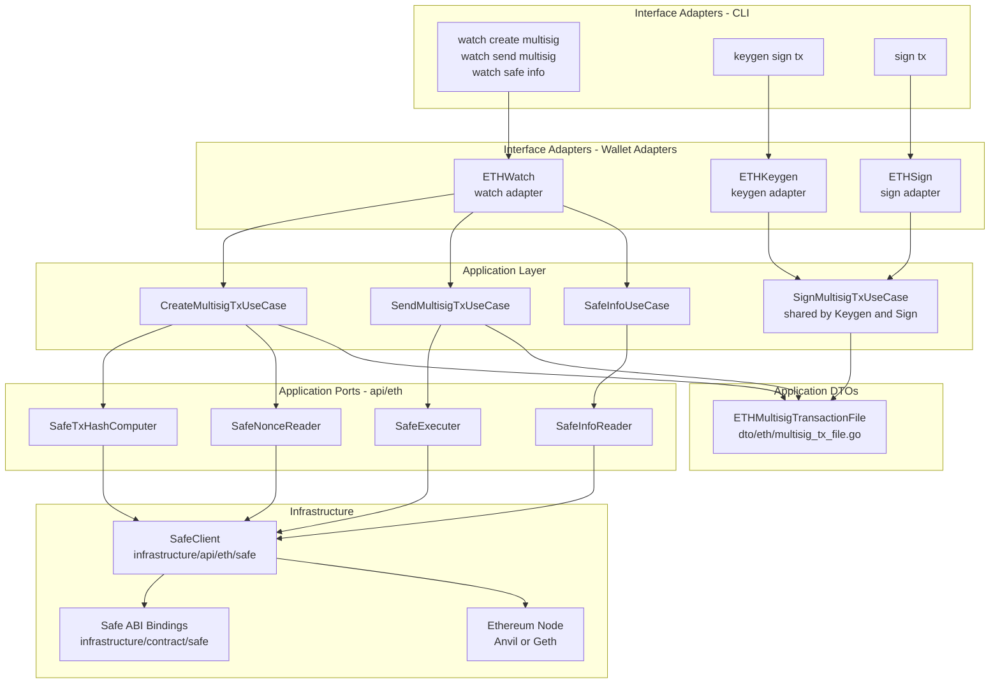
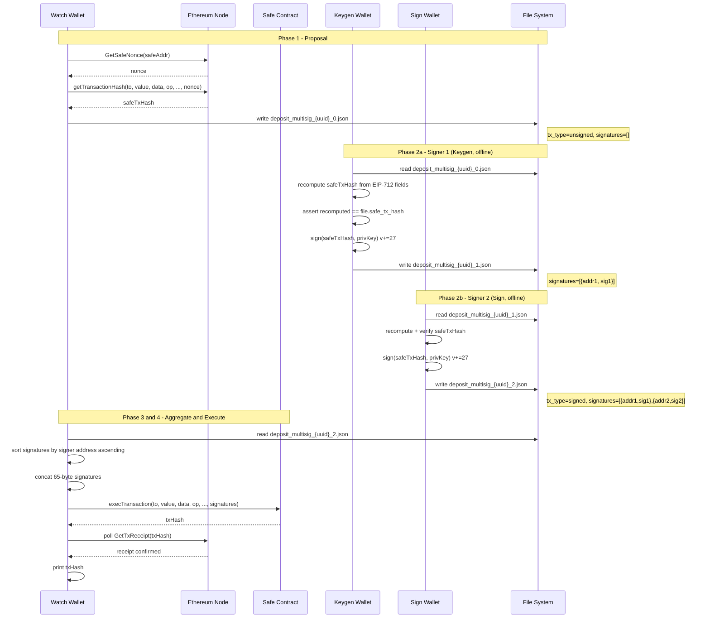

# Technical Design: eth-multisig-transaction

## Overview

This feature adds Ethereum multi-signature transaction support to the go-crypto-wallet system
using Safe (Gnosis Safe v1.4.1) smart contract accounts. The design extends the existing
Clean Architecture layers — application, infrastructure, interface-adapters, and DI — without
modifying any single-sig ETH flows.

**Purpose**: Enable operators to execute ETH payment transactions that require approval from N-of-M
authorized Ethereum EOA owners, with all signing performed offline on air-gapped wallets.

**Users**: Watch wallet operators (online) coordinate the flow; Keygen and Sign wallet operators
(offline) provide cryptographic approvals. The file-based handoff mirrors the existing BTC PSBT pattern.

**Impact**: Activates the currently no-op `ETHSign.SignTx()` method, adds three new use cases to the
Watch wallet, adds one shared signing use case to Keygen and Sign wallets, and introduces Safe contract
infrastructure without touching any existing single-sig code paths.

### Goals

- Implement a 2-of-2 Safe multisig payment flow end-to-end, validated by an E2E test against Anvil
- Enforce offline signing: Keygen and Sign wallets make zero network calls during EIP-712 signing
- Keep the design backward-compatible: existing P1 single-sig flows are unchanged

### Non-Goals

- ERC-4337 / Account Abstraction (UserOperation, Bundler)
- ERC-20 token multisig transfers (native ETH only in this spec)
- Safe modules, recovery, or spending limits
- Safe contract deployment via Watch wallet CLI (handled by Foundry script in E2E)
- Safe v1.3.x compatibility

---

## Architecture

### Existing Architecture Analysis

The current ETH infrastructure follows Clean Architecture with four strict layers:

- **Domain**: Pure value objects (`RawTx`, `ETHDetailTx`, etc.) — no infrastructure imports
- **Application ports**: Focused ISP interfaces (`TxCreator`, `TxSigner`, `TxSender`, etc.) in `ports/api/eth/`
- **Application use cases**: Single-responsibility implementations in `usecase/watch/eth/` and `usecase/keygen/eth/`
- **Infrastructure**: `eth/eth/` package implements all port interfaces via go-ethereum JSON-RPC
- **DI**: `internal/di/container.go` wires everything with `newXxx()` factory pattern

The existing single-sig flow uses `ETHTransactionFile` (JSON, file-based, no DB for file state). The
multisig flow adds `ETHMultisigTransactionFile` following the same pattern. No database tables are added.

### Architecture Pattern & Boundary Map



**Architecture Integration**:

- Selected pattern: **Clean Architecture Hexagonal** — existing pattern, extended not changed
- Domain/feature boundaries: All Safe-specific logic in `infrastructure/api/eth/safe/`; application layer sees only ports
- New components: `SafeClient`, `ETHMultisigTransactionFile` DTO, three Watch use cases, one shared Keygen/Sign use case
- Steering compliance: Dependency Inversion maintained; domain layer untouched; ISP interfaces

### Technology Stack

| Layer | Choice / Version | Role | Notes |
|-------|------------------|------|-------|
| Infrastructure / Safe | go-ethereum v1.x (existing) + Safe ABI bindings | Contract calls, EIP-712 crypto | No new external libraries; `abigen` generates Safe bindings from Safe v1.4.1 ABI |
| Infrastructure / CLI | Cobra (existing) | New `create multisig`, `send multisig`, `safe info` commands | No version change |
| Storage | File system (existing `TransactionFileRepositorier`) | `ETHMultisigTransactionFile` JSON read/write | No DB changes |
| Testing / E2E | Anvil (existing), Foundry (existing in `apps/eth-contracts/`) | Deploy Safe, fund, run full flow | New `DeploySafe.s.sol` Foundry script |

---

## System Flows

### 4-Phase Multisig Flow (2-of-2)



**Flow decisions**:
- Signature sorting is performed at **Watch time** (phase 4), not at signing time, so signers are independent and order-agnostic.
- The v-byte adjustment (`+27`) is applied immediately after `crypto.Sign` in the signing use case.
- If the recomputed hash does not match `safe_tx_hash` in the file, the signing use case returns an error before any private key operation.

---

## Requirements Traceability

| Requirement | Summary | Components | Interfaces | Flows |
|-------------|---------|------------|------------|-------|
| FR-1 | Safe ABI bindings + SafeClient | SafeClient, SafeABI | SafeTxHashComputer, SafeNonceReader, SafeExecuter, SafeInfoReader | Phase 1, 4 |
| FR-2 | ETHMultisigTransactionFile DTO | ETHMultisigTransactionFile | — | All phases |
| FR-3 | Port interface definitions | ports/api/eth/interface.go | SafeExecParams, SafeTxHashComputer, SafeNonceReader, SafeExecuter, SafeInfoReader | — |
| FR-4 | Watch: create multisig TX | CreateMultisigTransactionUseCase | SafeTxHashComputer, SafeNonceReader | Phase 1 |
| FR-5 | Offline EIP-712 signing | SignMultisigTransactionUseCase | — (pure crypto, no ports) | Phase 2 |
| FR-6 | Watch: submit multisig TX | SendMultisigTransactionUseCase | SafeExecuter | Phase 4 |
| FR-7 | Watch: safe info CLI | SafeInfoUseCase | SafeInfoReader | — |
| FR-8 | CLI commands | ETHWatch adapter, ETHSign adapter, CLI cobra commands | Watch/Keygen/Sign use cases | All phases |
| FR-9 | DI wiring | container.go factories | All new use cases + SafeClient | — |
| FR-10 | E2E P2 test | e2e-p2.sh, DeploySafe.s.sol, Makefile | — | All phases |

---

## Components and Interfaces

### Summary Table

| Component | Layer | Intent | Req Coverage | Key Dependencies | Contracts |
|-----------|-------|--------|--------------|------------------|-----------|
| `ETHMultisigTransactionFile` | application/dto | File DTO for Safe multisig transactions | FR-2 | — | State |
| `SafeExecParams` | application/ports | Execution parameter struct for `SafeExecuter` | FR-3 | — | Service |
| Port interfaces (4) | application/ports | ISP-compliant Safe contract ports | FR-3 | SafeClient (P0) | Service |
| `CreateMultisigTransactionUseCase` | application/usecase/watch | Proposes a Safe TX; writes multisig file | FR-4 | SafeTxHashComputer (P0), SafeNonceReader (P0), MultisigFileRepositorier (P0) | Service |
| `SignMultisigTransactionUseCase` | application/usecase/keygen | Offline EIP-712 signing; appends to file | FR-5 | accountKeyRepo (P0), MultisigFileRepositorier (P0) | Service |
| `SendMultisigTransactionUseCase` | application/usecase/watch | Aggregates sigs, calls execTransaction | FR-6 | SafeExecuter (P0), MultisigFileRepositorier (P0) | Service |
| `SafeInfoUseCase` | application/usecase/watch | Reads Safe contract state | FR-7 | SafeInfoReader (P0) | Service |
| `SafeClient` | infrastructure/api/eth/safe | Concrete Safe contract client | FR-1, FR-3 | SafeABI (P0), go-ethereum (P0) | Service |
| Safe ABI bindings | infrastructure/contract/safe | `abigen`-generated Go bindings | FR-1 | go-ethereum (P0) | — |
| ETHWatch extensions | interface-adapters/wallet/eth | Wire new Watch use cases; expose adapter methods | FR-8, FR-9 | All 3 Watch use cases (P0) | Service |
| ETHKeygen extension | interface-adapters/wallet/eth | Wire SignMultisigTxUseCase to existing SignTx | FR-8, FR-9 | SignMultisigTransactionUseCase (P0) | Service |
| ETHSign activation | interface-adapters/wallet/eth | Activate SignTx (previously no-op) | FR-8, FR-9 | SignMultisigTransactionUseCase (P0) | Service |
| CLI commands | interface-adapters/cli/watch | New Cobra subcommands | FR-8 | ETHWatch adapter (P0) | — |
| DI factories | di/container.go | Wire all new components | FR-9 | All new components (P0) | — |
| E2E P2 script + Foundry | scripts/, apps/eth-contracts/ | 2-of-2 multisig end-to-end test | FR-10 | All above (P0) | — |

---

### Application / DTO

#### `ETHMultisigTransactionFile`

| Field | Detail |
|-------|--------|
| Intent | JSON file DTO carrying all Safe multisig state between Watch → Keygen/Sign → Watch |
| Requirements | FR-2, FR-4, FR-5, FR-6 |

**Responsibilities & Constraints**

- Carries all EIP-712 fields needed to reconstruct `safeTxHash` offline (no network needed for signers)
- `TxType` transitions: `"unsigned"` → `"signed"` when `len(Signatures) >= Threshold`
- `UUID` is generated by the Watch wallet at proposal time; it is the sole unique identifier (no DB key)
- `Validate()` enforces required fields and consistent state (e.g., signed file must have enough signatures)

**Contracts**: State [x]

##### State Management

```go
// internal/application/dto/eth/multisig_transaction_file.go

type ETHMultisigTransactionFile struct {
    Version int    `json:"version"`       // 1
    TxType  string `json:"tx_type"`       // "unsigned" | "signed"
    UUID    string `json:"uuid"`          // UUID for file naming

    // Safe execution parameters (all required)
    SafeAddress    string `json:"safe_address"`
    To             string `json:"to"`
    Value          string `json:"value"`          // Wei decimal string
    Data           string `json:"data"`            // hex-encoded, empty "" for ETH transfer
    Operation      uint8  `json:"operation"`       // 0=Call, 1=DelegateCall
    SafeTxGas      string `json:"safe_tx_gas"`     // "0" for simple transfers
    BaseGas        string `json:"base_gas"`        // "0"
    GasPrice       string `json:"gas_price"`       // "0"
    GasToken       string `json:"gas_token"`       // zero address
    RefundReceiver string `json:"refund_receiver"` // zero address
    Nonce          string `json:"nonce"`           // Safe's current nonce (decimal)
    ChainID        uint64 `json:"chain_id"`

    // Pre-computed hash (authoritative; signers verify against this)
    SafeTxHash string `json:"safe_tx_hash"` // 0x-prefixed hex

    // Signature accumulation
    Threshold  int         `json:"threshold"`
    Signatures []SignEntry `json:"signatures"` // ordered by insertion; sorted at send time
}

type SignEntry struct {
    SignerAddress string `json:"signer_address"` // 0x-prefixed checksummed
    SignatureHex  string `json:"signature_hex"`  // 65-byte EIP-712 sig, 0x-prefixed, v=27/28
}
```

- State model: `TxType` is the lifecycle field; `Signatures` grows monotonically
- Idempotency: the same signer must not appear twice (Validate checks for duplicate signer addresses)

**Implementation Notes**

- Validation: check `SafeAddress` is valid EIP-55 checksum address; `Value` parses as decimal integer; `ChainID > 0`; no duplicate `SignerAddress` in `Signatures`
- Risks: Operators must not modify the file manually between wallet hops; corrupted `safe_tx_hash` causes signing to fail with a clear error message

---

### Application / Ports

#### Port Interfaces and `SafeExecParams`

| Field | Detail |
|-------|--------|
| Intent | ISP-compliant port contracts for Safe contract operations; `SafeExecParams` is the execution parameter value type |
| Requirements | FR-3 |

**Contracts**: Service [x]

##### Service Interface

```go
// internal/application/ports/api/eth/interface.go (additions)

// SafeExecParams carries all parameters for Safe execTransaction.
// Defined in ports to decouple SafeExecuter from the file DTO.
type SafeExecParams struct {
    SafeAddress    string
    To             string
    Value          *big.Int
    Data           []byte
    Operation      uint8
    SafeTxGas      *big.Int
    BaseGas        *big.Int
    GasPrice       *big.Int
    GasToken       string // checksummed address or zero address
    RefundReceiver string // checksummed address or zero address
    Nonce          *big.Int
    Signatures     []byte // concatenated 65-byte signatures, sorted by signer address ascending
}

// SafeInfo holds Safe contract state for the info use case.
type SafeInfo struct {
    Owners    []string // checksummed addresses
    Threshold *big.Int
    Nonce     *big.Int
    Balance   *big.Int // in Wei
}

// SafeTxHashComputer calls getTransactionHash on the deployed Safe contract.
// Used by the Watch wallet to compute the authoritative safeTxHash at proposal time.
type SafeTxHashComputer interface {
    GetSafeTxHash(
        ctx context.Context,
        safeAddr, to string,
        value *big.Int,
        data []byte,
        operation uint8,
        nonce *big.Int,
    ) (string, error) // returns 0x-prefixed hex hash
}

// SafeNonceReader reads the current Safe nonce from the contract.
// Used by Watch wallet before calling GetSafeTxHash.
type SafeNonceReader interface {
    GetSafeNonce(ctx context.Context, safeAddr string) (*big.Int, error)
}

// SafeExecuter calls execTransaction on the deployed Safe contract.
// Used by the Watch wallet to submit a fully-signed multisig transaction.
type SafeExecuter interface {
    ExecuteSafeTransaction(ctx context.Context, params SafeExecParams) (string, error) // returns txHash
}

// SafeInfoReader reads current Safe contract state.
// Used by watch safe info command.
type SafeInfoReader interface {
    GetSafeInfo(ctx context.Context, safeAddr string) (*SafeInfo, error)
}

// SafeClient combines all Safe port interfaces.
// Used by the DI layer only to inject a single implementation into multiple use cases.
type SafeClientDeps interface {
    SafeTxHashComputer
    SafeNonceReader
    SafeExecuter
    SafeInfoReader
}
```

- Preconditions: `safeAddr` must be a deployed Safe contract on the connected chain; `params.Nonce` must match the Safe's current nonce at execution time
- Postconditions: `ExecuteSafeTransaction` returns the submitted Ethereum transaction hash (not the Safe's internal nonce)
- Invariants: `SafeExecParams.Signatures` is a valid concatenation of sorted 65-byte EIP-712 signatures

**Implementation Notes**

- Integration: `SafeClient` in `infrastructure/api/eth/safe/` implements `SafeClientDeps`; DI injects it into each use case via the specific narrow interface required (ISP)
- Risks: If Safe contract is not deployed or `safeAddr` is an EOA, calls will fail with contract errors — validated at the CLI layer before use case invocation

---

### Application / Use Cases / Watch

#### `CreateMultisigTransactionUseCase`

| Field | Detail |
|-------|--------|
| Intent | Propose a Safe multisig TX: fetch nonce, compute hash on-chain, write proposal file |
| Requirements | FR-4 |

**Dependencies**

- Inbound: `ETHWatch` adapter (P0)
- Outbound: `SafeNonceReader` (P0), `SafeTxHashComputer` (P0), `file.MultisigFileRepositorier` (P0)

**Contracts**: Service [x]

##### Service Interface

```go
// internal/application/usecase/watch/interfaces.go (additions)

type CreateMultisigTransactionUseCase interface {
    Execute(ctx context.Context, input CreateMultisigTransactionInput) (CreateMultisigTransactionOutput, error)
}

type CreateMultisigTransactionInput struct {
    SafeAddress string
    ToAddress   string
    Amount      float64 // in Ether; converted to Wei internally
    Threshold   int
    ActionType  string // "deposit" | "payment" | "transfer"
}

type CreateMultisigTransactionOutput struct {
    FileName string
}
```

**Implementation Notes**

- Implementation file: `internal/application/usecase/watch/eth/create_multisig_transaction.go`
- The use case generates a UUID (`github.com/google/uuid` or `crypto/rand`), calls `GetSafeNonce`, then `GetSafeTxHash` with all-zero gas params and empty data for a simple ETH transfer
- The resulting `ETHMultisigTransactionFile` is written via `multisigFileRepo.WriteETHMultisigJSONFile` (method on the new `MultisigFileRepositorier` interface)
- File path: `{actionType}_multisig_{uuid}_0.json`

#### `SendMultisigTransactionUseCase`

| Field | Detail |
|-------|--------|
| Intent | Aggregate signatures, sort by address, call execTransaction, poll for receipt |
| Requirements | FR-6 |

**Dependencies**

- Inbound: `ETHWatch` adapter (P0)
- Outbound: `SafeExecuter` (P0), `file.MultisigFileRepositorier` (P0), `TxMonitor` (P1, existing)

**Contracts**: Service [x]

##### Service Interface

```go
type SendMultisigTransactionUseCase interface {
    Execute(ctx context.Context, input SendMultisigTransactionInput) (SendMultisigTransactionOutput, error)
}

type SendMultisigTransactionInput struct {
    FilePath string
}

type SendMultisigTransactionOutput struct {
    TxHash string
}
```

**Implementation Notes**

- Implementation: `internal/application/usecase/watch/eth/send_multisig_transaction.go`
- Sort `Signatures` slice by `SignerAddress` ascending (case-insensitive hex compare) before concatenation
- Convert each `SignatureHex` from 0x-prefixed hex to `[]byte` and concatenate into `SafeExecParams.Signatures`
- Validate `TxType == "signed"` and `len(Signatures) >= Threshold` before calling `SafeExecuter`
- Receipt polling: reuse existing `GetTxReceipt` pattern (up to N retries with sleep)

#### `SafeInfoUseCase`

| Field | Detail |
|-------|--------|
| Intent | Read and display Safe contract state (owners, threshold, nonce, balance) |
| Requirements | FR-7 |

**Contracts**: Service [x]

##### Service Interface

```go
type SafeInfoUseCase interface {
    Execute(ctx context.Context, input SafeInfoInput) (SafeInfoOutput, error)
}

type SafeInfoInput struct {
    SafeAddress string
}

type SafeInfoOutput struct {
    Owners    []string
    Threshold int
    Nonce     uint64
    BalanceWei string // decimal string
}
```

---

### Application / Use Cases / Keygen+Sign (shared)

#### `SignMultisigTransactionUseCase`

| Field | Detail |
|-------|--------|
| Intent | Offline EIP-712 signing: verify safeTxHash, sign with private key, append to file |
| Requirements | FR-5 |

**Dependencies**

- Inbound: `ETHKeygen` adapter (P0), `ETHSign` adapter (P0)
- Outbound: `repocold.ETHAccountKeyRepositorier` (P0, existing), `file.MultisigFileRepositorier` (P0)
- External: `go-ethereum/crypto` for `Sign`, `Keccak256`, `PubkeyToAddress` (P0, in use)

**Contracts**: Service [x]

##### Service Interface

```go
// internal/application/usecase/keygen/interfaces.go (addition)

type SignMultisigTransactionUseCase interface {
    Sign(ctx context.Context, input SignMultisigTransactionInput) (SignMultisigTransactionOutput, error)
}

type SignMultisigTransactionInput struct {
    FilePath      string
    SignerAddress string // checksummed EOA address of this signer; supplied via --signer-address CLI flag
}

type SignMultisigTransactionOutput struct {
    FilePath   string
    IsComplete bool // true when len(Signatures) >= Threshold after this signing
    SignCount  int
    Threshold  int
}
```

**Implementation Notes**

- Implementation: `internal/application/usecase/keygen/eth/sign_multisig_transaction.go` (shared by both wallets)
- EIP-712 hash recomputation algorithm (pure Go, no network):
  1. `DOMAIN_SEPARATOR_TYPEHASH = keccak256("EIP712Domain(uint256 chainId,address verifyingContract)")`
  2. `domainSeparator = keccak256(abi.encode(DOMAIN_SEPARATOR_TYPEHASH, chainId, safeAddress))`
  3. `SAFE_TX_TYPEHASH = keccak256("SafeTx(address to,uint256 value,bytes data,uint8 operation,uint256 safeTxGas,uint256 baseGas,uint256 gasPrice,address gasToken,address payable refundReceiver,uint256 nonce)")`
  4. `structHash = keccak256(abi.encode(SAFE_TX_TYPEHASH, to, value, keccak256(data), operation, safeTxGas, baseGas, gasPrice, gasToken, refundReceiver, nonce))`
  5. `safeTxHash = keccak256("\x19\x01", domainSeparator, structHash)`
- After `crypto.Sign(safeTxHash[:], privKey)`: apply `sig[64] += 27` to produce Safe-compatible v byte
- Retrieve private key by looking up `input.SignerAddress` in `ETHAccountKeyRepositorier.GetByAddress(signerAddr)`; derive via `deriveChildPrivKey` (existing function). The signer's address is provided explicitly by the caller — the file contains only the Safe contract address, not the signer's EOA.
- Write updated file with incremented counter in path: `{base}_{n+1}.json`
- Validation: check the signer address is not already in `Signatures` (detect duplicate signing)

---

### Infrastructure

#### `SafeClient`

| Field | Detail |
|-------|--------|
| Intent | Concrete implementation of all Safe port interfaces using go-ethereum + abigen bindings |
| Requirements | FR-1, FR-3 |

**Dependencies**

- Inbound: DI container (P0)
- Outbound: `SafeABI` bindings in `internal/infrastructure/contract/safe/` (P0)
- External: go-ethereum `ethclient.Client` (P0, existing)

**Contracts**: Service [x]

##### Service Interface

```go
// internal/infrastructure/api/eth/safe/client.go

type SafeClient struct {
    client   *ethclient.Client   // existing go-ethereum client
    chainID  *big.Int            // obtained via client.ChainID(ctx) at construction
}

// Implements: SafeTxHashComputer, SafeNonceReader, SafeExecuter, SafeInfoReader
// (i.e., SafeClientDeps from ports/api/eth/interface.go)
```

**Implementation Notes**

- `GetSafeTxHash`: instantiate the `abigen`-generated Safe binding for `safeAddr`, call `GetTransactionHash` with all params, return 0x-prefixed hex of `bytes32`
- `GetSafeNonce`: call `Nonce()` on the Safe binding (returns `*big.Int`)
- `ExecuteSafeTransaction`: build EIP-1559 transaction calling `ExecTransaction` on the Safe; gas estimated via `client.EstimateGas`; submit via `client.SendTransaction`; return tx hash
- `GetSafeInfo`: call `GetOwners()`, `GetThreshold()`, `Nonce()`, `client.BalanceAt()` on the Safe binding
- `chainID` fetched once at construction via `client.ChainID(ctx)` and cached in the struct

#### Safe ABI Bindings

| Field | Detail |
|-------|--------|
| Intent | Auto-generated Go bindings for Safe v1.4.1 contract; must not be hand-edited |
| Requirements | FR-1 |

**Implementation Notes**

- File: `internal/infrastructure/contract/safe/safe.go` — generated with `abigen --abi safe.abi --pkg safe --type Safe --out safe.go`
- The Safe v1.4.1 ABI JSON is sourced from the `safe-global/safe-smart-account` GitHub repository
- A `make safe-abi` Makefile target regenerates the binding; documented in the Makefile comment
- The file carries the standard `// Code generated - DO NOT EDIT.` header

---

### Interface Adapters

#### ETHWatch, ETHKeygen, ETHSign — Extensions

| Field | Detail |
|-------|--------|
| Intent | Extend existing wallet adapters to wire new use cases; expose adapter methods to CLI |
| Requirements | FR-8 |

**Contracts**: Service [x]

##### Service Interface

```go
// ETHWatch additions (interface-adapters/wallet/eth/watch.go)
type ETHWatch struct {
    // existing fields ...
    createMultisigTxUseCase watchusecase.CreateMultisigTransactionUseCase
    sendMultisigTxUseCase   watchusecase.SendMultisigTransactionUseCase
    safeInfoUseCase         watchusecase.SafeInfoUseCase
}

// New adapter methods:
func (w *ETHWatch) CreateMultisigTx(safeAddr, toAddr string, amount float64, threshold int, actionType string) (string, error)
func (w *ETHWatch) SendMultisigTx(filePath string) (string, error)
func (w *ETHWatch) GetSafeInfo(safeAddr string) (watchusecase.SafeInfoOutput, error)

// ETHKeygen — SignTx already exists; multisig branch added
// When file is an ETHMultisigTransactionFile (detected by trying to parse as multisig file):
// → route to signMultisigTxUseCase.Sign()
// ETHKeygen needs a new field:
//   signMultisigTxUseCase keygenusecase.SignMultisigTransactionUseCase

// ETHSign activation (interface-adapters/wallet/eth/sign.go)
// SignTx method wired to signMultisigTxUseCase (currently returns "", false, "", nil)
type ETHSign struct {
    ETH                   apieth.ETHLifecycle
    dbConn                *sql.DB
    wtype                 domainWallet.WalletType
    signMultisigTxUseCase keygenusecase.SignMultisigTransactionUseCase
}
```

**Implementation Notes**

- File type detection in ETHKeygen.SignTx and ETHSign.SignTx: attempt to parse as `ETHMultisigTransactionFile`; if `TxType` field exists and `SafeAddress` is non-empty → multisig path; otherwise → existing single-sig path
- Integration: ETHKeygen's existing `SignTx` method currently always calls `signTxUseCase.Sign()` (single-sig). After the extension, it inspects the file format first to route correctly.

#### CLI Commands

| Field | Detail |
|-------|--------|
| Intent | Cobra subcommands for `watch create multisig`, `watch send multisig`, `watch safe info` |
| Requirements | FR-8 |

**Implementation Notes**

- `watch create multisig`: flags `--safe`, `--to`, `--amount`, `--threshold`, `--action-type`
- `watch send multisig`: flag `--file`
- `watch safe info`: flag `--safe`
- Place in existing `internal/interface-adapters/cli/watch/create/` and `internal/interface-adapters/cli/watch/send/` directories; new `safe/` subdirectory for `safe info`
- All validation (non-empty, valid hex address) at CLI layer before calling use case

---

### DI Container

#### New Factory Functions

| Field | Detail |
|-------|--------|
| Intent | Wire all new use cases and `SafeClient` in `internal/di/container.go` |
| Requirements | FR-9 |

**Implementation Notes**

New factory functions to add to `container.go`:

```
newSafeClient()                               → *safe.SafeClient (shared, cached)
newETHWatchCreateMultisigTransactionUseCase() → watchusecase.CreateMultisigTransactionUseCase
newETHWatchSendMultisigTransactionUseCase()   → watchusecase.SendMultisigTransactionUseCase
newETHWatchSafeInfoUseCase()                  → watchusecase.SafeInfoUseCase
newETHKeygenSignMultisigTransactionUseCase()  → keygenusecase.SignMultisigTransactionUseCase
newETHSignSignMultisigTransactionUseCase()    → keygenusecase.SignMultisigTransactionUseCase
```

- `newSafeClient()` calls `client.ChainID(ctx)` and caches result; reuses the existing `go-ethereum` `ethclient.Client` from `newETH()`
- `ETHWatch` constructor extended with 3 new use case arguments
- `ETHKeygen` constructor extended with 1 new argument (`signMultisigTxUseCase`)
- `ETHSign` constructor updated to accept `signMultisigTxUseCase`

---

## Data Models

### Domain Model

No new domain entities. `ETHMultisigTransactionFile` is a DTO (application layer), not a domain entity. The multisig concept has no domain-level invariants that differ from the existing transaction domain.

### Logical Data Model

The file is the sole persistence unit for multisig proposals:

```
ETHMultisigTransactionFile
├── identity:    UUID (string), TxType (enum: unsigned|signed)
├── safe params: SafeAddress, To, Value, Data, Operation, gas fields, Nonce, ChainID
├── hash:        SafeTxHash (bytes32 as hex)
└── signatures:  []SignEntry{SignerAddress, SignatureHex}
    └── ordered by insertion; sorted by address at send time
```

File naming: `{action}_multisig_{uuid}_{signedCount}.json`

- `action` ∈ {`deposit`, `payment`, `transfer`}
- `signedCount` increments from 0 (unsigned) to N (fully signed)

No DB tables are added or modified.

### Data Contracts & Integration

**File I/O Extension**: A new `MultisigFileRepositorier` interface is defined in `ports/file/interface.go` alongside (not extending) the existing `TransactionFileRepositorier`. This preserves ISP — wallets without Safe support are unaffected, and no existing mock regeneration is required.

```go
// New addition to ports/file/interface.go — separate from TransactionFileRepositorier
type MultisigFileRepositorier interface {
    WriteETHMultisigJSONFile(path string, f *dtoeth.ETHMultisigTransactionFile) (string, error)
    ReadETHMultisigJSONFile(path string) (*dtoeth.ETHMultisigTransactionFile, error)
    CreateMultisigFilePath(actionType domainTx.ActionType, uuid string, signedCount int) string
}
```

The existing concrete file implementation (`infrastructure/file/`) implements both `TransactionFileRepositorier` and `MultisigFileRepositorier`. Use cases that require multisig file I/O (`CreateMultisigTransactionUseCase`, `SignMultisigTransactionUseCase`, `SendMultisigTransactionUseCase`) accept `MultisigFileRepositorier` — not the combined interface — as their dependency.

---

## Error Handling

### Error Strategy

All errors are wrapped with context (`fmt.Errorf("context: %w", err)`) per project conventions. Fail-fast validation is applied at each layer boundary.

### Error Categories and Responses

| Category | Scenario | Response |
|----------|----------|----------|
| File validation | `safe_tx_hash` missing, invalid address | Return error before any cryptographic operation |
| Hash mismatch | Signer's recomputed hash ≠ file's `safe_tx_hash` | Return `ErrSafeTxHashMismatch`; no signature produced |
| Duplicate signer | Same address already in `Signatures` | Return `ErrDuplicateSigner` |
| Not fully signed | `send multisig` called on file with `tx_type=unsigned` | Return `ErrNotFullySigned` |
| Stale nonce | `execTransaction` reverts (Safe nonce changed) | Return wrapped RPC error; operator must recreate proposal |
| Network timeout | Node unreachable during Watch phases | Wrapped RPC error; operator retries |

### Monitoring

Log `safeTxHash`, signer address, and `signCount/threshold` at each signing step using the existing structured logger (`logger.Info`). Log submitted `txHash` and Safe address on successful execution.

---

## Testing Strategy

### Unit Tests

- `ETHMultisigTransactionFile.Validate()` — valid/invalid field combinations, duplicate signer detection
- `SignMultisigTransactionUseCase`: mock `ETHAccountKeyRepositorier`; verify correct EIP-712 hash recomputed, v-byte adjusted, signature appended, `IsComplete` accurate
- `SendMultisigTransactionUseCase`: mock `SafeExecuter`; verify signature sort order, param mapping from DTO to `SafeExecParams`
- `CreateMultisigTransactionUseCase`: mock `SafeNonceReader` + `SafeTxHashComputer`; verify correct file written with UUID

### Integration Tests

- `SafeClient.GetSafeTxHash` vs locally-computed hash — must be equal for identical inputs (requires Anvil instance)
- Full sign → verify cycle: sign a known `safeTxHash` offline, call `SafeClient` to verify the signature is accepted

### E2E Test (FR-10)

Script: `scripts/operation/eth/e2e/e2e-p2.sh`

**Key provisioning for the E2E test**: `ETHSign` has no key generation capability. Signer 2's key is provisioned by running a second `keygen` wallet instance pointed at a dedicated SQLite DB (`e2e-p2-sign.db`), separate from the primary keygen DB. This matches the XRP P2 pattern where two Keygen wallet instances back the two signers. The `e2e-p2.sh` script initialises both DBs, exports each signer address, and passes them to the `watch safe deploy` (Foundry) step. The Sign wallet DI container is configured to point to `e2e-p2-sign.db` during the signing step.

Steps:
1. Start Anvil
2. Keygen DB 1: generate seed + HD keys for signer 1 → export `signer1_addr`
3. Keygen DB 2 (acts as Sign wallet): generate seed + HD keys for signer 2 → export `signer2_addr`
4. Deploy Safe v1.4.1 via `DeploySafe.s.sol` Foundry script with owners=[signer1_addr, signer2_addr], threshold=2 → capture `safe_addr`
5. Fund `safe_addr` with ETH via Anvil funder account
6. Watch: `create multisig --safe <safe_addr> --to <recipient> --amount 0.1 --threshold 2` → `deposit_multisig_{uuid}_0.json`
7. Keygen (signer 1): `sign tx --file deposit_multisig_{uuid}_0.json --signer-address <signer1_addr>` → `deposit_multisig_{uuid}_1.json`
8. Sign (keygen DB 2): `sign tx --file deposit_multisig_{uuid}_1.json --signer-address <signer2_addr>` → `deposit_multisig_{uuid}_2.json` (tx_type=signed)
9. Watch: `send multisig --file deposit_multisig_{uuid}_2.json` → broadcasts; polls receipt
10. Assert: recipient balance increased by 0.1 ETH; Safe balance decreased accordingly

---

## Security Considerations

- **Hash verification before signing**: The signer always recomputes `safeTxHash` and compares to the file value. A tampered file (different `to` or `value`) produces a different hash and signing is aborted.
- **No private key over network**: Sign wallet calls zero network endpoints. The only input is the transaction file (transferred via USB/file system).
- **v-byte integrity**: Applying `+27` is a deterministic, tested step. Unit tests confirm Safe contract accepts the adjusted v value.
- **Address checksum**: All Ethereum addresses in `ETHMultisigTransactionFile` are stored in EIP-55 checksum format; any non-checksum address is rejected at `Validate()`.
- **Stale nonce**: If the Safe has executed another transaction since the proposal was created, `execTransaction` will revert on-chain. This is safe — no funds lost, operator recreates.

---

## Supporting References

- Safe v1.4.1 ABI source: `github.com/safe-global/safe-smart-account/blob/main/deployments/canonical/gnosis-safe.json`
- EIP-712 domain separator construction: see `research.md` → "EIP-712 Hash Computation" for full `keccak256` chain
- `SafeExecParams` field defaults for simple ETH transfers: `SafeTxGas=0`, `BaseGas=0`, `GasPrice=0`, `GasToken=0x000...000`, `RefundReceiver=0x000...000`, `Data=[]`
