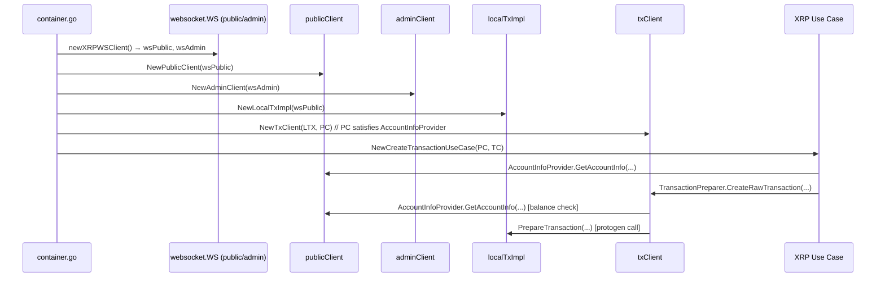

# Design Document — refactor-xrp-struct-infra

## Overview

This refactoring decomposes the monolithic `XRP` struct in `internal/infrastructure/api/xrp/` into five single-responsibility structs, each implementing exactly the port interfaces its role demands. The `WSClient` struct is reduced to a pure internal helper and is no longer exposed beyond the package. Each new struct is wired independently through the DI container, eliminating the over-provision of the current `XRPer` monolith to use cases.

**Purpose**: Replace the `XRP` and `WSClient` types with `publicClient`, `adminClient`, `txClient`, `accountClient`, and `addressClient` so that each use case depends only on what it actually needs.
**Users**: Developers wiring XRP use cases and infrastructure; any future developer adding an XRP use case.
**Impact**: Eliminates `XRP`, `NewXRP`, `WSClient`, `XRPer`, and `XRPAPIProvider`. All downstream use cases and the DI container are updated; no behavior changes for end users.

### Goals

- Five single-responsibility structs, each with a named constructor
- Each struct implements only the port interfaces for its role
- Non-gRPC local implementations so all XRP wallet operations work without the gRPC server
- gRPC backward compat: passing `xrplclient.XRPLClient` fields to the new constructors must compile and behave identically to the current gRPC path
- Build and lint pass (`make check-build`, `make go-lint`) with no new errors

### Non-Goals

- Modifying `apps/xrpl-grpc-server/` or `pkg/chains/xrp/xrplclient/client.go`
- Changing any existing `pkg/chains/xrp/xrplgo/` logic
- Removing `pkg/chains/xrp/protogen/` (DO NOT EDIT — generated files)
- Adding `github.com/XRPLF/xrpl-go` as a dependency

---

## Architecture

### Existing Architecture Analysis

The current `XRP` struct embeds `*WSClient` (holds `public *websocket.WS` and `admin *websocket.WS`) and holds `API *xrplclient.XRPLClient`. Both the `XRPer` monolith and `XRPAPIProvider` sub-monolith are defined in `internal/application/ports/api/xrp/interface.go`. The DI container caches a single `xrp apixrp.XRPer` instance and passes it to every XRP use case factory; use cases then define local narrow interfaces satisfied by the concrete `*XRP`.

The monolith ships five distinct responsibilities over a single type:
1. Public WebSocket communication (node queries)
2. Admin WebSocket communication (node admin)
3. Transaction preparation, signing, combining (local + gRPC)
4. Address generation and validation (gRPC or local)
5. Account queries (WebSocket)

### Architecture Pattern & Boundary Map

```mermaid
graph TD
  subgraph "internal/di"
    DI[container.go]
  end

  subgraph "internal/infrastructure/api/xrp"
    PC[publicClient\npublic *websocket.WS]
    AC[adminClient\nadmin *websocket.WS]
    TC[txClient\nimpl protogen.XRPTransactionAPIClient\nai AccountInfoProvider]
    ACC[accountClient\nimpl protogen.XRPAccountAPIClient]
    ADRC[addressClient\nimpl protogen.XRPAddressAPIClient]
    LTX[localTxImpl\npublic *websocket.WS\nPeersyst signing]
    LACC[localAccountImpl\npublic *websocket.WS]
    LADRC[localAddressImpl\npkg/chains/xrp utilities]
  end

  subgraph "internal/application/ports/api/xrp"
    XRPPublicer
    XRPAdminer
    AccountInfoProvider
    BalanceChecker
    TransactionSubmitter
    TransactionPreparer
    TransactionCombiner
    RegularKeyPreparer
    SignerListPreparer
    KeyGenerator
    Closer
  end

  subgraph "pkg/chains/xrp"
    protogen[protogen.*APIClient interfaces]
    xrplclient[xrplclient.XRPLClient\ngRPC path]
    xrprpc[rpc package]
    xrpkg[pkg/chains/xrp\nkeygen, sign, address]
  end

  DI -->|constructs| PC
  DI -->|constructs| AC
  DI -->|constructs| LTX
  DI -->|constructs| LACC
  DI -->|constructs| LADRC
  DI -->|injects LTX into| TC
  DI -->|injects LACC into| ACC
  DI -->|injects LADRC into| ADRC
  DI -->|gRPC alt: injects xrplclient.TxClient| TC
  DI -->|gRPC alt: injects xrplclient.AccountClient| ACC
  DI -->|gRPC alt: injects xrplclient.AddressClient| ADRC

  PC -->|uses| xrprpc
  AC -->|uses| xrprpc
  LTX -->|uses| xrprpc
  LTX -->|uses| xrpkg
  LACC -->|uses| xrprpc
  LADRC -->|uses| xrpkg

  PC -.->|implements| XRPPublicer
  PC -.->|implements| AccountInfoProvider
  PC -.->|implements| BalanceChecker
  PC -.->|implements| TransactionSubmitter
  AC -.->|implements| XRPAdminer
  AC -.->|implements| KeyGenerator
  TC -.->|implements| TransactionPreparer
  TC -.->|implements| TransactionCombiner
  TC -.->|implements| RegularKeyPreparer
  TC -.->|implements| SignerListPreparer
  ACC -.->|implements| AccountInfoProvider
  ACC -.->|implements| BalanceChecker
  ADRC -.->|implements| Closer
```



**Selected pattern**: Adapter per responsibility — each new struct adapts a lower-level transport or protocol interface to the application port interfaces.

**Existing patterns preserved**: Clean Architecture layer boundaries; port interfaces in `application/ports/`; infrastructure implements, never defines interfaces.

**New components rationale**:
- `localTxImpl` / `localAccountImpl` / `localAddressImpl` separate implementation concerns from the adapter wrapper, enabling gRPC swap without touching the wrapper.

### Technology Stack

| Layer | Choice / Version | Role | Notes |
|-------|-----------------|------|-------|
| Infrastructure structs | Go structs in `internal/infrastructure/api/xrp/` | 5 focused adapters | Replace XRP + WSClient |
| Offline crypto | `github.com/Peersyst/xrpl-go` v0.1.15 | Signing, key generation, address encoding | Already in go.mod |
| WebSocket node queries | `pkg/chains/xrp/rpc` (internal) | account_info, submit, ledger_current | Wraps `pkg/websocket.WS` |
| gRPC compat | `pkg/chains/xrp/protogen` | Interface contracts for tx/account/address | DO NOT EDIT generated |
| DI | `internal/di/container.go` | Independent construction and wiring | 5 separate factory methods |

---

## System Flows

### DI wiring flow (non-gRPC path)



---

## Requirements Traceability

| Requirement | Summary | Components | Interfaces | Notes |
|-------------|---------|------------|------------|-------|
| 1.1 | Delete XRP struct and NewXRP | `xrp.go`, `connection.go` deleted | — | |
| 1.2 | Create 5 unexported structs | `publicClient`, `adminClient`, `txClient`, `accountClient`, `addressClient` | All port interfaces | |
| 1.3 | Each struct carries only needed fields | Field list per struct in Components section | — | |
| 1.4 | Exported constructors | `NewPublicClient`, `NewAdminClient`, `NewTxClient`, `NewAccountClient`, `NewAddressClient` | — | |
| 1.5 | WSClient eliminated or reduced | Removed from exported surface; may keep as private helper | — | |
| 2.1 | publicClient implements public port interfaces | `XRPPublicer`, `AccountInfoProvider`, `BalanceChecker`, `TransactionSubmitter` | — | |
| 2.2 | adminClient implements admin port interfaces | `XRPAdminer`, `KeyGenerator` | — | |
| 2.3 | txClient implements XRPTransactionAPIClient surface | `TransactionPreparer`, `TransactionCombiner`, `RegularKeyPreparer`, `SignerListPreparer` | via localTxImpl or gRPC |
| 2.4 | accountClient implements XRPAccountAPIClient surface | `AccountInfoProvider`, `BalanceChecker` | via localAccountImpl or gRPC |
| 2.5 | addressClient implements XRPAddressAPIClient surface | address port interfaces | via localAddressImpl or gRPC |
| 2.6 | No cross-responsibility methods | Verified by receiver type per method | — | |
| 3.1 | txClient local (no gRPC) | `localTxImpl` using WebSocket + Peersyst | — | |
| 3.2 | accountClient local (no gRPC) | `localAccountImpl` using WebSocket rpc | — | |
| 3.3 | addressClient local (no gRPC) | `localAddressImpl` using pkg/chains/xrp | — | |
| 3.4 | Library compliance | Peersyst offline, xrprpc WebSocket, no XRPLF | — | |
| 4.1 | DI instantiates 5 structs independently | `container.go` | — | |
| 4.2 | Use cases declare only needed port interfaces | Already satisfied; no XRPer in use case params | — | |
| 4.3 | Former XRPAPIProvider use cases get focused interface | `txClient`/`accountClient`/`addressClient` wired per use case | — | |
| 4.4 | Remove all references to XRP/NewXRP/XRPer | `internal/` cleanup | — | |
| 5.1 | No modification to apps/xrpl-grpc-server | Out of scope | — | |
| 5.2 | No modification to xrplclient/client.go | Out of scope | — | |
| 5.3 | gRPC clients injectable into new constructors | Same interface type accepted | — | |
| 5.4 | gRPC/non-gRPC switch via DI only | constructor signature + DI wiring | — | |
| 6.1 | make check-build passes | Full build verification | — | |
| 6.2 | make go-lint passes | No new lint errors | — | |
| 6.3 | make go-test passes | Unit tests in `internal/infrastructure/api/xrp/` and `pkg/chains/xrp/` | — | |
| 6.4 | Port interface definitions unchanged | Existing small interfaces retained | — | |

---

## Components and Interfaces

### Summary Table

| Component | Layer | Intent | Req Coverage | Key Port Interfaces |
|-----------|-------|--------|-------------|----------------------|
| `publicClient` | Infrastructure | Public WebSocket adapter | 1.2, 2.1, 3.x | `XRPPublicer`, `AccountInfoProvider`, `BalanceChecker`, `TransactionSubmitter` |
| `adminClient` | Infrastructure | Admin WebSocket adapter | 1.2, 2.2 | `XRPAdminer`, `KeyGenerator` |
| `txClient` | Infrastructure | Transaction API adapter | 1.2, 2.3, 3.1 | `TransactionPreparer`, `TransactionCombiner`, `RegularKeyPreparer`, `SignerListPreparer` + all `Prepare*` |
| `accountClient` | Infrastructure | Account API adapter | 1.2, 2.4, 3.2 | `AccountInfoProvider`, `BalanceChecker` |
| `addressClient` | Infrastructure | Address API adapter | 1.2, 2.5, 3.3 | Address port interfaces |
| `localTxImpl` | Infrastructure | Non-gRPC tx implementation | 3.1 | `protogen.XRPTransactionAPIClient` |
| `localAccountImpl` | Infrastructure | Non-gRPC account implementation | 3.2 | `protogen.XRPAccountAPIClient` |
| `localAddressImpl` | Infrastructure | Non-gRPC address implementation | 3.3 | `protogen.XRPAddressAPIClient` |

---

### Infrastructure / `internal/infrastructure/api/xrp/`

#### `publicClient`

| Field | Detail |
|-------|--------|
| Intent | Adapts public WebSocket to public-facing port interfaces |
| Requirements | 1.2, 1.3, 1.4, 2.1 |

**Responsibilities & Constraints**

- Wraps `public *websocket.WS`; does NOT hold the admin websocket
- Owns all operations directed at the public XRPL node
- `WaitValidation` polls ledger_current via public WS only; admin ledger_accept is removed

**Fields**

```go
type publicClient struct {
    ws *websocket.WS // public node connection
}
```

**Constructor**

```go
func NewPublicClient(ws *websocket.WS) *publicClient
```

**Contracts**: Service [x]

**Port Interfaces Implemented**

| Interface | Methods |
|-----------|---------|
| `XRPPublicer` | `AccountChannels`, `AccountInfo`, `ServerInfo` |
| `AccountInfoProvider` | `GetAccountInfo` |
| `BalanceChecker` | `GetBalance`, `GetTotalBalance` |
| `TransactionSubmitter` | `SubmitTransaction`, `WaitValidation`, `GetTransaction` |

**Implementation Notes**

- Logic migrated directly from `WSClient` methods on the public connection
- `BalanceChecker` delegates to `GetAccountInfo` (same logic as current `WSClient`)

---

#### `adminClient`

| Field | Detail |
|-------|--------|
| Intent | Adapts admin WebSocket to admin port interfaces |
| Requirements | 1.2, 1.3, 1.4, 2.2 |

**Fields**

```go
type adminClient struct {
    ws *websocket.WS // admin node connection
}
```

**Constructor**

```go
func NewAdminClient(ws *websocket.WS) *adminClient
```

**Port Interfaces Implemented**

| Interface | Methods |
|-----------|---------|
| `XRPAdminer` | `ValidationCreate`, `WalletProposeWithKey`, `WalletPropose` |
| `KeyGenerator` | `WalletPropose` |

**Implementation Notes**

- Logic migrated directly from `WSClient` admin methods

---

#### `txClient`

| Field | Detail |
|-------|--------|
| Intent | Adapts XRPTransactionAPIClient to transaction port interfaces |
| Requirements | 1.2, 1.3, 1.4, 2.3, 3.1, 5.3 |

**Fields**

```go
type txClient struct {
    impl        protogen.XRPTransactionAPIClient
    accountInfo apixrp.AccountInfoProvider // for CreateRawTransaction balance check
}
```

**Constructor**

```go
func NewTxClient(
    impl protogen.XRPTransactionAPIClient,
    ai apixrp.AccountInfoProvider,
) *txClient
```

The `impl` field accepts either a `localTxImpl` (non-gRPC) or `xrplclient.XRPLClient.TxClient` (gRPC); switching requires only DI wiring changes.

**Port Interfaces Implemented**

| Interface | Methods |
|-----------|---------|
| `TransactionPreparer` | `CreateRawTransaction` |
| `TransactionCombiner` | `CombineTransaction` |
| `RegularKeyPreparer` | `PrepareSetRegularKeyTransaction` |
| `SignerListPreparer` | `PrepareSignerListSetTransaction` |
| Additional transaction ops | `PrepareAccountSetTransaction`, `PrepareEscrowCreateTransaction`, `PrepareEscrowFinishTransaction`, `PrepareEscrowCancelTransaction`, `PreparePaymentChannelCreateTransaction`, `PreparePaymentChannelFundTransaction`, `PreparePaymentChannelClaimTransaction`, `PrepareNFTokenMintTransaction`, `PrepareNFTokenBurnTransaction`, `PrepareNFTokenCreateOfferTransaction`, `PrepareNFTokenAcceptOfferTransaction`, `PrepareNFTokenCancelOfferTransaction` |
| Signing | `SignTransaction`, `SignTransactionNative` |

**Implementation Notes**

- `CreateRawTransaction` uses `accountInfo.GetAccountInfo(...)` for balance validation, then delegates to `impl.PrepareTransaction(...)`
- `SignTransaction` uses `PeersystSigner` (offline) regardless of `impl` type
- `CombineTransaction` and `Prepare*` methods convert DTO ↔ protogen types and delegate to `impl`

---

#### `localTxImpl`

| Field | Detail |
|-------|--------|
| Intent | Non-gRPC implementation of `protogen.XRPTransactionAPIClient` |
| Requirements | 3.1, 3.4 |

**Fields**

```go
type localTxImpl struct {
    ws *websocket.WS // public node for account_info queries
}
```

**Constructor**

```go
func NewLocalTxImpl(ws *websocket.WS) *localTxImpl
```

**Implements**: `protogen.XRPTransactionAPIClient`

**Implementation Notes**

- `PrepareTransaction`: queries `xrprpc.AccountInfo` for sequence and ledger index; builds tx locally (existing `WSClient.PrepareTransaction` logic)
- `SignTransaction`: delegates to `PeersystSigner` (existing `signer/peersyst_signer.go`)
- `CombineTransaction`: implements multisig combining using `binary-codec` from `Peersyst/xrpl-go`
- `Prepare*` methods: build transaction JSON using DTO fields (existing logic from `xrpapi_tx_*.go` files, adapted)

---

#### `accountClient`

| Field | Detail |
|-------|--------|
| Intent | Adapts XRPAccountAPIClient to account port interfaces |
| Requirements | 1.2, 1.3, 1.4, 2.4, 3.2, 5.3 |

**Fields**

```go
type accountClient struct {
    impl protogen.XRPAccountAPIClient
}
```

**Constructor**

```go
func NewAccountClient(impl protogen.XRPAccountAPIClient) *accountClient
```

**Port Interfaces Implemented**

| Interface | Methods |
|-----------|---------|
| `AccountInfoProvider` | `GetAccountInfo` |
| `BalanceChecker` | `GetBalance`, `GetTotalBalance` |

---

#### `localAccountImpl`

| Field | Detail |
|-------|--------|
| Intent | Non-gRPC implementation of `protogen.XRPAccountAPIClient` |
| Requirements | 3.2, 3.4 |

**Fields**

```go
type localAccountImpl struct {
    ws *websocket.WS // public node
}
```

**Constructor**

```go
func NewLocalAccountImpl(ws *websocket.WS) *localAccountImpl
```

**Implements**: `protogen.XRPAccountAPIClient`

**Implementation Notes**

- `GetAccountInfo`: existing `WSClient.GetAccountInfo` logic (calls `xrprpc.AccountInfo`)
- Returns protogen response types (wraps data in protogen structs)

---

#### `addressClient`

| Field | Detail |
|-------|--------|
| Intent | Adapts XRPAddressAPIClient to address port interfaces |
| Requirements | 1.2, 1.3, 1.4, 2.5, 3.3, 5.3 |

**Fields**

```go
type addressClient struct {
    impl protogen.XRPAddressAPIClient
}
```

**Constructor**

```go
func NewAddressClient(impl protogen.XRPAddressAPIClient) *addressClient
```

**Port Interfaces Implemented**

Exposes address generation/validation methods for the port interfaces that cover:
- `GenerateAddress`, `GenerateXAddress` (key generation)
- `IsValidAddress` (validation)

---

#### `localAddressImpl`

| Field | Detail |
|-------|--------|
| Intent | Non-gRPC implementation of `protogen.XRPAddressAPIClient` using `pkg/chains/xrp` |
| Requirements | 3.3, 3.4 |

**Fields**

```go
type localAddressImpl struct{}
```

**Constructor**

```go
func NewLocalAddressImpl() *localAddressImpl
```

**Implements**: `protogen.XRPAddressAPIClient`

**Implementation Notes**

- `GenerateAddress`: uses `pkg/chains/xrp.NewKeyGenerator` + `GenerateRandom()`
- `GenerateXAddress`: same key generator, returns X-Address formatted result
- `IsValidAddress`: uses `pkg/chains/xrp.ValidateAddress()`
- Library: `github.com/Peersyst/xrpl-go` address-codec for any encoding

---

### Port Interfaces (`internal/application/ports/api/xrp/interface.go`)

**To be removed**:
- `XRPer` — monolithic composite; eliminated
- `XRPAPIProvider` — sub-monolithic; eliminated

**Retained (unchanged)**:
- `XRPPublicer`, `XRPAdminer` — implemented by `publicClient` / `adminClient`
- `AccountInfoProvider`, `BalanceChecker`, `TransactionSubmitter`, `TransactionPreparer`, `TransactionCombiner`, `RegularKeyPreparer`, `SignerListPreparer`, `KeyGenerator`, `Closer`, `CoinTypeProvider` — all retained

**New port interfaces** (if needed): If use cases commonly combine the same pair of interfaces, a named composite may be promoted to `interface.go`. The initial implementation avoids premature composites.

---

### DI Container (`internal/di/container.go`)

**Field changes**:
```go
// Remove:
xrp apixrp.XRPer

// Add:
xrpPublic   *apixrpimpl.publicClient
xrpAdmin    *apixrpimpl.adminClient
xrpTx       *apixrpimpl.txClient
xrpAccount  *apixrpimpl.accountClient
xrpAddress  *apixrpimpl.addressClient
```

**New factory methods** (one per new struct, lazy-initialized and cached):
- `newXRPPublicClient() *apixrpimpl.publicClient`
- `newXRPAdminClient() *apixrpimpl.adminClient`
- `newXRPTxClient() *apixrpimpl.txClient`
- `newXRPAccountClient() *apixrpimpl.accountClient`
- `newXRPAddressClient() *apixrpimpl.addressClient`

**Use case factory updates** (examples):

| Use case factory | Was | Now |
|------------------|-----|-----|
| `newXRPWatchCreateTransactionUseCase` | `c.newXRP()` × 2 | `c.newXRPPublicClient()`, `c.newXRPTxClient()` |
| `newXRPWatchSendTransactionUseCase` | `c.newXRP()` | `c.newXRPPublicClient()` (TransactionSubmitter) |
| `newXRPWatchSetRegularKeyUseCase` | `c.newXRP()` | `c.newXRPTxClient()` |
| `newXRPWatchCreateMultisigTxUseCase` | `c.newXRP()` | `c.newXRPTxClient()` |
| `newXRPWatchAddMultisigSignatureUseCase` | `c.newXRP()` | `c.newXRPTxClient()` |
| `newXRPWatchSubmitMultisigTxUseCase` | `c.newXRP()` | `c.newXRPPublicClient()` |
| `newXRPWatchMonitorTransactionUseCase` | `c.newXRP()` | `c.newXRPPublicClient()` |
| `newXRPKeygenGenerateKeyUseCase` | `c.newXRP()` | `c.newXRPAdminClient()` |
| `newXRPKeygenSignTransactionUseCase` | `c.newXRP()` | `c.newXRPTxClient()` |

---

### Interface-Adapters (`internal/interface-adapters/wallet/xrp/`)

**`XRPKeygen`**: Replace `XRP apixrp.XRPer` with `closer apixrp.Closer` (only `Close()` is called in `Done()`). Or remove entirely if the `Done()` method only needs to close the DB connection (the close of each XRP client can be handled independently in the DI container shutdown path).

**`XRPWatch`** (watch.go): Same pattern — replace `XRP apixrp.XRPer` with `closer apixrp.Closer`.

---

## Error Handling

### Error Strategy

No new error categories introduced. All existing error wrapping patterns (`fmt.Errorf("...: %w", err)`) are preserved in each new struct. The adapter methods propagate errors from the underlying `impl` or WebSocket calls unchanged.

### Monitoring

No changes to existing logging. Methods log at the same level as the current implementations they replace.

---

## Testing Strategy

### Unit Tests

1. `publicClient`: test `GetAccountInfo`, `GetBalance`, `SubmitTransaction`, `WaitValidation` with mock WebSocket (using `testutil/`)
2. `adminClient`: test `ValidationCreate`, `WalletPropose` with mock admin WebSocket
3. `txClient`: test `CreateRawTransaction`, `SignTransaction`, `CombineTransaction` with mock `protogen.XRPTransactionAPIClient`
4. `localTxImpl`: test `PrepareTransaction` using existing `testutil/` integration test infrastructure
5. `localAddressImpl`: test `GenerateAddress`, `IsValidAddress` — pure offline, no network dependency

### Integration Tests (existing)

Existing integration tests in `internal/infrastructure/api/xrp/*_test.go` are updated to use the new struct types. Test helpers in `testutil/` are updated to construct the new structs.

### Build Verification

- `make go-lint` — no new lint errors
- `make check-build` — entire module compiles
- `make go-test` — all unit tests pass

---

## Security Considerations

- `localAddressImpl.GenerateAddress` uses `pkg/chains/xrp.NewKeyGenerator` which generates keys offline — no private key material transmitted over the network
- Seed/private key logging rules from `.claude/rules/security.md` remain in effect; no new code touches private key material beyond existing signer

---

## Migration Strategy

The refactoring is **non-breaking at runtime** (same behavior, different struct boundaries). The migration order:

1. Add 5 new structs and their constructors in `internal/infrastructure/api/xrp/` (new files, no deletions yet)
2. Add local non-gRPC implementations (`localTxImpl`, `localAccountImpl`, `localAddressImpl`)
3. Update `internal/di/container.go` to use new structs; update all use case factories
4. Update `internal/interface-adapters/wallet/xrp/` to remove `XRPer` references
5. Remove `XRP`, `NewXRP`, `WSClient`, `NewXRPFromCoinType`; remove `XRPer`, `XRPAPIProvider` from port interfaces
6. Run `make go-lint && make check-build && make go-test`

Each step compiles independently, enabling incremental validation.
