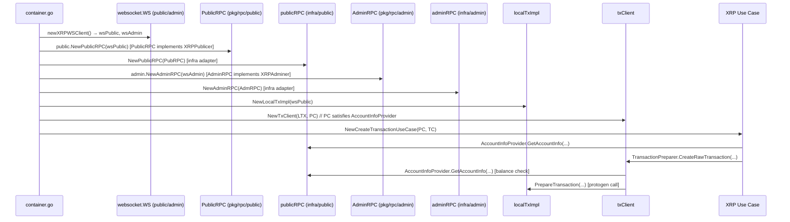

# Design Document — refactor-xrp-struct-infra

## Overview

This refactoring decomposes the monolithic `XRP` struct in `internal/infrastructure/api/xrp/` into focused single-responsibility structs. Public and admin WebSocket operations use a two-layer design: typed RPC structs (`PublicRPC`, `AdminRPC`) at the `pkg` layer and adapter structs (`publicRPC`, `adminRPC`) at the infrastructure layer. Transaction, account, and address operations become `txClient`, `accountClient`, and `addressClient`. The `WSClient` struct is eliminated. Each new struct is wired independently through the DI container, eliminating the over-provision of the current `XRPer` monolith to use cases.

**Purpose**: Replace the `XRP` and `WSClient` types with focused adapter structs (`publicRPC`, `adminRPC`, `txClient`, `accountClient`, `addressClient`) so that each use case depends only on what it actually needs. The public and admin WebSocket paths use a two-layer design: a typed RPC struct at the `pkg` layer and an adapter struct at the `internal/infrastructure` layer.
**Users**: Developers wiring XRP use cases and infrastructure; any future developer adding an XRP use case.
**Impact**: Eliminates `XRP`, `NewXRP`, `WSClient`, `XRPer`, and `XRPAPIProvider`. The `XRPPublicer` and `XRPAdminer` interfaces move from `internal/application/ports/api/xrp/` to `pkg/chains/xrp/rpc/public/` and `pkg/chains/xrp/rpc/admin/` respectively. All downstream use cases and the DI container are updated; no behavior changes for end users.

### Goals

- Five single-responsibility structs, each with a named constructor
- Each struct implements only the port interfaces for its role
- Non-gRPC local implementations so all XRP wallet operations work without the gRPC server
- gRPC backward compat: passing `xrplclient.XRPLClient` fields to the new constructors must compile and behave identically to the current gRPC path
- Build and lint pass (`make check-build`, `make go-lint`) with no new errors

### Non-Goals

- Modifying `apps/xrpl-grpc-server/` or `pkg/chains/xrp/xrplclient/client.go`
- Changing any existing `pkg/chains/xrp/xrplgo/` logic
- Removing `pkg/chains/xrp/protogen/` (DO NOT EDIT — generated files)
- Adding `github.com/XRPLF/xrpl-go` as a dependency

---

## Architecture

### Existing Architecture Analysis

The current `XRP` struct embeds `*WSClient` (holds `public *websocket.WS` and `admin *websocket.WS`) and holds `API *xrplclient.XRPLClient`. Both the `XRPer` monolith and `XRPAPIProvider` sub-monolith are defined in `internal/application/ports/api/xrp/interface.go`. The DI container caches a single `xrp apixrp.XRPer` instance and passes it to every XRP use case factory; use cases then define local narrow interfaces satisfied by the concrete `*XRP`.

The monolith ships five distinct responsibilities over a single type:
1. Public WebSocket communication (node queries)
2. Admin WebSocket communication (node admin)
3. Transaction preparation, signing, combining (local + gRPC)
4. Address generation and validation (gRPC or local)
5. Account queries (WebSocket)

### Architecture Pattern & Boundary Map

```mermaid
graph TD
  subgraph "internal/di"
    DI[container.go]
  end

  subgraph "internal/infrastructure/api/xrp/public"
    PC[publicRPC\ncaller xrprpcpublic.XRPPublicer]
  end

  subgraph "internal/infrastructure/api/xrp/admin"
    AC[adminRPC\ncaller xrprpcadmin.XRPAdminer]
  end

  subgraph "internal/infrastructure/api/xrp"
    TC[txClient\nimpl protogen.XRPTransactionAPIClient\nai AccountInfoProvider]
    ACC[accountClient\nimpl protogen.XRPAccountAPIClient]
    ADRC[addressClient\nimpl protogen.XRPAddressAPIClient]
    LTX[localTxImpl\nws *websocket.WS\nPeersyst signing]
    LACC[localAccountImpl\nws *websocket.WS]
    LADRC[localAddressImpl\npkg/chains/xrp utilities]
  end

  subgraph "internal/application/ports/api/xrp"
    AccountInfoProvider
    BalanceChecker
    TransactionSubmitter
    TransactionPreparer
    TransactionCombiner
    RegularKeyPreparer
    SignerListPreparer
    KeyGenerator
    Closer
  end

  subgraph "pkg/chains/xrp/rpc/public"
    PubRPC[PublicRPC\ncaller rpc.WSCaller]
    XRPPublicer[XRPPublicer interface]
  end

  subgraph "pkg/chains/xrp/rpc/admin"
    AdmRPC[AdminRPC\ncaller rpc.WSCaller]
    XRPAdminer[XRPAdminer interface]
  end

  subgraph "pkg/chains/xrp"
    protogen[protogen.*APIClient interfaces]
    xrplclient[xrplclient.XRPLClient\ngRPC path]
    xrpkg[pkg/chains/xrp\nkeygen, sign, address]
  end

  DI -->|constructs PublicRPC then publicRPC| PC
  DI -->|constructs AdminRPC then adminRPC| AC
  DI -->|constructs| LTX
  DI -->|constructs| LACC
  DI -->|constructs| LADRC
  DI -->|injects LTX into| TC
  DI -->|injects LACC into| ACC
  DI -->|injects LADRC into| ADRC
  DI -->|gRPC alt: injects xrplclient.TxClient| TC
  DI -->|gRPC alt: injects xrplclient.AccountClient| ACC
  DI -->|gRPC alt: injects xrplclient.AddressClient| ADRC

  PC -->|delegates to| PubRPC
  AC -->|delegates to| AdmRPC
  PubRPC -.->|implements| XRPPublicer
  AdmRPC -.->|implements| XRPAdminer

  LTX -->|uses| PubRPC
  LTX -->|uses| xrpkg
  LACC -->|uses| PubRPC
  LADRC -->|uses| xrpkg

  PC -.->|implements| AccountInfoProvider
  PC -.->|implements| BalanceChecker
  PC -.->|implements| TransactionSubmitter
  AC -.->|implements| KeyGenerator
  TC -.->|implements| TransactionPreparer
  TC -.->|implements| TransactionCombiner
  TC -.->|implements| RegularKeyPreparer
  TC -.->|implements| SignerListPreparer
  ACC -.->|implements| AccountInfoProvider
  ACC -.->|implements| BalanceChecker
  ADRC -.->|implements| Closer
```



**Selected pattern**: Two-layer adapter per responsibility.

- `pkg` layer: `PublicRPC` / `AdminRPC` typed structs providing typed WebSocket RPC methods (methods on receivers replacing standalone functions). Interfaces `XRPPublicer` / `XRPAdminer` defined here.
- `internal/infrastructure` layer: `publicRPC` / `adminRPC` adapter structs wrapping the pkg-layer interface and implementing application port interfaces.

**Existing patterns preserved**: Clean Architecture layer boundaries; application port interfaces in `application/ports/` (for use-case-facing interfaces); infrastructure implements, never defines port interfaces.

**Exception**: `XRPPublicer` and `XRPAdminer` are defined in `pkg/` (not ports) because they describe the RPC wire protocol boundary, not the application boundary. They are parallel to `rpc.BTCRPC` (defined in `pkg/chains/btc/rpc/`) following the same pattern used in BTC.

**New components rationale**:
- `PublicRPC` / `AdminRPC` in `pkg/` encapsulate the wire-protocol shape and are testable without the infrastructure layer.
- `publicRPC` / `adminRPC` in `internal/infrastructure/` bridge from the typed RPC calls to the application port method signatures (e.g., `GetAccountInfo`, `GetBalance`).
- `localTxImpl` / `localAccountImpl` / `localAddressImpl` separate implementation concerns from the adapter wrapper, enabling gRPC swap without touching the wrapper.

### Technology Stack

| Layer | Choice / Version | Role | Notes |
|-------|-----------------|------|-------|
| pkg RPC structs | `pkg/chains/xrp/rpc/public/`, `pkg/chains/xrp/rpc/admin/` | `PublicRPC`, `AdminRPC` typed structs with methods | Replace standalone functions; interfaces `XRPPublicer`/`XRPAdminer` defined here |
| Infrastructure adapters | `internal/infrastructure/api/xrp/public/`, `admin/` | `publicRPC`, `adminRPC` adapters wrapping pkg interfaces | Bridge pkg-layer RPCs to application port interfaces |
| Infrastructure tx/account/addr | `internal/infrastructure/api/xrp/` | `txClient`, `accountClient`, `addressClient` | Accept `protogen.*APIClient`; local or gRPC impl |
| Offline crypto | `github.com/Peersyst/xrpl-go` v0.1.15 | Signing, key generation, address encoding | Already in go.mod |
| WebSocket node queries | `pkg/chains/xrp/rpc` (internal) | `WSCaller` interface, `account_info`, `submit`, `ledger_current` | Wraps `pkg/websocket.WS` |
| gRPC compat | `pkg/chains/xrp/protogen` | Interface contracts for tx/account/address | DO NOT EDIT generated |
| DI | `internal/di/container.go` | Independent construction and wiring | Separate factory methods per struct |

---

## System Flows

### DI wiring flow (non-gRPC path)



---

## Requirements Traceability

| Requirement | Summary | Components | Interfaces | Notes |
|-------------|---------|------------|------------|-------|
| 1.1 | Delete XRP struct and NewXRP | `xrp.go`, `connection.go` deleted | — | |
| 1.2 | Reorganize `pkg/chains/xrp/rpc/` into `public/` and `admin/` subdirs | `PublicRPC`, `AdminRPC` structs with methods + `XRPPublicer`/`XRPAdminer` interfaces | — | Interfaces live at pkg layer |
| 1.3 | Create infra adapter structs in matching subdirs | `publicRPC`, `adminRPC`, `txClient`, `accountClient`, `addressClient` | All port interfaces | |
| 1.4 | Each struct carries only needed fields | Field list per struct in Components section | — | |
| 1.5 | Exported constructors | `NewPublicRPC`, `NewAdminRPC`, `NewTxClient`, `NewAccountClient`, `NewAddressClient` | — | |
| 1.6 | WSClient eliminated or reduced | Removed from exported surface; may keep as private helper | — | |
| 2.1 | `XRPPublicer`/`XRPAdminer` defined in pkg layer; publicRPC/adminRPC implement port interfaces | `AccountInfoProvider`, `BalanceChecker`, `TransactionSubmitter`, `KeyGenerator` | — | Interfaces removed from ports |
| 2.2 | No cross-responsibility methods | Verified by receiver type per method | — | |
| 2.3 | txClient implements XRPTransactionAPIClient surface | `TransactionPreparer`, `TransactionCombiner`, `RegularKeyPreparer`, `SignerListPreparer` | via localTxImpl or gRPC |
| 2.4 | accountClient implements XRPAccountAPIClient surface | `AccountInfoProvider`, `BalanceChecker` | via localAccountImpl or gRPC |
| 2.5 | addressClient implements XRPAddressAPIClient surface | address port interfaces | via localAddressImpl or gRPC |
| 2.7 | Mockery config updated | `XRPPublicer` mocks from pkg/public, `XRPAdminer` mocks from pkg/admin | — | |
| 3.1 | txClient local (no gRPC) | `localTxImpl` using WebSocket + Peersyst | — | |
| 3.2 | accountClient local (no gRPC) | `localAccountImpl` using WebSocket rpc | — | |
| 3.3 | addressClient local (no gRPC) | `localAddressImpl` using pkg/chains/xrp | — | |
| 3.4 | Library compliance | Peersyst offline, xrprpc WebSocket, no XRPLF | — | |
| 4.1 | DI instantiates all structs independently | `container.go` | — | |
| 4.2 | Use cases declare only needed port interfaces | Already satisfied; no XRPer in use case params | — | |
| 4.3 | Former XRPAPIProvider use cases get focused interface | `txClient`/`accountClient`/`addressClient` wired per use case | — | |
| 4.4 | Remove all references to XRP/NewXRP/XRPer | `internal/` cleanup | — | |
| 5.1 | No modification to apps/xrpl-grpc-server | Out of scope | — | |
| 5.2 | No modification to xrplclient/client.go | Out of scope | — | |
| 5.3 | gRPC clients injectable into new constructors | Same interface type accepted | — | |
| 5.4 | gRPC/non-gRPC switch via DI only | constructor signature + DI wiring | — | |
| 6.1 | make check-build passes | Full build verification | — | |
| 6.2 | make go-lint passes | No new lint errors | — | |
| 6.3 | make go-test passes | Unit tests in `internal/infrastructure/api/xrp/` and `pkg/chains/xrp/` | — | |
| 6.4 | Port interface definitions unchanged | Existing small interfaces retained | — | `XRPPublicer`/`XRPAdminer` moved, not changed |

---

## Components and Interfaces

### Summary Table

| Component | Package | Layer | Intent | Req Coverage | Key Interfaces |
|-----------|---------|-------|--------|-------------|----------------|
| `PublicRPC` | `pkg/chains/xrp/rpc/public/` | pkg | Typed public-node WebSocket RPC struct | 1.2 | `XRPPublicer` (defined here) |
| `AdminRPC` | `pkg/chains/xrp/rpc/admin/` | pkg | Typed admin-node WebSocket RPC struct | 1.2 | `XRPAdminer` (defined here) |
| `publicRPC` | `internal/infrastructure/api/xrp/public/` | Infrastructure | Adapter: bridges `XRPPublicer` to port interfaces | 1.3, 2.1, 3.x | `AccountInfoProvider`, `BalanceChecker`, `TransactionSubmitter` |
| `adminRPC` | `internal/infrastructure/api/xrp/admin/` | Infrastructure | Adapter: bridges `XRPAdminer` to port interfaces | 1.3, 2.2 | `KeyGenerator` |
| `txClient` | `internal/infrastructure/api/xrp/` | Infrastructure | Transaction API adapter | 1.3, 2.3, 3.1 | `TransactionPreparer`, `TransactionCombiner`, `RegularKeyPreparer`, `SignerListPreparer` + all `Prepare*` |
| `accountClient` | `internal/infrastructure/api/xrp/` | Infrastructure | Account API adapter | 1.3, 2.4, 3.2 | `AccountInfoProvider`, `BalanceChecker` |
| `addressClient` | `internal/infrastructure/api/xrp/` | Infrastructure | Address API adapter | 1.3, 2.5, 3.3 | Address port interfaces |
| `localTxImpl` | `internal/infrastructure/api/xrp/` | Infrastructure | Non-gRPC tx implementation | 3.1 | `protogen.XRPTransactionAPIClient` |
| `localAccountImpl` | `internal/infrastructure/api/xrp/` | Infrastructure | Non-gRPC account implementation | 3.2 | `protogen.XRPAccountAPIClient` |
| `localAddressImpl` | `internal/infrastructure/api/xrp/` | Infrastructure | Non-gRPC address implementation | 3.3 | `protogen.XRPAddressAPIClient` |

---

### pkg layer / `pkg/chains/xrp/rpc/public/` and `pkg/chains/xrp/rpc/admin/`

#### `PublicRPC`

| Field | Detail |
|-------|--------|
| Intent | Low-level typed struct for public-node WebSocket RPC calls |
| Location | `pkg/chains/xrp/rpc/public/client.go` |
| Requirements | 1.2 |

**Responsibilities & Constraints**

- Holds a `rpc.WSCaller` (the `websocket.WS` public connection, accessed via the `WSCaller` interface)
- Exposes methods for all public RPC commands (`AccountInfo`, `AccountChannels`, `ServerInfo`, `Submit`, `GetTx`, `LedgerCurrent`)
- Methods replace the previous standalone functions in `pkg/chains/xrp/rpc/`
- Does NOT hold the admin connection

**Fields**

```go
// pkg/chains/xrp/rpc/public/client.go
type PublicRPC struct {
    caller rpc.WSCaller
}
```

**Constructor**

```go
func NewPublicRPC(caller rpc.WSCaller) *PublicRPC
```

**Interface Defined Here**

```go
// pkg/chains/xrp/rpc/public/interface.go
type XRPPublicer interface {
    AccountChannels(ctx context.Context, sender, receiver string) (*ResponseAccountChannels, error)
    AccountInfo(ctx context.Context, address string) (*ResponseAccountInfo, error)
    ServerInfo(ctx context.Context) (*ResponseServerInfo, error)
}
```

`PublicRPC` implements `XRPPublicer`. Mocks for `XRPPublicer` are generated from this package (see `.mockery.yaml`).

---

#### `AdminRPC`

| Field | Detail |
|-------|--------|
| Intent | Low-level typed struct for admin-node WebSocket RPC calls |
| Location | `pkg/chains/xrp/rpc/admin/client.go` |
| Requirements | 1.2 |

**Fields**

```go
// pkg/chains/xrp/rpc/admin/client.go
type AdminRPC struct {
    caller rpc.WSCaller
}
```

**Constructor**

```go
func NewAdminRPC(caller rpc.WSCaller) *AdminRPC
```

**Interface Defined Here**

```go
// pkg/chains/xrp/rpc/admin/interface.go
type XRPAdminer interface {
    ValidationCreate(ctx context.Context, secret string) (*ResponseValidationCreate, error)
    WalletProposeWithKey(ctx context.Context, seed string, keyType xrp.KeyType) (*ResponseWalletPropose, error)
    WalletPropose(ctx context.Context, passphrase string) (*ResponseWalletPropose, error)
}
```

`AdminRPC` implements `XRPAdminer`. Mocks generated from this package (see `.mockery.yaml`).

---

### Infrastructure / `internal/infrastructure/api/xrp/`

#### `publicRPC`

| Field | Detail |
|-------|--------|
| Intent | Adapter: wraps `xrprpcpublic.XRPPublicer`, implements application port interfaces |
| Location | `internal/infrastructure/api/xrp/public/public.go` |
| Requirements | 1.3, 1.4, 1.5, 2.1 |

**Responsibilities & Constraints**

- Holds `caller xrprpcpublic.XRPPublicer`; does NOT hold `*websocket.WS` directly
- Bridges typed RPC responses to application port method signatures
- `WaitValidation` polls `LedgerCurrent` via the public caller

**Fields**

```go
type publicRPC struct {
    caller xrprpcpublic.XRPPublicer
}
```

**Constructor**

```go
func NewPublicRPC(caller xrprpcpublic.XRPPublicer) *publicRPC
```

**Port Interfaces Implemented**

| Interface | Methods |
|-----------|---------|
| `AccountInfoProvider` | `GetAccountInfo` |
| `BalanceChecker` | `GetBalance`, `GetTotalBalance` |
| `TransactionSubmitter` | `SubmitTransaction`, `WaitValidation`, `GetTransaction` |

**Implementation Notes**

- Logic migrated from `WSClient` methods; now delegates to `r.caller.AccountInfo(...)` etc.
- `BalanceChecker` delegates to `GetAccountInfo` (same logic as current `WSClient`)

---

#### `adminRPC`

| Field | Detail |
|-------|--------|
| Intent | Adapter: wraps `xrprpcadmin.XRPAdminer`, implements application port interfaces |
| Location | `internal/infrastructure/api/xrp/admin/admin.go` |
| Requirements | 1.3, 1.4, 1.5, 2.2 |

**Fields**

```go
type adminRPC struct {
    caller xrprpcadmin.XRPAdminer
}
```

**Constructor**

```go
func NewAdminRPC(caller xrprpcadmin.XRPAdminer) *adminRPC
```

**Port Interfaces Implemented**

| Interface | Methods |
|-----------|---------|
| `KeyGenerator` | `WalletPropose` |

**Implementation Notes**

- Delegates directly to `r.caller.ValidationCreate(...)`, `r.caller.WalletPropose(...)`, etc.

---

#### `txClient`

| Field | Detail |
|-------|--------|
| Intent | Adapts XRPTransactionAPIClient to transaction port interfaces |
| Requirements | 1.2, 1.3, 1.4, 2.3, 3.1, 5.3 |

**Fields**

```go
type txClient struct {
    impl        protogen.XRPTransactionAPIClient
    accountInfo apixrp.AccountInfoProvider // for CreateRawTransaction balance check
}
```

**Constructor**

```go
func NewTxClient(
    impl protogen.XRPTransactionAPIClient,
    ai apixrp.AccountInfoProvider,
) *txClient
```

The `impl` field accepts either a `localTxImpl` (non-gRPC) or `xrplclient.XRPLClient.TxClient` (gRPC); switching requires only DI wiring changes.

**Port Interfaces Implemented**

| Interface | Methods |
|-----------|---------|
| `TransactionPreparer` | `CreateRawTransaction` |
| `TransactionCombiner` | `CombineTransaction` |
| `RegularKeyPreparer` | `PrepareSetRegularKeyTransaction` |
| `SignerListPreparer` | `PrepareSignerListSetTransaction` |
| Additional transaction ops | `PrepareAccountSetTransaction`, `PrepareEscrowCreateTransaction`, `PrepareEscrowFinishTransaction`, `PrepareEscrowCancelTransaction`, `PreparePaymentChannelCreateTransaction`, `PreparePaymentChannelFundTransaction`, `PreparePaymentChannelClaimTransaction`, `PrepareNFTokenMintTransaction`, `PrepareNFTokenBurnTransaction`, `PrepareNFTokenCreateOfferTransaction`, `PrepareNFTokenAcceptOfferTransaction`, `PrepareNFTokenCancelOfferTransaction` |
| Signing | `SignTransaction`, `SignTransactionNative` |

**Implementation Notes**

- `CreateRawTransaction` uses `accountInfo.GetAccountInfo(...)` for balance validation, then delegates to `impl.PrepareTransaction(...)`
- `SignTransaction` uses `PeersystSigner` (offline) regardless of `impl` type
- `CombineTransaction` and `Prepare*` methods convert DTO ↔ protogen types and delegate to `impl`

---

#### `localTxImpl`

| Field | Detail |
|-------|--------|
| Intent | Non-gRPC implementation of `protogen.XRPTransactionAPIClient` |
| Requirements | 3.1, 3.4 |

**Fields**

```go
type localTxImpl struct {
    ws *websocket.WS // public node for account_info queries
}
```

**Constructor**

```go
func NewLocalTxImpl(ws *websocket.WS) *localTxImpl
```

**Implements**: `protogen.XRPTransactionAPIClient`

**Implementation Notes**

- `PrepareTransaction`: queries `xrprpc.AccountInfo` for sequence and ledger index; builds tx locally (existing `WSClient.PrepareTransaction` logic)
- `SignTransaction`: delegates to `PeersystSigner` (existing `signer/peersyst_signer.go`)
- `CombineTransaction`: implements multisig combining using `binary-codec` from `Peersyst/xrpl-go`
- `Prepare*` methods: build transaction JSON using DTO fields (existing logic from `xrpapi_tx_*.go` files, adapted)

---

#### `accountClient`

| Field | Detail |
|-------|--------|
| Intent | Adapts XRPAccountAPIClient to account port interfaces |
| Requirements | 1.2, 1.3, 1.4, 2.4, 3.2, 5.3 |

**Fields**

```go
type accountClient struct {
    impl protogen.XRPAccountAPIClient
}
```

**Constructor**

```go
func NewAccountClient(impl protogen.XRPAccountAPIClient) *accountClient
```

**Port Interfaces Implemented**

| Interface | Methods |
|-----------|---------|
| `AccountInfoProvider` | `GetAccountInfo` |
| `BalanceChecker` | `GetBalance`, `GetTotalBalance` |

---

#### `localAccountImpl`

| Field | Detail |
|-------|--------|
| Intent | Non-gRPC implementation of `protogen.XRPAccountAPIClient` |
| Requirements | 3.2, 3.4 |

**Fields**

```go
type localAccountImpl struct {
    ws *websocket.WS // public node
}
```

**Constructor**

```go
func NewLocalAccountImpl(ws *websocket.WS) *localAccountImpl
```

**Implements**: `protogen.XRPAccountAPIClient`

**Implementation Notes**

- `GetAccountInfo`: existing `WSClient.GetAccountInfo` logic (calls `xrprpc.AccountInfo`)
- Returns protogen response types (wraps data in protogen structs)

---

#### `addressClient`

| Field | Detail |
|-------|--------|
| Intent | Adapts XRPAddressAPIClient to address port interfaces |
| Requirements | 1.2, 1.3, 1.4, 2.5, 3.3, 5.3 |

**Fields**

```go
type addressClient struct {
    impl protogen.XRPAddressAPIClient
}
```

**Constructor**

```go
func NewAddressClient(impl protogen.XRPAddressAPIClient) *addressClient
```

**Port Interfaces Implemented**

Exposes address generation/validation methods for the port interfaces that cover:
- `GenerateAddress`, `GenerateXAddress` (key generation)
- `IsValidAddress` (validation)

---

#### `localAddressImpl`

| Field | Detail |
|-------|--------|
| Intent | Non-gRPC implementation of `protogen.XRPAddressAPIClient` using `pkg/chains/xrp` |
| Requirements | 3.3, 3.4 |

**Fields**

```go
type localAddressImpl struct{}
```

**Constructor**

```go
func NewLocalAddressImpl() *localAddressImpl
```

**Implements**: `protogen.XRPAddressAPIClient`

**Implementation Notes**

- `GenerateAddress`: uses `pkg/chains/xrp.NewKeyGenerator` + `GenerateRandom()`
- `GenerateXAddress`: same key generator, returns X-Address formatted result
- `IsValidAddress`: uses `pkg/chains/xrp.ValidateAddress()`
- Library: `github.com/Peersyst/xrpl-go` address-codec for any encoding

---

### Port Interfaces (`internal/application/ports/api/xrp/`)

**To be removed**:
- `XRPer` — monolithic composite; eliminated
- `XRPAPIProvider` — sub-monolithic; eliminated
- `XRPPublicer` — moved to `pkg/chains/xrp/rpc/public/interface.go`
- `XRPAdminer` — moved to `pkg/chains/xrp/rpc/admin/interface.go`

**Retained (unchanged)**:
- `AccountInfoProvider`, `BalanceChecker`, `TransactionSubmitter`, `TransactionPreparer`, `TransactionCombiner`, `RegularKeyPreparer`, `SignerListPreparer`, `KeyGenerator`, `Closer`, `CoinTypeProvider` — all retained

**Mock generation** (`.mockery.yaml`):
- `XRPPublicer` mock: generated from `pkg/chains/xrp/rpc/public`, output to `pkg/chains/xrp/rpc/public/mocks/`
- `XRPAdminer` mock: generated from `pkg/chains/xrp/rpc/admin`, output to `pkg/chains/xrp/rpc/admin/mocks/`

**New port interfaces** (if needed): If use cases commonly combine the same pair of interfaces, a named composite may be promoted to `interface.go`. The initial implementation avoids premature composites.

---

### DI Container (`internal/di/container.go`)

**Field changes**:
```go
// Remove:
xrp apixrp.XRPer

// Add (pkg layer RPC structs):
xrpPublicRPC *xrprpcpublic.PublicRPC  // pkg/chains/xrp/rpc/public
xrpAdminRPC  *xrprpcadmin.AdminRPC   // pkg/chains/xrp/rpc/admin

// Add (infrastructure adapters):
xrpPublic   *xrppublic.publicRPC    // internal/infrastructure/api/xrp/public
xrpAdmin    *xrpadmin.adminRPC      // internal/infrastructure/api/xrp/admin
xrpTx       *xrpinfra.txClient
xrpAccount  *xrpinfra.accountClient
xrpAddress  *xrpinfra.addressClient
```

**New factory methods** (lazy-initialized and cached):
- `newXRPPublicRPC() *xrprpcpublic.PublicRPC` — constructs pkg-layer RPC struct with public WSCaller
- `newXRPAdminRPC() *xrprpcadmin.AdminRPC` — constructs pkg-layer RPC struct with admin WSCaller
- `newXRPPublicClient() *xrppublic.publicRPC` — wraps `newXRPPublicRPC()`
- `newXRPAdminClient() *xrpadmin.adminRPC` — wraps `newXRPAdminRPC()`
- `newXRPTxClient() *xrpinfra.txClient`
- `newXRPAccountClient() *xrpinfra.accountClient`
- `newXRPAddressClient() *xrpinfra.addressClient`

**Use case factory updates** (examples):

| Use case factory | Was | Now |
|------------------|-----|-----|
| `newXRPWatchCreateTransactionUseCase` | `c.newXRP()` × 2 | `c.newXRPPublicClient()`, `c.newXRPTxClient()` |
| `newXRPWatchSendTransactionUseCase` | `c.newXRP()` | `c.newXRPPublicClient()` (TransactionSubmitter) |
| `newXRPWatchSetRegularKeyUseCase` | `c.newXRP()` | `c.newXRPTxClient()` |
| `newXRPWatchCreateMultisigTxUseCase` | `c.newXRP()` | `c.newXRPTxClient()` |
| `newXRPWatchAddMultisigSignatureUseCase` | `c.newXRP()` | `c.newXRPTxClient()` |
| `newXRPWatchSubmitMultisigTxUseCase` | `c.newXRP()` | `c.newXRPPublicClient()` |
| `newXRPWatchMonitorTransactionUseCase` | `c.newXRP()` | `c.newXRPPublicClient()` |
| `newXRPKeygenGenerateKeyUseCase` | `c.newXRP()` | `c.newXRPAdminClient()` |
| `newXRPKeygenSignTransactionUseCase` | `c.newXRP()` | `c.newXRPTxClient()` |

---

### Interface-Adapters (`internal/interface-adapters/wallet/xrp/`)

**`XRPKeygen`**: Replace `XRP apixrp.XRPer` with `closer apixrp.Closer` (only `Close()` is called in `Done()`). Or remove entirely if the `Done()` method only needs to close the DB connection (the close of each XRP client can be handled independently in the DI container shutdown path).

**`XRPWatch`** (watch.go): Same pattern — replace `XRP apixrp.XRPer` with `closer apixrp.Closer`.

---

## Error Handling

### Error Strategy

No new error categories introduced. All existing error wrapping patterns (`fmt.Errorf("...: %w", err)`) are preserved in each new struct. The adapter methods propagate errors from the underlying `impl` or WebSocket calls unchanged.

### Monitoring

No changes to existing logging. Methods log at the same level as the current implementations they replace.

---

## Testing Strategy

### Unit Tests

1. `publicClient`: test `GetAccountInfo`, `GetBalance`, `SubmitTransaction`, `WaitValidation` with mock WebSocket (using `testutil/`)
2. `adminClient`: test `ValidationCreate`, `WalletPropose` with mock admin WebSocket
3. `txClient`: test `CreateRawTransaction`, `SignTransaction`, `CombineTransaction` with mock `protogen.XRPTransactionAPIClient`
4. `localTxImpl`: test `PrepareTransaction` using existing `testutil/` integration test infrastructure
5. `localAddressImpl`: test `GenerateAddress`, `IsValidAddress` — pure offline, no network dependency

### Integration Tests (existing)

Existing integration tests in `internal/infrastructure/api/xrp/*_test.go` are updated to use the new struct types. Test helpers in `testutil/` are updated to construct the new structs.

### Build Verification

- `make go-lint` — no new lint errors
- `make check-build` — entire module compiles
- `make go-test` — all unit tests pass

---

## Security Considerations

- `localAddressImpl.GenerateAddress` uses `pkg/chains/xrp.NewKeyGenerator` which generates keys offline — no private key material transmitted over the network
- Seed/private key logging rules from `.claude/rules/security.md` remain in effect; no new code touches private key material beyond existing signer

---

## Migration Strategy

The refactoring is **non-breaking at runtime** (same behavior, different struct boundaries). The migration order:

1. Reorganize `pkg/chains/xrp/rpc/` into `public/` and `admin/` subdirectories:
   - Create `PublicRPC` struct with methods (replacing standalone functions)
   - Create `AdminRPC` struct with methods
   - Define `XRPPublicer` in `public/interface.go` and `XRPAdminer` in `admin/interface.go`
   - Update `.mockery.yaml` to generate mocks from new pkg packages
2. Add infra adapter structs in subdirectories:
   - `publicRPC` in `internal/infrastructure/api/xrp/public/`
   - `adminRPC` in `internal/infrastructure/api/xrp/admin/`
3. Add local non-gRPC implementations (`localTxImpl`, `localAccountImpl`, `localAddressImpl`)
4. Add `txClient`, `accountClient`, `addressClient` constructors in `internal/infrastructure/api/xrp/`
5. Update `internal/di/container.go` to use new structs; update all use case factories
6. Update `internal/interface-adapters/wallet/xrp/` to remove `XRPer` references
7. Remove `XRP`, `NewXRP`, `WSClient`, `NewXRPFromCoinType`; remove `XRPer`, `XRPAPIProvider`, `XRPPublicer`, `XRPAdminer` from `internal/application/ports/api/xrp/`
8. Run `make go-lint && make check-build && make go-test`

Each step compiles independently, enabling incremental validation.
