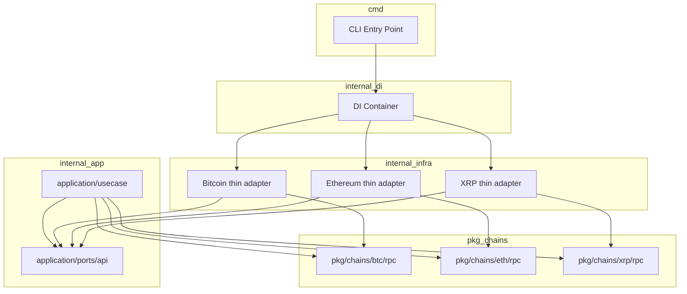
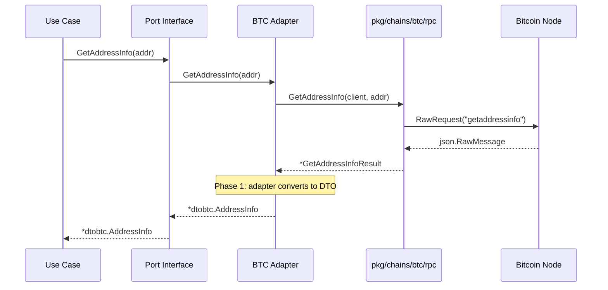
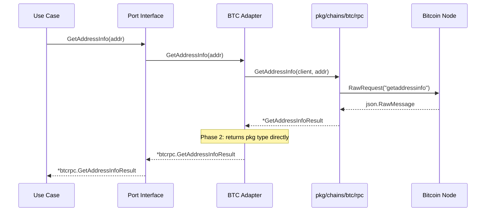

# Design Document: refactoring-chain-rpc

## Overview

This refactoring moves chain-specific Node RPC call functions and their associated wire-format types from `internal/infrastructure/api/` into new `pkg/chains/*/rpc/` packages. The goal is to separate pure RPC communication logic from infrastructure wiring, eliminate redundant DTO conversion at the infrastructure layer, and ensure all type mapping between wire-format types and domain/use-case types happens in the application layer.

The refactoring is structured as two independent phases to minimize risk. **Phase 1** is a pure code movement (zero behavioral change): RPC functions and types move to `pkg/`, and infrastructure structs become thin adapters. **Phase 2** eliminates infrastructure-layer mappers, updates port interface method signatures, and moves any remaining type conversion into the application layer.

All three chains — Bitcoin (BTC/BCH), Ethereum (ETH), and Ripple (XRP) — are in scope.

### Goals

- Create `pkg/chains/{btc,eth,xrp}/rpc/` packages as the single location for Node RPC call logic
- Eliminate redundant mapper/converter functions from the infrastructure layer
- Ensure use cases depend only on port interfaces and `pkg/` types (not `internal/infrastructure/` types)
- Preserve all existing behavior, error messages, and test coverage

### Non-Goals

- Changing the RPC protocol or adding new RPC methods
- Modifying PSBT, BIP32, or descriptor parsing logic (these stay in application/domain layer)
- Removing or renaming port interfaces in `application/ports/`
- Modifying the DI container structure beyond adjusting type references
- Changing XRP's `xrpapi_tx.go` orchestration layer in Phase 1

---

## Architecture

### Existing Architecture Analysis

The current data flow for a BTC RPC call:

```
Use Case
  → Port Interface (returns *dtobtc.AddressInfo)
    → Bitcoin struct method (infra)
      → RawRequest("getaddressinfo")          ← RPC call
      → json.Unmarshal → GetAddressInfoResult ← infra type
      → ToAddressInfo()                        ← mapper (infra)
      → returns *dtobtc.AddressInfo            ← DTO
```

Key problems with this flow:
1. Infrastructure types (`GetAddressInfoResult`) and their mappers are buried inside `internal/`, making them non-reusable.
2. The mapper is a pure field rename — no domain logic — yet it lives in the infrastructure layer.
3. Use cases import from `internal/application/dto/`, which is populated by infrastructure conversions.

### Architecture Pattern & Boundary Map

After both phases, the target flow is:

```
Use Case
  → Port Interface (returns *btcrpc.GetAddressInfoResult)
    → Bitcoin struct method (thin adapter)
      → btcrpc.GetAddressInfo(client, addr)   ← pkg function
        → RawRequest("getaddressinfo")         ← RPC call
        → json.Unmarshal                       ← in pkg
        → returns *btcrpc.GetAddressInfoResult ← pkg type
```



**Architecture Integration**:
- **Selected pattern**: Ports & Adapters (existing) — the refactoring deepens the separation by moving RPC call logic out of infrastructure adapters into `pkg/`.
- **Domain boundaries**: `pkg/chains/*/rpc/` owns the wire-format types and RPC call functions. Infrastructure owns only lifecycle/DI wiring. Application ports own the abstraction interfaces.
- **Existing patterns preserved**: Clean Architecture layer separation, BCH embedding BTC, focused port interfaces, `make mockery` for mock generation.
- **New components**: `pkg/chains/{btc,eth,xrp}/rpc/` packages.
- **Steering compliance**: Respects `pkg/` no-internal-import rule; respects `btc-shared.md` BCH override pattern; respects Clean Architecture dependency direction.

### Technology Stack

| Layer | Choice | Role | Notes |
|-------|--------|------|-------|
| BTC RPC | `github.com/btcsuite/btcd/rpcclient` | HTTP JSON-RPC to bitcoind | `*rpcclient.Client` → `RPCCaller` interface |
| ETH RPC | `github.com/ethereum/go-ethereum/rpc` + `ethclient` | HTTP JSON-RPC + higher-level client to geth | Two interfaces: `RPCCaller` (raw), `EthCaller` (typed) |
| XRP RPC | `pkg/websocket.WS` | WebSocket JSON-RPC to rippled | `WSCaller` interface |
| Type conversion | Standard library `encoding/json` | JSON marshal/unmarshal in `pkg/` | No change |
| Mock generation | `mockery` | Generate mocks from port interfaces | Re-run after Phase 2 interface changes |

---

## System Flows

### Phase 1 Call Flow (RPC Extraction — Infrastructure Unchanged)



### Phase 2 Call Flow (Port Interface Signature Updated)



---

## Requirements Traceability

| Requirement | Summary | Components | Phase |
|-------------|---------|------------|-------|
| 1.1–1.5 | RPC Package Structure | `pkg/chains/{btc,eth,xrp}/rpc/` | Phase 1 |
| 2.1–2.5 | RPC Types in pkg | Wire-format types in `pkg/chains/*/rpc/` | Phase 1 |
| 3.1–3.4 | Remove infra DTO conversion | Delete `mapper.go`, `converter.go`; update return types | Phase 2 |
| 4.1–4.4 | App-layer type conversion | Application-layer converters for domain-enriched types | Phase 2 |
| 5.1–5.4 | Port Interface Preservation | Update method signatures; keep interface names | Phase 2 |
| 6.1–6.4 | Infrastructure as thin adapter | Infrastructure delegates to `pkg/`; minimal logic remains | Phase 1 + Phase 2 |
| 7.1–7.4 | Multi-chain coverage | BTC, ETH, XRP each get `rpc/` package; BCH reuses BTC | Phase 1 + Phase 2 |
| 8.1–8.5 | Behavioral equivalence | Tests pass; error patterns preserved | Both phases |

---

## Components and Interfaces

### Summary Table

| Component | Layer | Intent | Req Coverage | Dependencies |
|-----------|-------|--------|--------------|-------------|
| `pkg/chains/btc/rpc` | pkg | BTC RPC call functions + wire types | 1, 2, 6, 7, 8 | `rpcclient.Client` (via RPCCaller) |
| `pkg/chains/eth/rpc` | pkg | ETH RPC call functions + wire types | 1, 2, 6, 7, 8 | `ethrpc.Client`, `ethclient.Client` (via interfaces) |
| `pkg/chains/xrp/rpc` | pkg | XRP WebSocket RPC functions + wire types | 1, 2, 6, 7, 8 | `pkg/websocket.WS` (via WSCaller) |
| BTC thin adapter | infrastructure | Delegates to `pkg/chains/btc/rpc/` | 6, 7 | `pkg/chains/btc/rpc`, port interfaces |
| ETH thin adapter | infrastructure | Delegates to `pkg/chains/eth/rpc/` | 6, 7 | `pkg/chains/eth/rpc`, port interfaces |
| XRP thin adapter | infrastructure | Delegates to `pkg/chains/xrp/rpc/` | 6, 7 | `pkg/chains/xrp/rpc`, port interfaces |
| Port interface updates | application/ports | Method signatures reference `pkg/` types | 3, 4, 5 | `pkg/chains/*/rpc/` |
| Application converters | application/usecase | Convert `pkg/` types → domain types when needed | 4 | `pkg/chains/*/rpc/`, domain |

---

### pkg Layer

#### `pkg/chains/btc/rpc/`

| Field | Detail |
|-------|--------|
| Intent | Provides standalone BTC Node RPC call functions and wire-format response types |
| Requirements | 1.1, 1.2, 1.4, 2.1, 2.2, 2.3, 6.1, 7.1 |

**Responsibilities & Constraints**
- Defines all BTC Node RPC call functions as standalone exported functions
- Defines wire-format request and response types with Go-idiomatic field names and JSON struct tags
- MUST NOT import from `internal/`
- MUST NOT define application DTOs or domain types
- BCH uses this package directly (no duplication)

**Dependencies**
- External: `github.com/btcsuite/btcd/rpcclient` — via `RPCCaller` interface only (P0)
- External: `encoding/json` — standard library (P0)

**Contracts**: Service [x]

##### Service Interface

```go
// pkg/chains/btc/rpc/client.go

// RPCCaller abstracts the JSON-RPC transport for Bitcoin node communication.
// *rpcclient.Client satisfies this interface.
type RPCCaller interface {
    RawRequest(method string, params []json.RawMessage) (json.RawMessage, error)
}
```

```go
// pkg/chains/btc/rpc/address.go

// GetAddressInfo calls RPC `getaddressinfo` and returns the wire-format result.
func GetAddressInfo(client RPCCaller, addr string) (*GetAddressInfoResult, error)

// ValidateAddress calls RPC `validateaddress`.
func ValidateAddress(client RPCCaller, addr string) (*ValidateAddressResult, error)

// GetAddressInfoResult is the wire-format response type for `getaddressinfo`.
// Field names are Go-idiomatic; JSON tags match the Bitcoin RPC protocol exactly.
type GetAddressInfoResult struct {
    Address             string         `json:"address"`
    ScriptPubKey        string         `json:"scriptPubKey"`
    IsMine              bool           `json:"ismine"`
    IsSolvable          bool           `json:"solvable,omitempty"`
    Desc                string         `json:"desc,omitempty"`
    IsWatchOnly         bool           `json:"iswatchonly"`
    IsScript            bool           `json:"isscript"`
    IsWitness           bool           `json:"iswitness,omitempty"`
    PubKey              string         `json:"pubkey,omitempty"`
    IsCompressed        bool           `json:"iscompressed,omitempty"`
    IsChange            bool           `json:"ischange"`
    Timestamp           int64          `json:"timestamp,omitempty"`
    HDKeyPath           string         `json:"hdkeypath,omitempty"`
    HDSeedID            string         `json:"hdseedid,omitempty"`
    HDMasterFingerprint string         `json:"hdmasterfingerprint,omitempty"`
    Labels              FlexibleLabels `json:"labels"`
}

// FlexibleLabels handles BTC (string array) and BCH (object array) label formats.
type FlexibleLabels []string
// UnmarshalJSON implements custom unmarshaling (moved from infrastructure).
func (f *FlexibleLabels) UnmarshalJSON(data []byte) error
```

```go
// pkg/chains/btc/rpc/networkinfo.go

func GetNetworkInfo(client RPCCaller) (*GetNetworkInfoResult, error)
func GetBlockchainInfo(client RPCCaller) (*GetBlockchainInfoResult, error)

type GetNetworkInfoResult struct { ... }    // wire-format types with idiomatic names
type GetBlockchainInfoResult struct { ... }
```

```go
// pkg/chains/btc/rpc/transaction.go

func GetTransactionByTxID(client RPCCaller, txID string) (*TransactionResult, error)
func DecodeRawTransaction(client RPCCaller, hexTx string) (*RawTransaction, error)
func FundRawTransaction(client RPCCaller, hex string) (*FundRawTransactionResult, error)
// ... additional transaction functions
```

Similar file-per-topic structure for: `balance.go`, `fee.go`, `import.go`, `descriptor.go`, `wallet.go`, `label.go`, `multisig.go`, `logging.go`.

**Implementation Notes**
- Integration: `*rpcclient.Client` satisfies `RPCCaller` without changes; no casting needed.
- Validation: Error wrapping pattern `fmt.Errorf("fail to call RawRequest(%s): %w", method, err)` preserved.
- Risks: `FlexibleLabels` and `WarningsField` custom unmarshalers must be moved from infrastructure; behavior must be identical.

---

#### `pkg/chains/eth/rpc/`

| Field | Detail |
|-------|--------|
| Intent | Provides standalone ETH JSON-RPC call functions and wire-format types |
| Requirements | 1.1, 1.2, 1.4, 2.1, 2.2, 6.1, 7.2 |

**Responsibilities & Constraints**
- Moves `rpc_eth.go`, `rpc_eth_tx.go`, `rpc_eth_gas.go`, `rpc_admin.go`, `rpc_personal.go`, `rpc_miner.go`, `rpc_net.go`, `rpc_web3.go` to `pkg/chains/eth/rpc/`
- MUST NOT import from `internal/`
- Returns `*big.Int`, `string`, or wire-format structs — NOT domain types from `internal/domain/`

**Dependencies**
- External: `github.com/ethereum/go-ethereum/rpc` — via `RPCCaller` interface (P0)
- External: `github.com/ethereum/go-ethereum/ethclient` — via `EthCaller` interface for higher-level methods (P1)
- External: `github.com/ethereum/go-ethereum/common/hexutil` — hex decoding (P0)

**Contracts**: Service [x]

##### Service Interface

```go
// pkg/chains/eth/rpc/client.go

// RPCCaller abstracts the raw JSON-RPC transport.
// *ethrpc.Client satisfies this interface.
type RPCCaller interface {
    CallContext(ctx context.Context, result any, method string, args ...any) error
}

// EthCaller abstracts the higher-level go-ethereum typed client.
// *ethclient.Client satisfies this interface.
type EthCaller interface {
    SuggestGasTipCap(ctx context.Context) (*big.Int, error)
    SendTransaction(ctx context.Context, tx *types.Transaction) error
    BalanceAt(ctx context.Context, account common.Address, blockNumber *big.Int) (*big.Int, error)
}
```

```go
// pkg/chains/eth/rpc/gas.go

func GasPrice(ctx context.Context, client RPCCaller) (*big.Int, error)
func EstimateGas(ctx context.Context, client RPCCaller, msg *ethereum.CallMsg) (*big.Int, error)
// SuggestGasTipCap stays in infrastructure because it has fallback config logic
```

```go
// pkg/chains/eth/rpc/eth.go

func BlockNumber(ctx context.Context, client RPCCaller) (*big.Int, error)
func GetBalance(ctx context.Context, client RPCCaller, hexAddr string, tag string) (*big.Int, error)
func Syncing(ctx context.Context, client RPCCaller) (*ResponseSyncing, bool, error)
// ...

// ResponseSyncing moves from internal/infrastructure/api/eth/eth/rpc_eth.go to pkg
type ResponseSyncing struct {
    StartingBlock int64 `json:"startingBlock" mapstructure:"startingBlock"`
    // ... other fields
}
```

**Implementation Notes**
- Integration: ETH already mostly returns `*big.Int` and simple types; Phase 2 impact is minimal.
- The `SuggestGasTipCap` fallback logic (config-dependent) stays in infrastructure; it calls `pkg/chains/eth/rpc/` for the RPC part.
- `ResponseSyncing` type moves to `pkg/` in Phase 1; `domainETH.ResponseSyncing` becomes an alias or is eliminated in Phase 2.

---

#### `pkg/chains/xrp/rpc/`

| Field | Detail |
|-------|--------|
| Intent | Provides standalone XRP WebSocket RPC call functions and wire-format types |
| Requirements | 1.1, 1.2, 1.4, 2.1, 2.2, 6.1, 7.3 |

**Responsibilities & Constraints**
- Moves direct WebSocket call functions: `public_account.go`, `public_server_info.go`, `public_transaction.go`, `admin_keygen.go`
- Does NOT move `xrpapi_tx.go` (orchestration layer stays in infrastructure)
- MUST NOT import from `internal/` or expose peersyst library types

**Dependencies**
- External: `pkg/websocket` — via `WSCaller` interface (P0)
- External: `encoding/json` — standard library (P0)

**Contracts**: Service [x]

##### Service Interface

```go
// pkg/chains/xrp/rpc/client.go

// WSCaller abstracts the WebSocket transport for XRP node communication.
// *websocket.WS satisfies this interface.
type WSCaller interface {
    Call(ctx context.Context, req, resp any) error
}
```

```go
// pkg/chains/xrp/rpc/account.go

func AccountInfo(ctx context.Context, ws WSCaller, address string) (*ResponseAccountInfo, error)
func AccountChannels(ctx context.Context, ws WSCaller, sender, receiver string) (*ResponseAccountChannels, error)

// Wire-format types (moved from internal/infrastructure/api/xrp/ types/request_response files)
type ResponseAccountInfo struct { ... }
type ResponseAccountChannels struct { ... }
```

```go
// pkg/chains/xrp/rpc/server.go

func ServerInfo(ctx context.Context, ws WSCaller) (*ResponseServerInfo, error)

type ResponseServerInfo struct { ... }
```

```go
// pkg/chains/xrp/rpc/keygen.go

func ValidationCreate(ctx context.Context, ws WSCaller, secret string) (*ResponseValidationCreate, error)
func WalletPropose(ctx context.Context, ws WSCaller, passphrase string) (*ResponseWalletPropose, error)

type ResponseValidationCreate struct { ... }
type ResponseWalletPropose struct { ... }
```

**Implementation Notes**
- Integration: `pkg/websocket.WS` already lives in `pkg/`; `WSCaller` interface can import `pkg/websocket` types if needed, or use `any` for request/response.
- XRP DTOs (`dtoxrp.ResponseWalletPropose` etc.) become aliases or are eliminated in Phase 2 when port interface signatures update.

---

### Infrastructure Layer

#### BTC Thin Adapter (`internal/infrastructure/api/btc/btc/`)

| Field | Detail |
|-------|--------|
| Intent | Thin adapter that delegates RPC calls to `pkg/chains/btc/rpc/`; retains lifecycle, config, and DI wiring |
| Requirements | 6.1, 6.2, 6.3, 6.4, 8.1, 8.3 |

**Phase 1 Pattern (port interfaces unchanged):**

```go
// internal/infrastructure/api/btc/btc/address.go
import btcrpc "github.com/hiromaily/go-crypto-wallet/pkg/chains/btc/rpc"

func (b *Bitcoin) GetAddressInfo(addr string) (*dtobtc.AddressInfo, error) {
    result, err := btcrpc.GetAddressInfo(b.Client, addr)
    if err != nil {
        return nil, err
    }
    return toAddressInfo(result), nil  // private, inline converter
}
```

**Phase 2 Pattern (port interface returns pkg type):**

```go
func (b *Bitcoin) GetAddressInfo(addr string) (*btcrpc.GetAddressInfoResult, error) {
    return btcrpc.GetAddressInfo(b.Client, addr)
}
```

**Responsibilities retained in infrastructure:**
- `Bitcoin` struct fields: `Client`, `chainConf`, `coinTypeCode`, `version`, `confirmationBlock`, `feeRange`
- Constructor `NewBitcoin()` including startup validation (calls `GetBlockchainInfo()` to verify network)
- Methods with non-trivial logic beyond a single RPC call (e.g., `GetBalanceByListUnspent`, `ListUnspentByAccount`, PSBT operations, descriptor parsing)
- `SuggestGasTipCap` fallback config logic (ETH)
- `mapper.go` private helpers for domain-enriched types (PSBT, UTXO) — these are NOT eliminated

**BCH compatibility**: BCH's `BitcoinCash` calls `btcrpc.GetAddressInfo(b.Client, addr)` via embedding; BCH-specific label handling is already in `FlexibleLabels` (moved to `pkg/`). No BCH override needed for Phase 1.

---

### Application Layer

#### Port Interface Updates (Phase 2)

| Field | Detail |
|-------|--------|
| Intent | Update method signatures to return `pkg/chains/*/rpc/` types instead of eliminated application DTOs |
| Requirements | 3.1, 4.4, 5.1, 5.2, 5.4 |

**Scope of changes (examples):**

```go
// Before (Phase 1):
GetAddressInfo(addr string) (*dtobtc.AddressInfo, error)
GetNetworkInfo() (*dtobtc.NetworkInfo, error)
GetBlockchainInfo() (*dtobtc.BlockchainInfo, error)

// After (Phase 2):
GetAddressInfo(addr string) (*btcrpc.GetAddressInfoResult, error)
GetNetworkInfo() (*btcrpc.GetNetworkInfoResult, error)
GetBlockchainInfo() (*btcrpc.GetBlockchainInfoResult, error)
```

**ETH Phase 2 scope (minimal):**
- `Syncing()` return type changes from `*domainETH.ResponseSyncing` to `*ethrpc_pkg.ResponseSyncing` (or domain type is renamed/aliased)

**Port interface names preserved:** `Bitcoiner`, `AddressOperator`, `BalanceChecker`, `NetworkInformer`, etc. — no interface names change.

**Mock regeneration**: After Phase 2 signature updates per chain, run `make mockery` to regenerate all affected mocks.

#### Application-Layer Converters (Phase 2, when needed)

For domain-enriched types that use cases need but that cannot be replaced by the `pkg/` wire type:

```go
// internal/application/usecase/shared/btc/converter.go (example)

import btcrpc "github.com/hiromaily/go-crypto-wallet/pkg/chains/btc/rpc"

// ToUnspentOutput converts a BTC RPC ListUnspentResult entry to the
// domain-enriched UnspentOutput that includes AccountType.
func ToUnspentOutput(result *btcrpc.ListUnspentResult, accountType domainAccount.AccountType) *UnspentOutput
```

This pattern is applied only for types that require domain enrichment (UTXO with account type, etc.). Pure wire-type results (address info, network info) need no converter.

---

## Data Models

### RPC Type Taxonomy

Types are classified as either **pure wire** (structurally equivalent to the RPC response; move to `pkg/`) or **domain-enriched** (require business context; stay in application/domain layer).

**Pure Wire → Move to `pkg/chains/*/rpc/`:**
- BTC: `GetAddressInfoResult`, `ValidateAddressResult`, `GetNetworkInfoResult`, `GetBlockchainInfoResult`, `TransactionResult`, `RawTransaction`, `FundRawTransactionResult`, `DescriptorInfo`, `ListDescriptorsResult`, `ImportDescriptorsRequest/Response`, `MultisigAddress`, `LoggingResult`
- ETH: `ResponseSyncing`
- XRP: `ResponseAccountInfo`, `ResponseAccountChannels`, `ResponseServerInfo`, `ResponseValidationCreate`, `ResponseWalletPropose`

**Domain-Enriched → Stay in Application/Domain Layer:**
- BTC: `UnspentOutput` (includes `domainAccount.AccountType`), `ParsedPSBT` + all `ParsedPSBT*` subtypes (PSBT parsing with domain semantics), `BIP32Derivation`, `PreviousTx`
- ETH: `TxCreateParams` (defined in port interface file; stays there), `RawTx`, `TransactionReceipt` (already in domain layer)
- XRP: `TxInput` and all transaction input types (orchestration concern; stays in application/dto)

### Data Contracts

After Phase 2, use cases import types from two locations:
1. `pkg/chains/*/rpc/` — for pure wire types (address info, network info, etc.)
2. `internal/domain/chains/*/` or `internal/application/dto/` — for domain-enriched types (PSBT, UTXO, XRP transaction inputs)

Use cases MUST NOT import from `internal/infrastructure/api/` (this is already the rule; Phase 2 ensures it's structurally enforced).

---

## Error Handling

### Error Strategy

All errors from `pkg/chains/*/rpc/` functions are wrapped with context at the call site, preserving the existing error message pattern:

```go
// pkg/chains/btc/rpc/address.go
func GetAddressInfo(client RPCCaller, addr string) (*GetAddressInfoResult, error) {
    ...
    rawResult, err := client.RawRequest("getaddressinfo", params)
    if err != nil {
        return nil, fmt.Errorf("fail to call RawRequest(getaddressinfo) %s: %w", addr, err)
    }
    ...
}
```

The infrastructure thin adapter does NOT re-wrap the error from `pkg/` — it passes it through directly (Req 8.1: error messages preserved).

### Error Categories

- **RPC Transport Errors**: Node unreachable, timeout → wrapped with method name and parameters, returned to caller
- **JSON Parsing Errors**: Malformed response → wrapped with context, returned to caller
- **Domain Validation Errors** (Phase 2): Invalid address → returned from `pkg/` function or application layer converter

---

## Testing Strategy

### Phase 1: Unit Tests for `pkg/chains/*/rpc/`

- Each moved RPC function gets a unit test in `pkg/chains/*/rpc/*_test.go`
- Tests use the `RPCCaller`/`WSCaller` interface with a mock or stub implementation
- No live node required; tests validate JSON marshaling, error handling, and response parsing
- Tests for `FlexibleLabels` and `WarningsField` custom unmarshalers move with their types

### Phase 2: Integration Tests & Mock Regeneration

- After each chain's Phase 2 port interface update, run `make mockery` to regenerate mocks
- Existing use case tests continue to compile against updated port interfaces
- Behavioral regression: run `make go-test` after each chain's Phase 2 completion

### Test Placement

| Test Target | Location |
|-------------|----------|
| `pkg/chains/btc/rpc/` functions | `pkg/chains/btc/rpc/*_test.go` |
| `pkg/chains/eth/rpc/` functions | `pkg/chains/eth/rpc/*_test.go` |
| `pkg/chains/xrp/rpc/` functions | `pkg/chains/xrp/rpc/*_test.go` |
| Infrastructure thin adapter integration | `internal/infrastructure/api/{chain}/testutil/` (existing) |
| Use case behavior | `internal/application/usecase/` (existing, no change expected) |

---

## Migration Strategy

### Phase 1: RPC Extraction (per-chain, independent)

**Recommended order: ETH → XRP public/admin → BTC**

```
Phase 1 steps per chain:
1. Create pkg/chains/{chain}/rpc/ directory
2. Define RPCCaller/WSCaller interface
3. Move RPC call functions + their types to pkg/ (with idiomatic field names + JSON tags)
4. Move custom unmarshalers (FlexibleLabels, WarningsField)
5. Update infrastructure struct methods to delegate to pkg/ functions
6. Phase 1 infra methods still convert to DTOs (private inline helper)
7. Run: make go-lint && make check-build && make go-test
```

**Exit criterion**: All tests pass; no behavioral change.

### Phase 2: DTO Elimination (per-chain, sequential)

**Recommended order: ETH → BTC → XRP**

```
Phase 2 steps per chain:
1. Update port interface method signatures (return pkg/ types instead of DTOs)
2. Update infrastructure thin adapters (remove inline DTO conversion; return pkg/ type directly)
3. Update use cases that depend on eliminated DTO types (import from pkg/ instead)
4. Add application-layer converters for domain-enriched types if needed
5. Delete mapper.go / converter.go functions that are now redundant
6. Delete DTO types that are now replaced by pkg/ types
7. Run: make mockery (regenerate mocks)
8. Run: make go-lint && make check-build && make go-test
```

**Rollback trigger**: If any test fails at Phase 2 step 6-7, revert the chain's Phase 2 changes and keep Phase 1 (infrastructure still has inline conversion helpers).

---

## Supporting References

See `research.md` for:
- Full classification table of BTC DTO types (pure wire vs. domain-enriched)
- Architecture pattern evaluation (one-phase vs. two-phase options)
- Decision rationale for `RPCCaller` interface design
- BCH override pattern research
- ETH scope analysis
