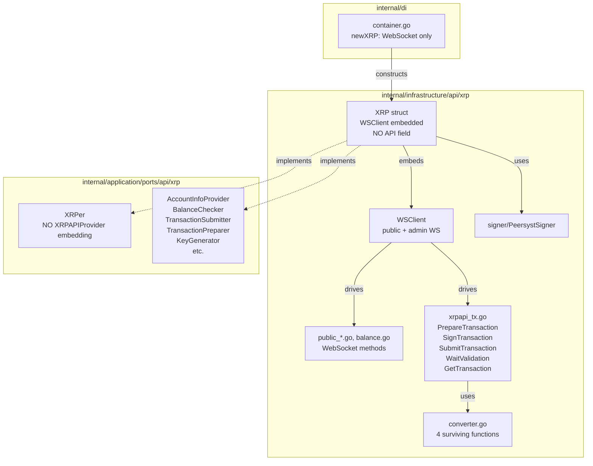

# Design Document — remove-unused-xrp-code-in-internal

## Overview

**Purpose**: Remove all dead gRPC-calling code from `internal/` that depends on the non-operational
`apps/xrpl-grpc-server`. The deletion reduces the XRP infrastructure footprint to only the working
WebSocket-based and offline implementations.
**Users**: Developers maintaining the XRP chain integration — reduced cognitive load, no more dead methods
in the codebase.
**Impact**: Deletes ~1,100 lines across 7 infrastructure files; removes `XRPAPIProvider` from the port
interface layer; strips `API *xrplclient.XRPLClient` from the `XRP` struct and DI container. No
behavioral change — all deleted code was non-functional.

### Goals

- Eliminate all `r.API.*` call sites (`r.API.TxClient.*`, `r.API.AddressClient.*`) from `internal/`
- Remove `XRPAPIProvider` composite interface and its mock
- No `protogen` or `xrplclient` imports remain in any `internal/` file
- Build and lint pass after all deletions

### Non-Goals

- Modifying `apps/xrpl-grpc-server/` or `pkg/chains/xrp/xrplclient/` or `pkg/chains/xrp/protogen/`
- Deleting the `XRP` struct (handled by `refactor-xrp-struct-infra`)
- Adding replacement implementations for any deleted method
- Touching non-XRP code

---

## Architecture

### Existing Architecture Analysis

The current `XRP` struct holds two transport channels:

1. `*WSClient` — WebSocket connections (`public` + `admin`); these work today.
2. `API *xrplclient.XRPLClient` — gRPC client wrapping `apps/xrpl-grpc-server`; server is not running, so all calls through this fail at runtime.

The `XRPAPIProvider` port interface composites all gRPC-backed operations. It is embedded in `XRPer` (the monolithic port interface), and its mock lives in `mocks/mock_xrpapi_provider.go`. No use case depends directly on `XRPAPIProvider` — they all use the smaller focused interfaces.

### Architecture Pattern & Boundary Map

This is a **pure deletion** — no new components, no new patterns. The boundary map after deletion:



**Deleted components** (shown crossed-out conceptually):
- `API *xrplclient.XRPLClient` field
- `xrpapi_address.go`, `xrpapi_tx_account.go`, `xrpapi_tx_escrow.go`, `xrpapi_tx_payment_channel.go`, `xrpapi_tx_nftoken.go`
- `XRPAPIProvider` interface + its mock
- `newXRPAPI()` DI factory

---

## Requirements Traceability

| Requirement | Summary | Files Changed | Action |
|-------------|---------|---------------|--------|
| 1.1 | Delete 5 gRPC-only infrastructure files | `xrpapi_address.go`, `xrpapi_tx_escrow.go`, `xrpapi_tx_payment_channel.go`, `xrpapi_tx_nftoken.go`, `xrpapi_tx_account.go` | `git rm` |
| 1.2 | Delete gRPC-only test files | `xrpapi_address_test.go`, `xrpapi_account_test.go` | `git rm` |
| 1.3 | Delete `XRPAPIProvider` mock | `mocks/mock_xrpapi_provider.go` | `git rm` |
| 2.1 | Strip gRPC methods from `xrpapi_tx.go` | Remove `signTransactionJSON`, `CombineTransaction`, `SignTransactionNative`, `unquoteJSON` | Edit |
| 2.2 | Strip dead converters from `converter.go` | Remove 11 functions that use `protogen` types or types in deleted files | Edit |
| 2.3 | Remove `protogen` imports | All surviving `internal/` files | Verify via build |
| 3.1 | Strip `API` field from `XRP` struct | `xrp.go` | Edit |
| 3.2 | Remove `api` param from constructors | `connection.go` | Edit |
| 3.3 | Remove gRPC setup from testutil | `testutil/xrp.go` | Edit |
| 4.1–4.2 | Remove `xrpAPI` / `newXRPAPI()` from DI | `di/container.go` | Edit |
| 5.1 | Remove `XRPAPIProvider` from ports | `ports/api/xrp/interface.go` | Edit |
| 5.2 | Remove `XRPAPIProvider` from mockery config | `.mockery.yaml` | Edit |
| 6.1–6.4 | Build + lint + test pass | All | Verify |

---

## Components and Interfaces

### Summary Table

| Component | Action | Requirement | Notes |
|-----------|--------|-------------|-------|
| `xrpapi_address.go` | **Delete entire file** | 1.1 | All 3 methods use `r.API.AddressClient` |
| `xrpapi_tx_escrow.go` | **Delete entire file** | 1.1 | All methods use `r.API.TxClient` |
| `xrpapi_tx_payment_channel.go` | **Delete entire file** | 1.1 | All methods use `r.API.TxClient` |
| `xrpapi_tx_nftoken.go` | **Delete entire file** | 1.1 | All methods use `r.API.TxClient` |
| `xrpapi_tx_account.go` | **Delete entire file** | 1.1 | All methods use `r.API.TxClient` or `signTransactionJSON` |
| `xrpapi_address_test.go` | **Delete entire file** | 1.2 | Tests for deleted methods |
| `xrpapi_account_test.go` | **Delete entire file** | 1.2 | Tests for deleted methods |
| `mocks/mock_xrpapi_provider.go` | **Delete entire file** | 1.3 | Auto-generated mock for `XRPAPIProvider` |
| `xrpapi_tx.go` | **Strip 4 items** | 2.1 | Remove `signTransactionJSON`, `CombineTransaction`, `SignTransactionNative`, `unquoteJSON`; keep all WebSocket methods and struct types |
| `converter.go` | **Strip 11 functions** | 2.2 | See detail below |
| `xrp.go` | **Strip 1 field + 1 call** | 3.1 | Remove `API *xrplclient.XRPLClient` field; remove `r.API.Close()` from `Close()` |
| `connection.go` | **Strip 1 parameter** | 3.2 | Remove `api *xrplclient.XRPLClient` from `NewXRPFromCoinType` and its `NewXRP` call |
| `testutil/xrp.go` | **Strip gRPC setup** | 3.3 | Remove `grpc.NewClient`, `xrplclient.NewXRPLClient`, pass no gRPC arg to `NewXRPFromCoinType` |
| `di/container.go` | **Strip 2 items** | 4.1–4.2 | Remove `xrpAPI` field + `newXRPAPI()` method; update `newXRP()` call |
| `ports/api/xrp/interface.go` | **Strip 1 interface** | 5.1 | Remove `XRPAPIProvider` definition and its embedding in `XRPer` |
| `.mockery.yaml` | **Remove 1 entry** | 5.2 | Remove `XRPAPIProvider` from XRP section |

---

### Infrastructure / `internal/infrastructure/api/xrp/`

#### `converter.go` — Functions to Delete

| Function | Reason for Deletion |
|----------|---------------------|
| `ToInfraInstructions()` | Returns `*protogen.Instructions`; only called by deleted `Prepare*` gRPC methods |
| `ToDTOInstructions()` | Takes `*protogen.Instructions`; only called by deleted gRPC methods |
| `ToDTOResponseGenerateAddress()` | Takes `*protogen.ResponseGenerateAddress`; only used in deleted `xrpapi_address.go` |
| `ToDTOResponseGenerateXAddress()` | Takes `*protogen.ResponseGenerateXAddress`; only used in deleted `xrpapi_address.go` |
| `ToDTOSignerListSetTxInput()` | Source type `SignerListSetTxInput` defined in deleted `xrpapi_tx_account.go` |
| `ToDTOTrustSetTxInput()` | Source type `TrustSetTxInput` defined in deleted `xrpapi_tx_account.go` |
| `ToDTOEscrowCreateTxInput()` | Source type `EscrowCreateTxInput` defined in deleted `xrpapi_tx_escrow.go` |
| `ToDTOEscrowFinishTxInput()` | Source type `EscrowFinishTxInput` defined in deleted `xrpapi_tx_escrow.go` |
| `ToDTOEscrowCancelTxInput()` | Source type `EscrowCancelTxInput` defined in deleted `xrpapi_tx_escrow.go` |
| `ToDTOPaymentChannelCreateTxInput()` | Source type defined in deleted `xrpapi_tx_payment_channel.go` |
| `ToDTOPaymentChannelFundTxInput()` | Source type defined in deleted `xrpapi_tx_payment_channel.go` |
| `ToDTOPaymentChannelClaimTxInput()` | Source type defined in deleted `xrpapi_tx_payment_channel.go` |
| `ToDTONFTokenMintTxInput()` + 4 NFToken variants | Source types defined in deleted `xrpapi_tx_nftoken.go` |

**Surviving functions** (not deleted):

| Function | Reason to Keep |
|----------|---------------|
| `ToInfraTxInput()` | Converts `*dtoxrp.TxInput` → `*TxInput`; `TxInput` survives in `xrpapi_tx.go` |
| `ToDTOTxInput()` | Used in `PrepareTransaction` (WebSocket, survives) |
| `ToInfraXRPKeyType()` | Used by admin key operations (WebSocket) |
| `ToDTOXRPKeyType()` | Used by admin key operations (WebSocket) |

After deletion, `converter.go` will import only `dtoxrp` — no `protogen` import.

---

#### `xrpapi_tx.go` — Methods to Delete

| Item | Type | Reason |
|------|------|--------|
| `signTransactionJSON()` | Private helper | Calls `r.API.TxClient.SignTransaction()`; only used by deleted gRPC sign methods |
| `(*XRP).CombineTransaction()` | Method | Calls `r.API.TxClient.CombineTransaction()` |
| `(*XRP).SignTransactionNative()` | Method | Stub returning `errors.New("not implemented")`; satisfies only the deleted `XRPAPIProvider` interface |
| `unquoteJSON()` | Private helper | Only called by `Prepare*` gRPC methods in deleted files |

**Surviving content** in `xrpapi_tx.go`:

| Item | Type | Reason to Keep |
|------|------|---------------|
| `TxInput`, `SentTx`, `TxInfo`, and related types | Struct definitions | Used by `PrepareTransaction`, `SubmitTransaction`, `GetTransaction` |
| `(*WSClient).PrepareTransaction()` | Method | WebSocket-based; used by use cases |
| `(*XRP).SignTransaction()` | Method | Uses `PeersystSigner`; offline signing |
| `(*WSClient).SubmitTransaction()` | Method | WebSocket-based |
| `(*WSClient).WaitValidation()` | Method | WebSocket-based |
| `(*WSClient).GetTransaction()` | Method | WebSocket-based |
| `toXRPClientSentTx()` | Private helper | Called by `SubmitTransaction` |

---

#### `xrp.go` — Field and Method Edits

**Before:**
```go
type XRP struct {
    *WSClient
    API          *xrplclient.XRPLClient  // ← DELETE
    chainConf    *chaincfg.Params
    coinTypeCode domainCoin.CoinTypeCode
}

func NewXRP(
    wsPublic *websocket.WS,
    wsAdmin  *websocket.WS,
    api      *xrplclient.XRPLClient,  // ← DELETE parameter
    coinTypeCode domainCoin.CoinTypeCode,
    conf *config.Ripple,
) (*XRP, error)

func (r *XRP) Close() error {
    _ = r.WSClient.Close()
    r.API.Close()  // ← DELETE
    return nil
}
```

**After:**
```go
type XRP struct {
    *WSClient
    chainConf    *chaincfg.Params
    coinTypeCode domainCoin.CoinTypeCode
}

func NewXRP(
    wsPublic *websocket.WS,
    wsAdmin  *websocket.WS,
    coinTypeCode domainCoin.CoinTypeCode,
    conf *config.Ripple,
) (*XRP, error)

func (r *XRP) Close() error {
    _ = r.WSClient.Close()
    return nil
}
```

---

#### `ports/api/xrp/interface.go` — Interface Edit

**Before:**
```go
type XRPer interface {
    XRPPublicer
    XRPAdminer
    XRPAPIProvider  // ← DELETE embedding
    // ...
}

// XRPAPIProvider defines the interface for XRP API operations.
type XRPAPIProvider interface {  // ← DELETE entire definition
    GetAccountInfo(...)
    GenerateAddress(...)
    // ... all gRPC-backed methods
}
```

**After:**
```go
type XRPer interface {
    XRPPublicer
    XRPAdminer
    // No XRPAPIProvider embedding
    // ...
}
// XRPAPIProvider definition removed entirely
```

---

## Error Handling

### Error Strategy

No new error handling required. This is a deletion task — no error paths are introduced. Existing error handling in surviving methods is preserved unchanged.

---

## Testing Strategy

### Verification

1. **Build check** (`make check-build`): Catches any missed cross-file reference after deletion (e.g., a converter function whose source type was deleted).
2. **Lint** (`make go-lint`): Catches unused imports, unused variables left after method removal.
3. **Unit tests** (`make go-test`): Confirm surviving WebSocket tests still pass. No new unit tests needed — we are deleting, not adding.
4. **Import check**: After deletion, `grep -r "xrplclient\|protogen" internal/` should return zero results.

### Deletion Order (Safe Sequence)

Execute in this order to allow each step to compile independently:

1. Delete entire dead files (`git rm` for the 8 files in Req 1)
2. Strip converter functions from `converter.go` (types disappear with the deleted files)
3. Strip gRPC methods from `xrpapi_tx.go`
4. Edit `xrp.go`, `connection.go`, `testutil/xrp.go` (struct/constructor changes)
5. Edit `di/container.go`
6. Edit `ports/api/xrp/interface.go` + `.mockery.yaml`
7. Run `make check-build && make go-lint && make go-test`

---

## Migration Strategy

This change is **non-breaking at runtime** — all deleted code was already non-functional (requires a non-running gRPC server). The only observable effect is that method calls that previously returned gRPC errors will no longer compile. Since no production call path reaches those methods, there is no rollback risk.

**Rollback**: Revert the git commit(s). No data migration involved.
