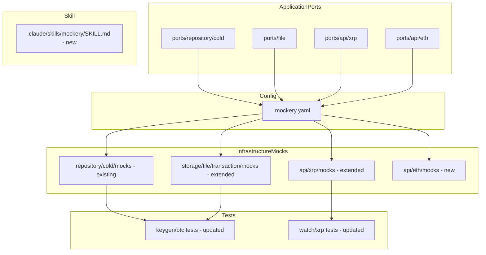
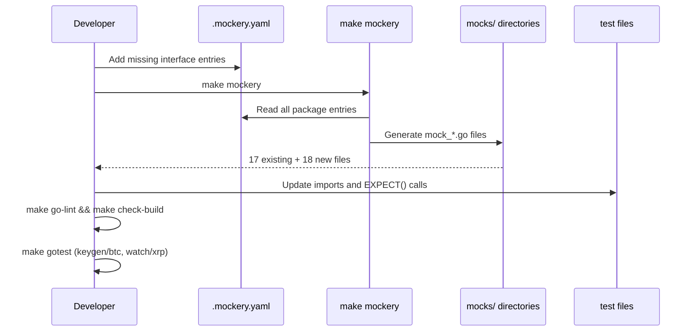

# Design Document: replace-manualstub-mockery

## Overview

This feature migrates all manually written test stubs and mocks in the go-crypto-wallet project to auto-generated mocks produced by mockery v3. The project already uses mockery for 17 interfaces across 5 packages; this work extends that configuration to cover the remaining gaps: XRP segregated sub-interfaces, ETH segregated interfaces, and the `DescriptorFileWriter` file-storage interface. It also updates BTC and XRP test files to consume the already-generated (and newly generated) mocks, and creates a Claude skill that encodes the workflow so future contributors never write manual mocks for ports interfaces again.

**Users**: Go developers working on this codebase. **Impact**: Eliminates 9 manually-maintained test doubles (6 BTC stubs, 3 XRP mocks) and prevents future manual mock creation through tooling and rules.

### Goals

- Replace all manual stubs/mocks for ports interfaces with mockery-generated equivalents.
- Extend `.mockery.yaml` to cover XRP sub-interfaces, ETH leaf interfaces, and `DescriptorFileWriter`.
- Create a Claude skill that enforces the convention for all future interface additions.

### Non-Goals

- Replacing `stubDescriptorGenerator` — it implements `keygenusecase.GenerateDescriptorUseCase`, a use case interface (not a ports interface). Use case interface mocks are out of scope per the placement convention (see `research.md` — Decision: Keep `stubDescriptorGenerator` as struct stub).
- Mocking `Ethereumer` — DI-only monolithic interface; excluded by design.
- Mocking composed ETH interfaces (`WatchTxCreationDeps`, `ETHKeygenSignClient`, etc.) — leaf mocks satisfy all compositions implicitly.
- Mocking `ETHTransactionSender` — it is a type alias for `TxSender`; mockery cannot generate mocks for type aliases.
- Renaming mock directories (e.g., `transaction/mocks/` → `file/mocks/`) — deferred to a separate cleanup.

---

## Architecture

### Existing Architecture Analysis

The project follows Clean Architecture with mockery generating mocks in infrastructure `mocks/` subdirectories for interfaces defined in `application/ports/`:

```
application/ports/<layer>/<pkg>/   ← interface definitions (owned by application)
    ↓  (mockery reads)
.mockery.yaml                      ← single configuration file
    ↓  (make mockery generates)
infrastructure/<layer>/<pkg>/mocks/ ← generated mock files (DO NOT EDIT)
    ↓  (test files import)
application/usecase/*_test.go      ← tests using EXPECT() builder pattern
```

This feature extends only the `.mockery.yaml` configuration and the test files. No domain, infrastructure implementation, or interface files change.

### Architecture Pattern & Boundary Map



**Key decisions**:
- Selected pattern: Extend existing (Option A from gap analysis). No new directory structure outside of `infrastructure/api/eth/mocks/`.
- `DescriptorFileWriter` appended to existing `ports/file` entry (same `dir`); minor naming imprecision accepted over import path breakage.
- ETH: 15 leaf interfaces only; composed interfaces excluded.
- XRP: 3 sub-interfaces added to existing `ports/api/xrp` entry.
- Steering compliance: Interface Segregation Principle maintained; placement convention formalized in `.claude/rules/internal/mockery.md`.

### Technology Stack

| Layer | Choice / Version | Role in Feature |
|-------|-----------------|-----------------|
| Mock generation tool | mockery v3.6.1 (existing) | Generates all mock files from `.mockery.yaml` config |
| Test framework | testify/mock (existing) | Mock behavior definition via `.EXPECT()` builder |
| Build tool | Makefile `make mockery` (existing) | Single command regenerates all mocks |
| AI tooling | Claude skill (new) | Encodes mock generation workflow for contributors |

---

## Requirements Traceability

| Requirement | Summary | Components | Key Interfaces |
|---|---|---|---|
| 1.1 | Cold repo stubs → already-generated mocks | BTC keygen test files | `BTCAccountKeyRepositorier`, `AuthFullPubkeyRepositorier`, `SeedRepositorier` |
| 1.2 | `DescriptorFileWriter` added to `.mockery.yaml` | `.mockery.yaml`, `FileMocks` | `DescriptorFileWriter` |
| 1.3 | BTC tests use `NewMock*(t)` + `.EXPECT()` | BTC keygen test files | all replaced interfaces |
| 1.4 | No mocks for non-interface types | design constraint | — |
| 1.5 | BTC stubs removed from test files | BTC keygen test files | — |
| 1.6 | `make go-lint` + `make check-build` pass | verification step | — |
| 2.1 | XRP sub-interfaces added to `.mockery.yaml` | `.mockery.yaml`, `XRPMocks` | `TransactionSubmitter`, `AccountInfoProvider`, `TransactionPreparer` |
| 2.2 | XRP sub-interface mocks generated | `XRPMocks` | — |
| 2.3 | XRP tests use `NewMock*(t)` + `.EXPECT()` | XRP watch test files | all replaced interfaces |
| 2.4 | XRP manual mocks removed | XRP watch test files | — |
| 2.5 | `make go-lint` + `make check-build` pass | verification step | — |
| 3.1 | ETH package entry added to `.mockery.yaml` | `.mockery.yaml`, `ETHMocks` | 15 leaf ETH interfaces |
| 3.2 | ETH mocks generated in `api/eth/mocks/` | `ETHMocks` | — |
| 3.3 | ETH mocks follow `mock_<snakecase>.go` convention | `.mockery.yaml` global config | — |
| 3.4 | `Ethereumer` excluded from `.mockery.yaml` | design constraint | — |
| 3.5 | `make go-lint` + `make check-build` pass | verification step | — |
| 4.1 | XRP API mocks (4) generated | `XRPMocks` | `Rippler`, `RippleAPIer`, `RipplePublicer`, `RippleAdminer` |
| 4.2 | Generated files contain `DO NOT EDIT` header | mockery tool | — |
| 4.3 | `make go-lint` + `make check-build` pass | verification step | — |
| 5.1 | `ports/<layer>/<pkg>` → `infrastructure/<layer>/<pkg>/mocks` convention encoded | `.mockery.yaml`, Claude rule | — |
| 5.2 | `pkg/<pkg>` → `pkg/<pkg>/mocks` convention documented | Claude rule | — |
| 5.3 | New interfaces added to `.mockery.yaml` in same commit | Claude rule | — |
| 5.4 | Consistent `filename`/`structname` via global config | `.mockery.yaml` global config | — |
| 6.1 | Skill file at `.claude/skills/mockery/SKILL.md` | Claude skill | — |
| 6.2 | Skill guides: locate interface → determine dir → add YAML → run → verify | Claude skill | — |
| 6.3 | Skill documents placement convention + `make mockery` + before/after examples | Claude skill | — |
| 6.4 | Skill states mocks must never be manually edited | Claude skill | — |
| 6.5 | Skill specifies `NewMock*(t)` + `.EXPECT()` pattern | Claude skill | — |
| 6.6 | Skill instructs Claude to use `make mockery`, not create files manually | Claude skill | — |

---

## Components and Interfaces

### Summary Table

| Component | Layer | Intent | Req Coverage | Key Dependencies |
|---|---|---|---|---|
| `.mockery.yaml` Extension | Config | Add 3 new interface groups to mockery config | 1.2, 2.1, 3.1, 3.4, 4.1, 5.1, 5.4 | mockery v3 (P0) |
| `infrastructure/api/eth/mocks/` | Infrastructure | New directory for ETH interface mocks | 3.2, 3.3 | `.mockery.yaml` (P0) |
| `infrastructure/api/xrp/mocks/` extension | Infrastructure | Add 3 XRP sub-interface mocks + 4 API mocks | 2.2, 4.1, 4.2 | `.mockery.yaml` (P0) |
| `infrastructure/storage/file/transaction/mocks/` extension | Infrastructure | Add `DescriptorFileWriter` mock | 1.2 | `.mockery.yaml` (P0) |
| BTC Keygen Test Updates | Test | Replace 4 struct stubs with generated mock calls | 1.1, 1.3, 1.5, 1.6 | `cold/mocks`, `file/mocks` (P0) |
| XRP Watch Test Updates | Test | Replace 3 manual mocks with generated mock calls | 2.3, 2.4, 2.5 | `xrp/mocks` (P0) |
| Claude Mockery Skill | Tooling | Encode mock generation workflow | 6.1–6.6 | `.mockery.yaml`, Claude rules (P1) |

---

### Config Layer

#### `.mockery.yaml` Extension

| Field | Detail |
|---|---|
| Intent | Extend existing mockery configuration to cover all missing ports interfaces |
| Requirements | 1.2, 2.1, 3.1, 3.4, 5.1, 5.4 |

**Responsibilities & Constraints**

- Single source of truth for which interfaces get generated mocks and where they land.
- One entry per Go package import path (mockery v3 constraint).
- Global settings (`filename`, `structname`, `template`, `formatter`) apply to all entries unchanged.

**Dependencies**

- Inbound: `application/ports/api/eth/interface.go`, `application/ports/api/xrp/{account_info,transaction_submitter,interface}.go`, `application/ports/file/interface.go` — source of interface definitions (P0)
- Outbound: mockery CLI reads this file to produce mock files (P0)

**Contracts**: Batch [x]

**Batch Contract**

- Trigger: `make mockery` (developer-invoked)
- Input: `.mockery.yaml` + Go source files in listed packages
- Output: one `mock_<interface_snakecase>.go` per listed interface in the specified `dir`
- Idempotency: regenerating with the same config produces identical files

**Changes to `.mockery.yaml`**:

1. Append to existing `ports/api/xrp` entry — add interfaces:
   ```
   TransactionSubmitter:
   AccountInfoProvider:
   TransactionPreparer:
   ```

2. Append to existing `ports/file` entry — add interface:
   ```
   DescriptorFileWriter:
   ```

3. Add new package entry:
   ```yaml
   github.com/hiromaily/go-crypto-wallet/internal/application/ports/api/eth:
     config:
       dir: "internal/infrastructure/api/eth/mocks"
       pkgname: "mocks"
     interfaces:
       ETHLifecycle:
       ETHKeyAccessor:
       ETHTransactionSigner:
       ETHRawKeyImporter:
       ETHNodeAPIClient:
       ERC20er:
       EtherTxMonitor:
       ChainConfigProvider:
       BalanceChecker:
       TxCreator:
       GasEstimator:
       TxSigner:
       TxSender:
       TxMonitor:
       AddressValidator:
   ```

**Implementation Notes**

- Validation: Run `make mockery` after each YAML change to confirm generation succeeds.
- Risk: `DescriptorFileWriter` mock lands in `transaction/mocks/` — minor naming imprecision; documented in `research.md`.

---

### Infrastructure Layer

#### Generated Mock Files

| Field | Detail |
|---|---|
| Intent | Auto-generated; never edited manually |
| Requirements | 1.2, 2.2, 3.2, 3.3, 4.1, 4.2 |

**Responsibilities & Constraints**

- Each generated file exports `Mock<InterfaceName>` struct embedding `mock.Mock` and a `NewMock<InterfaceName>(t testing.TB)` constructor.
- Files contain `// Code generated by mockery; DO NOT EDIT.` on line 1.
- Package: `mocks` in all cases.

**New directories after `make mockery`**:

- `internal/infrastructure/api/eth/mocks/` — 15 new files
- `internal/infrastructure/api/xrp/mocks/` — 7 files (4 existing configs now generated + 3 new)
- `internal/infrastructure/storage/file/transaction/mocks/` — 1 additional file (`mock_descriptor_file_writer.go`)

**Implementation Notes**

- Integration: `make mockery` creates directories automatically if absent.
- Risk: None — fully deterministic from interface definitions.

---

### Test Layer

#### BTC Keygen Test Updates

| Field | Detail |
|---|---|
| Intent | Replace manual struct stubs with EXPECT()-based generated mocks |
| Requirements | 1.1, 1.3, 1.5, 1.6 |

**Files to modify**:

| File | Stubs removed | Replaced with | Mock package import |
|---|---|---|---|
| `keygen/btc/generate_descriptor_test.go` | `stubAccountRepo`, `stubAuthRepo`, `stubSeedRepo` | `coldmocks.NewMockBTCAccountKeyRepositorier(t)`, `coldmocks.NewMockAuthFullPubkeyRepositorier(t)`, `coldmocks.NewMockSeedRepositorier(t)` | `coldmocks "github.com/.../infrastructure/repository/cold/mocks"` |
| `keygen/btc/export_descriptor_test.go` | `stubAccountKeyRepo`, `stubDescriptorFileWriter` | `coldmocks.NewMockBTCAccountKeyRepositorier(t)`, `filemocks.NewMockDescriptorFileWriter(t)` | `coldmocks`, `filemocks "github.com/.../infrastructure/storage/file/transaction/mocks"` |

**Note**: `stubDescriptorGenerator` in `export_descriptor_test.go` is **retained** (use case interface — see Non-Goals).

**EXPECT() pattern for each replaced stub**:

- `stubAccountRepo.GetOneMaxID(accountType)` → `.EXPECT().GetOneMaxID(accountType).Return(key, nil)`
- `stubAuthRepo.GetOne(ctx, authType)` → `.EXPECT().GetOne(ctx, authType).Return(pubkey, nil)`
- `stubSeedRepo.GetOne(ctx)` → `.EXPECT().GetOne(ctx).Return(seed, nil)`
- `stubDescriptorFileWriter.WriteFile(path, data)` → `.EXPECT().WriteFile(path, data).Return(nil)`

**Contracts**: Service [x]

**Implementation Notes**

- Integration: Import aliases (`coldmocks`, `filemocks`) must not conflict with existing imports in each test file.
- Validation: Run `make gotest` targeting the `keygen/btc` package after changes.
- Risk: `EXPECT()` call argument matchers must exactly match what the production code passes — review actual call sites in `generate_descriptor.go` and `export_descriptor.go` before writing EXPECT() calls.

---

#### XRP Watch Test Updates

| Field | Detail |
|---|---|
| Intent | Replace manual testify/mock structs with EXPECT()-based generated mocks |
| Requirements | 2.3, 2.4, 2.5 |

**Files to modify**:

| File | Mocks removed | Replaced with | Mock package import |
|---|---|---|---|
| `watch/xrp/send_transaction_test.go` | `MockTransactionSubmitter` | `xrpmocks.NewMockTransactionSubmitter(t)` | `xrpmocks "github.com/.../infrastructure/api/xrp/mocks"` |
| `watch/xrp/create_transaction_test.go` | `MockAccountInfoProvider`, `MockTransactionPreparer` | `xrpmocks.NewMockAccountInfoProvider(t)`, `xrpmocks.NewMockTransactionPreparer(t)` | `xrpmocks` |

**EXPECT() pattern for each replaced mock**:

- `MockTransactionSubmitter.SubmitTransaction(ctx, signedTx)` → `.EXPECT().SubmitTransaction(ctx, signedTx).Return(sentTx, ledgerVersion, nil)`
- `MockTransactionSubmitter.WaitValidation(ctx, targetLedger)` → `.EXPECT().WaitValidation(ctx, targetLedger).Return(validatedLedger, nil)`
- `MockTransactionSubmitter.GetTransaction(ctx, txID, ledger)` → `.EXPECT().GetTransaction(ctx, txID, ledger).Return(txInfo, nil)`
- `MockAccountInfoProvider.GetAccountInfo(ctx, addr)` → `.EXPECT().GetAccountInfo(ctx, addr).Return(info, nil)`
- `MockAccountInfoProvider.GetBalance(ctx, addr)` → `.EXPECT().GetBalance(ctx, addr).Return(balance, nil)`
- `MockTransactionPreparer.CreateRawTransaction(ctx, sender, receiver, amount, instructions)` → `.EXPECT().CreateRawTransaction(...).Return(txInput, txJSON, nil)`

**Contracts**: Service [x]

**Implementation Notes**

- Integration: The `sendTestDependencies` struct in `send_transaction_test.go` must update its `submitter` field type from `*MockTransactionSubmitter` to `*xrpmocks.MockTransactionSubmitter`.
- Validation: Run `make gotest` targeting `watch/xrp` after changes.
- Risk: Return type assertion helpers (`args.Get(0).(*dtoxrp.SentTx)`) in manual mocks become unnecessary — the generated mock handles type assertions via the `EXPECT()` builder.

---

### Tooling Layer

#### Claude Mockery Skill

| Field | Detail |
|---|---|
| Intent | Encode the mock generation workflow so Claude never writes manual mocks for ports interfaces |
| Requirements | 6.1–6.6 |

**Location**: `.claude/skills/mockery/SKILL.md`

**Responsibilities & Constraints**

- Activated when a developer asks Claude to add a mock for a new interface.
- Must instruct Claude to use `make mockery`, not to write Go mock structs manually.
- Must encode the placement convention table (from `.claude/rules/internal/mockery.md`).
- Must document exceptions: `Ethereumer`, type aliases, use case interfaces, compile-time conformance stubs.

**Contracts**: Service [x]

**Skill Content Structure**:

1. Trigger description — when to use this skill
2. Placement convention table
3. Step-by-step workflow (locate interface → determine `dir` → update `.mockery.yaml` → `make mockery` → verify)
4. `.mockery.yaml` entry template
5. Test usage example (before: manual stub; after: EXPECT() pattern)
6. Exceptions list
7. Verification commands

**Implementation Notes**

- Integration: Skill is registered in `.claude/skills/` directory following the `SKILL.md` convention used by all other skills.
- Risk: Skill content may drift from `.claude/rules/internal/mockery.md` over time — keep both files in sync when the convention changes.

---

## System Flows



---

## Testing Strategy

### Unit Tests

- `keygen/btc/generate_descriptor_test.go`: All existing test cases must pass after replacing `stubAccountRepo`, `stubAuthRepo`, `stubSeedRepo` with generated mocks. EXPECT() call counts must match production code invocations.
- `keygen/btc/export_descriptor_test.go`: All existing test cases must pass after replacing `stubAccountKeyRepo`, `stubDescriptorFileWriter` with generated mocks. `stubDescriptorGenerator` remains unchanged.
- `watch/xrp/send_transaction_test.go`: All existing test cases must pass after replacing `MockTransactionSubmitter`.
- `watch/xrp/create_transaction_test.go`: All existing test cases must pass after replacing `MockAccountInfoProvider`, `MockTransactionPreparer`.

### Build Verification

- `make go-lint` — must produce zero lint errors after all changes.
- `make check-build` — must compile all packages successfully (confirms generated mock files compile correctly).
- `make gotest` — run unit tests for modified packages.

### Mockery Generation Verification

- After updating `.mockery.yaml`, run `make mockery` and confirm expected files appear in each `mocks/` directory with the `// Code generated by mockery; DO NOT EDIT.` header.

---

## Migration Strategy

This feature is a pure refactoring — no behavior changes, no schema changes, no new runtime dependencies. Each requirement can be implemented independently:

1. Update `.mockery.yaml` and run `make mockery` (all new mocks generated).
2. Update `generate_descriptor_test.go` (replace BTC cold repo stubs).
3. Update `export_descriptor_test.go` (replace remaining BTC stubs).
4. Update `send_transaction_test.go` (replace XRP submitter mock).
5. Update `create_transaction_test.go` (replace XRP account/preparer mocks).
6. Create `.claude/skills/mockery/SKILL.md`.

Each step is independently verifiable with `make go-lint && make check-build && make gotest`.
