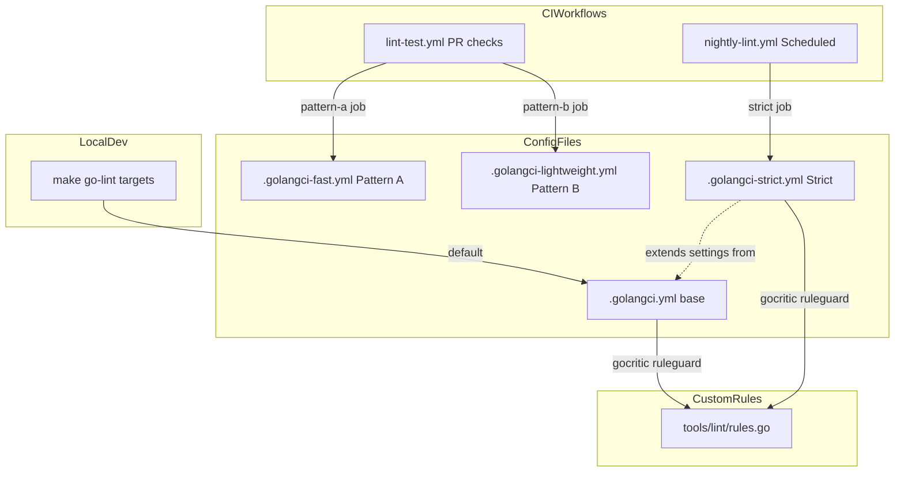
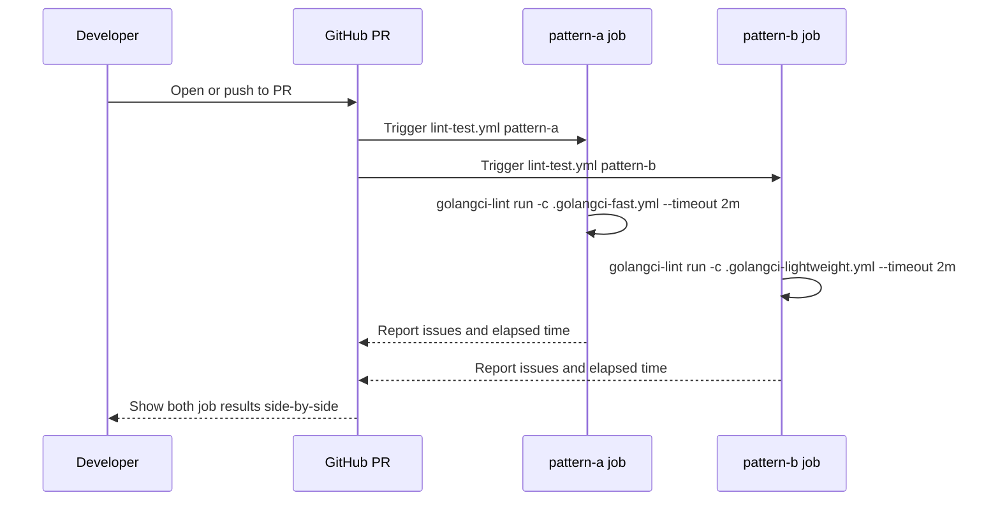
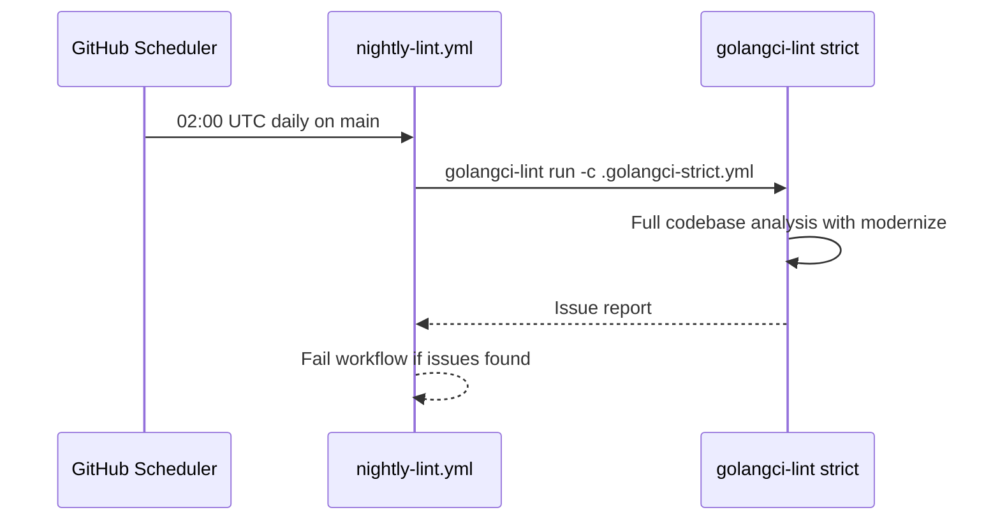

# Design Document: updating-golangci-lint

## Overview

This feature upgrades golangci-lint from v2.8.0 to v2.10.1 and restructures the project's lint configuration into three purpose-specific profiles: a fast-mode profile for rapid PR feedback, a lightweight profile for curated PR linting, and a strict full-coverage profile for nightly CI analysis. A new scheduled GitHub Actions workflow provides daily enforcement of the strict profile.

**Purpose**: Deliver faster PR feedback loops and more comprehensive nightly code quality enforcement by decoupling lint strictness from PR workflow constraints.
**Users**: All contributors will use the fast/lightweight profiles on PRs; the maintainer and CI will use the strict profile nightly.
**Impact**: The single `.golangci.yml` becomes the base for the strict profile; two new profile configs and one new workflow file are added.

### Goals

- Upgrade golangci-lint to v2.10.1 with no regression in existing lint rules.
- Introduce `modernize` linter in the strict profile.
- Provide Pattern A (fast mode) and Pattern B (lightweight) as separate, independently runnable CI jobs on PRs.
- Run a daily nightly CI job with the strict full-linter profile on the `main` branch.
- Keep the gocritic/ruleguard custom rules in `tools/lint/rules.go` with no breaking changes.

### Non-Goals

- Converting `tools/lint/rules.go` to a native Go plugin (`-buildmode=plugin`) — deferred; see `research.md` for rationale.
- Removing or replacing any existing linter in the standard config.
- Modifying the govet shadow or importas alias configurations.
- Enforcing `modernize` fixes as a blocking PR check.

## Requirements Traceability

| Requirement | Summary | Components | Interfaces | Flows |
|-------------|---------|------------|------------|-------|
| 1.1–1.4 | Upgrade to v2.10.1 | go.mod, CI workflows | golangci-lint-action version pin | — |
| 2.1–2.6 | Plugin system (deferred) | tools/lint/rules.go (unchanged) | gocritic ruleguard (existing) | — |
| 3.1–3.5 | modernize linter | .golangci-strict.yml | linters.enable | — |
| 4.1–4.6 | Pattern A fast profile | .golangci-fast.yml, lint-test.yml | linters.default: fast | PR lint flow |
| 5.1–5.6 | Pattern B lightweight profile | .golangci-lightweight.yml, lint-test.yml | explicit linter list | PR lint flow |
| 6.1–6.7 | Strict nightly profile | .golangci-strict.yml, nightly-lint.yml | full linter set | Nightly scheduled flow |
| 7.1–7.7 | CI workflow updates | lint-test.yml, nightly-lint.yml | golangci-lint-action v2.10.1 | All flows |
| 8.1–8.4 | A vs B comparison | lint-test.yml (parallel jobs) | job summary output | PR lint flow |

## Architecture

### Existing Architecture Analysis

The project manages golangci-lint as a `go tool` dependency registered in `go.mod`:
- `require github.com/golangci/golangci-lint/v2 v2.8.0 // indirect`
- Tool directive: `github.com/golangci/golangci-lint/v2/cmd/golangci-lint`
- All Makefile targets use `go tool golangci-lint` (not a binary in `$PATH`).
- CI uses `golangci/golangci-lint-action@v8` with `version: v2.8.0`.
- Single config file `.golangci.yml` is used for all contexts.
- Custom rules via gocritic's `ruleguard` check pointing to `tools/lint/rules.go`.

### Architecture Pattern & Boundary Map

**Architecture Integration**:
- Selected pattern: Multiple configuration file strategy — each profile is a standalone YAML file invoked via `-c` flag.
- Domain boundaries: Configuration files own linter selection; CI workflows own execution context and timing.
- Existing patterns preserved: `go tool golangci-lint` invocation, gocritic/ruleguard custom rules, existing exclusion rules and importas aliases.
- New components: `.golangci-fast.yml`, `.golangci-lightweight.yml`, `.golangci-strict.yml`, `nightly-lint.yml`, updated `lint-test.yml`.
- Steering compliance: `ubuntu-slim` runner, `timeout-minutes` on all jobs, `main` branch targeting.

### Technology Stack

| Layer | Choice / Version | Role in Feature | Notes |
|-------|-----------------|-----------------|-------|
| Lint engine | golangci-lint v2.10.1 | Executes all lint profiles | Managed via `go tool`; update `go.mod` + `go.sum` |
| CI action | golangci/golangci-lint-action v8 | Runs lint in GitHub Actions | Pin `version: v2.10.1` |
| Custom rules | gocritic/ruleguard + `tools/lint/rules.go` | Enforces crypto-naming convention | Unchanged; no plugin migration |
| New linter | modernize (bundled in golangci-lint) | Flags outdated Go patterns | Strict profile only |
| Scheduler | GitHub Actions `schedule` cron | Triggers nightly strict profile | New `nightly-lint.yml` |

## System Flows

### PR Lint Flow (Pattern A + B in Parallel)

### Nightly Strict Lint Flow

## Components and Interfaces

### Component Summary

| Component | Domain/Layer | Intent | Req Coverage | Key Dependencies | Contracts |
|-----------|-------------|--------|--------------|-----------------|-----------|
| .golangci-fast.yml | Config | Fast-mode PR profile (Pattern A) | 4.1–4.6 | golangci-lint v2.10.1 | Batch |
| .golangci-lightweight.yml | Config | Lightweight PR profile (Pattern B) | 5.1–5.6 | golangci-lint v2.10.1 | Batch |
| .golangci-strict.yml | Config | Full strict nightly profile | 3.1–3.5, 6.1–6.7 | golangci-lint v2.10.1 | Batch |
| lint-test.yml (updated) | CI Workflow | PR lint jobs A + B in parallel | 7.1–7.7, 8.1–8.4 | golangci-lint-action v8 | Batch |
| nightly-lint.yml | CI Workflow | Scheduled strict lint on main | 6.1–6.7, 7.3 | golangci-lint-action v8 | Batch |
| go.mod / go.sum (updated) | Dependency | Version pin for golangci-lint v2.10.1 | 1.1–1.4 | Go modules | — |

### Configuration Layer

#### .golangci-fast.yml (Pattern A)

| Field | Detail |
|-------|--------|
| Intent | Pattern A: enables fast-mode linters via `linters.default: fast` for rapid PR feedback |
| Requirements | 4.1, 4.2, 4.3, 4.4 |

**Responsibilities & Constraints**

- Configures `linters.default: fast` to activate all "fast"-tagged linters in golangci-lint v2.
- Inherits `run.timeout: 2m` to enforce the 2-minute CI requirement.
- Does not include linters not tagged "fast" (e.g., `gosec`, `depguard`, `exhaustive`, `gocyclo`).
- Retains the same `run`, `issues`, and `formatters` top-level sections as the base config for consistency.
- Preserves existing `importas` alias settings and `gocritic` enabled-checks (ruleguard) where they apply to the fast linter set.

**Dependencies**

- External: golangci-lint v2.10.1 — executes the fast linter set (P0)

**Contracts**: Batch [x]

##### Batch / Job Contract

- Trigger: Invoked by `go-lint-fast` Makefile target or CI with `-c .golangci-fast.yml`
- Input: Go source files matching current `run.build-tags`
- Output: Lint issue list; zero issues = success
- Idempotency: Fully idempotent; cache managed by golangci-lint cache

**Implementation Notes**

- Integration: Add `go-lint-fast` Makefile target in `make/lint.mk` for local invocation.
- Validation: After upgrade, verify the fast linter set intersects with existing enabled linters; document any new linters activated by "fast" default.
- Risks: `linters.default: fast` may activate linters producing new warnings not in the current config. Run locally and add exclusions if needed before merging.

---

#### .golangci-lightweight.yml (Pattern B)

| Field | Detail |
|-------|--------|
| Intent | Pattern B: explicitly listed low-overhead linters for PR feedback without fast-mode |
| Requirements | 5.1, 5.2, 5.3, 5.4 |

**Responsibilities & Constraints**

- Uses `linters.default: none` and `linters.enable` with an explicit curated list.
- Minimum set: `govet`, `staticcheck`, `errcheck`, `unused`, `ineffassign`, `misspell`, `copyloopvar`, `fatcontext`, `nolintlint`, `revive`.
- Retains relevant settings (govet shadow, revive rules, staticcheck checks) copied from the base config.
- Runs `run.timeout: 2m`.

**Dependencies**

- External: golangci-lint v2.10.1 — executes the explicit linter list (P0)

**Contracts**: Batch [x]

##### Batch / Job Contract

- Trigger: Invoked by `go-lint-lightweight` Makefile target or CI with `-c .golangci-lightweight.yml`
- Input: Go source files
- Output: Lint issue list
- Idempotency: Fully idempotent

**Implementation Notes**

- Integration: Add `go-lint-lightweight` Makefile target in `make/lint.mk`.
- Risks: Linter list should be periodically reviewed; do not include linters known to be slow on this codebase.

---

#### .golangci-strict.yml (Strict Profile)

| Field | Detail |
|-------|--------|
| Intent | Full strict profile: all current linters plus `modernize`, for nightly CI |
| Requirements | 3.1, 3.2, 3.3, 3.4, 6.1, 6.2 |

**Responsibilities & Constraints**

- Mirrors `.golangci.yml` linter set completely.
- Adds `modernize` to `linters.enable`.
- Configures `modernize` settings consistent with the Go version in `go.mod`.
- Sets `run.timeout: 15m` for full-codebase analysis.
- Does not use `--new-from-rev` or `only-new-issues`; reports all issues.

**Dependencies**

- External: golangci-lint v2.10.1 with `modernize` linter (P0)
- Inbound: `tools/lint/rules.go` via gocritic/ruleguard (P1)

**Contracts**: Batch [x]

##### Batch / Job Contract

- Trigger: `nightly-lint.yml` scheduled workflow; also available as `go-lint-strict` Makefile target
- Input: Entire codebase (`./...`)
- Output: Full lint report; fail if any issue found
- Idempotency: Fully idempotent

**Implementation Notes**

- Integration: Initial run may surface `modernize` and new gosec (G117, G602, G701-G706) warnings; add targeted exclusions before enforcing as a hard failure.
- Validation: Run strict profile locally after upgrade to triage new warnings before enabling nightly enforcement.
- Risks: New gosec rules may produce false positives; review each new rule category before enabling.

---

### CI Workflow Layer

#### lint-test.yml (Updated)

| Field | Detail |
|-------|--------|
| Intent | Adds parallel Pattern A and Pattern B jobs for PR lint comparison |
| Requirements | 7.1, 7.2, 7.4, 7.5, 7.6, 7.7, 8.1, 8.2 |

**Responsibilities & Constraints**

- Replaces the single `go-lint` job with two parallel jobs: `go-lint-pattern-a` and `go-lint-pattern-b`.
- Both jobs use `ubuntu-slim`, set `timeout-minutes: 5`, and use `only-new-issues: true`.
- Updates `golangci/golangci-lint-action` `version` from `v2.8.0` to `v2.10.1` in both jobs.
- Both jobs emit elapsed time via the action's built-in output.

**Dependencies**

- External: `golangci/golangci-lint-action@v8` with `version: v2.10.1` (P0)
- Inbound: `.golangci-fast.yml`, `.golangci-lightweight.yml` config files (P0)

**Contracts**: Batch [x]

##### Batch / Job Contract

- Trigger: `push` to `main`, `pull_request` targeting `main`; conditioned on `changes.outputs.go == 'true'`
- Input: Checkout with `fetch-depth: 0` (required for `only-new-issues`)
- Output: Job success/failure + issue count visible in GitHub Actions summary
- Idempotency: Idempotent

**Implementation Notes**

- Integration: Rename existing `go-lint` job to `go-lint-pattern-a`; add `go-lint-pattern-b` as a sibling job under the same `needs: changes` condition.
- Risks: Both jobs failing simultaneously on unrelated lint errors may confuse PR authors; clear job names mitigate this.

---

#### nightly-lint.yml (New)

| Field | Detail |
|-------|--------|
| Intent | Scheduled daily strict lint on main branch |
| Requirements | 6.3, 6.4, 6.5, 6.6, 7.3 |

**Responsibilities & Constraints**

- Runs on `schedule: cron: "0 2 * * *"` (02:00 UTC daily) and `workflow_dispatch`.
- Targets `main` branch only (implied by schedule + checkout without explicit ref).
- Uses `ubuntu-slim` runner with `timeout-minutes: 15`.
- Invokes golangci-lint with `-c .golangci-strict.yml` (no `only-new-issues`; full codebase).
- Sets `permissions: contents: read`.

**Dependencies**

- External: `golangci/golangci-lint-action@v8` with `version: v2.10.1` (P0)
- Inbound: `.golangci-strict.yml` config file (P0)

**Contracts**: Batch [x]

##### Batch / Job Contract

- Trigger: GitHub Actions scheduler (02:00 UTC) or manual `workflow_dispatch`
- Input: Full repository checkout on `main`
- Output: Lint report; workflow marked failed if issues are found
- Idempotency: Fully idempotent

**Implementation Notes**

- Integration: New file; no existing workflow to modify. Follow pattern from `nightly-e2e.yml` for cron and dispatch structure.
- Validation: The strict config must be validated locally (`go tool golangci-lint config verify -c .golangci-strict.yml`) before the workflow goes live.
- Risks: If new linter warnings from `modernize` or new gosec rules are not triaged before enabling, the nightly job will permanently fail. Use `warn: true` or `severity: warning` in golangci-lint v2 to surface issues without blocking until exclusions are finalized.

---

### Dependency Layer

#### go.mod / go.sum Version Update

| Field | Detail |
|-------|--------|
| Intent | Pin golangci-lint v2.10.1 as the `go tool` dependency |
| Requirements | 1.1, 1.2, 1.3, 1.4 |

**Responsibilities & Constraints**

- Update `require github.com/golangci/golangci-lint/v2 v2.8.0` → `v2.10.1`.
- Run `go mod tidy` to update `go.sum` and indirect dependencies.
- Verify `make go-lint-verify-config` passes after upgrade to confirm config compatibility.

**Implementation Notes**

- Integration: Single `go get github.com/golangci/golangci-lint/v2@v2.10.1 && go mod tidy` command.
- Validation: Run `make check-build` and `make go-lint` after upgrade.
- Risks: Indirect dependency updates may introduce unexpected transitive changes; review `go.sum` diff.

## Error Handling

### Error Strategy

Lint configuration errors surface at two levels: config validation (pre-execution) and lint execution (runtime).

### Error Categories and Responses

**Config Errors**: Invalid YAML, unknown linter name, or unsupported setting → `go tool golangci-lint config verify` catches these before CI runs; the CI job fails fast with a descriptive message.

**New Linter Warnings**: Linters previously absent (e.g., `modernize`, new gosec rules) fire on existing code → treat as warnings initially; add targeted exclusion rules with comments referencing the rule ID and rationale.

**Timeout Exceeded** (Pattern A/B): If either profile exceeds 2 minutes on a large PR, investigate via `--timeout` exit code; consider narrowing linter scope or increasing the timeout limit.

**Nightly Job Failure**: The `nightly-lint.yml` workflow marks the run failed and surfaces it in the GitHub Actions tab. Maintainers receive repository notification. No automated remediation; the team reviews and either fixes code or adds exclusions.

### Monitoring

- CI job duration is visible in the GitHub Actions summary for both Pattern A and Pattern B.
- Nightly failures create a visible red status on the `main` branch's Actions history.
- `go tool golangci-lint cache clean` is available as `make go-clean-lint-cache` for cache-related issues.

## Testing Strategy

### Config Validation Tests

- Run `go tool golangci-lint config verify -c .golangci-fast.yml` for each new config file.
- Run `go tool golangci-lint config verify -c .golangci-lightweight.yml`.
- Run `go tool golangci-lint config verify -c .golangci-strict.yml`.
- Run `go tool golangci-lint config verify` (default `.golangci.yml`) to confirm no regression.

### Profile Execution Tests

- Execute `make go-lint-fast` locally and confirm completion within 2 minutes.
- Execute `make go-lint-lightweight` locally and record execution time.
- Execute `make go-lint-strict` locally on the full codebase; triage any new warnings before merging.

### CI Workflow Tests

- Open a test PR to verify `go-lint-pattern-a` and `go-lint-pattern-b` jobs appear and run in parallel.
- Manually trigger `nightly-lint.yml` via `workflow_dispatch` to validate the schedule configuration before the first automated run.

### Regression Test

- Confirm that all linters currently in `.golangci.yml` are present in `.golangci-strict.yml` with equivalent settings.
- Confirm `make go-lint` (using the default `.golangci.yml`) produces the same issue set before and after the version upgrade.

## Performance & Scalability

- Pattern A target: complete within 2 minutes on `ubuntu-slim` for typical PR changesets (Requirement 4.2).
- Pattern B target: complete within 2 minutes (same constraint, enforced by `run.timeout: 2m`).
- Strict profile target: complete within 15 minutes on `ubuntu-slim` for full codebase (Requirement 6.6).
- Both PR profiles use `only-new-issues: true` to limit analysis scope to changed files.
- golangci-lint's built-in cache (`~/.cache/golangci-lint`) is preserved across CI runs via `actions/setup-go cache: true`.

## Migration Strategy

1. **Phase 1 – Version upgrade**: Update `go.mod`, run `go mod tidy`, update CI `version: v2.10.1`, verify config.
2. **Phase 2 – Config files**: Create `.golangci-fast.yml`, `.golangci-lightweight.yml`, `.golangci-strict.yml`.
3. **Phase 3 – Makefile targets**: Add `go-lint-fast`, `go-lint-lightweight`, `go-lint-strict` targets.
4. **Phase 4 – CI update**: Update `lint-test.yml` to replace `go-lint` with parallel `go-lint-pattern-a` + `go-lint-pattern-b`.
5. **Phase 5 – Nightly CI**: Create `nightly-lint.yml`; manually trigger to validate.
6. **Phase 6 – Triage**: Run strict profile locally; resolve or exclude new warnings; document decisions.

Rollback: Revert `go.mod` to `v2.8.0`, restore the original `lint-test.yml`, and delete new config and workflow files. No database or state changes are involved.

## Supporting References

- [research.md](./research.md) — investigation notes for plugin system, fast-mode API change, and new gosec rules
- [golangci-lint linters list with fast tags](https://golangci-lint.run/docs/linters/) — canonical list of "fast"-tagged linters in v2
- [golangci-lint v2 migration guide](https://golangci-lint.run/docs/product/migration-guide/) — covers `linters.default: fast` replacement
