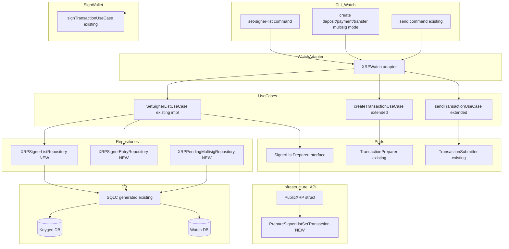
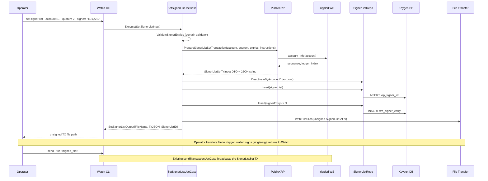
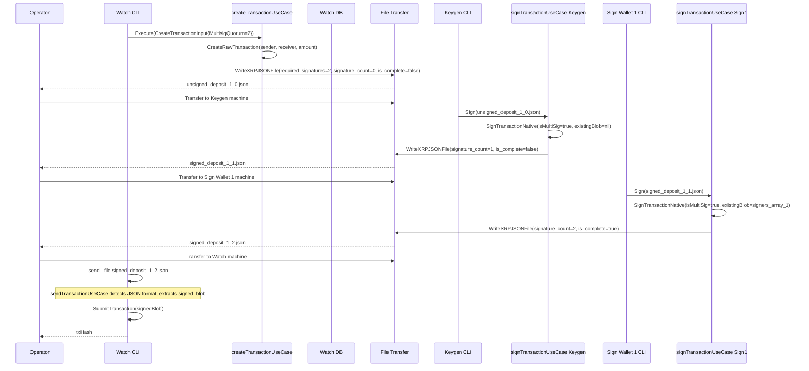

# Design Document: XRP Multisig Transaction

## Overview

This feature extends the XRP wallet implementation to support native XRPL multi-signature
transactions using a file-based serial signing workflow. The workflow mirrors the existing
BTC multisig flow: Watch Wallet creates an unsigned transaction file, each offline signer
(Keygen/Sign wallet) appends their signature to the file, and Watch Wallet broadcasts the
fully-signed transaction when the `is_complete` flag is set.

**Purpose**: Enable M-of-N multi-signature authorization for XRP payment transactions,
improving security through distributed key custody without deviating from the established
multi-wallet architecture.

**Users**: Wallet operators managing XRP accounts that require multiple offline signers for
transaction authorization.

**Impact**: Extends the existing XRP Watch, Keygen, and Sign wallet CLIs with multisig
setup commands and a parallel JSON-format transaction file path. The existing single-sig
(P1) flow is unaffected.

### Goals

- Configure XRP accounts for multisig via `SignerListSet` transaction through the Watch wallet CLI
- Create unsigned multisig transaction files using JSON format (carrying `required_signatures`)
- Leverage the already-implemented serial offline signing path in Sign/Keygen wallets
- Wire repository implementations and DI container for all multisig use cases
- Verify the complete 2-of-2 flow with an E2E test (P2)

### Non-Goals

- Parallel signature combination via `CombineTransaction` (deferred)
- `SetRegularKey` full implementation
- Disabling the master key (`asfDisableMaster`)
- DB-centric multisig coordination (`AddMultisigSignature` use case as primary flow)
- Destination tag support

---

## Architecture

### Existing Architecture Analysis

The system follows Clean Architecture with strict layer separation:

```
Interface Adapters (CLI) → Application (Use Cases + Ports) → Domain
                                    ↑
Infrastructure (API, Repository, Storage) → Application (Ports + DTOs)
```

Key existing patterns to extend:
- **Port interfaces** in `internal/application/ports/api/xrp/interface.go` — ISP-compliant focused interfaces
- **Infrastructure API** in `internal/infrastructure/api/xrp/public/` — wire type → DTO conversion pattern
- **Repository** in `internal/infrastructure/repository/` — SQLC adapter wrapping generated code
- **DI** in `internal/di/container.go` — constructor injection with panic for unsupported coins
- **CLI** in `internal/interface-adapters/cli/watch/` — Cobra commands delegating to wallet adapter

### Architecture Pattern & Boundary Map



**Architecture Integration**:
- Selected pattern: Extension of existing Ports & Adapters (Hexagonal Architecture)
- Domain boundaries: All new components follow existing layer rules; no cross-layer imports introduced
- Existing patterns preserved: DTO conversion in infrastructure, ISP-compliant port interfaces, SQLC repository adapter pattern
- New components: `PrepareSignerListSetTransaction` infrastructure method, 3 repository adapters, 1 CLI command, multisig TX file path in `create_transaction.go`
- Steering compliance: Clean Architecture dependency direction maintained; no infrastructure types in port interfaces

### Technology Stack

| Layer | Choice / Version | Role in Feature | Notes |
|-------|-----------------|-----------------|-------|
| CLI | `github.com/spf13/cobra` (existing) | `set-signer-list` command parsing | Follow existing Cobra patterns |
| Application | Go use cases (existing) | `SetSignerListUseCase`, `createTransactionUseCase` extension | Already implemented; fix DI wiring |
| Infrastructure API | `github.com/Peersyst/xrpl-go` (existing) | Offline signing; `SignerListSet` TX construction | No new library dependency |
| Infrastructure API | WebSocket RPC to `rippled` (existing) | `account_info` for sequence/fee; `submit` for broadcast | Follow `PrepareTransaction` pattern |
| Repository | SQLC-generated code (existing) | Data access for signer list, pending multisig tables | 5 tables already migrated |
| Storage | JSON file format via `WriteXRPJSONFile` (existing) | Unsigned multisig TX files | Parallel to existing text file path |

---

## System Flows

### Flow 1: SignerList Setup (One-Time, Watch Wallet)



**Key decisions**: The `SignerListSet` transaction itself is signed with the account's master key (single-sig); multi-signing is used for subsequent transactions like payments.

---

### Flow 2: Multisig Payment (File-Based, Serial Accumulation)



**Key decisions**: `is_complete=true` when `signature_count >= required_signatures`. The `send` command is extended to detect JSON-format files.

---

## Requirements Traceability

| Req | Summary | Components | Interfaces | Flows |
|-----|---------|------------|------------|-------|
| FR-1 | SignerList configuration (Watch) | `SetSignerListUseCase`, `PrepareSignerListSetTransaction`, `XRPSignerListRepository`, `XRPSignerEntryRepository`, DI wire | `SignerListPreparer`, `XRPSignerListRepositorier`, `XRPSignerEntryRepositorier` | Flow 1 |
| FR-2 | Multisig TX creation (Watch) | `createTransactionUseCase` extension, JSON file path | `TransactionPreparer` | Flow 2 step 1 |
| FR-3 | Offline multisig signing (already impl.) | `signTransactionUseCase` (existing) | `TransactionSigner` (existing) | Flow 2 steps 2–3 |
| FR-4 | Multisig TX submission (already impl.) | `sendTransactionUseCase` extension for JSON format | `TransactionSubmitter` (existing) | Flow 2 step 4 |
| FR-5 | Signer key provisioning (existing keygen) | Existing keygen CLI (no change) | Existing key interfaces | — |
| FR-6 | Repository implementations | `XRPSignerListRepository`, `XRPSignerEntryRepository`, `XRPPendingMultisigRepository`, `XRPMultisigSignatureRepository` | 4 port interfaces | Both flows |
| FR-7 | DI container fixes | `internal/di/container.go` | — | — |
| FR-8 | Watch wallet CLI commands | `set-signer-list` CLI command, `XRPWatch` adapter | Cobra CLI | Flow 1 |
| FR-9 | E2E test P2 | E2E scripts, Makefile targets | — | Flow 2 |

---

## Components and Interfaces

| Component | Layer | Intent | Req Coverage | Key Dependencies | Contracts |
|-----------|-------|--------|--------------|------------------|-----------|
| `PrepareSignerListSetTransaction` | Infrastructure API | Build unsigned `SignerListSet` TX via WebSocket | FR-1 | `PublicXRP.PublicRPC` (P0) | Service |
| `XRPSignerListRepository` | Infrastructure Repository | Persist signer list records (keygen DB) | FR-1, FR-6 | SQLC keygen queries (P0) | State |
| `XRPSignerEntryRepository` | Infrastructure Repository | Persist signer entry records (keygen DB) | FR-1, FR-6 | SQLC keygen queries (P0) | State |
| `XRPPendingMultisigRepository` | Infrastructure Repository | Persist pending multisig TX state (watch DB) | FR-6 | SQLC watch queries (P0) | State |
| `XRPMultisigSignatureRepository` | Infrastructure Repository | Persist individual signer blobs (watch DB) | FR-6 | SQLC watch queries (P0) | State |
| `createTransactionUseCase` extension | Application | Add multisig JSON file creation path when `MultisigQuorum > 0` passed explicitly | FR-2 | `TransactionPreparer` (P0) | Service |
| `sendTransactionUseCase` extension | Application | Detect and process JSON-format signed files | FR-4 | `TransactionFileRepositorier` (P0) | Service |
| `set-signer-list` CLI command | Interface Adapters | Expose SignerList setup to Watch wallet operators | FR-8 | `SetSignerListUseCase` (P0) | Service |
| `XRPWatch` adapter update | Interface Adapters | Include multisig use cases in Watch wallet | FR-8 | `SetSignerListUseCase` (P0) | Service |
| DI container fixes | DI | Wire `SetSignerListUseCase`; remove panics | FR-7 | All repo + API dependencies (P0) | — |

---

### Infrastructure API Layer

#### `PrepareSignerListSetTransaction` (on `PublicXRP`)

| Field | Detail |
|-------|--------|
| Intent | Build an unsigned `SignerListSet` transaction using WebSocket `account_info` for sequence/fee |
| Requirements | FR-1 |

**Responsibilities & Constraints**
- Fetch account `Sequence` and `LedgerCurrentIndex` via `AccountInfo` RPC (same as `PrepareTransaction`)
- Build infrastructure wire type `SignerListSetTxInput` with JSON tags matching XRPL protocol
- Convert to `dtoxrp.SignerListSetTxInput` DTO via private `toDTOSignerListSetTxInput()` function
- Return DTO and serialized JSON string; no signing occurs

**Dependencies**
- Inbound: `SetSignerListUseCase` — calls this via `SignerListPreparer` port (P0)
- Outbound: `p.PublicRPC.AccountInfo()` — fetches sequence number (P0)
- External: `rippled` WebSocket node — provides account state (P0)

**Contracts**: Service [x]

##### Service Interface

```go
// Satisfies apixrp.SignerListPreparer (already defined in ports/api/xrp/interface.go)
func (p *PublicXRP) PrepareSignerListSetTransaction(
    ctx context.Context,
    senderAccount string,
    signerQuorum uint32,
    signerEntries []apixrp.SignerEntryInput,
    instructions *dtoxrp.Instructions,
) (*dtoxrp.SignerListSetTxInput, string, error)
```

**Infrastructure wire type** (private to `xrppublic` package):
```go
type SignerListSetTxInput struct {
    TransactionType    string             `json:"TransactionType"`
    Account            string             `json:"Account"`
    SignerQuorum       uint32             `json:"SignerQuorum"`
    SignerEntries      []SignerEntryWire   `json:"SignerEntries"`
    Fee                string             `json:"Fee"`
    Flags              uint64             `json:"Flags"`
    LastLedgerSequence uint64             `json:"LastLedgerSequence"`
    Sequence           uint64             `json:"Sequence"`
}

type SignerEntryWire struct {
    SignerEntry SignerEntryInner `json:"SignerEntry"`
}

type SignerEntryInner struct {
    Account      string `json:"Account"`
    SignerWeight uint32 `json:"SignerWeight"`
}
```

- Preconditions: `senderAccount` non-empty; `signerEntries` non-empty (1–8); `signerQuorum >= 1`
- Postconditions: Returns DTO and valid JSON string; no state mutation
- Invariants: `SignerQuorum <= sum(SignerWeight)` enforced by caller (use case)

**Implementation Notes**
- Integration: Follows exact same pattern as `PrepareTransaction`; reuse `accountInfo` lookup and `json.Marshal`
- Validation: Input validation is the use case's responsibility; infrastructure only validates non-empty account
- Risks: XRPL fee for `SignerListSet` is `(N+1) * base_fee` where N is signer count; use minimum "12" drops as base (same as Payment); adjust if validation fails

---

### Infrastructure Repository Layer

#### `XRPSignerListRepository`

| Field | Detail |
|-------|--------|
| Intent | Concrete adapter for `XRPSignerListRepositorier` port, backed by SQLC keygen queries |
| Requirements | FR-1, FR-6 |

**Responsibilities & Constraints**
- Wraps `*sqlcgen.Queries` (keygen DB)
- Converts SQLC row types (`XrpSignerList`) to domain entities (`domainXRP.XRPSignerList`)
- Implements all 7 methods of `repocold.XRPSignerListRepositorier`

**Dependencies**
- Inbound: `SetSignerListUseCase`, `createTransactionUseCase` — dependency injection (P0)
- Outbound: SQLC keygen queries (`GetXRPSignerListByAccountID`, `InsertXRPSignerList`, etc.) (P0)

**Contracts**: State [x]

##### State Management
- State model: Active/inactive signer list per XRP account address; only one active list per account at a time
- Persistence: `DeactivateByAccountID` then `Insert` in sequence (non-atomic — use case is responsible for ordering)
- Concurrency: Single-writer assumption (CLI is single-threaded)

**Implementation Notes**
- Integration: Located at `internal/infrastructure/repository/cold/{postgres,mysql,sqlite}/xrp_signer_list.go`
- Validation: Port interface methods return domain entities; SQLC types are private
- Risks: `DeactivateByAccountID` + `Insert` is not atomic; a crash between operations leaves the account with no active signer list — acceptable for CLI use case

#### `XRPSignerEntryRepository`

| Field | Detail |
|-------|--------|
| Intent | Concrete adapter for `XRPSignerEntryRepositorier` port, backed by SQLC keygen queries |
| Requirements | FR-1, FR-6 |

**Implementation Notes**: Same pattern as `XRPSignerListRepository`. Located alongside it. No cross-table joins needed; list ID passed explicitly.

#### `XRPPendingMultisigRepository`

| Field | Detail |
|-------|--------|
| Intent | Concrete adapter for `XRPPendingMultisigRepositorier` port, backed by SQLC watch queries |
| Requirements | FR-6 |

**Implementation Notes**: Watch DB. Used by `CreateMultisigTxUseCase` and `SubmitMultisigTxUseCase`. Located at `internal/infrastructure/repository/watch/{postgres,mysql,sqlite}/xrp_pending_multisig.go`.

#### `XRPMultisigSignatureRepository`

| Field | Detail |
|-------|--------|
| Intent | Concrete adapter for `XRPMultisigSignatureRepositorier` port, backed by SQLC watch queries |
| Requirements | FR-6 |

**Implementation Notes**: Watch DB. Used by `AddMultisigSignatureUseCase` (deferred primary use but repo must still compile). Located alongside `XRPPendingMultisigRepository`.

---

### Application Layer

#### `createTransactionUseCase` Extension (multisig path)

| Field | Detail |
|-------|--------|
| Intent | Add a parallel JSON-format code path for creating unsigned multisig payment transactions |
| Requirements | FR-2 |

**Responsibilities & Constraints**
- Accept `MultisigQuorum uint32` as an explicit field in `CreateTransactionInput` (passed via `--quorum N` CLI flag)
- When `MultisigQuorum > 1`, build `XRPTransactionFile` with `RequiredSignatures = MultisigQuorum` and write via `WriteXRPJSONFile`
- When `MultisigQuorum == 0` (default, flag not supplied), execute the existing single-sig text-format path unchanged
- No database read of signer list is required; the operator supplies the quorum value on the command line

**Dependencies**
- Inbound: `XRPWatch.CreateDepositTx` / `CreatePaymentTx` / `CreateTransferTx` (P0)
- Outbound: `apixrp.TransactionPreparer` (P0), `file.TransactionFileRepositorier` (P0)

**Contracts**: Service [x]

##### Service Interface

`CreateTransactionInput` gains one new field:

```go
type CreateTransactionInput struct {
    // ... existing fields unchanged ...
    MultisigQuorum uint32 // 0 = single-sig (default); >1 = multisig JSON-format file
}
```

The existing `CreateTransactionUseCase.Execute()` signature is unchanged. The multisig path is
activated when `input.MultisigQuorum > 1`; no repository read is needed to determine this.

**Implementation Notes**
- Integration: New private method `generateMultisigJSONFile()` parallels existing `generateHexFile()`; calls `txFileRepo.WriteXRPJSONFile()`
- Validation: If `MultisigQuorum < 2` the single-sig path is used; the CLI validates the flag is either omitted or ≥ 2
- Risks: Operator must supply the correct quorum; no on-ledger verification at TX creation time (accepted limitation — same as existing single-sig flow)

#### `sendTransactionUseCase` Extension (JSON format detection)

| Field | Detail |
|-------|--------|
| Intent | Detect JSON-format signed transaction files and extract `signed_blob` for submission |
| Requirements | FR-4 |

**Responsibilities & Constraints**
- Detect file format by attempting to parse as `XRPTransactionFile` JSON first; fall back to existing text format
- For JSON format: extract `signed_blob` from each `XRPTransactionEntry` where `is_complete == true`
- Submit each signed blob via `SubmitTransaction` (unchanged)

**Implementation Notes**
- Integration: Detection is **content-based only** — attempt `txFileRepo.ReadXRPJSONFile(filePath)` first; if the file does not parse as valid `XRPTransactionFile` JSON (unmarshal error or empty `transactions` slice), fall back to `txFileRepo.ReadFileSlice(filePath)`. Extension-based detection is not used because both the legacy text format and the new JSON format share the `.json` extension.
- Risks: If both parsers fail, return a clear error indicating unsupported file format

---

### Interface Adapters Layer

#### `set-signer-list` CLI Command

| Field | Detail |
|-------|--------|
| Intent | Watch wallet CLI command to create a `SignerListSet` unsigned transaction |
| Requirements | FR-1, FR-8 |

**Contracts**: Service [x]

##### Service Interface

```go
// Located in internal/interface-adapters/cli/watch/send/multisig.go
// Command: watch send multisig set-signer-list
// Flags:
//   --account  string  XRP account address to configure (required)
//   --quorum   uint32  Minimum signature weight required (required)
//   --signers  string  Signer list as "address:weight,..." comma-separated (required)
func runSetSignerList(
    ctx context.Context,
    container di.Container,
    account, signersStr string,
    quorum uint32,
) error
```

**Implementation Notes**
- Integration: Parse `--signers` comma-separated string into `[]watchusecase.SignerEntry` via `parseSignerEntries()`; validate non-empty before calling use case
- Validation: Validate quorum ≥ 1 and signer count 1–8 in the CLI layer before calling use case
- Risks: None; pure CLI delegation pattern

#### `XRPWatch` Adapter Update

| Field | Detail |
|-------|--------|
| Intent | Add `SetSignerListUseCase` to the Watch wallet adapter |
| Requirements | FR-8 |

**Implementation Notes**: Add `setSignerListUseCase watchusecase.SetSignerListUseCase` field; update `NewXRPWatch()` constructor; add `SetSignerList()` method delegating to use case.

---

### DI Container

#### `newXRPWatchSetSignerListUseCase` Fix

| Field | Detail |
|-------|--------|
| Intent | Replace panic with proper construction of `SetSignerListUseCase` |
| Requirements | FR-7 |

**Implementation Notes**:
- Inject `PublicXRP` (as `apixrp.SignerListPreparer`), `uuid.UUIDHandler`, `XRPSignerListRepository`, `XRPSignerEntryRepository`, `file.TransactionFileRepositorier`
- `newXRPWatchAddMultisigSignatureUseCase`: Replace the panic with a `notImplementedAddMultisigSignatureUseCase` no-op struct that satisfies the `AddMultisigSignatureUseCase` interface. Its `Execute()` method returns `fmt.Errorf("AddMultisigSignature is not yet implemented")`. Returning a nil interface is forbidden — a nil interface value causes a silent nil pointer panic at the first method call site, which is worse than the current named startup panic. The no-op struct compiles cleanly, starts without panic, and produces a clear runtime error if the unimplemented path is ever reached.

---

## Data Models

### Domain Model

The feature uses existing domain entities without modification:

- **`XRPSignerList`** (domain/chains/xrp) — aggregate root for signer configuration; one active list per account
- **`XRPSignerEntry`** (domain/chains/xrp) — value object representing one authorized signer with weight
- **`XRPPendingMultisig`** (domain/chains/xrp) — aggregate for pending DB-centric multisig TX (used by deferred use cases)
- **`XRPMultisigSignature`** (domain/chains/xrp) — value object for one signer's blob

Business invariants (enforced by domain):
- `SignerQuorum > 0`
- `len(SignerEntries) >= 1 && len(SignerEntries) <= 8`
- `sum(SignerWeight) >= SignerQuorum`
- Only one active `XRPSignerList` per account at a time

### Logical Data Model

```mermaid
erDiagram
    XRPSignerList {
        int64 id PK
        string account_id
        uint32 signer_quorum
        bool is_active
        string set_tx_hash
        time created_at
        time updated_at
    }

    XRPSignerEntry {
        int64 id PK
        int64 signer_list_id FK
        string signer_account
        uint32 signer_weight
        time created_at
    }

    XRPPendingMultisig {
        int64 id PK
        string tx_uuid UNIQUE
        string account_id
        string unsigned_tx_json
        string xrp_tx_type
        uint32 required_quorum
        uint32 current_weight
        string status
        string combined_tx_blob
        string submitted_tx_hash
        time expires_at
        time created_at
        time updated_at
    }

    XRPMultisigSignature {
        int64 id PK
        int64 pending_multisig_id FK
        string signer_account
        string signed_tx_blob
        uint32 signer_weight
        time signed_at
    }

    XRPSignerList ||--o{ XRPSignerEntry : "has entries"
    XRPPendingMultisig ||--o{ XRPMultisigSignature : "collects signatures"
```

**DB mapping**:
- `XRPSignerList` + `XRPSignerEntry` → keygen DB (`xrp_signer_list`, `xrp_signer_entry`)
- `XRPPendingMultisig` + `XRPMultisigSignature` → watch DB (`xrp_pending_multisig`, `xrp_multisig_signature`)

All schema and SQLC code already exist. Only repository adapter implementations are new.

### Watch DB Signer List Access

The `createTransactionUseCase` (Watch wallet) does **not** read the signer quorum from any database.
Instead, the operator supplies `--quorum N` on the CLI when invoking `create deposit`, `create payment`,
or `create transfer` in multisig mode. The value is passed directly through `CreateTransactionInput.MultisigQuorum`.

This design eliminates the namespace ambiguity between `repocold.XRPSignerListRepositorier` (keygen DB,
used by `SetSignerListUseCase`) and any Watch-DB-backed variant. No Watch DB schema changes are required
for signer list data — `xrp_signer_list` and `xrp_signer_entry` remain keygen-only tables.

### Data Contracts

**`XRPTransactionFile` JSON format** (existing; used for multisig TX files):

```json
{
  "transactions": [
    {
      "uuid": "<uuid-v7>",
      "sender_account_type": "client",
      "sender_account": "r...",
      "unsigned_data": { "TransactionType": "Payment", "Account": "r...", ... },
      "required_signatures": 2,
      "signature_count": 1,
      "is_complete": false,
      "signed_blob": "<hex-encoded blob with 1 Signers entry>"
    }
  ]
}
```

**`SignerListSet` unsigned TX file** (new; plain text format, same as existing):

```
r<account_address>
<uuid>,<SignerListSet JSON blob>
```

---

## Error Handling

### Error Strategy

Fail fast with wrapped errors; all errors propagate to CLI for display. No retry logic (CLI is interactive).

### Error Categories

**Input Validation**:
- `signerQuorum == 0` → `"signer quorum must be at least 1"` (validated in domain)
- `len(signerEntries) > 8` → `"signer list cannot exceed 8 entries"` (validated in domain)
- `sum(weights) < quorum` → `"signer quorum exceeds total signer weight"` (validated in domain)
- Missing `--account` or `--signers` CLI flags → Cobra required-flag error

**Infrastructure Errors**:
- `AccountInfo` RPC failure → `"failed to prepare SignerListSet: <wrapped RPC error>"`
- DB insert failure → `"failed to insert signer list: <wrapped DB error>"`
- File write failure → `"failed to write transaction file: <wrapped IO error>"`

**Business Logic Errors**:
- No active signer list for account (on multisig TX creation) → fall back to single-sig path (logged as debug)
- `is_complete = false` when `send` is called → `"transaction is not fully signed (signature_count < required_signatures)"`
- Pending TX not found (submit multisig) → `"pending transaction not found: <uuid>"`

### Monitoring

- Logging via existing `pkg/logger` at `Debug` level for happy path; `Warn` for recoverable conditions; `Error` for failures
- No new metrics or alerting required (CLI tool, not a long-running service)

---

## Testing Strategy

### Unit Tests

- `PrepareSignerListSetTransaction`: Test happy path with mocked `PublicRPC.AccountInfo`; test error propagation
- `XRPSignerListRepository.GetByAccountID`: Test SQLC mapping to domain entity; test not-found case
- `SetSignerListUseCase.Execute`: Test with mocked `SignerListPreparer` + mocked repositories; test quorum validation error
- `createTransactionUseCase` multisig path: Test JSON file creation when signer list active; test single-sig fallback when no signer list
- `sendTransactionUseCase` JSON format detection: Test with JSON-format input file; test fallback to text format

### Integration Tests

- Repository integration: Test SQLC adapters against SQLite in-memory DB for all 4 repositories
- Full Watch-side setup flow: `SetSignerList` → file created → verifiable in DB

### E2E Tests (P2)

Covered by FR-9: 2-of-2 multisig payment on rippled standalone mode:
1. Setup: Two signer accounts funded from genesis; `SignerListSet` configured on sender
2. Create: Unsigned multisig JSON file created by Watch wallet
3. Sign 1: Keygen wallet signs → `signature_count: 1`
4. Sign 2: Sign wallet signs → `signature_count: 2`, `is_complete: true`
5. Send: Watch wallet broadcasts; ledger_accept; balance verified

Makefile targets: `make xrp-e2e-p2`, `make xrp-e2e-p2-ci`, `make xrp-e2e-p2-reset`

### Performance

No performance concerns; CLI tool with single-request operations.

---

## Security Considerations

- **Private keys never leave offline wallets**: The signing path (`SignTransactionNative`) is fully offline; no change to security model
- **Master key exposure**: The `SignerListSet` TX is signed by the account master key in the Keygen wallet — the same security posture as single-sig transactions
- **Signer list integrity**: The signer list stored in the Watch DB is operator-controlled; no validation against on-ledger state at TX creation time (accepted limitation — operator is responsible for consistency)
- **`signed_blob` in JSON files**: Contains the serialized signed TX; must be treated with the same physical security as other TX files (USB transfer)

---

## Supporting References

See `research.md` for:
- XRPL `SignerListSet` JSON wire format details
- Analysis of the file format split between single-sig and multisig paths
- Architecture pattern evaluation (serial vs parallel vs DB-centric)
- Decision rationale for Watch DB signer list storage
