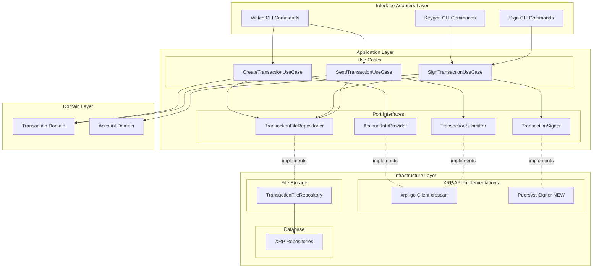
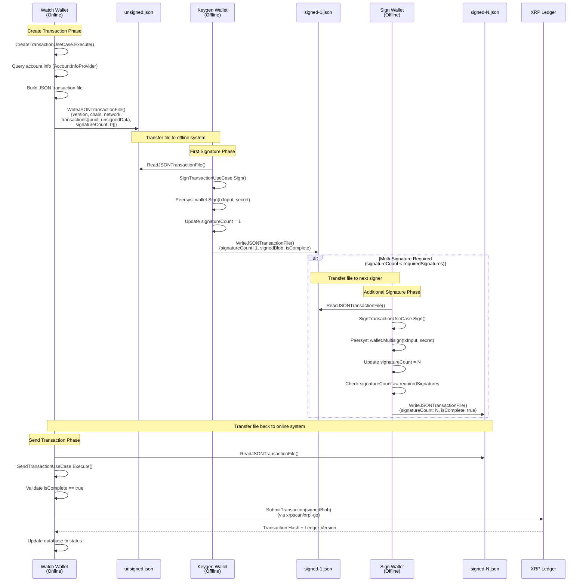
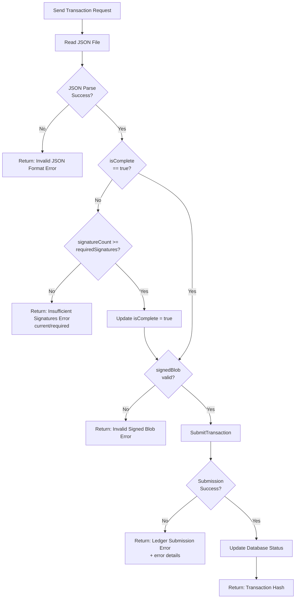
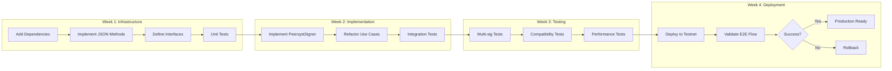

# Technical Design: XRP Transaction Flow Alignment

## Overview

This feature aligns the XRP transaction flow with Bitcoin patterns by introducing a JSON-based file format and native Go signing implementation. The design maintains Clean Architecture principles while modernizing the offline signing workflow to support multi-signature transactions with comprehensive metadata tracking.

**Purpose**: This feature delivers structured transaction file format and native Go signing to wallet operators, enabling robust offline multi-signature workflows aligned with Bitcoin PSBT patterns.

**Users**: Wallet operators using watch, keygen, and sign wallets will utilize this for creating, signing, and submitting XRP transactions with comprehensive metadata tracking throughout the transaction lifecycle.

**Impact**: Changes the current text-based CSV transaction file format to structured JSON format, replaces gRPC-based signing with native Go implementation (xrpl-go), and introduces interface segregation for XRP API operations (AccountInfoProvider, TransactionSigner, TransactionSubmitter).

### Goals

- Replace text-based transaction file format with structured JSON format supporting versioning and metadata
- Implement native Go transaction signing using xrpl-go library (replace gRPC dependency)
- Enable offline multi-signature workflow with signature count tracking and completion validation
- Segregate XRP API interface into minimal, focused interfaces (Interface Segregation Principle)
- Maintain backward compatibility with existing text-format transactions during migration
- Align XRP transaction flow with established Bitcoin PSBT patterns

### Non-Goals

- Migrating existing text-format transaction files to JSON (handled by operators manually)
- Implementing new multi-signature account creation workflows (SignerListSet transactions remain manual)
- Optimizing transaction file size beyond standard JSON formatting
- Supporting XRP-specific advanced features (escrow, payment channels, NFTs) in this phase
- Real-time transaction status monitoring or webhook notifications

## Architecture

### Existing Architecture Analysis

**Current XRP Transaction Flow**:
- **Watch Wallet** (Online): Creates unsigned transactions in CSV text format, submits signed transactions
- **Keygen/Sign Wallet** (Offline): Parses CSV files, signs via gRPC, outputs CSV format
- **File Format**: Simple text with sender account type header + UUID,JSON transaction pairs
- **Interfaces**: Monolithic `XRPer` interface with 30+ methods (admin, public, API operations)

**Current Architecture Patterns**:
- Clean Architecture with strict layer separation (Domain → Application → Infrastructure → Interface Adapters)
- File repository pattern for transaction file I/O (`TransactionFileRepositorier`)
- Use case orchestration pattern (create, sign, send use cases)
- Port interface pattern (interfaces in application/ports, implementations in infrastructure)

**Constraints to Maintain**:
- Domain layer has ZERO infrastructure dependencies
- Use cases depend only on port interfaces (never concrete implementations)
- File path naming convention: `{actionType}_{txID}_{txType}_{signedCount}_{timestamp}.{ext}`
- Multi-wallet architecture (watch online, keygen/sign offline)

**Technical Debt Addressed**:
- Monolithic XRPer interface → Segregated interfaces (AccountInfoProvider, TransactionSigner, TransactionSubmitter)
- gRPC dependency for signing → Native Go signing (offline-capable)
- Unstructured text format → Structured JSON with metadata

### Architecture Pattern & Boundary Map

**Selected Pattern**: Clean Architecture with Interface Segregation



**Architecture Integration**:
- **Selected pattern**: Clean Architecture (already established) + Interface Segregation Principle (ISP)
- **Domain/feature boundaries**:
  - Transaction file operations isolated in `TransactionFileRepositorier` (reusable across BTC/BCH/ETH/XRP)
  - XRP API operations segregated by use case (AccountInfoProvider, TransactionSigner, TransactionSubmitter)
  - Use cases own transaction orchestration logic (create → sign → send workflow)
- **Existing patterns preserved**:
  - Port interface pattern (interfaces in application/ports, implementations in infrastructure)
  - Clean Architecture layer separation (dependencies flow inward)
  - Multi-wallet architecture (watch online, keygen/sign offline)
- **New components rationale**:
  - `PeersystSigner` (NEW): Implements `TransactionSigner` using Peersyst/xrpl-go for native Go signing
  - JSON transaction file methods (NEW): Extend `TransactionFileRepositorier` for structured metadata
  - Segregated interfaces (NEW): Replace monolithic `XRPer` with focused interfaces per ISP
- **Steering compliance**:
  - Maintains zero infrastructure dependencies in domain layer
  - Follows established file repository extension pattern (PSBT, Hex precedent)
  - Preserves existing transaction file naming convention
  - Upholds security requirement: offline signing without network dependency

### Technology Stack

| Layer | Choice / Version | Role in Feature | Notes |
|-------|------------------|-----------------|-------|
| **Backend / Services** | Go 1.23+ | Core implementation language | Existing project constraint |
| **XRP Signing Library** | Peersyst/xrpl-go (latest) | Native Go transaction signing (NEW) | Replaces gRPC signing; provides `wallet.Sign()` and `wallet.Multisign()` |
| **XRP Submission Library** | xrpscan/xrpl-go v0.2.11 | WebSocket communication and transaction submission | Existing integration; already used for `SubmitTransaction` |
| **Data / Storage** | JSON (Go stdlib encoding/json) | Transaction file format | Replaces text CSV format; supports versioning and metadata |
| **Data / Storage** | MySQL (existing) | Transaction metadata persistence | No changes; existing xrp_tx tables |
| **Infrastructure / Runtime** | File system | Transaction file I/O | Extends existing `TransactionFileRepository` with JSON methods |

**Rationale Summary**:
- **Peersyst/xrpl-go**: Selected for comprehensive wallet/signing API over XRPLF (serialization-focused) or xrpscan (websocket-focused). Provides offline signing with `wallet.Sign()` and multi-signature support with `wallet.Multisign()`. See research.md for detailed comparison.
- **Dual xrpl-go libraries**: xrpscan/xrpl-go for submission (already working), Peersyst/xrpl-go for signing (new requirement). Acceptable specialization; alternative XRPLF investigation deferred to future optimization.
- **JSON format**: Standard library support, human-readable for debugging, schema validation possible, versioning support (apiVersion field per Google JSON Style Guide).

## System Flows

### Transaction Flow: Create → Sign → Send



**Key Decisions**:
- JSON file format enables metadata preservation across offline transfers (version, network, signature count)
- Sequential file naming tracks signing progression (`unsigned.json` → `signed-1.json` → `signed-N.json`)
- Multi-signature detection: `isComplete = (signatureCount >= requiredSignatures)`
- Offline signing guaranteed: Peersyst wallet operations have no network calls
- Fee calculation: Multi-sig transactions require (N+1) × base fee (validated in SendTransactionUseCase)

### Error Handling Flow: Multi-Signature Validation



**Flow Decisions**:
- Fail fast: JSON parsing errors block further processing
- Signature count validation: Prevent premature submission of incomplete transactions
- `isComplete` flag: Explicit completion marker prevents retry confusion
- Ledger error propagation: Return full XRP Ledger error details for debugging

## Requirements Traceability

| Requirement | Summary | Components | Interfaces | Flows |
|-------------|---------|------------|------------|-------|
| 1.1 | JSON file generation with metadata | TransactionFileRepository (JSON methods) | TransactionFileRepositorier | Create Transaction |
| 1.2 | Transaction entry fields (UUID, unsigned data, sender, signature count) | JSON schema definition | N/A | Create Transaction |
| 1.3 | File extension `.json` | TransactionFileRepository | TransactionFileRepositorier | All phases |
| 1.4 | Version format "1.0.0" | JSON schema definition | N/A | All phases |
| 1.5 | Chain identifier and network metadata | JSON schema definition | N/A | Create Transaction |
| 2.1 | JSON output from create transaction | CreateTransactionUseCase | TransactionFileRepositorier | Create Transaction |
| 2.2 | Depend on AccountInfoProvider interface | CreateTransactionUseCase | AccountInfoProvider | Create Transaction |
| 2.3 | Return generated JSON file path | CreateTransactionUseCase | N/A | Create Transaction |
| 2.4 | Preserve transaction details for offline signing | JSON schema definition | N/A | Create Transaction |
| 2.5 | Error context wrapping | All use cases | N/A | All phases |
| 3.1 | Parse JSON transaction files | SignTransactionUseCase | TransactionFileRepositorier | Sign Transaction |
| 3.2 | Native Go signing implementation | PeersystSigner | TransactionSigner | Sign Transaction |
| 3.3 | Track signature count and completion | SignTransactionUseCase | N/A | Sign Transaction |
| 3.4 | Skip re-signing if complete | SignTransactionUseCase | N/A | Sign Transaction |
| 3.5 | Output signed JSON file | SignTransactionUseCase | TransactionFileRepositorier | Sign Transaction |
| 3.6 | Retrieve secrets from repository | SignTransactionUseCase | XRPAccountKeyRepositorier | Sign Transaction |
| 3.7 | Set completion status | SignTransactionUseCase | N/A | Sign Transaction |
| 4.1 | Parse signed JSON files | SendTransactionUseCase | TransactionFileRepositorier | Send Transaction |
| 4.2 | Submit via xrpl-go library | SendTransactionUseCase | TransactionSubmitter | Send Transaction |
| 4.3 | Validate signature completion | SendTransactionUseCase | N/A | Send Transaction, Error Handling |
| 4.4 | Return transaction hash on success | SendTransactionUseCase | N/A | Send Transaction |
| 4.5 | Return descriptive error on failure | SendTransactionUseCase | N/A | Error Handling |
| 4.6 | Validate completion before submission | SendTransactionUseCase | N/A | Error Handling |
| 5.1-5.5 | Offline signing support | SignTransactionUseCase, TransactionSigner interface | TransactionSigner (no network methods) | Sign Transaction |
| 6.1-6.5 | Multi-signature flow support | JSON schema, SignTransactionUseCase | N/A | Sign Transaction |
| 7.1-7.5 | Backward compatibility | parseTransactionFile helper, format detection | TransactionFileRepositorier | All phases (migration) |
| 8.1-8.6 | Testing and validation | Test suite (unit, integration, multisig) | N/A | N/A (testing phase) |
| 9.1-9.5 | Interface segregation | AccountInfoProvider, TransactionSigner, TransactionSubmitter | All three interfaces | All phases |
| 10.1-10.6 | Error handling and logging | All use cases, error wrapping pattern | N/A | Error Handling |

## Components and Interfaces

### Component Summary

| Component | Domain/Layer | Intent | Req Coverage | Key Dependencies (P0/P1) | Contracts |
|-----------|--------------|--------|--------------|--------------------------|-----------|
| **TransactionFileRepository** (Extended) | Infrastructure/Storage | JSON transaction file I/O | 1.1, 1.3, 2.1, 3.1, 4.1 | File system (P0) | Service |
| **PeersystSigner** (NEW) | Infrastructure/XRP | Native Go transaction signing | 3.2, 5.1 | Peersyst/xrpl-go (P0), XRPAccountKeyRepo (P0) | Service |
| **AccountInfoProvider** (NEW Interface) | Application/Ports | Minimal account query interface | 2.2, 9.1, 9.3 | None (interface) | Service |
| **TransactionSigner** (NEW Interface) | Application/Ports | Offline signing interface | 3.2, 9.2, 9.4 | None (interface) | Service |
| **TransactionSubmitter** (NEW Interface) | Application/Ports | Transaction submission interface | 4.2, 9.2, 9.4 | None (interface) | Service |
| **CreateTransactionUseCase** (Refactored) | Application/Use Cases | Create unsigned transactions in JSON format | 2.1-2.5 | AccountInfoProvider (P0), TransactionFileRepositorier (P0) | Service |
| **SignTransactionUseCase** (Refactored) | Application/Use Cases | Sign transactions with native Go, track multisig | 3.1-3.7, 6.1-6.5 | TransactionSigner (P0), TransactionFileRepositorier (P0) | Service |
| **SendTransactionUseCase** (Refactored) | Application/Use Cases | Validate and submit signed transactions | 4.1-4.6 | TransactionSubmitter (P0), TransactionFileRepositorier (P0) | Service |
| **XRPTransactionFile** (NEW DTO) | Application/DTO | JSON transaction file structure | 1.2, 1.4, 1.5 | None | State |

### Infrastructure / Storage

#### TransactionFileRepository (Extended)

| Field | Detail |
|-------|--------|
| Intent | Provide JSON transaction file I/O operations alongside existing PSBT/Hex/Text formats |
| Requirements | 1.1, 1.3, 2.1, 3.1, 4.1, 7.1 |

**Responsibilities & Constraints**
- Extend existing file repository with JSON read/write methods (`ReadJSONTransactionFile`, `WriteJSONTransactionFile`)
- Reuse file path naming convention: `{actionType}_{txID}_{txType}_{signedCount}_{timestamp}.json`
- Maintain backward compatibility: detect and parse text format with deprecation warnings
- JSON validation: verify version field, chain/network consistency, transaction array structure
- File extension enforcement: `.json` for new files

**Dependencies**
- Outbound: File system I/O — read/write JSON files (P0)
- Outbound: JSON serialization (Go stdlib encoding/json) — marshal/unmarshal (P0)
- Outbound: Path validation logic (existing) — file naming, directory creation (P0)

**Contracts**: Service [x]

##### Service Interface

```go
// Extend existing TransactionFileRepositorier interface
type TransactionFileRepositorier interface {
    // ... existing methods (ReadFile, WriteFile, ReadPSBTFile, etc.)

    // NEW: JSON transaction file methods
    ReadJSONTransactionFile(path string) (*XRPTransactionFile, error)
    WriteJSONTransactionFile(path string, data *XRPTransactionFile) (string, error)
}

// NEW: JSON transaction file structure
type XRPTransactionFile struct {
    Version   string                `json:"version"`   // e.g., "1.0.0"
    Chain     string                `json:"chain"`     // "XRP"
    Network   string                `json:"network"`   // "mainnet" | "testnet"
    CreatedAt string                `json:"createdAt"` // ISO 8601 timestamp
    Transactions []XRPTransactionEntry `json:"transactions"`
}

type XRPTransactionEntry struct {
    UUID               string         `json:"uuid"`               // UUIDv7
    UnsignedData       dtoxrp.TxInput `json:"unsignedData"`       // Full transaction input
    SenderAccount      string         `json:"senderAccount"`      // XRP address
    SenderAccountType  string         `json:"senderAccountType"`  // "client", "receipt", etc.
    SignatureCount     int            `json:"signatureCount"`     // Current signatures
    RequiredSignatures int            `json:"requiredSignatures"` // Quorum threshold
    SignedBlob         *string        `json:"signedBlob"`         // Hex-encoded signed tx (null if unsigned)
    IsComplete         bool           `json:"isComplete"`         // signatureCount >= requiredSignatures
}
```

**Preconditions**:
- `WriteJSONTransactionFile`: `data` must have valid version, chain, and network fields
- `ReadJSONTransactionFile`: File must exist and contain valid JSON

**Postconditions**:
- `WriteJSONTransactionFile`: Returns full file path with timestamp; file created on disk
- `ReadJSONTransactionFile`: Returns deserialized `XRPTransactionFile` or error if invalid

**Invariants**:
- JSON files always have `.json` extension
- Version field always present and follows semantic versioning (Major.Minor.Patch)
- Transaction UUIDs unique within file

**Implementation Notes**
- **Integration**: Follows existing PSBT/Hex method pattern; reuses `CreateFilePath` and `createDir` helpers
- **Validation**: JSON schema validation for version compatibility; verify `chain == "XRP"`; check transaction array non-empty
- **Backward Compatibility**: `parseTransactionFile` helper in use cases detects format (JSON vs text) based on extension or content; logs deprecation warnings for text format
- **Risks**: JSON file size larger than text format; acceptable trade-off for metadata value (monitor in testing)

### Infrastructure / XRP

#### PeersystSigner (NEW)

| Field | Detail |
|-------|--------|
| Intent | Implement native Go transaction signing using Peersyst/xrpl-go library for offline operations |
| Requirements | 3.2, 5.1, 5.2, 9.2 |

**Responsibilities & Constraints**
- Implement `TransactionSigner` interface using Peersyst/xrpl-go `wallet.Sign()` and `wallet.Multisign()` functions
- Convert `dtoxrp.TxInput` to Peersyst transaction format for signing
- Return signed transaction blob (hex-encoded) and transaction hash
- NO network calls (offline signing only)
- Handle multi-signature transactions (combine multiple signatures if needed)

**Dependencies**
- Inbound: SignTransactionUseCase — requests transaction signing (P0)
- Outbound: Peersyst/xrpl-go wallet package — native Go signing (P0)
- Outbound: XRPAccountKeyRepositorier — retrieve signing secrets (P0)

**Contracts**: Service [x]

##### Service Interface

```go
type TransactionSigner interface {
    // SignTransactionNative signs a transaction using native Go implementation (no gRPC)
    // Returns: signedTxID (hex hash), signedTxBlob (hex-encoded signed transaction), error
    SignTransactionNative(ctx context.Context, txInput *dtoxrp.TxInput, secret string) (string, string, error)
}

// Implementation in infrastructure/api/xrp/peersyst_signer.go
type PeersystSigner struct {
    logger Logger
}

func NewPeersystSigner(logger Logger) *PeersystSigner {
    return &PeersystSigner{logger: logger}
}

func (s *PeersystSigner) SignTransactionNative(
    ctx context.Context,
    txInput *dtoxrp.TxInput,
    secret string,
    isMultiSig bool,
    existingSignedBlob *string,
) (string, string, error) {
    // 1. Handle multi-sig accumulation if existingSignedBlob provided
    //    - Decode existing blob to extract Signers array
    //    - Sign transaction to get new signature
    //    - Combine Signers arrays and re-encode
    // 2. Otherwise: Derive wallet from secret using Peersyst wallet.FromSeed()
    // 3. Convert dtoxrp.TxInput to Peersyst transaction struct
    // 4. Call wallet.Sign(transaction) for single-sig OR wallet.Multisign(transaction) for multi-sig
    // 5. Return transaction hash and signed blob (hex-encoded)
}
```

**Preconditions**:
- `txInput` must have all required fields populated (Account, Destination, Amount, Fee, Sequence, LastLedgerSequence)
- `secret` must be valid XRP seed format (rXXX family seed or ed25519/secp256k1 hex seed)
- `isMultiSig` must correctly indicate signature type (true for multi-sig, false for single-sig)
- `existingSignedBlob` must be nil for first signature, or valid hex-encoded blob for subsequent signatures
- For multi-sig: `txInput.SigningPubKey` must be empty string

**Postconditions**:
- Returns 64-character hex transaction hash (unique identifier)
- Returns hex-encoded signed transaction blob ready for submission
- Signed blob includes signature in `TxnSignature` field (single-sig) or `Signers` array (multi-sig)
- If existingSignedBlob provided, new signature is ADDED to existing signatures (accumulation)

**Invariants**:
- No network calls during signing (offline operation)
- Signing deterministic (same input + secret = same signature)

**Implementation Notes**
- **Integration**: Add `github.com/Peersyst/xrpl-go` to go.mod; import wallet and binary-codec packages
- **Conversion**: Map `dtoxrp.TxInput` fields to Peersyst transaction map format
- **Multi-sig Signing**: Use `wallet.Multisign()` for multi-sig, `wallet.Sign()` for single-sig
- **Signature Accumulation** (implemented):
  - Uses `binary-codec.Decode()` to extract existing Signers array from blob
  - Creates new signature with `wallet.Multisign()`
  - Combines Signers arrays (existing + new)
  - Re-encodes with `binary-codec.Encode()` to produce final combined blob
  - Returns transaction hash from new signature (same for all signers of same tx)
- **Error Handling**: Wrap Peersyst errors with context (e.g., "failed to derive wallet from seed: %w")
- **Testing**: Verify signed blob compatibility with xrpscan/xrpl-go submission (integration test)
- **Security**: Transaction hash verification ensures signature integrity; offline operation prevents network attacks

### Application / Ports

#### AccountInfoProvider (NEW Interface)

| Field | Detail |
|-------|--------|
| Intent | Provide minimal account information queries for create transaction use case (ISP compliance) |
| Requirements | 2.2, 9.1, 9.3 |

**Responsibilities & Constraints**
- Extract account query methods from monolithic `XRPer` interface
- Support only operations needed by CreateTransactionUseCase (account info, balance)
- Implemented by xrpl-go client (xrpscan implementation reused)

**Dependencies**
- Inbound: CreateTransactionUseCase — queries account information (P0)
- Outbound: XRP Ledger (via xrpl-go) — fetches account data (P0)

**Contracts**: Service [x]

##### Service Interface

```go
// Define in application/ports/api/xrp/account_info.go
type AccountInfoProvider interface {
    // GetAccountInfo retrieves account details from XRP Ledger
    GetAccountInfo(ctx context.Context, address string) (*dtoxrp.ResponseGetAccountInfo, error)

    // GetBalance retrieves account balance in XRP
    GetBalance(ctx context.Context, addr string) (float64, error)
}
```

**Preconditions**:
- `address` must be valid XRP address format (rXXX classic address or XXXX X-address)
- Network connectivity required (online operation)

**Postconditions**:
- Returns account information (sequence, balance, flags) or error if account not found
- Balance returned as XRP (float64), not drops (integer)

**Invariants**:
- Read-only operations (no ledger state modifications)

#### TransactionSigner (NEW Interface)

| Field | Detail |
|-------|--------|
| Intent | Provide offline transaction signing interface with NO network dependencies (ISP compliance) |
| Requirements | 3.2, 9.2, 9.4 |

**Responsibilities & Constraints**
- Define signing contract for SignTransactionUseCase
- NO network methods (offline-capable interface)
- Implemented by PeersystSigner (native Go signing)

**Dependencies**
- Inbound: SignTransactionUseCase — requests transaction signing (P0)
- Outbound: None (interface definition)

**Contracts**: Service [x]

##### Service Interface

```go
// Define in application/ports/api/xrp/transaction_signer.go
type TransactionSigner interface {
    // SignTransactionNative signs a transaction using native Go implementation (no gRPC)
    // Returns: signedTxID (hex hash), signedTxBlob (hex-encoded signed transaction), error
    SignTransactionNative(ctx context.Context, txInput *dtoxrp.TxInput, secret string) (string, string, error)
}
```

**Preconditions**: (See PeersystSigner implementation)
**Postconditions**: (See PeersystSigner implementation)
**Invariants**: Zero network calls (offline guarantee)

#### TransactionSubmitter (NEW Interface)

| Field | Detail |
|-------|--------|
| Intent | Provide transaction submission and validation interface for send transaction use case (ISP compliance) |
| Requirements | 4.2, 9.2, 9.4 |

**Responsibilities & Constraints**
- Extract submission methods from monolithic `XRPer` interface
- Support only operations needed by SendTransactionUseCase (submit, wait validation, get transaction)
- Implemented by xrpl-go client (xrpscan implementation reused)

**Dependencies**
- Inbound: SendTransactionUseCase — submits signed transactions (P0)
- Outbound: XRP Ledger (via xrpl-go) — broadcasts transactions (P0)

**Contracts**: Service [x]

##### Service Interface

```go
// Define in application/ports/api/xrp/transaction_submitter.go
type TransactionSubmitter interface {
    // SubmitTransaction broadcasts signed transaction to XRP Ledger
    SubmitTransaction(ctx context.Context, signedTx string) (*dtoxrp.SentTx, uint64, error)

    // WaitValidation waits for ledger to reach target version (validation confirmation)
    WaitValidation(ctx context.Context, targetLedgerVersion uint64) (uint64, error)

    // GetTransaction retrieves transaction details by hash
    GetTransaction(ctx context.Context, txID string, targetLedgerVersion uint64) (*dtoxrp.TxInfo, error)
}
```

**Preconditions**:
- `signedTx` must be valid hex-encoded signed transaction blob
- Network connectivity required (online operation)

**Postconditions**:
- `SubmitTransaction` returns transaction hash, ledger version, or error if submission fails
- `WaitValidation` blocks until ledger reaches target version or timeout
- `GetTransaction` returns transaction details (status, result, metadata) or error if not found

**Invariants**:
- Idempotent submission (submitting same transaction twice returns same result)

### Application / Use Cases

#### CreateTransactionUseCase (Refactored)

| Field | Detail |
|-------|--------|
| Intent | Generate unsigned XRP transactions in JSON format using minimal account information interface |
| Requirements | 2.1, 2.2, 2.3, 2.4, 2.5 |

**Responsibilities & Constraints**
- Orchestrate transaction creation workflow (validate inputs, query account info, build transaction, write JSON file)
- Depend on `AccountInfoProvider` interface (not full `XRPer`)
- Generate JSON file with comprehensive metadata (version, chain, network, timestamp)
- Initialize signature count to 0, set required signatures based on account configuration
- Return generated JSON file path

**Dependencies**
- Inbound: Watch CLI commands — requests transaction creation (P0)
- Outbound: AccountInfoProvider — queries account info and balance (P0)
- Outbound: TransactionFileRepositorier — writes JSON transaction files (P0)
- Outbound: XRP repositories (tx, tx_detail, payment_request) — persist transaction metadata (P0)

**Contracts**: Service [x]

##### Service Interface

```go
type CreateTransactionUseCase interface {
    Execute(ctx context.Context, input CreateTransactionInput) (CreateTransactionOutput, error)
}

type CreateTransactionInput struct {
    ActionType      string  // "deposit", "payment", "transfer"
    SenderAccount   string  // Optional for deposit
    ReceiverAccount string  // Optional for transfer
    Amount          float64 // Optional for deposit (collect all)
    AdjustmentFee   float64
}

type CreateTransactionOutput struct {
    TransactionHex string // Deprecated (empty for JSON format)
    FileName       string // Full path to generated JSON file
}
```

**Preconditions**:
- `ActionType` must be valid ("deposit", "payment", "transfer")
- For transfer: `SenderAccount`, `ReceiverAccount`, `Amount` must be provided
- Network connectivity required (online operation)

**Postconditions**:
- JSON transaction file created at `.kiro/tx/xrp/{actionType}_{txID}_unsigned_0_{timestamp}.json`
- Database records created (xrp_tx, xrp_tx_detail)
- Returns file path in `FileName` field

**Invariants**:
- Generated transactions always have `signatureCount = 0` and `signedBlob = null`
- UUID generated using UUIDv7 for each transaction entry

**Implementation Notes**
- **Integration**: Replace `WriteFileSlice` with `WriteJSONTransactionFile`; change dependency from `xrpCreateTxClient` to `AccountInfoProvider`
- **Validation**: Verify account has sufficient balance; validate destination address format
- **Error Handling**: Wrap errors with context (e.g., "failed to query account info for %s: %w")
- **Risks**: JSON file size for batch deposit transactions (monitor transaction count)

#### SignTransactionUseCase (Refactored)

| Field | Detail |
|-------|--------|
| Intent | Sign XRP transactions using native Go implementation, track multi-signature progress |
| Requirements | 3.1, 3.2, 3.3, 3.4, 3.5, 3.6, 3.7, 5.1, 5.2, 6.1, 6.2, 6.3, 6.4 |

**Responsibilities & Constraints**
- Parse JSON transaction files (replace CSV parsing)
- Use `TransactionSigner` interface for native Go signing (replace gRPC)
- Track signature count and determine completion status
- Skip re-signing if transaction already complete
- Output signed JSON file with updated metadata
- Retrieve signing secrets from XRPAccountKeyRepositorier

**Dependencies**
- Inbound: Keygen/Sign CLI commands — requests transaction signing (P0)
- Outbound: TransactionSigner — performs native Go signing (P0)
- Outbound: TransactionFileRepositorier — reads/writes JSON transaction files (P0)
- Outbound: XRPAccountKeyRepositorier — retrieves signing secrets (P0)

**Contracts**: Service [x]

##### Service Interface

```go
type SignTransactionUseCase interface {
    Sign(ctx context.Context, input SignTransactionInput) (SignTransactionOutput, error)
}

type SignTransactionInput struct {
    FilePath string // Path to unsigned or partially signed JSON file
}

type SignTransactionOutput struct {
    SignedData   string // Deprecated (empty for JSON format)
    IsComplete   bool   // signatureCount >= requiredSignatures
    NextFilePath string // Full path to generated signed JSON file
}
```

**Preconditions**:
- `FilePath` must exist and contain valid JSON transaction file
- JSON file must have transactions with `signatureCount < requiredSignatures`
- Signing secrets must be available in database for sender accounts
- No network connectivity required (offline operation)

**Postconditions**:
- Signed JSON file created at `.kiro/tx/xrp/{actionType}_{txID}_signed_{signedCount+1}_{timestamp}.json`
- Each transaction entry updated: `signatureCount` incremented, `signedBlob` populated, `isComplete` flag set if quorum met
- Returns `IsComplete = true` when all transactions have sufficient signatures

**Invariants**:
- Signature count never decrements (monotonically increasing)
- Signed blob format: hex-encoded XRP Ledger transaction
- No re-signing: skip transactions where `isComplete == true`

**Implementation Notes**
- **Integration**: Replace `ReadFileSlice` with `ReadJSONTransactionFile`; replace gRPC signing call with `TransactionSigner.SignTransactionNative`
- **Multi-sig Detection**: Check `requiredSignatures` field; if > 1, use multi-sig signing flow
- **Completion Logic**: Set `isComplete = (signatureCount >= requiredSignatures)` after signing
- **Error Handling**: Wrap signing errors with transaction UUID context
- **Security**: Never log `secret` parameter; log only success/failure with transaction UUID
- **Multi-sig Accumulation**: Implemented using binary-codec for decode/encode and signature combining (verified in unit tests)

#### SendTransactionUseCase (Refactored)

| Field | Detail |
|-------|--------|
| Intent | Validate signed JSON transaction files and submit to XRP Ledger using xrpl-go |
| Requirements | 4.1, 4.2, 4.3, 4.4, 4.5, 4.6 |

**Responsibilities & Constraints**
- Parse signed JSON transaction files (replace CSV parsing)
- Validate signature completion status (`isComplete == true`)
- Submit signed transaction blobs to XRP Ledger via `TransactionSubmitter` interface
- Return transaction hash on success, descriptive error on failure
- Update database with transaction status

**Dependencies**
- Inbound: Watch CLI commands — requests transaction submission (P0)
- Outbound: TransactionSubmitter — submits transactions to ledger (P0)
- Outbound: TransactionFileRepositorier — reads signed JSON files (P0)
- Outbound: XRP repositories (tx, tx_detail) — updates transaction status (P0)

**Contracts**: Service [x]

##### Service Interface

```go
type SendTransactionUseCase interface {
    Execute(ctx context.Context, input SendTransactionInput) (SendTransactionOutput, error)
}

type SendTransactionInput struct {
    FilePath string // Path to signed JSON file
}

type SendTransactionOutput struct {
    TransactionHash string   // XRP Ledger transaction hash
    LedgerVersion   uint64   // Ledger version where transaction was included
    Errors          []string // Errors for individual transactions (if batch)
}
```

**Preconditions**:
- `FilePath` must exist and contain valid signed JSON transaction file
- All transactions must have `isComplete == true`
- All transactions must have valid `signedBlob` (non-null, hex-encoded)
- Network connectivity required (online operation)

**Postconditions**:
- Transactions submitted to XRP Ledger
- Database updated with transaction hash and status (sent → done)
- Returns transaction hash for each submitted transaction

**Invariants**:
- Only complete transactions submitted (signatureCount >= requiredSignatures)
- Idempotent: submitting same signed blob returns same transaction hash

**Implementation Notes**
- **Integration**: Replace `ReadFileSlice` with `ReadJSONTransactionFile`; submission logic already uses xrpl-go (xrpscan)
- **Validation**: Check `isComplete` flag before submission; verify `signedBlob != null`
- **Error Handling**: Return XRP Ledger error codes and messages (e.g., "tefPAST_SEQ", "tecUNFUNDED_PAYMENT")
- **Batch Handling**: Submit transactions sequentially; collect successes and errors
- **Risks**: Multi-sig fee calculation (verify (N+1) × base fee in signed blob)

### Application / DTO

#### XRPTransactionFile (NEW)

| Field | Detail |
|-------|--------|
| Intent | Define JSON transaction file structure for serialization/deserialization |
| Requirements | 1.2, 1.4, 1.5, 2.4 |

**Responsibilities & Constraints**
- Represent JSON transaction file schema as Go struct
- Support JSON marshaling/unmarshaling via struct tags
- Enforce version, chain, network, timestamp fields
- Transaction array with comprehensive metadata (UUID, unsigned data, signature tracking)

**Dependencies**
- Inbound: TransactionFileRepository — serializes/deserializes files (P0)
- Inbound: Use cases — build transaction file structures (P0)
- Outbound: dtoxrp.TxInput — embedded unsigned transaction data (P0)

**Contracts**: State [x]

##### State Management

```go
// Define in application/dto/xrp/transaction_file.go
type XRPTransactionFile struct {
    Version   string                `json:"version"`   // Semantic versioning (e.g., "1.0.0")
    Chain     string                `json:"chain"`     // Always "XRP"
    Network   string                `json:"network"`   // "mainnet" | "testnet"
    CreatedAt string                `json:"createdAt"` // ISO 8601 timestamp
    Transactions []XRPTransactionEntry `json:"transactions"`
}

type XRPTransactionEntry struct {
    UUID               string         `json:"uuid"`               // UUIDv7 for traceability
    UnsignedData       dtoxrp.TxInput `json:"unsignedData"`       // Full TxInput structure
    SenderAccount      string         `json:"senderAccount"`      // XRP classic address
    SenderAccountType  string         `json:"senderAccountType"`  // Domain account type
    SignatureCount     int            `json:"signatureCount"`     // Current signatures
    RequiredSignatures int            `json:"requiredSignatures"` // Quorum threshold
    SignedBlob         *string        `json:"signedBlob"`         // Hex-encoded signed tx (null if unsigned)
    IsComplete         bool           `json:"isComplete"`         // Completion flag
}
```

**State Validation**:
- `Version` must match semantic versioning pattern (Major.Minor.Patch)
- `Chain` must equal "XRP"
- `Network` must be "mainnet" or "testnet"
- `Transactions` array must not be empty
- `SignatureCount` must be >= 0 and <= `RequiredSignatures`
- `SignedBlob` must be null when `SignatureCount == 0`

**Persistence**: In-memory only (no database storage); persisted as JSON files

**Concurrency Strategy**: Immutable (new file created for each signing phase)

**Implementation Notes**
- **JSON Tags**: Use lowercase JSON field names per Google JSON Style Guide
- **Pointer Fields**: `SignedBlob` as pointer to distinguish null (unsigned) vs empty string
- **Validation**: Create `Validate()` method for schema validation
- **Versioning**: Future versions can extend `XRPTransactionEntry` with optional fields

## Data Models

### Domain Model

**Entities**:
- **Transaction** (existing): Aggregate root for transaction lifecycle (unsigned → signed → sent → done)
- **Account** (existing): XRP account entity with address, type, balance

**Value Objects**:
- **ActionType** (existing): Enumeration (deposit, payment, transfer)
- **TxType** (existing): Enumeration (unsigned, signed, sent, done)
- **AccountType** (existing): Enumeration (client, receipt, deposit, payment, etc.)

**Business Rules**:
- Multi-signature completion: `signatureCount >= requiredSignatures`
- Transaction immutability: Once signed, transaction fields cannot be modified
- Fee calculation: Multi-sig transactions require (N+1) × base fee

**Domain Events**: None (synchronous file-based workflow)

### Logical Data Model

**JSON Transaction File Structure**:

```
XRPTransactionFile (root)
├── version: string (semantic versioning)
├── chain: string (constant "XRP")
├── network: string ("mainnet" | "testnet")
├── createdAt: string (ISO 8601 timestamp)
└── transactions: array
    └── XRPTransactionEntry
        ├── uuid: string (UUIDv7)
        ├── unsignedData: TxInput (nested object)
        ├── senderAccount: string (XRP address)
        ├── senderAccountType: string (domain type)
        ├── signatureCount: integer (>=0)
        ├── requiredSignatures: integer (>=1)
        ├── signedBlob: string | null (hex-encoded)
        └── isComplete: boolean
```

**Consistency Boundaries**:
- Each JSON file is a consistency boundary (atomic file write)
- Database transactions separate (xrp_tx, xrp_tx_detail updates)
- No distributed transactions between file and database

**Temporal Aspects**:
- `createdAt` timestamp for audit trail
- File path timestamp for version progression tracking
- No in-file versioning history (each file is immutable)

### Physical Data Model

**File Storage**:
- **Location**: `.kiro/tx/xrp/`
- **Naming**: `{actionType}_{txID}_{txType}_{signedCount}_{timestamp}.json`
- **Format**: UTF-8 encoded JSON
- **Size Estimate**: ~1-5 KB per transaction entry (typical payment transaction)

**File Progression Example**:
```
.kiro/tx/xrp/
├── deposit_42_unsigned_0_1634744535097796209.json
├── deposit_42_signed_1_1634744635097796209.json
├── deposit_42_signed_2_1634744735097796209.json  (complete if 2-of-3)
└── deposit_42_sent_2_1634744835097796209.json
```

**Database Schema** (Existing, No Changes):
- **xrp_tx** table: txID, action_type, status, created_at, updated_at
- **xrp_tx_detail** table: txID, uuid, sender_account, destination, amount, fee, sequence
- **xrp_account_key** table: account_type, address, master_seed (encrypted)

**Indexes**: Existing database indexes maintained (no changes required)

### Data Contracts & Integration

**API Data Transfer** (Internal):
- Use `dtoxrp.TxInput` for unsigned transaction data (consistent with existing DTOs)
- Use `XRPTransactionFile` for file I/O operations (new DTO)

**Event Schemas**: None (synchronous file-based workflow)

**Cross-Service Data Management**: File-based data transfer between online/offline systems (manual transfer by operator)

## Error Handling

### Error Strategy

**Error Categories**:
1. **Validation Errors** (4xx-equivalent): Invalid input, schema violations
2. **Business Logic Errors** (422-equivalent): Insufficient signatures, incomplete transactions
3. **Infrastructure Errors** (5xx-equivalent): File I/O failures, database errors, network timeouts
4. **External Service Errors**: XRP Ledger submission failures (tefXXX, tecXXX codes)

**Recovery Mechanisms**:
- File I/O errors: Retry with exponential backoff
- Signature errors: Return descriptive error; operator investigates
- Ledger submission errors: Return XRP error code and message; operator investigates
- Database errors: Transaction rollback; retry if transient

### Error Categories and Responses

**User Errors** (Validation):
- Invalid JSON format → Return parse error with line/column number
- Missing required fields → Return field-level validation error
- Invalid XRP address format → Return address validation error with examples

**System Errors** (Infrastructure):
- File I/O failure → Log error with file path; return "failed to read/write transaction file"
- Database connection failure → Return "database temporarily unavailable"
- Network timeout → Return "XRP Ledger unavailable; retry later"

**Business Logic Errors**:
- Insufficient signatures → Return "transaction requires X signatures, has Y"
- Transaction already complete → Return "transaction already signed and ready for submission"
- Insufficient balance → Return "sender account has X XRP, transaction requires Y XRP + fees"

**XRP Ledger Errors**:
- `tefPAST_SEQ` → Return "transaction sequence number already used"
- `tecUNFUNDED_PAYMENT` → Return "sender account has insufficient balance"
- `tecNO_DST` → Return "destination account does not exist"
- `temBAD_FEE` → Return "transaction fee invalid for multi-signature transaction"

### Monitoring

**Logging**:
- DEBUG level: Transaction UUIDs, account addresses, signature counts
- INFO level: Transaction creation, signing completion, submission success
- WARN level: Backward compatibility fallback (text format parsing)
- ERROR level: File parsing failures, signing errors, ledger submission failures

**Metrics** (Future):
- Transaction file size distribution
- Signing operation latency
- Ledger submission success/failure rates
- Multi-signature transaction completion time

## Testing Strategy

### Unit Tests

**TransactionFileRepository**:
- JSON serialization/deserialization correctness
- Schema validation (version, chain, network)
- File path naming convention
- Error handling (invalid JSON, missing files)

**PeersystSigner**:
- Wallet derivation from seed
- Transaction signing output format (hex-encoded blob, transaction hash)
- Multi-signature signing flow
- Error handling (invalid seed, malformed transaction)

**Use Cases**:
- CreateTransactionUseCase: JSON file generation with correct metadata
- SignTransactionUseCase: Signature count tracking, completion detection
- SendTransactionUseCase: Completion validation, error propagation

### Integration Tests

**Full Transaction Flow** (create → sign → send):
- Create unsigned transaction → verify JSON file structure
- Sign transaction → verify signature count incremented, blob populated
- Send transaction → verify ledger submission (testnet)

**Multi-Signature Scenarios**:
- 2-of-3 multisig: Create → Sign (Keygen) → Sign (Sign) → Send → verify completion
- 3-of-5 multisig: Create → Sign × 3 → Send → verify completion

**Backward Compatibility**:
- Parse legacy text format transaction files
- Verify deprecation warnings logged
- Ensure text format parsing still functional

**Peersyst + xrpscan Compatibility**:
- Sign transaction with Peersyst → Submit with xrpscan → verify acceptance
- Verify signed blob format matches XRP Ledger requirements

### E2E Tests

**Deposit Flow** (mainnet simulation):
1. Create deposit transaction (collect client funds)
2. Sign with keygen wallet
3. Submit to testnet
4. Verify transaction confirmed on ledger

**Payment Flow**:
1. Create payment transaction (pay external recipient)
2. Sign with keygen and sign wallets (2-of-2)
3. Submit to testnet
4. Verify transaction confirmed and payment delivered

**Transfer Flow**:
1. Create transfer transaction (move funds between internal accounts)
2. Sign with single signer
3. Submit to testnet
4. Verify transaction confirmed

### Performance / Load Tests

**JSON File Size**:
- Generate transaction files with 1, 10, 100 transaction entries
- Measure file size and serialization/deserialization latency

**Signing Latency**:
- Measure native Go signing latency vs gRPC signing (baseline comparison)
- Verify offline signing has zero network dependency (no network calls)

**Batch Transaction Submission**:
- Submit 100 transactions sequentially
- Measure total submission time and success rate

**Concurrent Signing**:
- Simulate 5 concurrent signers signing different transactions
- Verify no file conflicts or race conditions

## Security Considerations

**Threat Modeling**:
- **Threat**: Offline system compromise (private keys exposed)
  - **Mitigation**: Keygen/sign wallets on air-gapped systems; manual file transfer only
- **Threat**: Signed transaction tampering during file transfer
  - **Mitigation**: Transaction hash verification before submission; immutable file format
- **Threat**: Unauthorized transaction submission
  - **Mitigation**: Multi-signature quorum enforcement; signature count validation

**Security Controls**:
- **Secret Management**: Signing secrets encrypted in database; never logged
- **File Permissions**: Transaction files read/write by wallet process only (0600)
- **Network Isolation**: Sign wallet has NO network methods (offline guarantee)

**Compliance Requirements**:
- **Audit Trail**: Transaction file progression (unsigned → signed-1 → signed-N → sent)
- **Non-Repudiation**: Transaction hash uniquely identifies signed transaction
- **Least Privilege**: Use cases depend on minimal interfaces (ISP)

**Data Protection**:
- **Sensitive Data**: Master seeds, signing secrets (never logged, encrypted at rest)
- **PII**: XRP addresses considered public (no encryption required)
- **File Encryption**: Not required (transaction data public on ledger)

## Performance & Scalability

**Target Metrics**:
- JSON file serialization: < 10ms per file (100 transactions)
- Native Go signing: < 50ms per transaction (single signature)
- Transaction submission: < 500ms per transaction (network dependent)

**Scaling Approaches**:
- **Horizontal**: Multiple sign wallets can sign different transactions concurrently
- **Vertical**: Single keygen wallet signs sequentially (acceptable for offline operations)

**Caching Strategies**:
- Account info caching (60s TTL) in create transaction use case
- No caching for signing or submission (real-time operations)

**Optimization Techniques**:
- Batch transaction submission (sequential, not parallel, to avoid sequence conflicts)
- JSON streaming for large transaction files (future optimization if needed)

## Migration Strategy

**Phase 1: Infrastructure Preparation** (Week 1)
1. Add Peersyst/xrpl-go dependency to go.mod
2. Implement JSON transaction file methods in TransactionFileRepository
3. Define segregated interfaces (AccountInfoProvider, TransactionSigner, TransactionSubmitter)
4. Unit tests for file repository and signer

**Phase 2: Implementation** (Week 2)
1. Implement PeersystSigner with native Go signing
2. Refactor CreateTransactionUseCase to use JSON format and AccountInfoProvider
3. Refactor SignTransactionUseCase to use JSON parsing and native signing
4. Refactor SendTransactionUseCase to validate JSON and submit
5. Integration tests for full transaction flow

**Phase 3: Testing** (Week 3)
1. Multi-signature scenario tests (2-of-3, 3-of-5)
2. Backward compatibility tests (text format parsing)
3. Peersyst + xrpscan compatibility verification
4. Performance testing (file size, signing latency)

**Phase 4: Deployment** (Week 4)
1. Deploy to testnet environment
2. Validate end-to-end transaction flow (create → sign → send)
3. Monitor for errors and performance issues
4. Documentation and operator training

**Rollback Triggers**:
- Peersyst signed blobs rejected by XRP Ledger
- JSON file size exceeds acceptable limits (>100KB per file)
- Signing latency regression (>5x slower than gRPC)
- Critical bugs in multi-signature logic

**Validation Checkpoints**:
- ✅ JSON schema validation passes for all generated files
- ✅ Native Go signing produces valid XRP Ledger signatures
- ✅ Multi-signature transactions submit successfully
- ✅ Backward compatibility maintained for text format

**Migration Diagram**:



## Supporting References

### JSON Schema Definition

```json
{
  "$schema": "https://json-schema.org/draft/2020-12/schema",
  "type": "object",
  "required": ["version", "chain", "network", "createdAt", "transactions"],
  "properties": {
    "version": {
      "type": "string",
      "pattern": "^\\d+\\.\\d+\\.\\d+$",
      "description": "Semantic versioning (Major.Minor.Patch)"
    },
    "chain": {
      "type": "string",
      "enum": ["XRP"],
      "description": "Blockchain identifier"
    },
    "network": {
      "type": "string",
      "enum": ["mainnet", "testnet"],
      "description": "Network type"
    },
    "createdAt": {
      "type": "string",
      "format": "date-time",
      "description": "ISO 8601 timestamp"
    },
    "transactions": {
      "type": "array",
      "minItems": 1,
      "items": {
        "type": "object",
        "required": ["uuid", "unsignedData", "senderAccount", "senderAccountType", "signatureCount", "requiredSignatures", "isComplete"],
        "properties": {
          "uuid": {"type": "string", "format": "uuid"},
          "unsignedData": {"type": "object"},
          "senderAccount": {"type": "string"},
          "senderAccountType": {"type": "string"},
          "signatureCount": {"type": "integer", "minimum": 0},
          "requiredSignatures": {"type": "integer", "minimum": 1},
          "signedBlob": {"type": ["string", "null"]},
          "isComplete": {"type": "boolean"}
        }
      }
    }
  }
}
```

### XRP Transaction Fee Calculation

#### Standard Single-Signature Transactions
**Formula**: `Fee = BaseFee`

Where:
- BaseFee = Current XRP Ledger minimum fee (typically 0.00001 XRP = 10 drops)

**Example**:
- Single signature: Fee = 10 drops

#### Multi-Signature Transactions
**Formula**: `Fee = (N + 1) × BaseFee`

Where:
- N = Number of signatures provided in transaction
- BaseFee = Current XRP Ledger minimum fee (typically 0.00001 XRP = 10 drops)

**Example**:
- 2-of-3 multisig (2 signatures): Fee = (2 + 1) × 10 drops = 30 drops
- 3-of-5 multisig (3 signatures): Fee = (3 + 1) × 10 drops = 40 drops

**Implementation**: SendTransactionUseCase validates fee matches expected value before submission.

### Peersyst/xrpl-go vs XRPLF/xrpl-go Comparison

| Feature | Peersyst/xrpl-go | XRPLF/xrpl-go | xrpscan/xrpl-go (Current) |
|---------|------------------|---------------|---------------------------|
| Wallet Derivation | ✅ `wallet.FromSeed()` | ✅ Serialization support | ❌ Not supported |
| Transaction Signing | ✅ `wallet.Sign()` | ✅ Via serialization | ❌ Not supported |
| Multi-Signature | ✅ `wallet.Multisign()` | ⚠️ Manual combination | ❌ Not supported |
| WebSocket Client | ❌ Not included | ⚠️ Basic support | ✅ Full support |
| Documentation | ⚠️ Moderate | ✅ Official | ⚠️ Minimal |
| Maintenance | ✅ Active | ✅ Active (official) | ⚠️ Community |
| **Recommendation** | **Use for signing** | Future alternative | **Keep for submission** |

**Decision Rationale**: Use Peersyst for signing (mature wallet API), keep xrpscan for submission (already integrated). Future optimization: investigate XRPLF as unified solution.

### Sources

Research findings are based on the following sources:

**xrpl-go Libraries**:
- [XRPLF/xrpl-go](https://github.com/XRPLF/xrpl-go) - Official XRP Ledger Foundation implementation
- [Peersyst/xrpl-go](https://pkg.go.dev/github.com/Peersyst/xrpl-go) - Comprehensive wallet and signing functionality
- [xrpscan/xrpl-go](https://github.com/xrpscan/xrpl-go) - Currently integrated (v0.2.11)

**XRP Ledger Documentation**:
- [Multi-Signing Concepts](https://xrpl.org/docs/concepts/accounts/multi-signing)
- [Set Up Multi-Signing Tutorial](https://xrpl.org/docs/tutorials/how-tos/manage-account-settings/set-up-multi-signing)
- [Secure Signing](https://xrpl.org/docs/concepts/transactions/secure-signing)

**JSON Standards**:
- [Google JSON Style Guide](https://google.github.io/styleguide/jsoncstyleguide.xml)
- [REST API Standards & Best Practices 2026](https://www.boltic.io/blog/rest-api-standards)

**Internal References**:
- [Gap Analysis](./gap-analysis.md) - Implementation gap evaluation
- [Requirements](./requirements.md) - EARS-formatted acceptance criteria
- [Research Log](./research.md) - Detailed discovery findings
