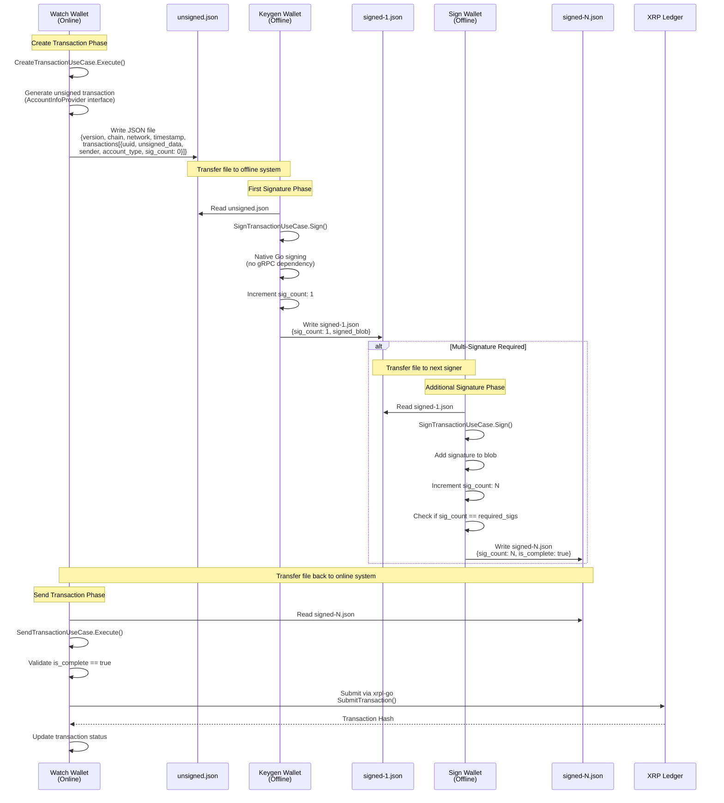

# Requirements Document

## Project Description (Input)

Align XRP transaction flow with Bitcoin patterns by introducing a JSON-based file format similar to BTC's PSBT (Partially Signed Bitcoin Transaction) concept for offline signing support. This refactoring modernizes the XRP transaction processing to match the architecture patterns used in Bitcoin operations.

**GitHub Issue:** #515 - [XRP Refactor] Phase 5: Transaction flow alignment

## Introduction

The current XRP transaction flow uses a simple text-based format that lacks structured metadata needed for offline multi-signature operations. This specification aligns the XRP transaction processing with the Bitcoin transaction patterns already established in the wallet system, introducing a JSON-based transaction file format that supports offline signing, multi-signature flows, and native Go signing without gRPC dependencies.

The refactoring maintains Clean Architecture principles with strict layer separation and improves the offline signing workflow by providing comprehensive transaction metadata throughout the transaction lifecycle (create → sign → send).

## Transaction Flow Overview

The following diagram illustrates the complete XRP transaction flow across the three wallet types (Watch, Keygen, Sign):

### Flow Phases

1. **Create Phase (Watch Wallet - Online)**
   - Input: Payment requests, transfer parameters, or deposit detection
   - Process: Generate unsigned transaction with comprehensive metadata
   - Output: JSON file with unsigned transaction data
   - Interface: `AccountInfoProvider` (minimal dependency)

2. **Sign Phase (Keygen/Sign Wallet - Offline)**
   - Input: Unsigned or partially signed JSON file
   - Process: Native Go signing, signature count tracking
   - Output: Signed JSON file with updated metadata
   - Interface: `TransactionSigner` (no gRPC dependency)
   - Supports: Sequential multi-signature workflow

3. **Send Phase (Watch Wallet - Online)**
   - Input: Fully signed JSON file
   - Process: Validate completion status, submit to ledger
   - Output: Transaction hash from XRP Ledger
   - Library: xrpl-go for submission

## Requirements

### Requirement 1: JSON Transaction File Format

**Objective:** As a wallet operator, I want XRP transactions to use a structured JSON file format, so that transaction metadata is preserved throughout the offline signing workflow.

#### Acceptance Criteria

1. When the watch wallet creates an unsigned transaction, the Transaction File Service shall generate a JSON file containing version, chain, network, creation timestamp, and transaction array
2. The Transaction File Service shall include the following fields for each transaction entry: UUID, unsigned transaction data, sender account address, sender account type, signature count, and required signature count
3. When the transaction file format is JSON, the Transaction File Service shall store files with `.json` extension
4. The Transaction File Service shall maintain version information in the format "1.0.0" for backward compatibility tracking
5. The Transaction File Service shall include chain identifier "XRP" and network type ("mainnet", "testnet") in transaction metadata

### Requirement 2: Create Transaction Use Case Refactoring

**Objective:** As a watch wallet operator, I want the create transaction use case to generate JSON-formatted transaction files using only required account information interfaces, so that the watch wallet maintains minimal dependencies for offline operations.

#### Acceptance Criteria

1. When the create transaction use case generates unsigned transactions, the XRP Create Transaction Use Case shall output transaction data in JSON format with comprehensive metadata
2. While interfacing with XRP blockchain services, the XRP Create Transaction Use Case shall depend on the `AccountInfoProvider` interface instead of the full `XRPer` interface
3. When the create transaction operation completes successfully, the XRP Create Transaction Use Case shall return the generated JSON file path
4. The XRP Create Transaction Use Case shall preserve all transaction details required for offline signing including account addresses, destination tags, amounts, and fee information
5. If the transaction creation fails at any step, then the XRP Create Transaction Use Case shall return a descriptive error with context wrapping

### Requirement 3: Sign Transaction Use Case Refactoring

**Objective:** As a keygen/sign wallet operator, I want the sign transaction use case to parse JSON transaction files and use native Go signing, so that offline signing operations are independent of gRPC services.

#### Acceptance Criteria

1. When the sign transaction use case receives a JSON transaction file, the XRP Sign Transaction Use Case shall parse the structured format to extract unsigned transaction data
2. While performing transaction signing, the XRP Sign Transaction Use Case shall use native Go signing implementation without gRPC dependencies
3. When processing multi-signature transactions, the XRP Sign Transaction Use Case shall track signature count and determine completion status based on required signatures
4. If a transaction already has sufficient signatures, then the XRP Sign Transaction Use Case shall skip re-signing and mark the transaction as complete
5. When signing completes, the XRP Sign Transaction Use Case shall output a signed transaction JSON file with updated signature count and signed transaction blob
6. The XRP Sign Transaction Use Case shall retrieve signing secrets from the XRP Account Key repository using sender account type and account address
7. When all required signatures are collected, the XRP Sign Transaction Use Case shall set the transaction status to complete in the output metadata

### Requirement 4: Send Transaction Use Case Refactoring

**Objective:** As a watch wallet operator, I want the send transaction use case to parse signed JSON files and submit transactions using xrpl-go, so that ledger submission uses the canonical XRP Ledger SDK.

#### Acceptance Criteria

1. When the send transaction use case receives a signed JSON transaction file, the XRP Send Transaction Use Case shall parse the file to extract signed transaction blobs
2. While submitting transactions to the XRP Ledger, the XRP Send Transaction Use Case shall use xrpl-go library for transaction submission
3. If a transaction in the file lacks sufficient signatures, then the XRP Send Transaction Use Case shall return an error indicating incomplete signing
4. When transaction submission succeeds, the XRP Send Transaction Use Case shall return the transaction hash from the XRP Ledger
5. If transaction submission fails due to network or validation errors, then the XRP Send Transaction Use Case shall return a descriptive error with the failure reason
6. The XRP Send Transaction Use Case shall validate that all transactions in the file are marked as complete before attempting submission

### Requirement 5: Offline Signing Support

**Objective:** As a security-conscious wallet operator, I want keygen and sign wallets to operate completely offline, so that private keys never touch network-connected systems.

#### Acceptance Criteria

1. When the keygen wallet performs signing operations, the XRP Sign Transaction Use Case shall complete all signing without requiring network connectivity
2. While the sign wallet processes transactions, the XRP Sign Transaction Use Case shall retrieve all required data from local database and transaction files
3. The XRP Create Transaction Use Case shall export all necessary transaction data in the JSON file for offline signing
4. The XRP Sign Transaction Use Case shall import transaction files created on online watch wallet
5. When signing completes, the XRP Sign Transaction Use Case shall export signed transaction files that can be transferred back to the watch wallet

### Requirement 6: Multi-Signature Flow Support

**Objective:** As a wallet operator using multi-signature accounts, I want the transaction flow to track and support sequential signing by multiple operators, so that multi-signature security policies are enforced.

#### Acceptance Criteria

1. When a transaction requires multiple signatures, the Transaction File Service shall track current signature count and required signature count in the JSON metadata
2. While processing partially signed transactions, the XRP Sign Transaction Use Case shall increment the signature count after adding each signature
3. If the signature count reaches the required threshold, then the XRP Sign Transaction Use Case shall mark the transaction as ready for submission
4. When a signer attempts to sign an already complete transaction, the XRP Sign Transaction Use Case shall validate the signature status and skip redundant signing
5. The Transaction File Service shall support sequential file naming for tracking signing progression (e.g., unsigned → signed-1 → signed-2 → signed-final)

### Requirement 7: Backward Compatibility and Migration

**Objective:** As a wallet operator with existing transaction files, I want the system to handle legacy text format during migration, so that in-flight transactions are not disrupted.

#### Acceptance Criteria

1. When the transaction file service detects a text-format transaction file, the Transaction File Service shall attempt to parse it using the legacy text parser
2. If JSON parsing fails on a transaction file, then the Transaction File Service shall fall back to text format parsing with a deprecation warning logged
3. When new transactions are created, the Transaction File Service shall always use JSON format
4. The Transaction File Service shall log a warning when processing legacy text format files indicating format deprecation
5. Where the system supports both formats, the system shall prioritize JSON format for all new transaction operations

### Requirement 8: Testing and Validation

**Objective:** As a developer, I want comprehensive test coverage for the XRP transaction flow refactoring, so that the implementation is verified to work correctly.

#### Acceptance Criteria

1. When unit tests are executed, the test suite shall verify JSON serialization and deserialization of transaction files
2. While testing signing operations, the test suite shall validate native Go signing produces correct transaction blobs
3. When integration tests run, the test suite shall verify the full transaction flow from creation to submission
4. The test suite shall validate multi-signature scenarios with multiple sequential signing operations
5. When linting is executed, the code shall pass all configured linters without errors
6. The test suite shall verify backward compatibility with legacy text format transaction files

### Requirement 9: Port Interface Segregation

**Objective:** As a developer, I want use cases to depend on minimal interface subsets, so that dependencies are clear and follow Interface Segregation Principle.

#### Acceptance Criteria

1. When defining XRP API dependencies, the XRP Create Transaction Use Case shall define and use an `AccountInfoProvider` interface containing only required methods
2. While refactoring use case dependencies, the XRP Sign Transaction Use Case shall define and use a `TransactionSigner` interface containing only signing-related methods
3. The `AccountInfoProvider` interface shall exclude transaction signing and submission methods
4. The `TransactionSigner` interface shall exclude account information and balance checking methods
5. Where full XRP API access is needed, the implementation shall pass types that implement multiple segregated interfaces

### Requirement 10: Error Handling and Logging

**Objective:** As a wallet operator, I want descriptive errors and comprehensive logging, so that transaction processing issues can be quickly diagnosed and resolved.

#### Acceptance Criteria

1. When any use case operation fails, the use case shall return errors wrapped with operation context using `fmt.Errorf("context: %w", err)`
2. While processing transactions, the system shall log transaction UUIDs, account addresses, and operation steps at DEBUG level
3. If file parsing fails, then the system shall log the file path and error details at ERROR level
4. When transactions are successfully signed, the system shall log the signature count and completion status
5. If secret retrieval fails, then the system shall return an error without logging the secret value (security requirement)
6. The system shall never log private keys, secrets, or sensitive cryptographic material at any log level
