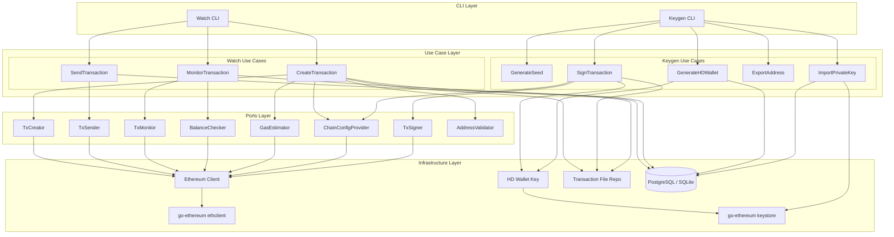
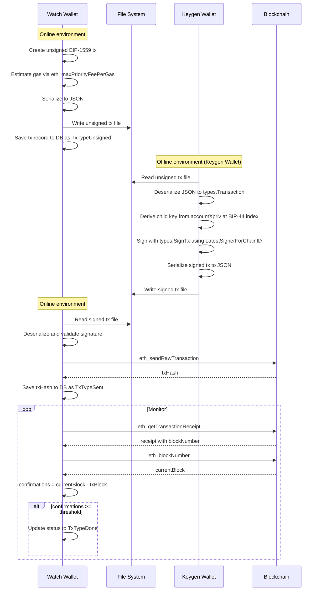
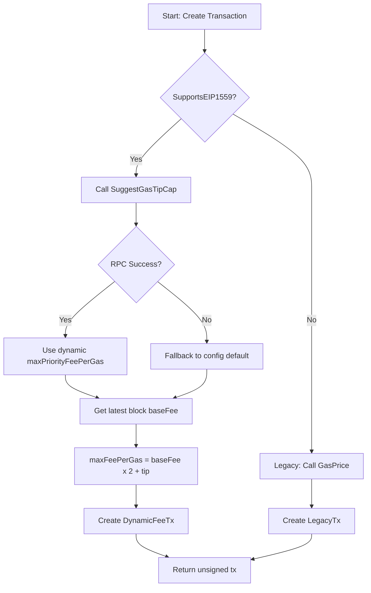

# Design Document: ETH Transaction Flow Alignment

## Overview

**Purpose**: This feature modernizes the Ethereum transaction flow to match the maturity of the BTC implementation, delivering offline signing capability, EIP-1559 transaction support, and Clean Architecture compliance.

**Users**: Wallet operators use the three-wallet system (Watch/Keygen/Sign) to create, sign, and broadcast ETH transactions with air-gapped key security.

**Impact**: Transforms the ETH Sign wallet from non-functional stubs to a fully operational offline signing component, replaces legacy transaction format with EIP-1559 as default, ~~decomposes the monolithic `Ethereumer` interface into ISP-compliant ports~~ **[Done PR #575: ISP-compliant port interfaces added to `interface.go`; `Ethereumer` retained for DI layer only]**, and migrates to Anvil as the development node.

### Goals

- Make the ETH Sign wallet fully functional for offline transaction signing
- Default to EIP-1559 (Type 2) transactions with dynamic fee estimation
- Achieve Clean Architecture compliance across all ETH use cases
- Align the file-based transaction exchange flow (Watch → Sign → Watch) with BTC patterns
- Support Anvil as the primary development node

### Non-Goals

- Multisig / Safe smart contract wallet support (separate spec)
- ERC-20 token EIP-1559 support (future enhancement)
- EIP-4844 blob transaction support
- Cross-chain transaction coordination

## Architecture

> Discovery findings captured in `research.md`. Key decisions restated here.

### Existing Architecture Analysis

The ETH implementation follows a layered architecture matching the BTC side:

```
CLI Layer (interface-adapters/wallet/eth/)
  → Use Case Layer (application/usecase/{watch,keygen,sign}/eth/)
    → Port Interfaces (application/ports/api/eth/)
      → Infrastructure (infrastructure/api/eth/eth/)
```

**Current constraints** (as of PR #575):

- ~~Port interfaces exist but the monolithic `Ethereumer` (80+ methods) violates ISP~~ — **Resolved (PR #575)**: ISP-compliant focused interfaces added; `Ethereumer` restricted to DI layer only
- Keygen/sign use cases still import `apiethimpl` (infrastructure) for the hardcoded `Password` constant — resolved by Task 10.3
- Sign wallet adapter has all methods as stubs
- Transaction encoding uses RLP which breaks with EIP-2718 typed transactions

### Architecture Pattern & Boundary Map

> Full first-class documentation: [docs/chains/eth/architecture.md](../../../docs/chains/eth/architecture.md)
>
> **ETH is single-sig EOA only. The Sign Wallet is not required.**
> Keygen Wallet owns both key generation and transaction signing.
> This mirrors the BTC Keygen wallet pattern (see `internal/application/usecase/keygen/btc/sign_transaction.go`).



**Architecture Integration**:

- Selected pattern: Clean Architecture with ISP-compliant port interfaces (mirrors BTC)
- Domain boundaries: Watch (online, creates/broadcasts), Keygen (offline, key generation **and signing**)
- Sign Wallet: not required for ETH single-sig — omitted from this diagram
- Keygen `SignTransaction` mirrors `internal/application/usecase/keygen/btc/sign_transaction.go` — same offline pattern, different transaction format (JSON/EIP-2718 vs PSBT)
- Existing patterns preserved: Three-wallet separation, file-based exchange, domain/infrastructure type conversion via DTOs
- New components: ETH-specific small port interfaces, JSON transaction file format, offline signer
- Steering compliance: Dependency rule (use cases depend only on ports), ISP, DIP

### Technology Stack

| Layer | Choice / Version | Role in Feature | Notes |
|-------|------------------|-----------------|-------|
| Backend | Go 1.25+ | All wallet components | Matches existing |
| Blockchain Client | go-ethereum v1.17.0 | RPC, types, signing | Already in go.mod |
| Key Derivation | btcsuite/hdkeychain + go-bip39 | BIP-44 HD wallet | Already in go.mod |
| Dev Node | Foundry Anvil | Local ETH testing | Replaces Geth devnet |
| Data | PostgreSQL, MySQL, SQLite | Transaction/key storage | PostgreSQL is new addition |
| File Format | JSON | Transaction file exchange | Human-readable, debuggable |

## System Flows

### ETH Transaction Lifecycle (Watch → Keygen → Watch)

> ETH uses single-sig EOA only. The Sign Wallet is **not required**.
> Only Watch Wallet (online) and Keygen Wallet (offline) participate.



### EIP-1559 Fee Estimation Flow



## Requirements Traceability

| Requirement | Summary | Components | Interfaces | Flows |
|-------------|---------|------------|------------|-------|
| 1.1 | Keygen wallet deserializes and signs | ETHKeygenSignTxUseCase, TxFileRepo | TxFileSigner | Tx Lifecycle |
| 1.2 | BIP-44 child key derivation | ETHKeygenSignTxUseCase, HDWallet | KeyDeriver | Tx Lifecycle |
| 1.3 | Missing key error | ETHKeygenSignTxUseCase | KeyDeriver | - |
| 1.4 | Offline operation | ETHKeygenSignTxUseCase | - | Tx Lifecycle |
| 1.5 | DI wiring (Keygen) | DI Container | - | - |
| 2.1 | DynamicFeeTx construction | EthereumClient | TxCreator, GasEstimator | Fee Estimation |
| 2.2 | Legacy fallback | EthereumClient | TxCreator | Fee Estimation |
| 2.3 | Dynamic fee estimation | EthereumClient | GasEstimator | Fee Estimation |
| 2.4 | LatestSignerForChainID | ETHKeygenSignTxUseCase, EthereumClient | TxSigner | Tx Lifecycle |
| 2.5 | Tx type in file format | TxFileRepo | TxFileFormat | Tx Lifecycle |
| 3.1 | Anvil endpoint config | Config | ChainConfigProvider | - |
| 3.2 | Anvil key import | KeygenUseCase | - | - |
| 3.3 | Deprecated network replacement | Config | ChainConfigProvider | - |
| 3.4 | Anvil startup docs | Documentation | - | - |
| 3.5 | Standard JSON-RPC | EthereumClient | - | - |
| 4.1 | BIP-39/BIP-44 key gen | KeygenUseCase, HDWallet | KeyDeriver | - |
| 4.2 | Store accountXpriv | KeygenUseCase | KeyRepository | - |
| 4.3 | Export full pubkeys | ExportFullPubkeyUseCase | PubkeyFileRepo | - |
| 4.4 | Keccak-256 address derivation | ETHKeyStrategy | KeyDeriver | - |
| 4.5 | No plaintext private keys | All key components | - | - |
| 4.6 | Entropy failure handling | KeygenUseCase | - | - |
| 5.1 | Port-only imports | All ETH use cases | All ETH ports | - |
| 5.2 | ISP interface decomposition | ETH Port Interfaces | All small interfaces | - |
| 5.3 | Remove deprecated interfaces | Cleanup | - | - |
| 5.4 | Configurable password | Config, DI | - | - |
| 5.5 | Port-level DTOs | ETH Ports | TxCreateParams | - |
| 6.1 | Unsigned tx serialization | TxFileRepo | TxFileFormat | Tx Lifecycle |
| 6.2 | Signed tx file production | TxFileRepo | TxFileFormat | Tx Lifecycle |
| 6.3 | Broadcast from signed file | SendTxUseCase | TxSender | Tx Lifecycle |
| 6.4 | JSON encoding | TxFileRepo | TxFileFormat | - |
| 6.5 | Parse error handling | TxFileRepo | TxFileFormat | - |
| 7.1 | PostgreSQL support | Config, DB layer | - | - |
| 7.2 | Network type definitions | Config | ChainConfigProvider | - |
| 7.3 | EIP-1559 fee config | Config | - | - |
| 7.4 | Chain ID per network | Config | ChainConfigProvider | - |
| 7.5 | Deprecated network error | Config | - | - |
| 8.1 | Confirmation tracking | MonitorTxUseCase | TxMonitor | Tx Lifecycle |
| 8.2 | TxTypeDone update | MonitorTxUseCase | TxMonitor | Tx Lifecycle |
| 8.3 | Failed tx detection | MonitorTxUseCase | TxMonitor | - |
| 8.4 | is_allocated update | MonitorTxUseCase | - | - |
| 8.5 | Retry with backoff | MonitorTxUseCase | TxMonitor | - |
| 9.1 | Anvil + Geth node_type config | Config, EthereumClient | ChainConfigProvider | - |
| 9.2 | Node-agnostic use cases | All ETH use cases | All ETH ports | - |
| 9.3 | Docker Compose node profiles | docker-compose.yml | - | - |
| 9.4 | Docker Compose multi-DB | docker-compose.yml | - | - |
| 9.5 | E2E script | scripts/operation/eth/e2e/ | - | - |
| 9.6 | E2E node-switchable | scripts/operation/eth/e2e/ | - | - |

## Components and Interfaces

| Component | Domain/Layer | Intent | Req Coverage | Key Dependencies | Contracts |
|-----------|--------------|--------|--------------|-----------------|-----------|
| ETH Small Port Interfaces | Ports | ISP-compliant blockchain API ports | 5.1, 5.2 | - | Service |
| ETHKeygenSignTransactionUseCase | Use Case / Keygen | Offline transaction signing | 1.1-1.5, 2.4 | KeyDeriver (P0), TxFileRepo (P0) | Service |
| ETHCreateTransactionUseCase | Use Case / Watch | Create unsigned EIP-1559 transactions | 2.1-2.3, 6.1 | TxCreator (P0), GasEstimator (P0) | Service |
| ETHSendTransactionUseCase | Use Case / Watch | Broadcast signed transactions | 6.3 | TxSender (P0), TxFileRepo (P0) | Service |
| ETHMonitorTransactionUseCase | Use Case / Watch | Track confirmations and status | 8.1-8.5 | TxMonitor (P0) | Service |
| ETHExportFullPubkeyUseCase | Use Case / Keygen | Export account-level xpub for Watch | 4.3 | HDWallet (P0), PubkeyFileRepo (P1) | Service |
| ETHTransactionFileRepo | Infrastructure / File | JSON transaction file I/O | 6.1-6.5, 2.5 | FileSystem (P0) | Service |
| EthereumClient | Infrastructure / API | Blockchain RPC operations (Anvil or Geth) | 2.1-2.3, 3.1, 3.5, 9.1, 9.2 | ethclient (P0) | Service |
| Config / NetworkType | Config | ETH network, fee, and node-type configuration | 3.1-3.3, 7.1-7.5, 9.1 | - | State |
| E2E Scripts | Scripts / Verification | Full flow operational verification | 9.5, 9.6 | - | - |

### Ports Layer

#### ETH Small Port Interfaces

| Field | Detail |
|-------|--------|
| Intent | Decompose monolithic `Ethereumer` into focused, ISP-compliant interfaces |
| Requirements | 5.1, 5.2 |

**Responsibilities & Constraints**

- ~~Define minimal interfaces at `internal/application/ports/api/eth/interfaces_small.go`~~ — **Done (PR #575)**: interfaces added directly to `internal/application/ports/api/eth/interface.go`
- ETH uses a single `interface.go` file (not a separate `interfaces_small.go` like BTC)
- `Ethereumer` preserved with DI-layer-only usage restriction comment
- Each interface covers a single capability area

**Contracts**: Service [x]

##### Service Interface

> **Status (PR #575)**: Partial implementation complete. The following ISP interfaces have been added to `internal/application/ports/api/eth/interface.go`:
>
> - `ETHLifecycle` (`Close`, `CoinTypeCode`), `ETHKeyAccessor` (`GetKeyDir`, `ToECDSA`), `ETHTransactionSigner` (`SignOnRawTransaction`), `ETHTransactionSender` (`SendSignedRawTransaction`), `ETHRawKeyImporter` (`ImportRawKey`), `ETHNodeAPIClient` (`ClientVersion`, `NetVersion`, `NodeInfo`, `Syncing`)
> - Composed: `ETHKeygenSignClient` (`ETHLifecycle` + `ETHRawKeyImporter`), `ETHWatchClient` (`ETHLifecycle` + `ETHNodeAPIClient`)
>
> The interfaces below (`ChainConfigProvider`, `TxCreator`, `GasEstimator`, `TxSigner`, `TxMonitor`, `AddressValidator`, etc.) are still required for the EIP-1559 transaction flow (Tasks 7, 9) and have not yet been implemented. File path will be `interface.go`, not `interfaces_small.go`.

```go
// internal/application/ports/api/eth/interface.go

// ChainConfigProvider provides chain configuration
type ChainConfigProvider interface {
    CoinTypeCode() domainCoin.CoinTypeCode
    GetChainConf() *chaincfg.Params
}

// BalanceChecker retrieves account balances
type BalanceChecker interface {
    GetTotalBalance(ctx context.Context, addrs []string) (*big.Int, error)
    BalanceAt(ctx context.Context, addr string) (*big.Int, error)
}

// TxCreator creates unsigned transactions
type TxCreator interface {
    CreateRawTransaction(ctx context.Context, fromAddr, toAddr string, amount uint64, additionalNonce int) (*domainEthereum.RawTx, *TxCreateParams, error)
    CreateRawTransactionEIP1559(ctx context.Context, fromAddr, toAddr string, amount uint64, additionalNonce int) (*domainEthereum.RawTx, *TxCreateParams, error)
    SupportsEIP1559(ctx context.Context) bool
}

// GasEstimator estimates gas and fees
type GasEstimator interface {
    GasPrice(ctx context.Context) (*big.Int, error)
    EstimateGas(ctx context.Context, from, to string, value *big.Int) (uint64, error)
    SuggestGasTipCap(ctx context.Context) (*big.Int, error)
}

// TxSigner signs raw transactions offline
type TxSigner interface {
    SignOnRawTransaction(rawTx *domainEthereum.RawTx, privKey *ecdsa.PrivateKey, chainID *big.Int) (*domainEthereum.RawTx, error)
}

// TxSender broadcasts signed transactions
type TxSender interface {
    SendSignedRawTransaction(ctx context.Context, signedTxHex string) (string, error)
}

// TxMonitor retrieves transaction status
type TxMonitor interface {
    GetTransactionReceipt(ctx context.Context, txHash string) (*domainEthereum.TransactionReceipt, error)
    GetConfirmation(ctx context.Context, txHash string) (uint64, error)
}

// AddressValidator validates Ethereum addresses
type AddressValidator interface {
    ValidateAddr(addr string) error
}

// Composed interfaces for use cases
type WatchTxCreationDeps interface {
    ChainConfigProvider
    TxCreator
    GasEstimator
    AddressValidator
}

// KeygenSignTxDeps is used by the Keygen wallet's SignTransaction use case
// (ETH is single-sig; there is no Sign wallet)
type KeygenSignTxDeps interface {
    ChainConfigProvider
    TxSigner
}
```

- Preconditions: Existing `Ethereumer` implementation must satisfy all small interfaces (Go implicit satisfaction)
- Postconditions: All ETH use cases import only from `internal/application/ports/api/eth`
- Invariants: Small interfaces are subsets of `Ethereumer`

**Implementation Notes**

- Go's implicit interface satisfaction means the existing `Ethereum` struct automatically satisfies these interfaces without code changes
- The `TxSigner` interface changes signature to accept `*ecdsa.PrivateKey` instead of using keystore password; this enables true offline signing without node dependency
- Deprecation markers on old interfaces guide migration

### Use Case Layer / Keygen

#### ETHKeygenSignTransactionUseCase

| Field | Detail |
|-------|--------|
| Intent | Sign unsigned ETH transactions offline using HD-derived private keys (Keygen Wallet only — ETH is single-sig) |
| Requirements | 1.1, 1.2, 1.3, 1.4, 1.5, 2.4 |

**Responsibilities & Constraints**

- Read unsigned transaction JSON file from file system
- Derive child private key from `accountXpriv` at BIP-44 path `m/44'/60'/0'/0/x`
- Sign transaction using `types.SignTx` with `LatestSignerForChainID(chainID)`
- Write signed transaction JSON file
- Operate fully offline (no RPC, no network)

**Dependencies**

- Inbound: KeygenCLI — invokes signing (P0)
- Outbound: TxFileRepo — read/write transaction files (P0)
- Outbound: AccountKeyRepo — retrieve `accountXpriv` (P0)
- External: hdkeychain — BIP-32 key derivation (P0)
- External: go-ethereum/types — transaction signing (P0)

**Contracts**: Service [x]

##### Service Interface

```go
// Current implementation (PR #575) — uses ETHTransactionSigner directly
// apieth.ChainConfigProvider does not exist yet; added when Task 2.1b is done

type signTransactionUseCase struct {
    eth        apieth.ETHTransactionSigner  // signs raw transactions; not ChainConfigProvider yet
    accountKeyRepo repocold.ETHAccountKeyRepositorier
    txFileRepo     file.TransactionFileRepositorier
    wtype          domainWallet.WalletType
}

// Target implementation (after Task 2.1b):
// type signTxETHClient interface {
//     apieth.ChainConfigProvider
//     apieth.TxSigner
// }

// SignTransactionInput contains the path to the unsigned transaction file
type SignTransactionInput struct {
    FilePath string
}

// SignTransactionOutput contains signing result
type SignTransactionOutput struct {
    SignedFilePath string
    TxHash        string
}

func (u *signTransactionUseCase) Sign(ctx context.Context, input SignTransactionInput) (*SignTransactionOutput, error)
```

- Preconditions: Unsigned transaction file exists; `accountXpriv` stored in DB for the transaction's account index
- Postconditions: Signed transaction file written; original unsigned file unchanged
- Invariants: Private key never leaves memory; no network calls made

**Implementation Notes**

- Uses `types.LatestSignerForChainID(chainID)` not `NewLondonSigner` (forward compatibility, see `research.md`)
- Detects transaction type from deserialized `types.Transaction.Type()` to select correct signing approach
- Key derivation reuses existing `internal/infrastructure/wallet/key/` infrastructure

### Use Case Layer / Watch

#### ETHCreateTransactionUseCase

| Field | Detail |
|-------|--------|
| Intent | Create unsigned EIP-1559 transactions with dynamic fee estimation |
| Requirements | 2.1, 2.2, 2.3, 2.5, 6.1 |

**Responsibilities & Constraints**

- Check EIP-1559 support; fall back to legacy if unsupported
- Estimate fees dynamically via `SuggestGasTipCap()` with config fallback
- Serialize unsigned transaction to JSON file
- Save transaction record to database as `TxTypeUnsigned`

**Dependencies**

- Inbound: WatchCLI — triggers transaction creation (P0)
- Outbound: TxCreator port — creates raw transaction (P0)
- Outbound: GasEstimator port — fee estimation (P0)
- Outbound: TxFileRepo — writes transaction file (P0)
- Outbound: TxRepository — persists to database (P0)

**Contracts**: Service [x]

##### Service Interface

```go
type createTxETHClient interface {
    apieth.ChainConfigProvider
    apieth.TxCreator
    apieth.GasEstimator
    apieth.AddressValidator
}
```

- Preconditions: Ethereum node reachable; sender account has sufficient balance
- Postconditions: Unsigned transaction file written; DB record created
- Invariants: Transaction nonce is unique per sender address

#### ETHMonitorTransactionUseCase

| Field | Detail |
|-------|--------|
| Intent | Track transaction confirmations and update status |
| Requirements | 8.1, 8.2, 8.3, 8.4, 8.5 |

**Responsibilities & Constraints**

- Query transaction receipt for sent transactions
- Compare confirmation count against configured threshold
- Update status: `TxTypeSent` → `TxTypeDone` when confirmed
- Detect failed/reverted transactions and log revert reason
- Retry with exponential backoff on node connectivity failures
- Update `is_allocated` in `account_pubkey_table` after successful send

**Dependencies**

- Inbound: WatchCLI — triggers monitoring (P0)
- Outbound: TxMonitor port — queries blockchain (P0)
- Outbound: TxRepository — updates status (P0)
- Outbound: AccountPubkeyRepository — updates allocation (P1)

**Contracts**: Service [x]

##### Service Interface

```go
type monitorTxETHClient interface {
    apieth.ChainConfigProvider
    apieth.TxMonitor
    apieth.BalanceChecker
}
```

- Preconditions: Transactions with `TxTypeSent` status exist in database
- Postconditions: Transaction statuses updated; `is_allocated` flags updated for completed sends
- Invariants: Status transitions are monotonic (sent → done → notified)

### Infrastructure Layer

#### ETHTransactionFileRepo

| Field | Detail |
|-------|--------|
| Intent | Serialize/deserialize ETH transactions as JSON files for air-gapped exchange |
| Requirements | 6.1, 6.2, 6.3, 6.4, 6.5, 2.5 |

**Responsibilities & Constraints**

- Write unsigned/signed transactions as JSON with `.json` extension
- Follow BTC naming convention: `{action}_{txID}_{type}_{signedCount}_{timestamp}.json`
- Parse and validate transaction file metadata from filename
- Return descriptive errors for malformed files

**Contracts**: Service [x]

##### Service Interface

```go
// ETHTransactionFile is the JSON file structure
type ETHTransactionFile struct {
    Version     int    `json:"version"`
    TxType      string `json:"tx_type"`       // "unsigned" or "signed"
    EthTxType   uint8  `json:"eth_tx_type"`   // 0=legacy, 2=EIP-1559
    ChainID     uint64 `json:"chain_id"`
    Nonce       uint64 `json:"nonce"`
    From        string `json:"from"`
    To          string `json:"to"`
    Value       string `json:"value"`          // Wei as decimal string
    Gas         uint64 `json:"gas"`
    // Legacy fields
    GasPrice    string `json:"gas_price,omitempty"`
    // EIP-1559 fields
    MaxFeePerGas         string `json:"max_fee_per_gas,omitempty"`
    MaxPriorityFeePerGas string `json:"max_priority_fee_per_gas,omitempty"`
    Data        string `json:"data,omitempty"` // Hex-encoded input data
    // Signed transaction
    RawTxHex    string `json:"raw_tx_hex"`     // MarshalBinary hex of types.Transaction
    SignedTxHex string `json:"signed_tx_hex,omitempty"` // MarshalBinary hex when signed
}

func WriteETHTxFile(path string, txFile *ETHTransactionFile) (string, error)
func ReadETHTxFile(path string) (*ETHTransactionFile, error)
```

- Preconditions: Parent directory exists; file path follows naming convention
- Postconditions: Valid JSON file written with all required fields
- Invariants: `RawTxHex` always present; `SignedTxHex` present only when `tx_type == "signed"`

**Implementation Notes**

- `RawTxHex` uses `tx.MarshalBinary()` (not RLP) for correct EIP-2718 envelope handling
- `Version` field enables future format evolution
- Existing `TransactionFileRepositorier` interface extended with ETH-specific methods

#### EthereumClient Updates

| Field | Detail |
|-------|--------|
| Intent | Update existing client for EIP-1559 dynamic fees and correct transaction encoding |
| Requirements | 2.1, 2.2, 2.3, 2.4, 3.1, 3.5 |

**Key Changes**:

1. **Fee estimation**: Add `SuggestGasTipCap()` wrapper method that calls `ethClient.SuggestGasTipCap(ctx)` with fallback to config
2. **Signer**: Replace `types.NewLondonSigner(chainID)` with `types.LatestSignerForChainID(chainID)`
3. **Encoding**: Replace `rlp.EncodeToBytes`/`rlp.Decode` with `MarshalBinary`/`UnmarshalBinary` in `ethtx.go`
4. **Offline signing**: New `SignOnRawTransaction` variant that accepts `*ecdsa.PrivateKey` directly instead of using keystore password

### Config Layer

#### Configuration and Network Updates

| Field | Detail |
|-------|--------|
| Intent | Modernize ETH configuration with current networks, node-type selection, and PostgreSQL support |
| Requirements | 3.1, 3.2, 3.3, 7.1, 7.2, 7.3, 7.4, 7.5, 9.1, 9.2 |

**Key Changes**:

```go
// Updated Ethereum config structure
type Ethereum struct {
    Host                 string
    Port                 int
    DisableTLS           bool
    NetworkType          EthNetworkType   // mainnet, sepolia, holesky, local
    NodeType             EthNodeType      // New: "anvil" or "geth"
    KeyDirName           string
    ConfirmationNum      uint64
    ChainID              uint64           // New: explicit chain ID
    ERC20Token           domainCoin.ERC20Token
    ERC20s               map[domainCoin.ERC20Token]ERC20
    MaxPriorityFeePerGas uint64           // Gwei; ceiling for dynamic estimation
    MaxFeePerGasCap      uint64           // New: Gwei; absolute fee ceiling
    KeystorePassword     string           // New: replaces hardcoded Password constant
}

// EthNetworkType defines supported networks
type EthNetworkType string
const (
    EthNetworkMainnet EthNetworkType = "mainnet"   // Chain ID 1
    EthNetworkSepolia EthNetworkType = "sepolia"   // Chain ID 11155111
    EthNetworkHolesky EthNetworkType = "holesky"   // Chain ID 17000
    EthNetworkLocal   EthNetworkType = "local"     // Chain ID 31337 (Anvil default) / 1337 (Geth devnet)
)

// EthNodeType selects the Ethereum node implementation
type EthNodeType string
const (
    EthNodeAnvil EthNodeType = "anvil"  // Foundry Anvil (https://getfoundry.sh/anvil)
    EthNodeGeth  EthNodeType = "geth"   // go-ethereum Geth (https://github.com/ethereum/go-ethereum)
)
```

**Contracts**: State [x]

- Remove deprecated network references (Goerli, Rinkeby, Ropsten)
- Validate network type on load; return error listing supported networks for unknown values
- `ChainID` auto-populated from `NetworkType` if not explicitly set
- `NodeType` controls node-specific behavior (key import method, RPC quirks); defaults to `anvil`
- Both node types use standard `eth_*` JSON-RPC — no node-specific logic in use cases

### Deployment Layer

#### Docker Compose and E2E Scripts

| Field | Detail |
|-------|--------|
| Intent | Support both Anvil and Geth via Docker Compose profiles; provide E2E verification scripts |
| Requirements | 9.3, 9.4, 9.5, 9.6 |

**Docker Compose Design**:

- Separate service profiles: `--profile anvil` and `--profile geth`
- Both profiles share the same Watch/Keygen wallet service definitions
- Multiple database backends (PostgreSQL, MySQL, SQLite) consistent with BTC/BCH compose structure
- Example profile structure:

```yaml
services:
  anvil:
    image: ghcr.io/foundry-rs/foundry:latest
    profiles: [anvil]
    ...
  geth:
    image: ethereum/client-go:stable
    profiles: [geth]
    ...
  postgres:
    profiles: [anvil, geth]
    ...
```

**E2E Script Design** (`scripts/operation/eth/e2e/`):

- Mirrors BTC/BCH E2E script structure at `scripts/operation/btc/e2e/`
- Covers the full single-sig flow: keygen → export address → watch import → create tx → keygen sign → watch send → monitor
- Accepts `NODE_TYPE=anvil|geth` as environment variable for node selection
- Individual scripts per operation pattern (consistent with BTC e2e patterns 1–11)

## Data Models

### Domain Model

**ETH Transaction File** (new value object):

| Field | Type | Description |
|-------|------|-------------|
| Version | int | File format version (1) |
| TxType | string | "unsigned" or "signed" |
| EthTxType | uint8 | 0=legacy, 2=EIP-1559 |
| ChainID | uint64 | EIP-155 chain identifier |
| Nonce | uint64 | Sender transaction count |
| From | string | Sender address |
| To | string | Recipient address |
| Value | string | Wei amount as decimal string |
| Gas | uint64 | Gas limit |
| GasPrice | string | Legacy gas price (Wei) |
| MaxFeePerGas | string | EIP-1559 max fee (Wei) |
| MaxPriorityFeePerGas | string | EIP-1559 priority fee (Wei) |
| Data | string | Hex-encoded call data |
| RawTxHex | string | Binary-encoded transaction |
| SignedTxHex | string | Binary-encoded signed tx |

**Existing tables used** (no schema changes required):

- `eth_detail_tx`: Transaction records with status tracking
- `account_pubkey_table`: Public key and allocation tracking
- `auth_account_key_table`: Extended private keys for signing

### Data Contracts & Integration

**Transaction File JSON Schema**:

```json
{
  "version": 1,
  "tx_type": "unsigned",
  "eth_tx_type": 2,
  "chain_id": 1,
  "nonce": 42,
  "from": "0x742d35Cc6634C0532925a3b844Bc9e7595f0bEb",
  "to": "0x1234567890abcdef1234567890abcdef12345678",
  "value": "1000000000000000000",
  "gas": 21000,
  "max_fee_per_gas": "30000000000",
  "max_priority_fee_per_gas": "2000000000",
  "data": "",
  "raw_tx_hex": "0x02f86c..."
}
```

## Error Handling

### Error Strategy

Errors follow the existing domain error patterns with typed errors for each failure mode.

### Error Categories and Responses

**User Errors**:

- Invalid transaction file path → descriptive parse error (6.5)
- Missing key for account index → error identifying missing index (1.3)
- Unsupported network name → error listing supported networks (7.5)

**System Errors**:

- Node unreachable during monitoring → exponential backoff retry (8.5)
- `SuggestGasTipCap` failure → fallback to config default (2.3)
- EIP-1559 unsupported → fallback to legacy transaction (2.2)

**Business Logic Errors**:

- Insufficient entropy for key generation → error without partial key material (4.6)
- Failed/reverted transaction → update status with revert reason (8.3)

### Monitoring

- Transaction status transitions logged at INFO level
- Node connectivity issues logged at WARN level with retry count
- Signing operations logged at INFO level (without any key material)
- Fee estimation values logged at DEBUG level for troubleshooting

## Testing Strategy

### Unit Tests

- `ETHSignTransactionUseCase`: Sign unsigned tx file → verify signed output with correct signature
- `ETHSignTransactionUseCase`: Missing key index → verify descriptive error returned
- `ETHTransactionFileRepo`: Write/read roundtrip for both legacy and EIP-1559 JSON formats
- `GasEstimator`: Dynamic fee estimation with fallback to config on RPC failure
- `Config`: Validate network type → error for deprecated networks

### Integration Tests

- Watch → Sign → Watch file exchange: create unsigned file, sign offline, broadcast
- EIP-1559 transaction creation against Anvil node
- Legacy fallback: verify `CreateRawTransaction` used when `SupportsEIP1559` returns false
- Key generation → export pubkey → import to Sign wallet → sign transaction
- Monitor transaction confirmation against Anvil (mine blocks, verify status update)

### E2E Tests

- Full deposit flow: Watch creates tx → Sign signs → Watch broadcasts → Monitor confirms
- Full payment flow with EIP-1559 fees against Anvil
- Key generation with BIP-44 derivation → address matches expected

## Security Considerations

- Private keys exist only in memory during signing; never written to disk or logs (4.5)
- Sign wallet operates fully offline with no network access (1.4)
- Hardcoded `Password = "password"` replaced with configurable secret (5.4)
- Transaction files do not contain private keys; only public addresses and encoded transactions
- BIP-44 derivation uses hardened paths for purpose and coin type indices
- Chain ID included in all EIP-1559 transactions for EIP-155 replay protection (7.4)
