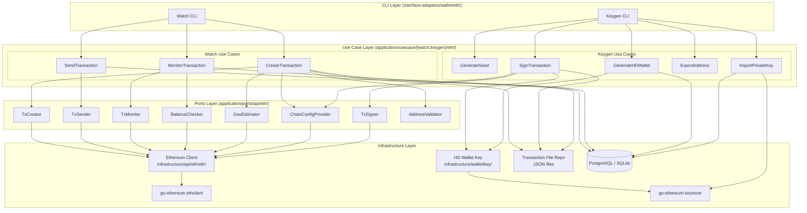

# Ethereum (ETH) Wallet Architecture

This document is the authoritative reference for the ETH module's wallet architecture within go-crypto-wallet's Clean Architecture + 3-wallet security model (Watch / Keygen / Sign).

It covers:

- **Wallet role assignment**: which wallets are required for ETH and why
- **Clean Architecture boundary map**: use case, port, and infrastructure boundaries per wallet
- **Use case assignments**: which wallet owns which use cases
- **Key differences from BTC**: single-sig, account model, EIP-1559

> **Related documents:**
> - Chain-agnostic 3-wallet flow: [docs/transaction-flow.md](../../transaction-flow.md)
> - ETH protocol specifications: [docs/chains/eth/README.md](./README.md)
> - BTC reference implementation: [docs/chains/btc/README.md](../btc/README.md)

---

## 1. Wallet Roles for ETH

ETH uses single-sig EOA (Externally Owned Account) only. There is no protocol-level multisig for EOA accounts.

| Wallet | Environment | Required for ETH? | Responsibilities |
|--------|-------------|-------------------|-----------------|
| **Watch** | Online | Always | Create unsigned transactions, broadcast signed transactions, monitor confirmations |
| **Keygen** | Offline (air-gapped) | Always | Generate HD keys, manage keystore, **sign transactions** |
| **Sign** | Offline (air-gapped) | **Not required** | Multisig additional signatures — not applicable for single-sig ETH EOA |

> The Sign Wallet is used only for multisig workflows (e.g., BTC P2WSH, XRP multisig). For ETH, the Keygen Wallet performs all signing.

---

## 2. Use Case Assignments per Wallet

### Watch Wallet

| Use Case | Responsibility |
|----------|---------------|
| `CreateTransaction` | Build unsigned EIP-1559 (or legacy) transaction; write to JSON file; save record to DB |
| `SendTransaction` | Read signed JSON file; broadcast via `eth_sendRawTransaction` |
| `MonitorTransaction` | Poll receipt; track confirmation count; update status in DB |

### Keygen Wallet

| Use Case | Responsibility |
|----------|---------------|
| `GenerateSeed` | Generate BIP-39 mnemonic; store encrypted seed |
| `GenerateHDWallet` | Derive BIP-44 keys at `m/44'/60'/account'/0/i`; store in DB |
| `ImportPrivateKey` | Import ECDSA key into local keystore (scrypt-encrypted) |
| `ExportAddress` | Export public addresses to file for Watch Wallet import |
| **`SignTransaction`** | **Read unsigned JSON file; derive child key from xpriv; sign with `LatestSignerForChainID`; write signed JSON file** |

### Sign Wallet

Not used for ETH single-sig. Defined in codebase for structural consistency only.

---

## 3. Architecture Boundary Map

The diagram below shows the complete dependency graph across all layers for the ETH implementation. Read it as: each node depends only on nodes in layers below it (Clean Architecture dependency rule).



---

## 4. Port Interface Responsibilities

The `Ethereumer` monolithic interface is decomposed into focused ISP-compliant ports. Each use case declares only the interface it needs.

| Port | Methods | Used By |
|------|---------|---------|
| `ChainConfigProvider` | `CoinTypeCode()`, `GetChainConf()` | CreateTx, KeygenSignTx |
| `TxCreator` | `CreateRawTransaction()`, `CreateRawTransactionEIP1559()`, `SupportsEIP1559()` | CreateTx |
| `GasEstimator` | `GasPrice()`, `EstimateGas()`, `SuggestGasTipCap()` | CreateTx |
| `TxSigner` | `SignOnRawTransaction(rawTx, privKey, chainID)` | KeygenSignTx |
| `TxSender` | `SendSignedRawTransaction()` | SendTx |
| `TxMonitor` | `GetTransactionReceipt()`, `GetConfirmation()` | MonitorTx |
| `BalanceChecker` | `GetTotalBalance()`, `BalanceAt()` | MonitorTx |
| `AddressValidator` | `ValidateAddr()` | CreateTx |

The existing `Ethereum` struct (infrastructure) satisfies all small interfaces implicitly via Go's structural typing.

---

## 5. KeygenSignTx: Offline Signing Detail

The `SignTransaction` use case in the Keygen wallet is the critical offline path. It has **no network dependency**.

```
KeygenSignTxUseCase.Sign(filePath)
    │
    ├── Read unsigned JSON file (TransactionFileRepo)
    │     Fields: chain_id, nonce, from, to, value, gas, fee fields, raw_tx_hex
    │
    ├── Load accountXpriv from DB (AccountKeyRepository)
    │
    ├── Derive child private key
    │     hdkeychain: m/44'/60'/account'/0/addressIndex
    │     → *btcec.PrivateKey → *ecdsa.PrivateKey
    │
    ├── Decode raw_tx_hex → types.Transaction (MarshalBinary format)
    │
    ├── Sign transaction (offline, no RPC)
    │     signer := types.LatestSignerForChainID(chainID)
    │     signedTx, err := types.SignTx(tx, signer, privKey)
    │
    ├── Verify sender address
    │     sender := types.Sender(signer, signedTx)
    │     assert sender == from
    │
    └── Write signed JSON file (TransactionFileRepo)
          Adds: signed_tx_hex field
```

**Key design decisions** (aligning with BTC keygen signing pattern):

| Decision | Rationale |
|----------|-----------|
| Use `LatestSignerForChainID` not `NewLondonSigner` | Forward-compatible: automatically selects correct signer for any tx type |
| Accept `*ecdsa.PrivateKey` directly in `TxSigner` port | Enables true offline signing without node or keystore RPC dependency |
| Use `MarshalBinary` / `UnmarshalBinary` not RLP | Correct EIP-2718 typed transaction envelope; RLP breaks for Type 2 |
| Verify sender after signing | Detects key derivation index mismatch before writing file |

---

## 6. Comparison with BTC Pattern

BTC uses both Keygen and Sign wallets for multisig. ETH uses Keygen only (single-sig).

| Aspect | BTC Keygen Sign | ETH Keygen Sign |
|--------|----------------|-----------------|
| **Transaction format** | PSBT (BIP-174) | EIP-2718 JSON |
| **Signing library** | btcd txscript | go-ethereum types.SignTx |
| **Key derivation** | xpriv → child WIF | xpriv → child ECDSA |
| **Signer** | ECDSA/Schnorr (Taproot) | ECDSA with chain ID |
| **Multiple inputs** | Derives multiple WIFs for multiple UTXOs | Single key (account model) |
| **Multisig** | Keygen first, Sign wallet(s) additional | **Not applicable — single-sig only** |
| **Signing completeness check** | `UnsignedCount == 0` | Signature present in SignedTxHex |

---

## 7. Directory Layout

```
internal/
├── domain/ethereum/
│   ├── types.go                    # RawTx, BlockInfo, ResponseGetTransaction
│   └── eth_detail_tx.go            # ETHDetailTx entity
│
├── application/
│   ├── ports/api/eth/
│   │   ├── interface.go            # Monolithic Ethereumer (legacy, preserved)
│   │   └── interfaces_small.go     # ISP-compliant small interfaces (target state)
│   │
│   └── usecase/
│       ├── watch/eth/
│       │   ├── create_transaction.go
│       │   ├── send_transaction.go
│       │   └── monitor_transaction.go
│       └── keygen/eth/
│           ├── sign_transaction.go # Offline signing (Keygen wallet only)
│           ├── import_private_key.go
│           └── generate_hdwallet.go (shared)
│
└── infrastructure/
    ├── api/eth/
    │   ├── eth/
    │   │   ├── ethereum.go         # Ethereum struct (implements all small interfaces)
    │   │   ├── transaction.go      # CreateRawTransaction, CreateRawTransactionEIP1559
    │   │   └── key.go              # SignOnRawTransaction, GetPrivKey
    │   └── ethtx/
    │       └── ethtx.go            # MarshalBinary / UnmarshalBinary helpers
    │
    └── interface-adapters/wallet/eth/
        ├── keygen.go               # BTCKeygen: wires all Keygen use cases incl. SignTx
        └── watch.go                # ETHWatch: wires all Watch use cases
```

---

**Document Version:** 1.0
**Last Updated:** 2026-02-24
**Maintainer:** go-crypto-wallet team
