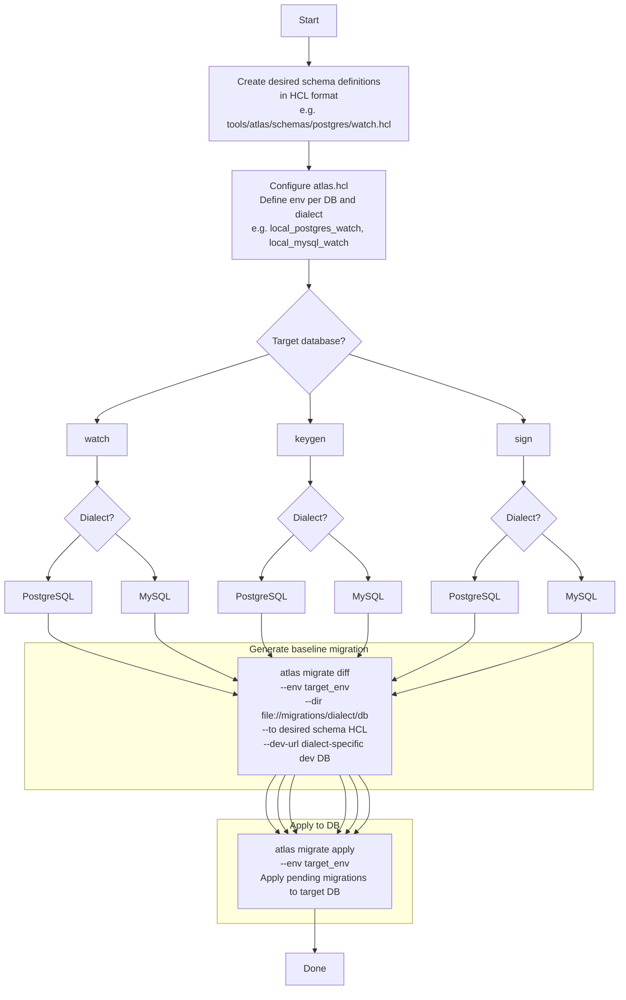
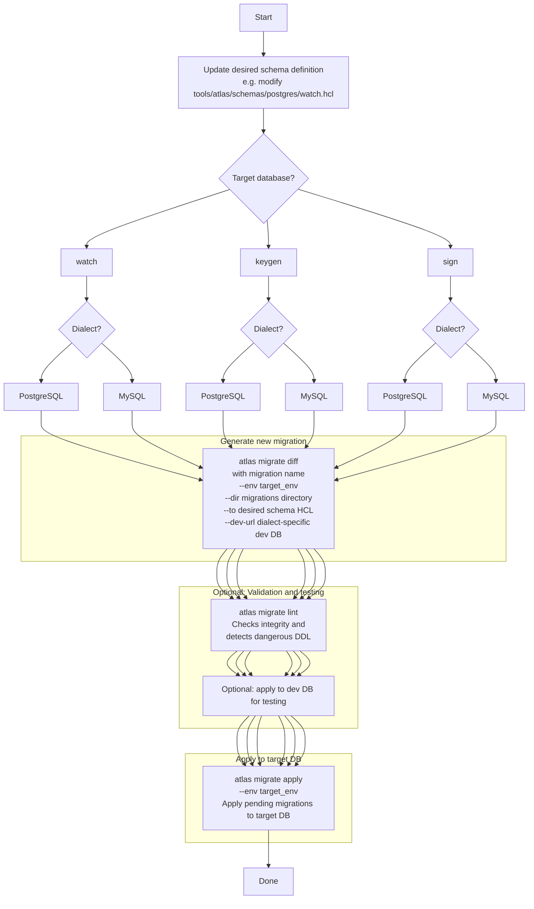
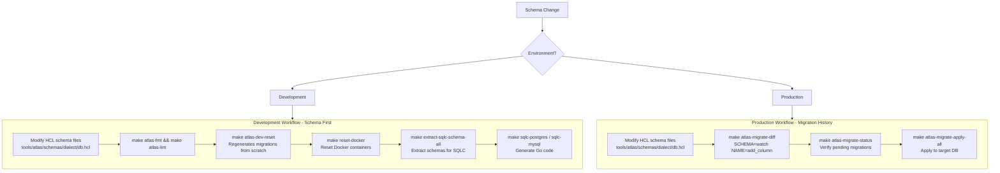

# Atlas Migration Flow (`atlas migrate diff/apply`)

This document describes the versioned migration workflow using **Atlas v1.1.0** (`atlas migrate diff/apply`) for
the three databases (`watch / keygen / sign`) across **PostgreSQL** and **MySQL** dialects.

> **Note**: SQLite is NOT managed by Atlas migrations. SQLite schemas are manually maintained in `tools/sqlc/schemas/sqlite/` and used only for SQLC code generation.

## Project Structure

```
tools/atlas/
├── atlas.hcl                          # Atlas configuration (env definitions)
├── schemas/
│   ├── postgres/
│   │   ├── watch.hcl                  # Desired schema (HCL) for watch DB
│   │   ├── keygen.hcl                 # Desired schema (HCL) for keygen DB
│   │   └── sign.hcl                   # Desired schema (HCL) for sign DB
│   └── mysql/
│       ├── watch.hcl
│       ├── keygen.hcl
│       └── sign.hcl
└── migrations/
    ├── postgres/
    │   ├── watch/                     # Migration files + atlas.sum
    │   ├── keygen/
    │   └── sign/
    └── mysql/
        ├── watch/
        ├── keygen/
        └── sign/
```

## Environments Defined in `atlas.hcl`

| Environment | Purpose |
|---|---|
| `local_postgres_watch`, `local_postgres_keygen`, `local_postgres_sign` | Local PostgreSQL development |
| `local_mysql_watch`, `local_mysql_keygen`, `local_mysql_sign` | Local MySQL development |
| `admin_postgres_watch`, `admin_postgres_keygen`, `admin_postgres_sign` | Admin (allows `ModifySchema` for drop/create) |
| `admin_mysql_watch`, `admin_mysql_keygen`, `admin_mysql_sign` | Admin (allows `ModifySchema` for drop/create) |

## 1. Initial Setup: Schema Design -> Generate Baseline Migration -> Apply to DB



Key points:

- **`atlas migrate diff`** generates SQL migration files matching the `dev-url` dialect
- **`atlas migrate apply`** applies pending (unapplied) migrations from the migrations directory to the target DB
- Migrations are **separated by dialect and database** to prevent cross-dialect issues (e.g. `migrations/postgres/watch/`, `migrations/mysql/keygen/`)

---

## 2. Schema Change: Update Schema -> Generate New Migration -> Apply to DB



Notes:

- `migrate diff` **auto-generates a diff migration from the current state to the desired state**
- `migrate apply` **applies unapplied migrations in order**
- The `atlas.hcl` env consolidates which DB, migrations directory, and schema source to use

---

## 3. Makefile Targets

### Development Workflow (Schema-First)

| Target | Description |
|---|---|
| `make atlas-fmt` | Format all HCL schema files |
| `make atlas-lint` | Lint HCL schemas (requires Docker) |
| `make atlas-validate` | Validate Atlas configuration |
| `make atlas-dev-reset [DB_DIALECT=postgres\|mysql]` | Regenerate migrations from HCL (drops and recreates) |
| `make atlas-dev-clean [DB_DIALECT=postgres\|mysql]` | Clean databases and reapply from HCL |

### Production Workflow (Migration-History)

| Target | Description |
|---|---|
| `make atlas-migrate-diff SCHEMA=<schema> NAME=<name> [DB_DIALECT=...]` | Generate a new incremental migration |
| `make atlas-migrate-apply-all [DB_DIALECT=postgres\|mysql]` | Apply all pending migrations |
| `make atlas-migrate-status [DB_DIALECT=postgres\|mysql]` | Show migration status |
| `make atlas-migrate-hash-all [DB_DIALECT=postgres\|mysql]` | Rehash migration directory |

### Schema Direct Apply

| Target | Description |
|---|---|
| `make atlas-schema-apply-all [DB_DIALECT=postgres\|mysql]` | Apply HCL schemas directly (bypasses migrations) |
| `make atlas-schema-apply SCHEMA=<schema> [DB_DIALECT=...]` | Apply a single schema directly |

### Full Regeneration

| Target | Description |
|---|---|
| `make regenerate-all-from-atlas [DB_DIALECT=postgres\|mysql]` | Full workflow: reset Docker, regenerate migrations, extract SQLC schemas, generate Go code |

---

## 4. Development vs Production Workflow



---

## 5. Dialect Differences

| Feature | PostgreSQL | MySQL |
|---|---|---|
| ID generation | `identity { generated = BY_DEFAULT }` | `auto_increment = true` |
| Enum type | Named type: `enum "coin" { values = [...] }` | Inline: `enum("a", "b")` |
| Timestamp | `timestamptz` (timezone-aware) | `datetime` |
| Schema reference | `schema "public"` | `schema "watch"` / `"keygen"` / `"sign"` |
| Numeric | `numeric(26,10)` | `decimal(26,10)` |
| Binary data | `bytea` | `blob` |
| Default time | `sql("now()")` | `sql("CURRENT_TIMESTAMP")` |

---

## 6. Destructive Change Protection

The `atlas.hcl` configuration includes a `destructive` variable (default: `false`) that controls whether destructive changes (e.g. `DROP TABLE`, `DROP COLUMN`) are allowed during migration generation. Lint rules also enforce naming conventions (lowercase with underscores) and flag dangerous DDL operations.

Admin environments (`admin_*`) are configured without a specific schema/database name, allowing `ModifySchema` operations such as dropping and recreating entire databases.
