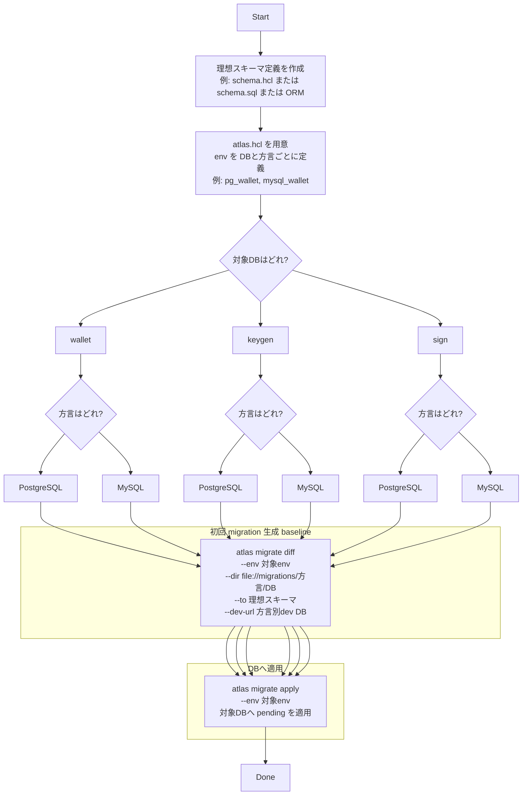
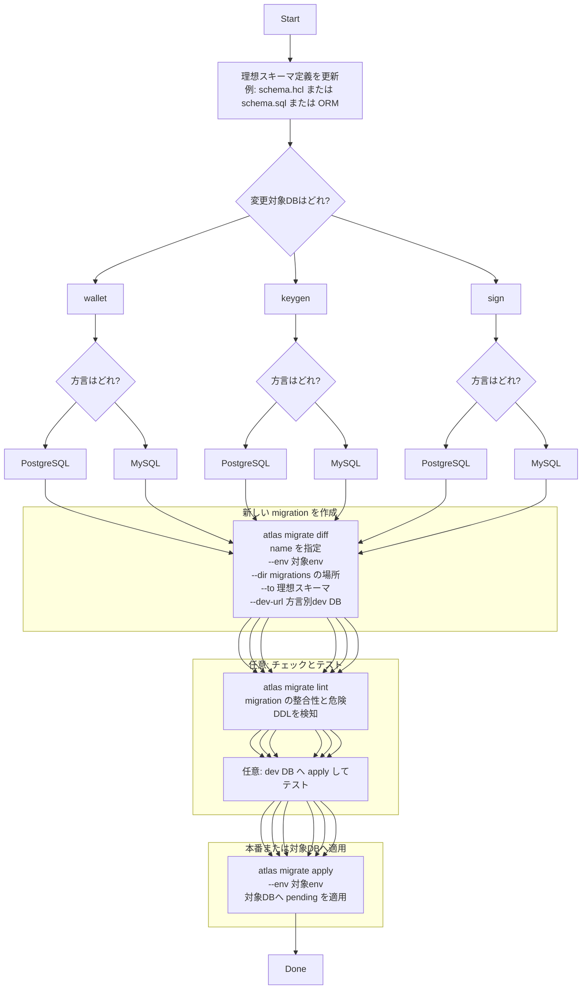

# atlas migration flow by `atlas migrate diff/apply`

以下は **Atlas v1.0.0 の versioned migrations（`atlas migrate diff/apply`）** を前提に、
`wallet / keygen / sign` の3つのDBを、**PostgreSQL / MySQL** に対して運用するフローを **mermaid** で整理したもの。
（`migrate diff` で migration を生成し、`migrate apply` で適用する流れ）

> **Note**: SQLite は Atlas による migration 管理の対象外。SQLite スキーマは `tools/sqlc/schemas/sqlite/` で手動管理し、SQLC によるコード生成のみ行う。

## 1. 初回: DBデザイン → migration生成 → DBへ適用

ポイント:

- **`atlas migrate diff` は `dev-url のdialect` に合わせて SQL migration を生成**する
- **`atlas migrate apply` が migrations directory の未適用分をDBに適用**する
- 3 DB×2 dialectを全部カバーするなら、運用上は **migrations を dialect/DBごとに分ける**のが事故りにくい（e.g. `migrations/postgres/wallet` など）。

---

## 2. 変更: schema変更 → 更新migration作成 → DBへ適用

補足:

- `migrate diff` は **「現在の状態 → 理想状態」への差分 migration を自動生成**するコマンド
- `migrate apply` は **未適用 migration を順に適用**する
- `atlas.hcl` の env で「どのDBに」「どの migrations dir を」「どの schema source から」扱うかをまとめて定義できる
