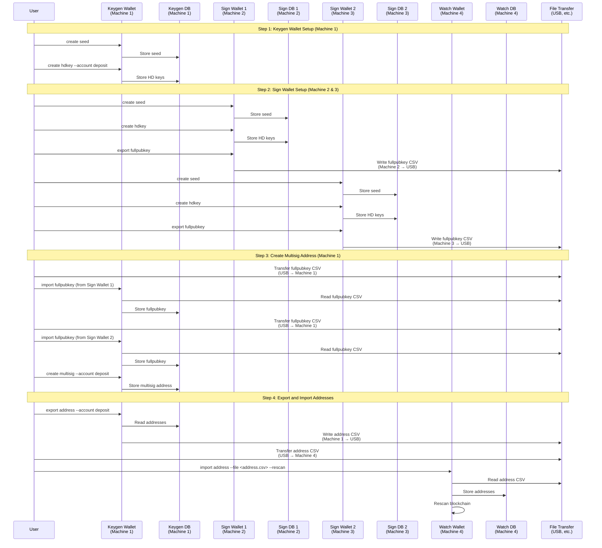
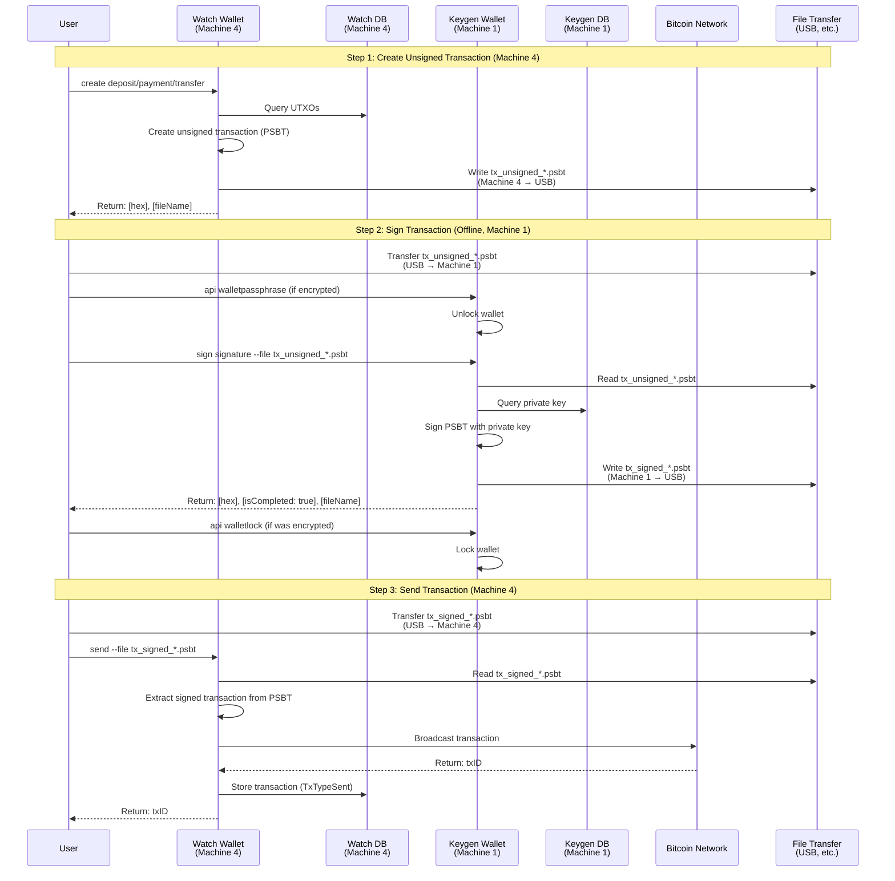
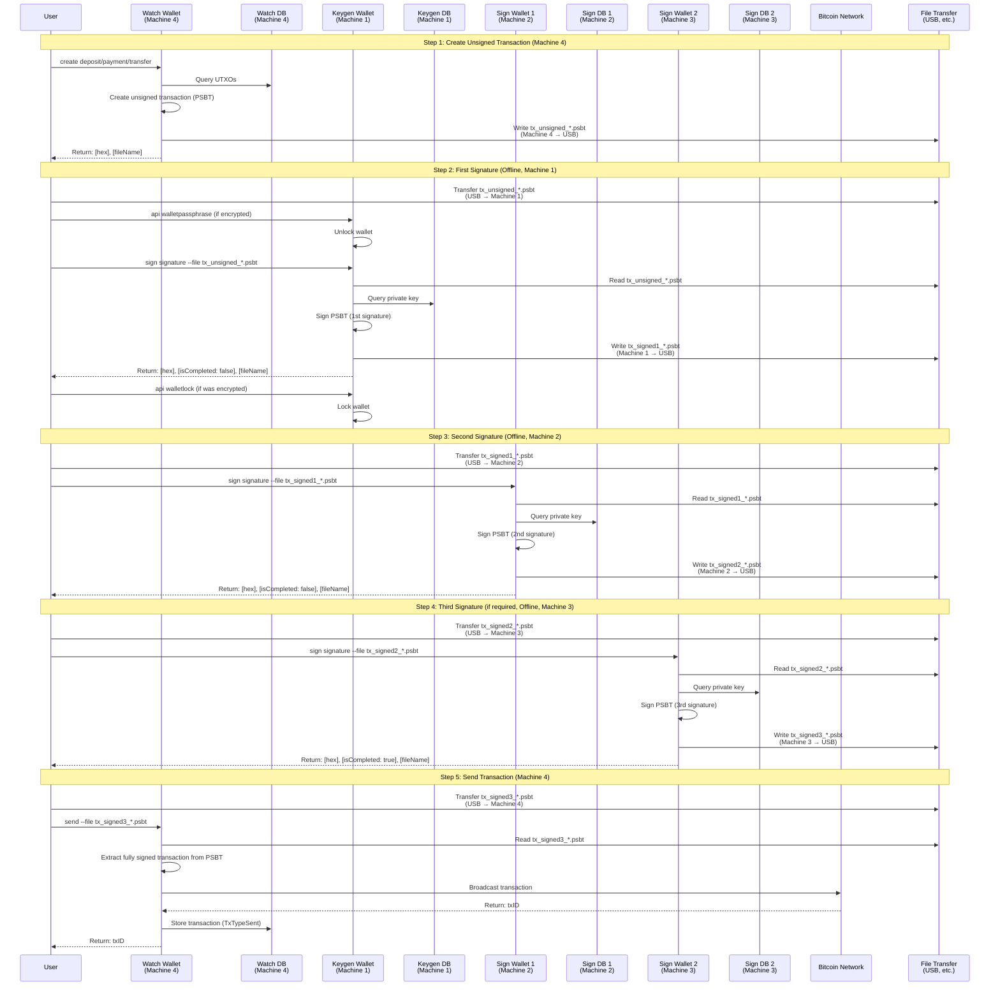
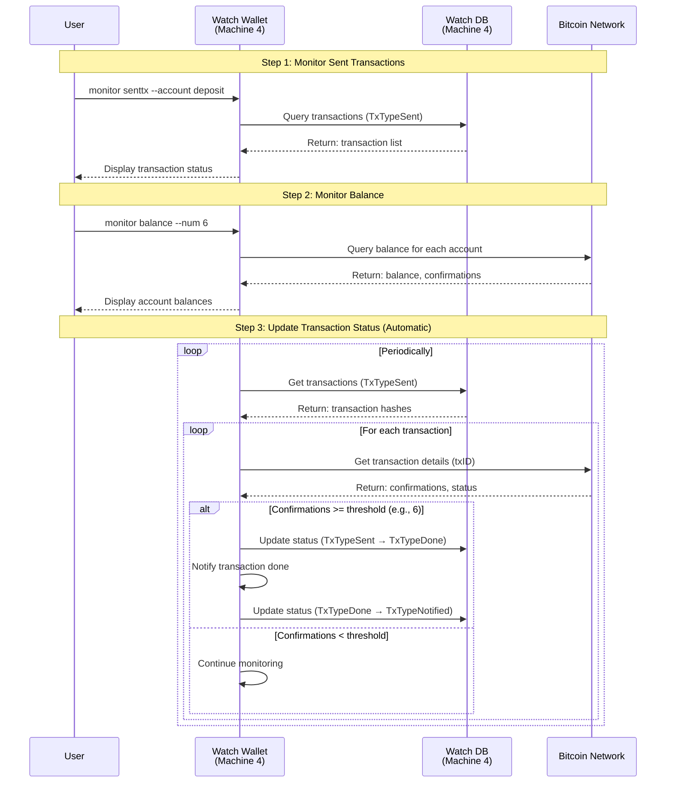

# Flow for BTC

This document describes the setup procedures and transaction flow for the three wallet types: Watch Wallet,
Keygen Wallet, and Sign Wallet.

## Architecture Overview

**Important**: Each wallet type runs on a **separate machine** with its **own independent database**:

- **Keygen Wallet (Machine 1)**: Offline machine with Keygen DB
- **Sign Wallet 1 (Machine 2)**: Offline machine with Sign DB 1
- **Sign Wallet 2 (Machine 3)**: Offline machine with Sign DB 2 (if required)
- **Watch Wallet (Machine 4)**: Online machine with Watch DB

**Key Points**:

- Each wallet maintains its own database independently
- Keygen and Sign Wallets operate **offline** (air-gapped) for security
- Only Watch Wallet is connected to the network
- Data transfer between machines uses **secure offline methods** (USB drives, etc.)
- Transaction files (PSBT) are transferred via USB between machines

## Overview

This document is organized into three main categories:

1. **Setup Flow**: Initial wallet setup procedures
2. **Transaction Operation Flow**: Creating, signing, and sending transactions
3. **Monitoring Flow**: Monitoring transaction confirmations and updating database

Each flow is described with detailed procedures and Mermaid sequence diagrams showing the interaction between
Watch Wallet, Keygen Wallet, and Sign Wallet across separate machines.

## 1. Setup Flow

### Setup Flow Sequence Diagram



## Wallet Setup Procedures

### Initial Setup Overview

Before using the wallet system, you need to set up each wallet type. The setup process involves:

1. **Keygen Wallet Setup**: Generate seeds, HD keys, and multisig addresses
2. **Sign Wallet Setup**: Generate authorization account seeds and HD keys
3. **Watch Wallet Setup**: Import addresses from Keygen Wallet

### Step 1: Keygen Wallet Setup

The Keygen Wallet is the foundation of the system. It generates keys and creates multisig addresses.

#### 1.1 Create Seed

Generate a seed for the account. This seed is used to derive all keys for the account.

```bash
keygen --coin btc create seed
```

**Note:** For development purposes, you can provide a seed value using `--seed` flag:

```bash
keygen --coin btc create seed --seed <your-seed-value>
```

#### 1.2 Generate HD Keys

Generate HD (Hierarchical Deterministic) keys based on BIP32/BIP44 standards for a specific account.

```bash
keygen --coin btc create hdkey --account deposit --keynum 10
```

**Parameters:**

- `--account <string>` - Target account name (e.g., `deposit`, `payment`, `client`)
- `--keynum <uint64>` - Number of HD keys to generate
- `--keypair` - Generate keypair for XRP (XRP only)

#### 1.3 Import Private Keys (Optional)

If you need to import private keys from the database into the Keygen Wallet:

```bash
keygen --coin btc import privkey --account deposit
```

### Step 2: Sign Wallet Setup

Each authorization operator needs their own Sign Wallet instance. The Sign Wallet provides subsequent
signatures for multisig transactions.

#### 2.1 Create Seed for Authorization Account

Generate a seed for the authorization account.

```bash
sign --coin btc create seed
```

**Note:** For development purposes, you can provide a seed value:

```bash
sign --coin btc create seed --seed <your-seed-value>
```

#### 2.2 Generate HD Keys for Authorization Account

Generate HD keys for the authorization account.

```bash
sign --coin btc create hdkey
```

#### 2.3 Export Full Public Key

Export the full public key as a CSV file. This file will be imported into Keygen Wallet to create
multisig addresses.

```bash
sign --coin btc export fullpubkey
```

This command generates a CSV file (e.g., `data/fullpubkey/btc/fullpubkey_YYYYMMDDHHMMSS.csv`) containing
the full public keys.

#### 2.4 Import Private Key

Import the generated private key for the authorization account into the database.

```bash
sign --coin btc import privkey
```

### Step 3: Create Multisig Address (Keygen Wallet)

After setting up Sign Wallets, you need to create multisig addresses using the exported full public keys.

#### 3.1 Import Full Public Keys from Sign Wallets

Import the full public keys exported from Sign Wallets.

```bash
keygen --coin btc import fullpubkey --file data/fullpubkey/btc/fullpubkey_sign1_YYYYMMDDHHMMSS.csv
```

Repeat this step for each Sign Wallet that will participate in the multisig address.

#### 3.2 Create Multisig Address

Create a multisig address using the imported full public keys.

```bash
keygen --coin btc create multisig --account deposit
```

This command creates a multisig address based on the account configuration (number of required
signatures, participating public keys, etc.).

### Step 4: Export Addresses (Keygen Wallet)

Export the generated addresses (including multisig addresses) as a CSV file for import into Watch Wallet.

```bash
keygen --coin btc export address --account deposit
```

This command generates a CSV file (e.g., `data/address/btc/address_deposit_YYYYMMDDHHMMSS.csv`)
containing the addresses.

### Step 5: Import Addresses (Watch Wallet)

Import the addresses exported from Keygen Wallet into Watch Wallet. This allows Watch Wallet to monitor
these addresses.

```bash
watch --coin btc import address --file data/address/btc/address_deposit_YYYYMMDDHHMMSS.csv --rescan
```

**Parameters:**

- `--file <path>` - Path to the CSV file containing addresses
- `--rescan` - Run blockchain rescan when importing addresses (recommended for first-time import)

## 2. Transaction Operation Flow

### Transaction Operation Flow Sequence Diagrams

#### Single-Signature Address Flow



#### Multisig Address Flow



### Overview

The transaction flow follows these general steps:

1. **Create Unsigned Transaction** (Watch Wallet)
2. **Sign Transaction** (Keygen Wallet, then Sign Wallets for multisig)
3. **Send Transaction** (Watch Wallet)

The exact flow depends on whether the address is a single-signature or multisig address.

### Single-Signature Address Flow

For single-signature addresses (non-multisig), the flow is simpler:

#### Step 1: Create Unsigned Transaction (Watch Wallet)

Create an unsigned transaction file. The transaction type can be:

- **Deposit**: Aggregate coins from client addresses to cold wallet addresses
- **Payment**: Send coins to user-specified addresses based on withdrawal requests
- **Transfer**: Transfer coins between internal accounts

**Example - Deposit:**

```bash
watch --coin btc create deposit --fee 0.0001
```

**Example - Payment:**

```bash
watch --coin btc create payment --fee 0.0001
```

**Example - Transfer:**

```bash
watch --coin btc create transfer --account1 deposit --account2 payment --amount 0.001 --fee 0.0001
```

The command outputs:

```text
[hex]: <transaction_hex>
[fileName]: data/tx/btc/tx_unsigned_YYYYMMDDHHMMSS.json
```

#### Step 2: Sign Transaction (Keygen Wallet)

Sign the unsigned transaction using Keygen Wallet.

**If the wallet is encrypted, unlock it first:**

```bash
keygen --coin btc api walletpassphrase --passphrase <your-passphrase>
```

**Sign the transaction:**

```bash
keygen --coin btc sign signature --file data/tx/btc/tx_unsigned_YYYYMMDDHHMMSS.json
```

**If the wallet was unlocked, lock it:**

```bash
keygen --coin btc api walletlock
```

The command outputs:

```text
[hex]: <signed_transaction_hex>
[isCompleted]: true
[fileName]: data/tx/btc/tx_signed_YYYYMMDDHHMMSS.json
```

#### Step 3: Send Transaction (Watch Wallet)

Send the signed transaction to the blockchain network.

```bash
watch --coin btc send --file data/tx/btc/tx_signed_YYYYMMDDHHMMSS.json
```

The command outputs:

```text
tx is sent!! txID: <transaction_id>
```

### Multisig Address Flow

For multisig addresses, multiple signatures are required. The flow includes additional signing steps.

#### Step 1: Create Unsigned Transaction (Watch Wallet)

Same as single-signature flow. Create an unsigned transaction file.

```bash
watch --coin btc create payment --fee 0.0001
```

Output:

```text
[hex]: <transaction_hex>
[fileName]: data/tx/btc/tx_unsigned_YYYYMMDDHHMMSS.json
```

#### Step 2: First Signature (Keygen Wallet)

Sign the unsigned transaction using Keygen Wallet (first signature).

**If the wallet is encrypted, unlock it first:**

```bash
keygen --coin btc api walletpassphrase --passphrase <your-passphrase>
```

**Sign the transaction:**

```bash
keygen --coin btc sign signature --file data/tx/btc/tx_unsigned_YYYYMMDDHHMMSS.json
```

**If the wallet was unlocked, lock it:**

```bash
keygen --coin btc api walletlock
```

Output:

```text
[hex]: <partially_signed_transaction_hex>
[isCompleted]: false
[fileName]: data/tx/btc/tx_signed1_YYYYMMDDHHMMSS.json
```

**Note:** `isCompleted: false` indicates that more signatures are required.

#### Step 3: Subsequent Signatures (Sign Wallets)

Each Sign Wallet provides an additional signature. Repeat this step for each required signature.

**Sign Wallet #1 (Second Signature):**

```bash
sign --coin btc --wallet sign1 sign signature --file data/tx/btc/tx_signed1_YYYYMMDDHHMMSS.json
```

Output:

```text
[hex]: <partially_signed_transaction_hex>
[isCompleted]: false
[fileName]: data/tx/btc/tx_signed2_YYYYMMDDHHMMSS.json
```

**Sign Wallet #2 (Third Signature, if required):**

```bash
sign --coin btc --wallet sign2 sign signature --file data/tx/btc/tx_signed2_YYYYMMDDHHMMSS.json
```

Output:

```text
[hex]: <fully_signed_transaction_hex>
[isCompleted]: true
[fileName]: data/tx/btc/tx_signed3_YYYYMMDDHHMMSS.json
```

**Note:** Continue signing with additional Sign Wallets until `isCompleted: true` is returned, indicating
that the transaction has the required number of signatures.

#### Step 4: Send Transaction (Watch Wallet)

Once the transaction is fully signed (`isCompleted: true`), send it to the blockchain network.

```bash
watch --coin btc send --file data/tx/btc/tx_signed3_YYYYMMDDHHMMSS.json
```

Output:

```text
tx is sent!! txID: <transaction_id>
```

## Transaction Types

### Deposit Transaction

A deposit transaction aggregates coins sent to client addresses into cold wallet addresses managed
offline.

**Use Case:** Users send coins to their assigned addresses. Periodically, these coins need to be
collected and moved to secure cold storage addresses.

**Flow:**

1. Watch Wallet: `watch create deposit`
2. Keygen Wallet: `keygen sign signature --file <tx_file>`
3. Watch Wallet: `watch send --file <signed_tx_file>`

**Example:**

```bash
# Step 1: Create unsigned deposit transaction
watch --coin btc create deposit --fee 0.0001

# Step 2: Sign with Keygen Wallet (unlock if encrypted)
keygen --coin btc api walletpassphrase --passphrase <passphrase>
keygen --coin btc sign signature --file data/tx/btc/tx_unsigned_YYYYMMDDHHMMSS.json
keygen --coin btc api walletlock

# Step 3: Send signed transaction
watch --coin btc send --file data/tx/btc/tx_signed_YYYYMMDDHHMMSS.json
```

### Payment Transaction

A payment transaction sends coins to user-specified addresses based on withdrawal requests.

**Use Case:** Users request withdrawals. The system creates a transaction to send coins from payment
accounts to the user's specified address.

**Flow (Single-Signature):**

1. Watch Wallet: `watch create payment`
2. Keygen Wallet: `keygen sign signature --file <tx_file>`
3. Watch Wallet: `watch send --file <signed_tx_file>`

**Flow (Multisig):**

1. Watch Wallet: `watch create payment`
2. Keygen Wallet: `keygen sign signature --file <tx_file>` (1st signature)
3. Sign Wallet #1: `sign sign signature --file <tx_file_signed1>` (2nd signature)
4. Sign Wallet #2: `sign sign signature --file <tx_file_signed2>` (3rd signature, if required)
5. Watch Wallet: `watch send --file <fully_signed_tx_file>`

**Example (Multisig):**

```bash
# Step 1: Create unsigned payment transaction
watch --coin btc create payment --fee 0.0001

# Step 2: First signature with Keygen Wallet
keygen --coin btc api walletpassphrase --passphrase <passphrase>
keygen --coin btc sign signature --file data/tx/btc/tx_unsigned_YYYYMMDDHHMMSS.json
keygen --coin btc api walletlock

# Step 3: Second signature with Sign Wallet #1
sign --coin btc --wallet sign1 sign signature --file data/tx/btc/tx_signed1_YYYYMMDDHHMMSS.json

# Step 4: Third signature with Sign Wallet #2 (if required)
sign --coin btc --wallet sign2 sign signature --file data/tx/btc/tx_signed2_YYYYMMDDHHMMSS.json

# Step 5: Send fully signed transaction
watch --coin btc send --file data/tx/btc/tx_signed3_YYYYMMDDHHMMSS.json
```

### Transfer Transaction

A transfer transaction moves coins between internal accounts.

**Use Case:** Internal operations require moving coins between different account types (e.g., from
deposit account to payment account).

**Flow:**

1. Watch Wallet: `watch create transfer --account1 <sender> --account2 <receiver> --amount <amount>`
2. Keygen Wallet: `keygen sign signature --file <tx_file>`
3. Watch Wallet: `watch send --file <signed_tx_file>`

**Example:**

```bash
# Step 1: Create unsigned transfer transaction
watch --coin btc create transfer --account1 deposit --account2 payment --amount 0.001 --fee 0.0001

# Step 2: Sign with Keygen Wallet
keygen --coin btc api walletpassphrase --passphrase <passphrase>
keygen --coin btc sign signature --file data/tx/btc/tx_unsigned_YYYYMMDDHHMMSS.json
keygen --coin btc api walletlock

# Step 3: Send signed transaction
watch --coin btc send --file data/tx/btc/tx_signed_YYYYMMDDHHMMSS.json
```

## Security Considerations

### Wallet Encryption

For production use, encrypt wallets to protect private keys:

```bash
# Encrypt Keygen Wallet
keygen --coin btc api encryptwallet --passphrase <strong-passphrase>

# Encrypt Sign Wallet
sign --coin btc --wallet sign1 api encryptwallet --passphrase <strong-passphrase>
```

### Offline Operation

- **Keygen Wallet** and **Sign Wallet** should operate offline (air-gapped) to prevent exposure of
  private keys
- Only **Watch Wallet** should be connected to the network
- Transfer transaction files between wallets using secure, offline methods (USB drives, etc.)

### Transaction File Handling

- Transaction files contain sensitive information
- Store transaction files securely and delete them after successful transaction broadcast
- Verify transaction details before signing
- Use secure channels when transferring transaction files between wallets

## 3. Monitoring Flow

### Monitoring Flow Sequence Diagram



### Monitoring Transactions

After sending a transaction, you can monitor its status:

```bash
# Monitor sent transactions for an account
watch --coin btc monitor senttx --account deposit

# Monitor balance
watch --coin btc monitor balance --num 6
```

### Transaction Status Lifecycle

The transaction status follows this lifecycle:

1. **TxTypeSent**: Transaction has been broadcast to the blockchain
2. **TxTypeDone**: Transaction has received sufficient confirmations (default: 6 blocks)
3. **TxTypeNotified**: Transaction has been confirmed and notifications have been sent

The Watch Wallet automatically updates transaction status by:

- Periodically checking confirmation count for transactions with `TxTypeSent` status
- Updating to `TxTypeDone` when confirmations meet the threshold
- Sending notifications and updating to `TxTypeNotified` when appropriate

## Troubleshooting

### "No utxo" Error

If you see "No utxo" when creating a transaction, it means there are no unspent transaction outputs
available for the specified account. Ensure that:

- Coins have been sent to the addresses
- Addresses have been imported into Watch Wallet
- Sufficient confirmations have been received

### Incomplete Multisig Transaction

If `isCompleted: false` is returned after signing, additional signatures are required. Continue
signing with Sign Wallets until `isCompleted: true` is returned.

### Transaction Not Confirming

If a transaction is not confirming:

- Check the transaction fee (may be too low)
- Verify the transaction was successfully broadcast
- Use `watch monitor senttx` to check transaction status
- Consider increasing the fee and re-broadcasting if necessary
