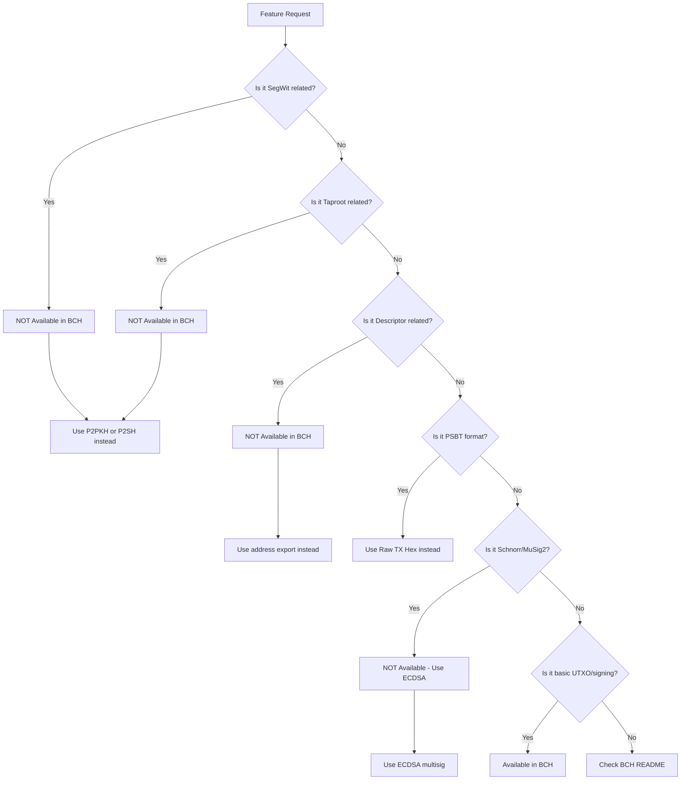

# BCH (Bitcoin Cash) Task Context for AI Agents

This document provides AI agents with critical information about BCH implementation differences from BTC. **Read this document before implementing any BCH E2E workflow.**

## Overview

| Property | Value |
|----------|-------|
| Transaction Model | UTXO-based |
| Communication | Bitcoin Cash RPC |
| Address Format | P2PKH, P2SH (CashAddr: `bitcoincash:q...`) |
| Special Features | CashAddr, Fork from BTC |

---

## Critical: BTC vs BCH Feature Differences

BCH is a fork of BTC but has **significant protocol differences**. Many BTC features are NOT available in BCH.

| Feature | BTC | BCH | Impact on Implementation |
|---------|-----|-----|--------------------------|
| Address Format | Legacy/Bech32/Bech32m | CashAddr only | Different address encoding |
| SegWit | Yes | **NO** | No witness data, larger TX size |
| Taproot | Yes | **NO** | No P2TR addresses |
| Schnorr Signatures | Yes (BIP340) | **NO** | ECDSA only |
| Descriptor | Yes | **NO** | Cannot use descriptor APIs |
| PSBT | Yes (BIP174) | **NO** | Use raw transaction hex |
| MuSig2 | Yes (BIP327) | **NO** | Traditional multisig only |
| Block Size | 1MB (+SegWit) | 32MB | Different capacity |
| Fee Unit | sat/vByte | sat/Byte | No witness discount |

---

## Workflow-based Feature Comparison

This section compares BTC and BCH capabilities at each workflow step.

### 1. Key Generation

| Step | BTC | BCH | Notes |
|------|-----|-----|-------|
| Seed Generation | BIP39 mnemonic | BIP39 mnemonic | Same |
| HD Key Derivation | BIP32 | BIP32 | Same |
| Derivation Paths | BIP44/49/84/86 | **BIP44 only** | BCH: No BIP49/84/86 |
| Coin Type (SLIP44) | 0 (mainnet), 1 (testnet) | 145 (mainnet), 1 (testnet) | Different coin type |

**BCH Derivation Path:**

```
m/44'/145'/account'/change/index  (mainnet)
m/44'/1'/account'/change/index    (testnet/regtest)
```

### 2. Address Generation

| Step | BTC | BCH | Notes |
|------|-----|-----|-------|
| P2PKH | Yes (`1...`) | Yes (CashAddr `q...`) | Different encoding |
| P2SH (Multisig) | Yes (`3...`) | Yes (CashAddr `p...`) | Different encoding |
| P2WPKH (Native SegWit) | Yes (`bc1q...`) | **NO** | SegWit not supported |
| P2WSH (SegWit Multisig) | Yes (`bc1q...`) | **NO** | SegWit not supported |
| P2TR (Taproot) | Yes (`bc1p...`) | **NO** | Taproot not supported |
| Descriptor Export | Yes | **NO** | Not available |
| Descriptor Import | Yes | **NO** | Not available |

**BCH Address Types:**

| Type | CashAddr Prefix | Legacy Prefix | Description |
|------|-----------------|---------------|-------------|
| P2PKH | `q...` | `1...` | Standard address |
| P2SH | `p...` | `3...` | Script Hash (multisig) |

### 3. Transaction Creation

| Step | BTC | BCH | Notes |
|------|-----|-----|-------|
| Transaction Format | PSBT (BIP174) | **Raw TX (Hex)** | BCH: No PSBT support |
| UTXO Selection | Automatic | Automatic | Same logic |
| Change Address | Any type | P2PKH/P2SH only | Limited types |
| Fee Calculation | sat/vByte | **sat/Byte** | No witness discount |
| RBF (Replace-by-Fee) | Yes (BIP125) | No | Not supported |

### 4. Signing

| Step | BTC | BCH | Notes |
|------|-----|-----|-------|
| ECDSA (secp256k1) | Yes | Yes | Same |
| Schnorr (BIP340) | Yes | **NO** | Not available |
| MuSig2 Protocol | Yes (BIP327) | **NO** | Not available |
| Sighash Fork ID | No | **Yes (0x40)** | Replay protection |
| Single-sig | Yes | Yes | Same |
| 2-of-3 Multisig | Yes (P2SH/P2WSH) | Yes (P2SH only) | BCH: P2SH only |
| 3-of-3 Multisig | Yes (P2SH/P2WSH/MuSig2) | Yes (P2SH only) | BCH: P2SH only |

### 5. Signed Transaction Output

| Step | BTC | BCH | Notes |
|------|-----|-----|-------|
| Output Format | PSBT (base64) | **Raw TX (Hex)** | Different format |
| Partial Signatures | PSBT fields | **Embedded in TX** | Different handling |
| Signature Size | 64-72 bytes | 71-73 bytes (DER) | ECDSA only |
| Witness Data | Separate | **None** | No SegWit |

---

## E2E Pattern Availability Matrix

This matrix shows which BTC E2E patterns are available for BCH.

| BTC Pattern | Description | BCH Available? | BCH Equivalent | Reason |
|-------------|-------------|----------------|----------------|--------|
| Pattern 1 | P2PKH Single-sig | **Yes** | BCH Pattern 1 | Legacy format supported |
| Pattern 2 | P2PKH 2-of-3 Multisig | **Yes** | BCH Pattern 2 | P2SH multisig supported |
| Pattern 3 | P2SH-P2WPKH Single-sig | **NO** | N/A | SegWit not supported |
| Pattern 4 | P2SH-P2WSH 2-of-3 | **NO** | N/A | SegWit not supported |
| Pattern 5 | P2WPKH Single-sig | **NO** | N/A | SegWit not supported |
| Pattern 6 | P2WSH 2-of-3 | **NO** | N/A | SegWit not supported |
| Pattern 7 | P2WSH 3-of-3 | **NO** | Use BCH Pattern 3 | SegWit not supported |
| Pattern 8 | P2SH-P2WSH 3-of-3 | **NO** | Use BCH Pattern 3 | SegWit not supported |
| Pattern 9 | P2TR Single-sig | **NO** | N/A | Taproot not supported |
| Pattern 10 | P2TR MuSig2 | **NO** | N/A | Taproot/Schnorr not supported |
| Pattern 11 | P2TR Tapscript | **NO** | N/A | Taproot not supported |

### BCH Available Patterns

| BCH Pattern | Address Type | Signature Pattern | E2E Script |
|-------------|--------------|-------------------|------------|
| **Pattern 1** | CashAddr P2PKH | Single-sig | Manual testing |
| **Pattern 2** | CashAddr P2SH | 2-of-3 Multisig | Not implemented |
| **Pattern 3** | CashAddr P2SH | 3-of-3 Multisig | `scripts/operation/bch/e2e-workflow.sh` |

---

## BCH Implementation Decision Flowchart

Use this flowchart to determine if a feature is available for BCH:



---

## Critical Implementation Rules

### DO NOT (Prohibited for BCH)

| Rule | Reason | BTC File to Avoid |
|------|--------|-------------------|
| DO NOT use Descriptor APIs | BCH has no descriptor support | `descriptor*.go` |
| DO NOT use PSBT format | BCH uses raw transaction hex | `psbt.go` |
| DO NOT use MuSig2 | BCH has no Schnorr signatures | `musig2.go` |
| DO NOT use Taproot addresses | BCH has no Taproot | `descriptor_taproot*.go` |
| DO NOT use Bech32/Bech32m | BCH uses CashAddr | N/A |
| DO NOT use BIP49/84/86 paths | BCH only supports BIP44 | N/A |
| DO NOT calculate fees in sat/vByte | BCH uses sat/Byte | N/A |

### DO (Required for BCH)

| Rule | Reason | Implementation |
|------|--------|----------------|
| DO use CashAddr format | BCH standard address format | `bitcoincash:q...` or `bitcoincash:p...` |
| DO use Raw Transaction Hex | BCH transaction format | `createrawtransaction` RPC |
| DO use ECDSA signatures only | Only supported algorithm | Standard secp256k1 |
| DO use P2SH for multisig | Only multisig option | `createmultisig` RPC |
| DO include SIGHASH_FORKID | Replay protection | Sighash type `0x41` |
| DO use BIP44 derivation | Only supported path | `m/44'/145'/...` |
| DO override BTC methods | BCH-specific behavior | In `bch/` directory |

---

## Files NOT to Use for BCH Implementation

> **⚠️ CRITICAL WARNING FOR AI AGENTS ⚠️**
>
> The following files are **BTC-ONLY** and must **NEVER** be modified or referenced for BCH tasks.
> BCH uses completely different transaction formats and signing mechanisms.

### 🚫 PSBT Files (MOST COMMONLY MISTAKEN)

**`internal/infrastructure/api/btc/btc/psbt.go`** - This file is the most common mistake!

| Feature | BTC | BCH |
|---------|-----|-----|
| Transaction Format | **PSBT (BIP174)** | **Raw TX Hex** |
| Signing Mechanism | walletprocesspsbt | signrawtransaction |
| Sighash | SigHashAll (0x01) | **SigHashAll + ForkID (0x41)** |

**DO NOT:**

- Import or call any function from `psbt.go` for BCH
- Modify `psbt.go` to add BCH support
- Reference PSBT examples when implementing BCH

### 🚫 Other Prohibited Files

```
# Descriptor files (BCH has no descriptor support)
internal/infrastructure/api/btc/btc/descriptor*.go
internal/application/usecase/*/btc/*descriptor*.go

# PSBT files (BCH uses raw transactions) - SEE WARNING ABOVE
internal/infrastructure/api/btc/btc/psbt.go

# MuSig2 files (BCH has no Schnorr)
internal/infrastructure/api/btc/btc/musig2.go
internal/application/usecase/*/btc/*musig2*.go
```

### Why These Files Are Prohibited

| File | BTC Feature | BCH Alternative |
|------|-------------|-----------------|
| `psbt.go` | PSBT format (BIP174) | Raw TX Hex via `createrawtransaction` |
| `descriptor*.go` | Descriptor wallets | Address export/import workflow |
| `musig2.go` | Schnorr/MuSig2 | Traditional P2SH multisig |

## Files Safe to Use for BCH Implementation

These BTC files can be inherited/referenced:

```
# UTXO management (same logic)
internal/infrastructure/api/btc/btc/unspent.go

# Basic transaction structure
internal/infrastructure/api/btc/btc/transaction.go

# Balance operations
internal/infrastructure/api/btc/btc/balance.go

# Basic signing (ECDSA)
internal/application/usecase/keygen/btc/sign_transaction.go
```

---

## Directory Structure

### Use Case Layer

```
internal/application/usecase/
└── keygen/btc/          # Shared with BTC (partially)
    └── ...
```

**Note**: BCH-specific Use Cases currently share code with BTC. Pay attention to differences when implementing.

### Infrastructure Layer

```
internal/infrastructure/api/btc/bch/
├── bitcoin_cash.go      # Client initialization
├── account.go           # Account management
├── address.go           # Address operations (CashAddr support)
├── balance.go           # Balance operations
└── unspent.go           # UTXO management
```

### CLI Layer

BCH CLI commands share structure with BTC but are distinguished by `coin_type = "bch"`.

---

## Implementation Patterns

### BitcoinCash Struct Design

The BCH API client **embeds and extends** the BTC implementation:

```go
// internal/infrastructure/api/btc/bch/bitcoin_cash.go
type BitcoinCash struct {
    btc.Bitcoin  // Embed BTC implementation
}
```

This design means:

- Methods common to BTC are automatically inherited
- BCH-specific behavior requires **method overriding**

### Important: BTC API Override Pattern

When BTC API implementation has issues for BCH, **DO NOT modify BTC code directly**. Override in BCH instead:

```go
// WRONG: Modifying BTC code directly
// internal/infrastructure/api/btc/btc/address.go

// CORRECT: Override in BCH
// internal/infrastructure/api/btc/bch/address.go
func (b *BitcoinCash) GetAddressInfo(addr string) (*dtobtc.AddressInfo, error) {
    // BCH-specific implementation
    input, err := json.Marshal(addr)
    if err != nil {
        return nil, fmt.Errorf("fail to call json.Marshal() in bch: %w", err)
    }
    rawResult, err := b.Client.RawRequest("getaddressinfo", []json.RawMessage{input})
    if err != nil {
        return nil, fmt.Errorf("fail to call json.RawRequest(getaddressinfo) %s in bch: %w", addr, err)
    }

    // Use BCH-specific response type
    infoResult := GetAddressInfoResult{}
    err = json.Unmarshal(rawResult, &infoResult)
    if err != nil {
        return nil, fmt.Errorf("fail to call json.Unmarshal(rawResult) in bch: %w", err)
    }

    // Convert BCH type to BTC type, then to DTO
    btcResult := &btc.GetAddressInfoResult{
        Address:      infoResult.Address,
        ScriptPubKey: infoResult.ScriptPubKey,
        // ... BCH-specific mapping
        Iswitness:    false,  // BCH has no SegWit
    }

    return btc.ToAddressInfo(btcResult), nil
}
```

**Design Reasons:**

1. Keep BTC implementation stable for BTC-only use
2. Absorb BCH differences in BCH layer
3. Isolate changes to each chain

### When to Override

Override is required when:

| Case | Reason |
|------|--------|
| Response structure differs | BCH node API response differs from BTC |
| Missing fields | SegWit/Taproot fields don't exist |
| Address format | CashAddr processing required |
| Fee calculation | sat/Byte vs sat/vByte |
| Signature method | Replay protection with FORKID |

### Shared Code

BCH and BTC can share these components:

```go
// CAN be shared (inherited via embedding)
- UTXO selection logic
- Basic transaction structure
- Signing algorithm (ECDSA)
- Many RPC methods

// MUST override in BCH
- Address-related APIs (GetAddressInfo, etc.)
- Fee-related APIs
- SegWit/Taproot features (disabled in BCH)
```

---

## Key Concepts

### CashAddr Format

BCH uses CashAddr format for addresses:

```
# Legacy format (compatible)
1BvBMSEYstWetqTFn5Au4m4GFg7xJaNVN2

# CashAddr format (recommended)
bitcoincash:qr95sy3j9xwd2ap32xkykttr4cvcu7as4y0qverfuy

# Without prefix
qr95sy3j9xwd2ap32xkykttr4cvcu7as4y0qverfuy
```

### UTXO Model

Same as BTC, BCH uses the UTXO transaction model:

```
Input (UTXO) -> Transaction -> Output (New UTXO)

- Input: Unspent output from previous transaction
- Output: Recipient address + Change address
- Fee: Total inputs - Total outputs
```

---

## Configuration

```yaml
# config/wallet/bch/watch.yaml
coin_type: bch
network_type: mainnet  # mainnet, testnet

bitcoin:  # Bitcoin Cash Node
  host: localhost
  port: 8332
  user: user
  pass: password
```

---

## Testing

```bash
# BCH Infrastructure tests
go test ./internal/infrastructure/api/btc/bch/...

# Check BCH config files
ls config/wallet/bch/*.yaml
```

---

## Common Operations

| Operation | Wallet | Implementation Location |
|-----------|--------|-------------------------|
| Address Generation | Keygen | Shared logic + CashAddr conversion |
| Transaction Creation | Watch | BTC shared + BCH adjustments |
| Signing | Keygen/Sign | BTC shared |
| Broadcasting | Watch | BTC shared |

---

## Implementation Checklist for AI Agents

Before implementing BCH E2E workflow, verify:

- [ ] Using CashAddr format (not Bech32/Bech32m)
- [ ] Using BIP44 derivation path with coin type 145
- [ ] Using Raw Transaction Hex (not PSBT)
- [ ] Using ECDSA signatures only (not Schnorr)
- [ ] Using P2SH for multisig (not P2WSH)
- [ ] Including SIGHASH_FORKID in signatures
- [ ] NOT referencing descriptor/psbt/musig2 files
- [ ] Overriding in BCH layer (not modifying BTC code)

---

## Related Documentation

- [BCH Technical Reference](../../crypto/bch/README.md) - Comprehensive BCH documentation
- [BTC E2E Transaction Patterns](../../crypto/btc/operations/e2e-transaction-patterns.md) - BTC patterns (for comparison)
- [BTC Task Context](./btc.md) - BTC reference (for comparison)

---

## Embedding Inheritance Diagram

```
btc.Bitcoin (internal/infrastructure/api/btc/btc/)
    |
    | embedding
    v
BitcoinCash (internal/infrastructure/api/btc/bch/)
    -> Inherits BTC methods
    -> Override as needed for BCH
```

### Reference Pattern Summary

```
When referencing BTC implementation:

INHERITED (usable as-is):
- internal/infrastructure/api/btc/btc/unspent.go (UTXO)
- internal/infrastructure/api/btc/btc/transaction.go (basic TX)
- internal/infrastructure/api/btc/btc/balance.go (balance)

CAN REFERENCE (Use Case layer):
- internal/application/usecase/keygen/btc/sign_transaction.go (basic signing)

ALREADY OVERRIDDEN in BCH:
- internal/infrastructure/api/btc/bch/address.go (GetAddressInfo)
- Add more overrides as needed

DO NOT USE for BCH:
- internal/infrastructure/api/btc/btc/descriptor*.go (No Descriptor)
- internal/infrastructure/api/btc/btc/psbt.go (No PSBT)
- internal/infrastructure/api/btc/btc/musig2.go (No MuSig2)
- internal/application/usecase/*/btc/*musig2*.go
- internal/application/usecase/*/btc/*descriptor*.go
```

### Adding BCH-specific Implementation

```go
// 1. Create new file in bch/ directory
// internal/infrastructure/api/btc/bch/new_feature.go

package bch

// 2. Implement as BitcoinCash method
func (b *BitcoinCash) SomeMethod() error {
    // BCH-specific implementation
}

// Or override existing BTC method
func (b *BitcoinCash) ExistingBTCMethod() (*Result, error) {
    // BCH-customized implementation
}
```

---

## Related Rules and Documentation

### Claude/Cursor Rules (MUST READ for BCH tasks)

| Rule File | Purpose |
|-----------|---------|
| `.claude/rules/bch/btc-only-files.md` | Complete list of BTC-only files that must NEVER be used for BCH |
| `.claude/rules/bch/e2e-script.md` | BCH E2E script development rules |

### Design Documents

| Document | Purpose |
|----------|---------|
| `docs/crypto/bch/interface-separation.md` | Interface separation requirements between BTC and BCH |

### Related GitHub Issues

| Issue | Description |
|-------|-------------|
| #435 | BCH: Use case layer incorrectly uses BTC-only APIs (PSBT, Descriptor, MuSig2) |
| #434 | BCH: Implement SIGHASH_FORKID support for transaction signing |
| #431 | BCH E2E Pattern 1 (P2PKH Single-sig) |
| #432 | BCH E2E Pattern 2 (P2SH 2-of-3 Multisig) |
| #433 | BCH E2E Pattern 3 (P2SH 3-of-3 Multisig) |

---

**Document Version:** 2.1
**Last Updated:** 2026-01-17
**Purpose:** AI Agent Task Context for BCH Implementation
