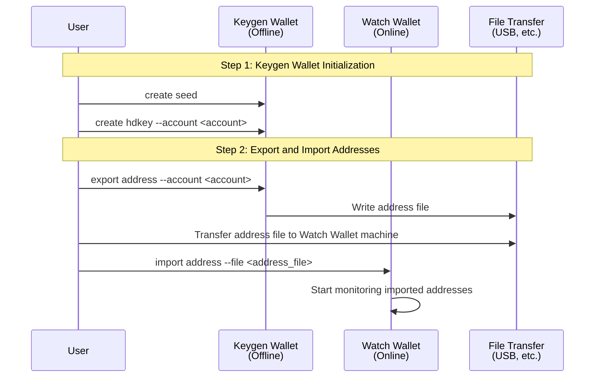
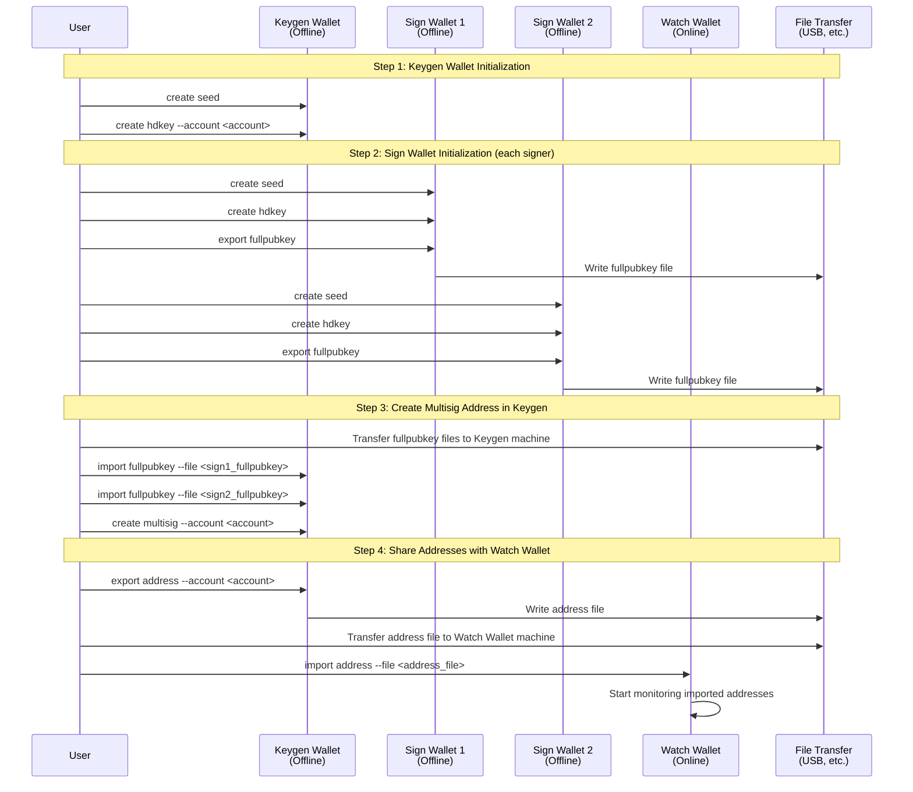
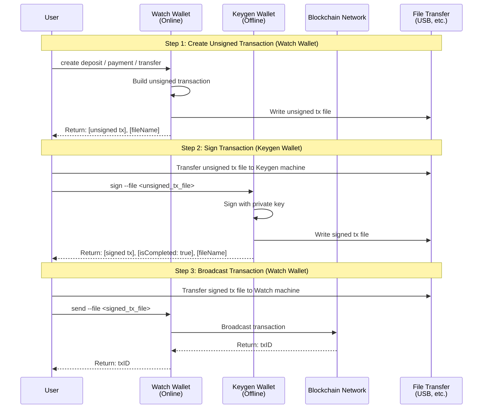
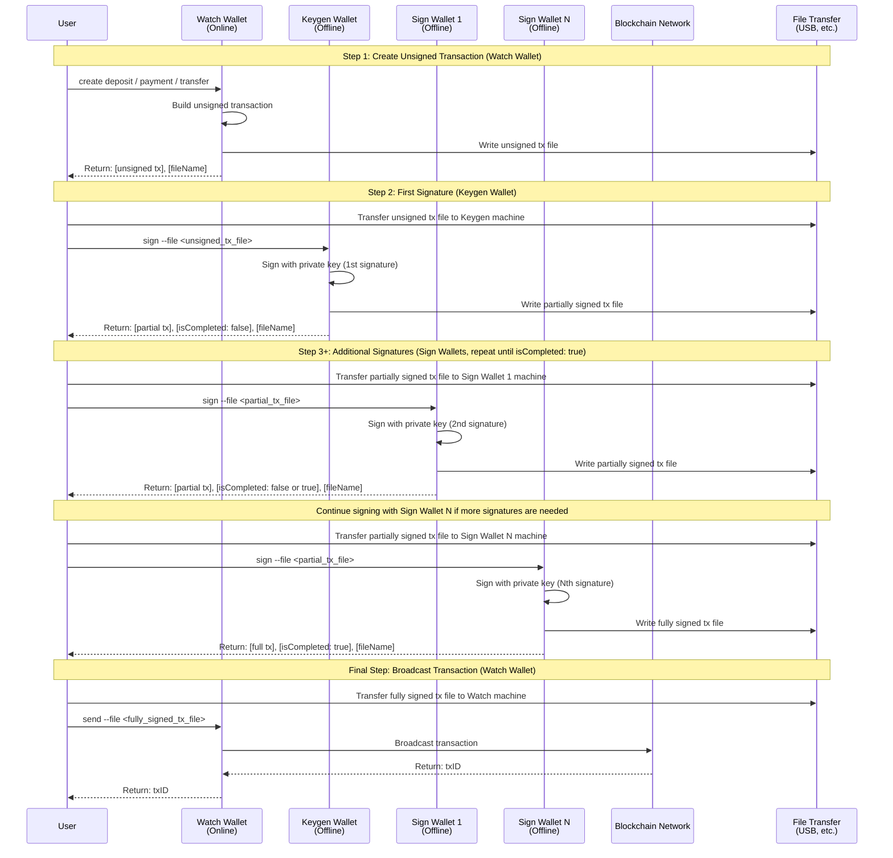
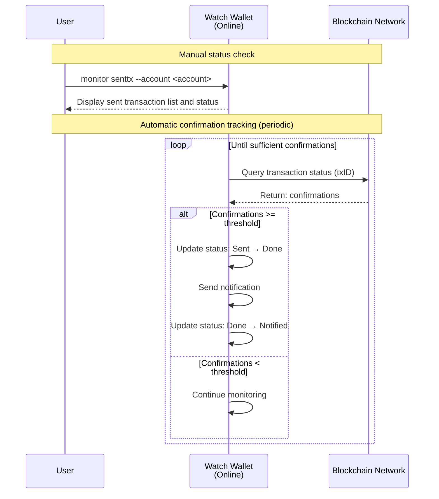

# Transaction Flow

This document describes the common transaction flow that applies across all supported chains (BTC, BCH, ETH, XRP).
For chain-specific details, see the documentation under `docs/chains/`.

## Architecture Overview

The system uses three wallet types running on **separate machines**:

| Wallet | Environment | Role |
|--------|-------------|------|
| **Watch Wallet** | Online | Creates unsigned transactions, broadcasts signed transactions, monitors status |
| **Keygen Wallet** | Offline (air-gapped) | Generates keys and addresses; **sole signer for single-sig transactions** |
| **Sign Wallet** | Offline (air-gapped) | Provides additional signatures for multisig transactions only |

> **Single-sig vs Multisig wallet requirements:**
> - **Single-sig**: Only **Watch + Keygen** wallets are needed. The Sign Wallet is not required.
> - **Multisig (M-of-N)**: All three wallets are used. Keygen provides the first signature; Sign Wallet(s) provide the remaining signatures.

Key design principles:

- Only Watch Wallet connects to the network — Keygen and Sign Wallets are always offline
- Transaction files are transferred between machines via secure offline methods (e.g., USB drives)
- Each wallet maintains its own independent database

---

## 1. Setup Flow

Before sending any transaction, each wallet must be initialized and addresses must be shared with Watch Wallet.

### Single-sig Setup



### Multisig Setup



---

## 2. Transaction Operation Flow

### Single-sig Flow

Used when the address is controlled by a single key (Keygen Wallet only).



### Multisig Flow (M-of-N)

Used when the address requires multiple signatures. Signing is repeated until the required threshold M is met.



> **Note**: The signing loop continues until `isCompleted: true` is returned. For a 2-of-3 multisig,
> only 2 signatures are needed; Sign Wallet 2 can be skipped once the threshold is met.

---

## 3. Transaction Types

All transaction types follow the same signing flow above. They differ only in how Watch Wallet selects UTXOs/sources and destinations.

| Type | Description | Typical Signing |
|------|-------------|-----------------|
| **Deposit** | Consolidates funds received at client addresses into a managed cold wallet address | Single-sig or Multisig |
| **Payment** | Sends funds to an external address based on a withdrawal request | Multisig (recommended) |
| **Transfer** | Moves funds between internal accounts (e.g., deposit → payment account) | Single-sig or Multisig |

---

## 4. Monitoring Flow

After broadcasting, Watch Wallet tracks confirmation status automatically.



### Transaction Status Lifecycle

```
TxTypeSent ──(confirmations >= threshold)──> TxTypeDone ──(notified)──> TxTypeNotified
```

---

## 5. Security Model

| Principle | Description |
|-----------|-------------|
| **Network isolation** | Keygen and Sign Wallets never connect to the internet |
| **Private key separation** | Watch Wallet holds no private keys; it only works with public addresses |
| **Multisig** | Multiple independent offline machines must cooperate to authorize transactions |
| **Offline file transfer** | Transaction files move between machines via physically controlled media |
| **Role separation** | Key generation, transaction signing, and broadcasting are handled by distinct wallets |

---

## Chain-Specific Documentation

For chain-specific details (address formats, transaction formats, signing algorithms, etc.), see:

| Chain | Documentation |
|-------|---------------|
| Bitcoin (BTC) | [`docs/chains/btc/operations/wallet-flow.md`](chains/btc/operations/wallet-flow.md) |
| Bitcoin Cash (BCH) | [`docs/chains/bch/README.md`](chains/bch/README.md) |
| Ethereum (ETH) | [`docs/chains/eth/README.md`](chains/eth/README.md) |
| Ripple (XRP) | [`docs/chains/xrp/README.md`](chains/xrp/README.md) |
