# Bitcoin (BTC) Wallet Architecture

This document is the authoritative reference for the BTC module's wallet architecture within go-crypto-wallet's Clean Architecture + 3-wallet security model (Watch / Keygen / Sign).

It covers:

- **Wallet role assignment**: all three wallets and their responsibilities
- **Clean Architecture boundary map**: use case, port, and infrastructure boundaries per wallet
- **Use case assignments**: which wallet owns which use cases
- **Keygen vs Sign wallet signing**: how they differ in key source and signing scope
- **MuSig2 note**: where MuSig2 nonce and partial signing fit

> **Related documents:**
> - Chain-agnostic 3-wallet flow: [docs/transaction-flow.md](../../../../docs/transaction-flow.md)
> - BTC protocol specifications: [docs/chains/btc/README.md](../../../../docs/chains/btc/README.md)
> - ETH reference implementation (single-sig comparison): [docs/chains/eth/architecture.md](../../../../docs/chains/eth/architecture.md)

---

## 1. Wallet Roles for BTC

BTC supports both single-sig and multisig (P2WSH, MuSig2/P2TR). The Sign Wallet is required for multisig configurations.

| Wallet | Environment | Responsibilities |
|--------|-------------|-----------------|
| **Watch** | Online | Create unsigned PSBTs, import addresses/descriptors, broadcast finalized transactions, monitor confirmations |
| **Keygen** | Offline (air-gapped) | Generate HD keys, manage account keys, import co-signer pubkeys, create multisig/MuSig2 addresses, **first signature on PSBT** |
| **Sign** | Offline (air-gapped) | Generate auth keys, export pubkeys (for Keygen multisig setup), **additional signatures on PSBT** |

> For single-sig: only Watch + Keygen are needed. Sign Wallet participates only in multisig flows.
> See [docs/transaction-flow.md](../../../../docs/transaction-flow.md) for the full single-sig vs multisig comparison.

---

## 2. Use Case Assignments per Wallet

### Watch Wallet

| Use Case | Responsibility |
|----------|---------------|
| `ImportAddress` | Import public addresses exported by Keygen; begin monitoring |
| `ImportDescriptor` | Import output descriptors for descriptor wallet support |
| `CreateTransaction` | Select UTXOs, build unsigned PSBT, write to file, save to DB |
| `SendTransaction` | Finalize and extract signed PSBT; broadcast via `sendrawtransaction` |
| `MonitorTransaction` | Poll confirmation count; update status in DB; track balances |
| `CreatePaymentRequest` | Record outbound payment intent for later `CreateTransaction` |
| `MuSig2Aggregate` | Aggregate MuSig2 partial signatures from all signers into final signature |

### Keygen Wallet

| Use Case | Responsibility |
|----------|---------------|
| `GenerateSeed` | Generate BIP-39 mnemonic; store encrypted seed |
| `GenerateHDWallet` | Derive BIP-44/49/84/86 keys for all account types; store in DB |
| `ImportPrivateKey` | Import WIF keys into Bitcoin Core wallet |
| `ImportFullPubkey` | Import Sign wallet's extended public keys for multisig setup |
| `CreateMultisigAddress` | Create P2SH/P2WSH M-of-N multisig address from collected pubkeys |
| `CreateMuSig2Address` | Create P2TR MuSig2 aggregated key address |
| `ExportAddress` | Export addresses to file for Watch Wallet import |
| `ExportDescriptor` | Export output descriptors for descriptor wallet |
| `GenerateDescriptor` | Compute descriptor strings for all address types |
| **`SignTransaction`** | **Read unsigned PSBT; derive WIFs from account xpriv; add first signature; write partially-signed PSBT** |
| `MuSig2Nonce` | Generate MuSig2 session nonces (must not be reused) |
| `MuSig2Sign` | Produce MuSig2 partial signature for aggregation by Watch |

### Sign Wallet

| Use Case | Responsibility |
|----------|---------------|
| `GenerateSeed` | Generate BIP-39 mnemonic for auth keys |
| `StoreSeed` | Store seed created externally |
| `GenerateAuthKey` | Derive auth keys at hardened BIP-44 paths |
| `ImportPrivateKey` | Import WIF auth keys into Bitcoin Core wallet |
| `ExportFullPubkey` | Export extended public keys for Keygen to create multisig address |
| **`SignTransaction`** | **Read partially-signed PSBT; derive WIF from auth xpriv; add subsequent signature; write updated PSBT** |
| `MuSig2Nonce` | Generate MuSig2 session nonces |
| `MuSig2Sign` | Produce MuSig2 partial signature |

---

## 3. Architecture Boundary Map

The diagram shows the complete dependency graph across all layers. Read it as: each node depends only on nodes in layers below it (Clean Architecture dependency rule).

```mermaid
graph TB
    subgraph "CLI Layer (interface-adapters/wallet/btc/)"
        WatchCLI[Watch CLI]
        KeygenCLI[Keygen CLI]
        SignCLI[Sign CLI]
    end

    subgraph "Use Case Layer (application/usecase/{watch,keygen,sign}/btc/)"
        subgraph "Watch Use Cases"
            ImportAddrUC[ImportAddress]
            CreateTxUC[CreateTransaction]
            SendTxUC[SendTransaction]
            MonitorTxUC[MonitorTransaction]
            MuSig2AggUC[MuSig2Aggregate]
        end
        subgraph "Keygen Use Cases"
            GenSeedUC_K[GenerateSeed]
            GenKeyUC_K[GenerateHDWallet]
            ImportPubkeyUC[ImportFullPubkey]
            CreateMultisigUC[CreateMultisigAddress]
            ExportAddrUC[ExportAddress]
            KeygenSignTxUC[SignTransaction]
            KeygenMuSig2NonceUC[MuSig2Nonce]
            KeygenMuSig2SignUC[MuSig2Sign]
        end
        subgraph "Sign Use Cases"
            GenAuthKeyUC[GenerateAuthKey]
            ExportPubkeyUC[ExportFullPubkey]
            SignSignTxUC[SignTransaction]
            SignMuSig2NonceUC[MuSig2Nonce]
            SignMuSig2SignUC[MuSig2Sign]
        end
    end

    subgraph "Ports Layer (application/ports/api/btc/)"
        ChainConfig[ChainConfigProvider]
        UTXOProvider[UTXOProvider]
        RawTxCreator[RawTransactionCreator]
        PSBTCreator[PSBTCreator]
        PSBTSigner[PSBTSigner]
        PSBTFinalizer[PSBTFinalizer]
        TxSender[TransactionSender]
        TxMonitor[TransactionMonitor]
        BalanceChecker[BalanceChecker]
        AddrOperator[AddressOperator]
        AmountConverter[AmountConverter]
    end

    subgraph "Infrastructure Layer"
        BTCClient[Bitcoin Client\ninfrastructure/api/bitcoin/btc/]
        BTCCoreRPC[Bitcoin Core JSON-RPC]
        HDWallet[HD Wallet Key\ninfrastructure/wallet/key/]
        FileRepo[Transaction File Repo\nPSBT files]
        DB[(PostgreSQL / MySQL / SQLite)]
    end

    WatchCLI --> ImportAddrUC
    WatchCLI --> CreateTxUC
    WatchCLI --> SendTxUC
    WatchCLI --> MonitorTxUC
    WatchCLI --> MuSig2AggUC

    KeygenCLI --> GenSeedUC_K
    KeygenCLI --> GenKeyUC_K
    KeygenCLI --> ImportPubkeyUC
    KeygenCLI --> CreateMultisigUC
    KeygenCLI --> ExportAddrUC
    KeygenCLI --> KeygenSignTxUC
    KeygenCLI --> KeygenMuSig2NonceUC
    KeygenCLI --> KeygenMuSig2SignUC

    SignCLI --> GenAuthKeyUC
    SignCLI --> ExportPubkeyUC
    SignCLI --> SignSignTxUC
    SignCLI --> SignMuSig2NonceUC
    SignCLI --> SignMuSig2SignUC

    CreateTxUC --> ChainConfig
    CreateTxUC --> UTXOProvider
    CreateTxUC --> RawTxCreator
    CreateTxUC --> PSBTCreator
    CreateTxUC --> AddrOperator
    CreateTxUC --> BalanceChecker
    CreateTxUC --> AmountConverter
    SendTxUC --> TxSender
    SendTxUC --> PSBTFinalizer
    MonitorTxUC --> ChainConfig
    MonitorTxUC --> BalanceChecker
    MonitorTxUC --> TxMonitor
    MuSig2AggUC --> PSBTSigner

    KeygenSignTxUC --> ChainConfig
    KeygenSignTxUC --> PSBTSigner
    SignSignTxUC --> ChainConfig
    SignSignTxUC --> PSBTSigner

    ChainConfig --> BTCClient
    UTXOProvider --> BTCClient
    RawTxCreator --> BTCClient
    PSBTCreator --> BTCClient
    PSBTSigner --> BTCClient
    PSBTFinalizer --> BTCClient
    TxSender --> BTCClient
    TxMonitor --> BTCClient
    BalanceChecker --> BTCClient
    AddrOperator --> BTCClient
    AmountConverter --> BTCClient
    BTCClient --> BTCCoreRPC

    KeygenSignTxUC --> HDWallet
    SignSignTxUC --> HDWallet
    GenKeyUC_K --> HDWallet
    GenAuthKeyUC --> HDWallet

    CreateTxUC --> FileRepo
    KeygenSignTxUC --> FileRepo
    SignSignTxUC --> FileRepo
    SendTxUC --> FileRepo

    CreateTxUC --> DB
    MonitorTxUC --> DB
    GenKeyUC_K --> DB
    GenAuthKeyUC --> DB
    ImportPubkeyUC --> DB
```



---

## 4. Port Interface Responsibilities

Each use case declares only the small interfaces it needs (Interface Segregation Principle). The full `Bitcoiner` interface implementation satisfies all of them implicitly via Go structural typing.

| Port | Key Methods | Primary Users |
|------|-------------|--------------|
| `ChainConfigProvider` | `GetChainConf()`, `CoinTypeCode()`, `ConfirmationBlock()` | CreateTx, KeygenSignTx, SignSignTx, MonitorTx |
| `UTXOProvider` | `ListUnspentByAccount()`, `GetUnspentListAddrs()` | CreateTx |
| `RawTransactionCreator` | `CreateRawTransaction()`, `GetFee()`, `ToHex()`, `ToMsgTx()` | CreateTx |
| `PSBTCreator` | `CreatePSBT()` | CreateTx |
| `PSBTSigner` | `ParsePSBT()`, `SignPSBTWithKey()`, `WalletProcessPsbt()` | KeygenSignTx, SignSignTx, MuSig2Agg |
| `PSBTFinalizer` | `IsPSBTComplete()`, `FinalizePSBT()`, `ExtractTransaction()` | SendTx |
| `TransactionSender` | `SendTransactionByHex()` | SendTx |
| `TransactionMonitor` | `GetTransactionByTxID()` | MonitorTx |
| `BalanceChecker` | `GetBalanceByAccount()` | CreateTx, MonitorTx |
| `AddressOperator` | `DecodeAddress()`, `GetAddressInfo()`, `GetAccount()` | CreateTx |
| `AmountConverter` | `FloatToAmount()`, `AmountToDecimal()` | CreateTx |

---

## 5. Keygen vs Sign Wallet: SignTransaction Differences

Both wallets run a `SignTransaction` use case but they differ fundamentally in key source and signing scope.

| Aspect | Keygen `SignTransaction` | Sign `SignTransaction` |
|--------|--------------------------|------------------------|
| **Key repository** | `BTCAccountKeyRepositorier` (account keys) | `AuthAccountKeyRepositorier` (auth keys) |
| **Key storage** | `account_key` table: xpriv for deposit/payment/stored accounts | `auth_account_key` table: xpriv for auth1/auth2/etc |
| **Signing order** | First signer (signature 1 of M) | Subsequent signer (signature 2..M of M) |
| **WIF derivation** | Multiple WIFs for multi-input PSBTs (all inputs belong to account) | Single WIF per call (one auth key per Sign wallet) |
| **RPC path** | Supports `WalletProcessPsbt` (descriptor wallet mode) | Offline only via `SignPSBTWithKey` |
| **Wallet tracking** | No `wtype`/`authType` tracking | Stores `wtype` and `authType` (which Sign wallet is this?) |
| **Output: done check** | `UnsignedCount == 0` | `IsComplete` from PSBT status |

### Keygen SignTransaction Flow

```
KeygenSignTxUseCase.Sign(filePath)
    │
    ├── Read unsigned PSBT file (TransactionFileRepo)
    │
    ├── Path A: Descriptor-based derivation (recommended)
    │     Load accountXpriv from DB (BTCAccountKeyRepository)
    │     Parse PSBT → extract BIP-32 derivation paths per input
    │     Derive child WIF at each path from accountXpriv
    │     SignPSBTWithKey(psbt, wifs[]) → (signedPSBT, isComplete)
    │
    ├── Path B: Stored WIF keys
    │     Load WIF keys directly from DB
    │     SignPSBTWithKey(psbt, wifs[])
    │
    └── Path C: RPC descriptor wallet
          WalletProcessPsbt(psbt) → (signedPSBT, isComplete)

    → Write partially-signed PSBT file
    → Return: { FilePath, IsDone, SignedCount, UnsignedCount }
```

### Sign Wallet SignTransaction Flow

```
SignSignTxUseCase.Sign(filePath)
    │
    ├── Read partially-signed PSBT file (TransactionFileRepo)
    │
    ├── Load auth xpriv from DB (AuthAccountKeyRepository)
    │     Keyed by: (walletType, authType, accountIndex)
    │
    ├── Parse PSBT → extract BIP-32 derivation path for this auth key
    │     Derive single child WIF from auth xpriv
    │     SignPSBTWithKey(psbt, [wif]) → (signedPSBT, isComplete)
    │
    └── Write updated PSBT file

    → Return: { SignedData, IsComplete, NextFilePath }
```

---

## 6. PSBT File Exchange Convention

Files are named to encode signing progress:

```
{action}_{txID}_{type}_{signedCount}_{timestamp}.psbt

Examples:
  payment_5_unsigned_0_1534466246366489473.psbt   ← Watch creates
  payment_5_unsigned_1_1534466246366489473.psbt   ← Keygen signs (1st)
  payment_5_signed_2_1534466246366489473.psbt     ← Sign1 signs (2nd, complete for 2-of-3)
```

The `signedCount` in the filename is the count of signers who have signed so far. When `signedCount` reaches the required threshold M, the type field changes from `unsigned` to `signed`.

---

## 7. MuSig2 Notes

MuSig2 (BIP-327) is a Schnorr signature aggregation scheme for P2TR outputs that appears as single-sig on-chain.

Both Keygen and Sign wallets participate in MuSig2:

| Step | Wallet | Use Case |
|------|--------|----------|
| Address creation | Keygen | `CreateMuSig2Address` — aggregate all signers' pubkeys |
| Nonce generation | Keygen + Sign (each) | `MuSig2Nonce` — fresh nonces per session |
| Partial signing | Keygen + Sign (each) | `MuSig2Sign` — partial Schnorr signature |
| Aggregation | Watch | `MuSig2Aggregate` — combine partial sigs into final Schnorr sig |

> **Critical:** MuSig2 nonces must never be reused. Reuse leaks the private key.
> See [docs/chains/btc/musig2/security.md](../../../../docs/chains/btc/musig2/security.md) for details.

---

## 8. Directory Layout

```
internal/
├── domain/bitcoin/
│   └── types.go                           # BTCAccountKey, WalletKey, domain types
│
├── application/
│   ├── ports/api/btc/
│   │   ├── interface.go                   # Monolithic Bitcoiner (~50 methods)
│   │   └── interfaces_small.go            # ISP-compliant small interfaces
│   │
│   └── usecase/
│       ├── watch/btc/
│       │   ├── create_transaction.go
│       │   ├── send_transaction.go
│       │   ├── monitor_transaction.go
│       │   ├── import_address.go
│       │   ├── import_descriptor.go
│       │   ├── musig2_aggregate.go
│       │   └── create_payment_request.go
│       ├── keygen/btc/
│       │   ├── sign_transaction.go        # First PSBT signature (account keys)
│       │   ├── create_multisig_address.go
│       │   ├── create_musig2_address.go
│       │   ├── import_private_key.go
│       │   ├── import_fullpubkey.go
│       │   ├── export_address.go
│       │   ├── export_descriptor.go
│       │   ├── generate_descriptor.go
│       │   ├── musig2_nonce.go
│       │   └── musig2_sign.go
│       └── sign/btc/
│           ├── sign_transaction.go        # Subsequent PSBT signatures (auth keys)
│           ├── export_fullpubkey.go
│           ├── import_private_key.go
│           ├── musig2_nonce.go
│           └── musig2_sign.go
│
└── infrastructure/
    ├── api/bitcoin/btc/
    │   └── bitcoin.go                     # Bitcoin struct (implements all small interfaces)
    └── interface-adapters/wallet/btc/
        ├── watch.go                       # BTCWatch: wires all Watch use cases
        ├── keygen.go                      # BTCKeygen: wires all Keygen use cases incl. SignTx
        └── sign.go                        # BTCSign: wires all Sign use cases incl. SignTx
```

---

**Document Version:** 1.0
**Last Updated:** 2026-02-24
**Maintainer:** go-crypto-wallet team
