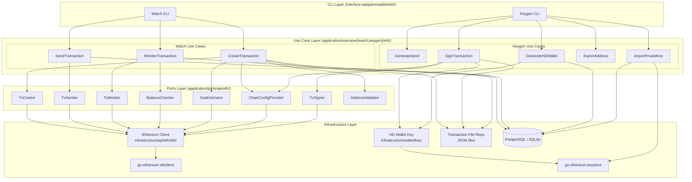
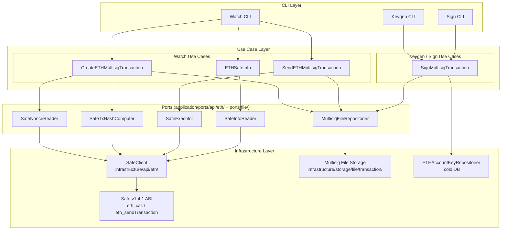

# Ethereum (ETH) Wallet Architecture

This document is the authoritative reference for the ETH module's wallet architecture within go-crypto-wallet's Clean Architecture + 3-wallet security model (Watch / Keygen / Sign).

It covers:

- **Wallet role assignment**: which wallets are required for ETH and why
- **Clean Architecture boundary map**: use case, port, and infrastructure boundaries per wallet
- **Use case assignments**: which wallet owns which use cases
- **Key differences from BTC**: account model, EIP-1559, Safe multisig

> **Related documents:**
> - Chain-agnostic 3-wallet flow: [docs/transaction-flow.md](../../../docs/transaction-flow.md)
> - ETH protocol specifications: [docs/chains/eth/README.md](../../../docs/chains/eth/README.md)
> - ETH Safe multisig details: [docs/chains/eth/multisig.md](../../../docs/chains/eth/multisig.md)
> - BTC reference implementation: [docs/chains/btc/README.md](../../../docs/chains/btc/README.md)

---

## 1. Wallet Roles for ETH

ETH supports two transaction flows with different wallet requirements:

| Wallet | Environment | Single-sig EOA | Safe Multisig | Responsibilities |
|--------|-------------|---------------|---------------|-----------------|
| **Watch** | Online | Required | Required | Create/propose transactions, broadcast/submit, monitor confirmations |
| **Keygen** | Offline (air-gapped) | Required | Required | Generate HD keys, manage keystore, sign (EOA single-sig or Safe owner 1) |
| **Sign** | Offline (air-gapped) | Not required | Required | Sign as Safe owner 2…n (offline EIP-712 signing) |

> **Single-sig EOA** (`keygen sign --file`): Only Watch + Keygen are needed. Keygen holds the EOA private key and signs the raw transaction directly.
>
> **Safe Multisig** (`keygen/sign sign signature --signer-address`): All three wallets participate. Each owner signs the EIP-712 `safeTxHash` independently offline. Watch submits `execTransaction` once the threshold is met.

---

## 2. Use Case Assignments per Wallet

### Watch Wallet

#### Single-sig EOA

| Use Case | Responsibility |
|----------|---------------|
| `CreateTransaction` | Build unsigned EIP-1559 (or legacy) transaction; write to JSON file; save record to DB |
| `SendTransaction` | Read signed JSON file; broadcast via `eth_sendRawTransaction` |
| `MonitorTransaction` | Poll receipt; track confirmation count; update status in DB |

#### Safe Multisig

| Use Case | Responsibility |
|----------|---------------|
| `CreateETHMultisigTransaction` | Call `getTransactionHash` on Safe; write unsigned proposal JSON file |
| `SendETHMultisigTransaction` | Read fully-signed JSON file; call `execTransaction` on Safe contract |
| `ETHSafeInfo` | Read Safe contract state: owners, threshold, nonce, version |

### Keygen Wallet

#### Key Management (shared)

| Use Case | Responsibility |
|----------|---------------|
| `GenerateSeed` | Generate BIP-39 mnemonic; store encrypted seed |
| `GenerateHDWallet` | Derive BIP-44 keys at `m/44'/60'/account'/0/i`; store in DB |
| `ImportPrivateKey` | Import ECDSA key into local keystore (scrypt-encrypted) |
| `ExportAddress` | Export public addresses to file for Watch Wallet import |

#### Single-sig signing

| Use Case | Responsibility |
|----------|---------------|
| **`SignTransaction`** | Read unsigned JSON file; derive child key from xpriv; sign with `LatestSignerForChainID`; write signed JSON file |

#### Safe multisig signing

| Use Case | Responsibility |
|----------|---------------|
| **`SignMultisigTransaction`** | Read proposal JSON file; recompute `safeTxHash` offline via EIP-712; append owner 1 signature; write new JSON file |

### Sign Wallet

#### Safe multisig signing (ETH only)

| Use Case | Responsibility |
|----------|---------------|
| **`SignMultisigTransaction`** | Read partially-signed JSON file; recompute `safeTxHash` offline via EIP-712; append owner N signature; write new JSON file |

> The Sign Wallet is **not used** for ETH single-sig EOA. It is only active in the Safe multisig flow.

---

## 3. Architecture Boundary Map

### Single-sig EOA



### Safe Multisig



---

## 4. Port Interface Responsibilities

### Single-sig EOA Ports

| Port | Methods | Used By |
|------|---------|---------|
| `ChainConfigProvider` | `CoinTypeCode()`, `GetChainConf()` | CreateTx, KeygenSignTx |
| `TxCreator` | `CreateRawTransaction()`, `CreateRawTransactionEIP1559()`, `SupportsEIP1559()` | CreateTx |
| `GasEstimator` | `GasPrice()`, `EstimateGas()`, `SuggestGasTipCap()` | CreateTx |
| `TxSigner` | `SignOnRawTransaction(rawTx, privKey, chainID)` | KeygenSignTx |
| `TxSender` | `SendSignedRawTransaction()` | SendTx |
| `TxMonitor` | `GetTransactionReceipt()`, `GetConfirmation()` | MonitorTx |
| `BalanceChecker` | `GetTotalBalance()`, `BalanceAt()` | MonitorTx |
| `AddressValidator` | `ValidateAddr()` | CreateTx |

The existing `Ethereum` struct (infrastructure) satisfies all small interfaces implicitly via Go's structural typing.

### Safe Multisig Ports (`application/ports/api/eth/`)

| Port | Methods | Used By |
|------|---------|---------|
| `SafeNonceReader` | `GetSafeNonce(ctx, safeAddress)` | CreateETHMultisigTransaction |
| `SafeTxHashComputer` | `GetSafeTxHash(ctx, safe, to, value, data, op, nonce)` | CreateETHMultisigTransaction |
| `SafeExecutor` | `ExecTransaction(ctx, file, gasPayerKey)` | SendETHMultisigTransaction |
| `SafeInfoReader` | `GetSafeInfo(ctx, safeAddress)` | ETHSafeInfo |

### File Port (`application/ports/file/`)

| Port | Methods | Used By |
|------|---------|---------|
| `MultisigFileRepositorier` | `ReadETHMultisigJSONFile()`, `WriteETHMultisigJSONFile()`, `CreateMultisigFilePath()` | Create, Sign, Send multisig use cases |

---

## 5. Signing Detail

### 5a. KeygenSignTx: Offline Single-sig Signing

The `SignTransaction` use case in the Keygen wallet has **no network dependency**.

```
KeygenSignTxUseCase.Sign(filePath)
    │
    ├── Read unsigned JSON file (TransactionFileRepo)
    │     Fields: chain_id, nonce, from, to, value, gas, fee fields, raw_tx_hex
    │
    ├── Load accountXpriv from DB (AccountKeyRepository)
    │
    ├── Derive child private key
    │     hdkeychain: m/44'/60'/account'/0/addressIndex
    │     → *btcec.PrivateKey → *ecdsa.PrivateKey
    │
    ├── Decode raw_tx_hex → types.Transaction (MarshalBinary format)
    │
    ├── Sign transaction (offline, no RPC)
    │     signer := types.LatestSignerForChainID(chainID)
    │     signedTx, err := types.SignTx(tx, signer, privKey)
    │
    ├── Verify sender address
    │     sender := types.Sender(signer, signedTx)
    │     assert sender == from
    │
    └── Write signed JSON file (TransactionFileRepo)
          Adds: signed_tx_hex field
```

**Key design decisions:**

| Decision | Rationale |
|----------|-----------|
| Use `LatestSignerForChainID` not `NewLondonSigner` | Forward-compatible: automatically selects correct signer for any tx type |
| Accept `*ecdsa.PrivateKey` directly in `TxSigner` port | Enables true offline signing without node or keystore RPC dependency |
| Use `MarshalBinary` / `UnmarshalBinary` not RLP | Correct EIP-2718 typed transaction envelope; RLP breaks for Type 2 |
| Verify sender after signing | Detects key derivation index mismatch before writing file |

### 5b. SignMultisigTransaction: Offline EIP-712 Signing (Safe)

The `SignMultisigTransaction` use case is shared by both Keygen and Sign wallets. It has **no network dependency**.

```
SignMultisigTransactionUseCase.Sign(filePath, signerAddress)
    │
    ├── Read proposal JSON file (MultisigFileRepositorier)
    │     Fields: safe_address, to, value, data, operation, gas fields,
    │             nonce, chain_id, safe_tx_hash, threshold, signatures
    │
    ├── Recompute safeTxHash offline (EIP-712)
    │     domainSeparator = keccak256(domainTypeHash || chainID || safeAddress)
    │     safeTxStructHash = keccak256(safeTxTypeHash || ABI-encode(tx fields))
    │     safeTxHash = keccak256("\x19\x01" || domainSeparator || safeTxStructHash)
    │
    ├── Verify: recomputed hash == file.safe_tx_hash → abort if mismatch
    │
    ├── Guard: signerAddress not already in file.signatures
    │
    ├── Load accountXpriv from cold DB (ETHAccountKeyRepositorier)
    │
    ├── Derive child private key (same BIP-44 derivation as single-sig)
    │
    ├── Sign the hash (offline, no RPC)
    │     sig, _ := crypto.Sign(safeTxHash[:], privKey)
    │     sig[64] += 27  // adjust V to Safe's {27, 28} convention
    │
    ├── Append SignEntry{signerAddress, "0x" + hex(sig)} to file.signatures
    │
    ├── If len(signatures) >= threshold → set tx_type = "signed"
    │
    └── Write new JSON file with incremented counter
          {actionType}_multisig_{uuid}_{signCount}.json
```

For the EIP-712 domain and struct type hashes, see `internal/application/usecase/keygen/eth/safe_tx_hash.go`.

---

## 6. Comparison with BTC Pattern

| Aspect | BTC Keygen Sign | ETH Single-sig | ETH Safe Multisig |
|--------|----------------|----------------|-------------------|
| **Transaction format** | PSBT (BIP-174) | EIP-2718 JSON | ETHMultisigTransactionFile JSON |
| **Signing library** | btcd txscript | go-ethereum types.SignTx | go-ethereum crypto.Sign |
| **Key derivation** | xpriv → child WIF | xpriv → child ECDSA | xpriv → child ECDSA (same) |
| **Signer** | ECDSA/Schnorr (Taproot) | ECDSA with chain ID | ECDSA + EIP-712 domain |
| **Multiple inputs** | Derives multiple WIFs for multiple UTXOs | Single key (account model) | Single key per owner |
| **Sign Wallet used?** | Yes (additional PSBT sigs) | No | Yes (owner N signature) |
| **Completeness check** | `UnsignedCount == 0` | Signature present in SignedTxHex | `len(signatures) >= threshold` |
| **Broadcast** | `sendrawtransaction` | `eth_sendRawTransaction` | `execTransaction` (Safe ABI) |

---

## 7. Directory Layout

```
internal/
├── domain/
│   ├── ethereum/
│   │   ├── types.go                    # RawTx, BlockInfo, ResponseGetTransaction
│   │   └── eth_detail_tx.go            # ETHDetailTx entity
│   └── transaction/
│       └── types.go                    # ActionType, TxTypeSigned/Unsigned (shared)
│
├── application/
│   ├── dto/eth/
│   │   └── multisig_transaction_file.go  # ETHMultisigTransactionFile, SignEntry, validation
│   │
│   ├── ports/api/eth/
│   │   ├── interface.go                # Monolithic Ethereumer (legacy, preserved)
│   │   ├── interfaces_small.go         # ISP-compliant small interfaces (EOA single-sig)
│   │   └── interfaces_safe.go          # Safe multisig ports: SafeNonceReader, SafeTxHashComputer, SafeExecutor, SafeInfoReader
│   │
│   ├── ports/file/
│   │   └── multisig_file.go            # MultisigFileRepositorier interface
│   │
│   └── usecase/
│       ├── watch/eth/
│       │   ├── create_transaction.go
│       │   ├── send_transaction.go
│       │   ├── monitor_transaction.go
│       │   ├── create_multisig_transaction.go   # Safe: propose → write _0.json
│       │   ├── send_multisig_transaction.go     # Safe: execTransaction on-chain
│       │   └── safe_info.go                     # Safe: read owners/threshold/nonce
│       └── keygen/eth/
│           ├── sign_transaction.go              # EOA single-sig (Keygen only)
│           ├── sign_multisig_transaction.go     # Safe: EIP-712 sign (Keygen + Sign)
│           ├── safe_tx_hash.go                  # EIP-712 offline hash computation
│           ├── import_private_key.go
│           └── generate_hdwallet.go (shared)
│
└── infrastructure/
    ├── api/eth/
    │   ├── eth/
    │   │   ├── ethereum.go             # Ethereum struct (implements all small interfaces)
    │   │   ├── transaction.go          # CreateRawTransaction, CreateRawTransactionEIP1559
    │   │   └── key.go                  # SignOnRawTransaction, GetPrivKey
    │   ├── ethtx/
    │   │   └── ethtx.go                # MarshalBinary / UnmarshalBinary helpers
    │   └── safe_client.go              # SafeClient: implements all Safe ports
    │
    ├── storage/file/transaction/
    │   └── multisig.go                 # MultisigFileRepositorier implementation
    │
    └── interface-adapters/wallet/eth/
        ├── keygen.go                   # ETHKeygen: wires all Keygen use cases incl. SignTx + SignMultisigTx
        ├── sign.go                     # ETHSign: wires SignMultisigTransaction
        └── watch.go                    # ETHWatch: wires all Watch use cases incl. multisig
```

---

**Document Version:** 1.1
**Last Updated:** 2026-03-08
**Maintainer:** go-crypto-wallet team
