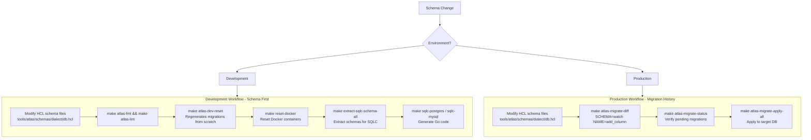

### 4. Development vs Production Workflow

```mermaid
flowchart TD
  A[Schema Change] --> B{Environment?}

  B --> DEV[Development]
  B --> PROD[Production]

  subgraph DEV_FLOW[Development Workflow - Schema First]
    D1[Modify HCL schema files\ntools/atlas/schemas/dialect/db.hcl]
    D2[make atlas-fmt && make atlas-lint]
    D3[make atlas-dev-reset\nRegenerates migrations from scratch]
    D4[make reset-docker\nReset Docker containers]
    D5[make extract-sqlc-schema-all\nExtract schemas for SQLC]
    D6[make sqlc-postgres / sqlc-mysql\nGenerate Go code]
    D1 --> D2 --> D3 --> D4 --> D5 --> D6
  end

  subgraph PROD_FLOW[Production Workflow - Migration History]
    P1[Modify HCL schema files\ntools/atlas/schemas/dialect/db.hcl]
    P2[make atlas-migrate-diff\nSCHEMA=watch NAME=add_column]
    P3[make atlas-migrate-status\nVerify pending migrations]
    P4[make atlas-migrate-apply-all\nApply to target DB]
    P1 --> P2 --> P3 --> P4
  end

  DEV --> DEV_FLOW
  PROD --> PROD_FLOW
```

---
