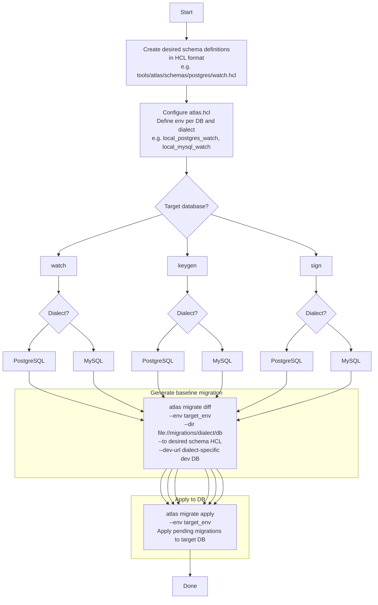

### 1. Initial Setup: Schema Design -> Generate Baseline Migration -> Apply to DB

Key points:

- **`atlas migrate diff`** generates SQL migration files matching the `dev-url` dialect
- **`atlas migrate apply`** applies pending (unapplied) migrations from the migrations directory to the target DB
- Migrations are **separated by dialect and database** to prevent cross-dialect issues (e.g. `migrations/postgres/watch/`, `migrations/mysql/keygen/`)

---
