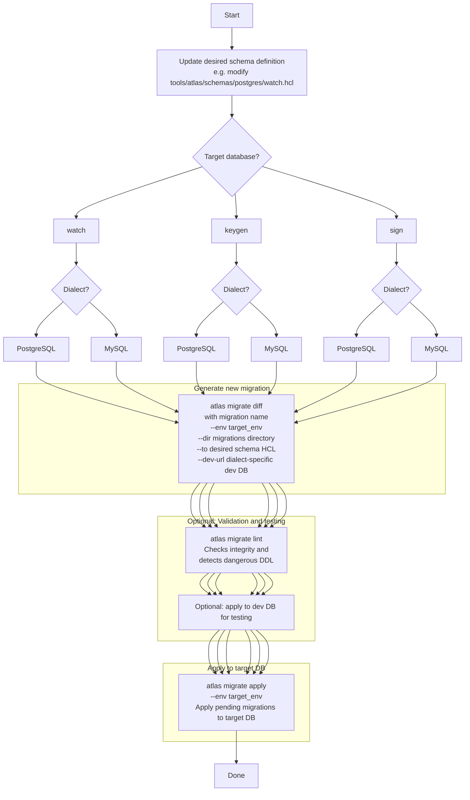

### 2. Schema Change: Update Schema -> Generate New Migration -> Apply to DB

Notes:

- `migrate diff` **auto-generates a diff migration from the current state to the desired state**
- `migrate apply` **applies unapplied migrations in order**
- The `atlas.hcl` env consolidates which DB, migrations directory, and schema source to use

---
