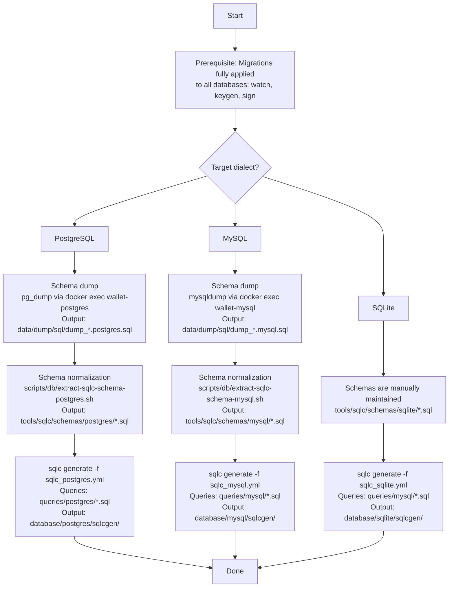
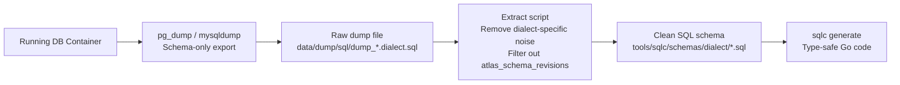
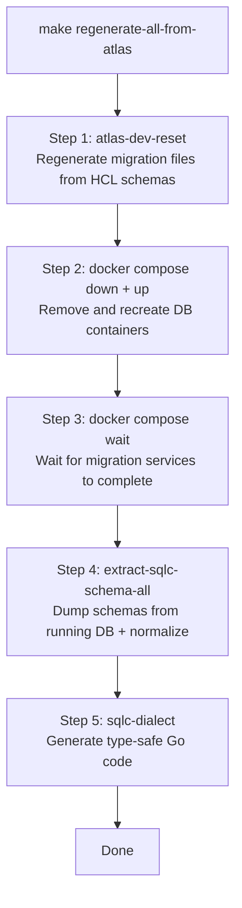

## SQLC Code Generation Flow

This document describes the SQLC code generation pipeline for the three databases (`watch / keygen / sign`) across **PostgreSQL**, **MySQL**, and **SQLite** dialects.

> **Note**: SQLite reuses MySQL query files because their SQL syntax is compatible. SQLite schemas are manually maintained in `tools/sqlc/schemas/sqlite/`.

### Project Structure

```
tools/sqlc/
├── sqlc_postgres.yml           # SQLC config for PostgreSQL
├── sqlc_mysql.yml              # SQLC config for MySQL
├── sqlc_sqlite.yml             # SQLC config for SQLite
├── schemas/
│   ├── postgres/
│   │   ├── 01_watch.sql        # Extracted from running PostgreSQL DB
│   │   ├── 02_keygen.sql
│   │   └── 03_sign.sql
│   ├── mysql/
│   │   ├── 01_watch.sql        # Extracted from running MySQL DB
│   │   ├── 02_keygen.sql
│   │   └── 03_sign.sql
│   └── sqlite/
│       ├── 01_watch.sql        # Manually maintained
│       ├── 02_keygen.sql
│       └── 03_sign.sql
└── queries/
    ├── postgres/*.sql          # PostgreSQL query files (21 files)
    └── mysql/*.sql             # MySQL query files (21 files, also used by SQLite)

scripts/db/
├── extract-sqlc-schema-postgres.sh   # Normalizes pg_dump output for SQLC
└── extract-sqlc-schema-mysql.sh      # Normalizes mysqldump output for SQLC
```

#### Generated Output

```
internal/infrastructure/database/
├── postgres/sqlcgen/           # Generated Go code for PostgreSQL
├── mysql/sqlcgen/              # Generated Go code for MySQL
└── sqlite/sqlcgen/             # Generated Go code for SQLite
```

All generated files contain `// Code generated by sqlc. DO NOT EDIT.` headers.

### Code Generation Flowchart



### Schema Extraction Pipeline

The extract scripts transform raw database dumps into clean SQL that SQLC can parse:



**What the extract scripts do:**

1. Read raw database dump file
2. Extract only `CREATE TABLE` statements
3. Exclude internal tables (`atlas_schema_revisions`; for `sign` schema, also excludes `seed` and `musig2_nonces`)
4. Remove dialect-specific noise (PostgreSQL: `SET`, `SELECT`, `ALTER TABLE OWNER`; MySQL: `DROP TABLE`, conditional comments)
5. Remove schema prefixes (`public.` for PostgreSQL, backticks for MySQL)
6. Add `DO NOT EDIT` comment header
7. Output formatted SQL for SQLC consumption

### Makefile Targets

#### SQLC Code Generation

| Target | Description |
|---|---|
| `make sqlc` | Generate PostgreSQL Go code (default) |
| `make sqlc-postgres` | Alias for `make sqlc` |
| `make sqlc-mysql` | Generate MySQL Go code |
| `make sqlc-sqlite` | Generate SQLite Go code |
| `make sqlc-all` | Generate all dialects (PostgreSQL + MySQL + SQLite) |

#### Schema Dumping

| Target | Description |
|---|---|
| `make dump-schema-watch [DB_DIALECT=postgres\|mysql]` | Export watch schema from running DB |
| `make dump-schema-keygen [DB_DIALECT=postgres\|mysql]` | Export keygen schema from running DB |
| `make dump-schema-sign [DB_DIALECT=postgres\|mysql]` | Export sign schema from running DB |
| `make dump-schema-all [DB_DIALECT=postgres\|mysql]` | Export all three schemas |
| `make dump-schema-all-mysql` | Convenience alias for MySQL |

#### Schema Extraction (Dump + Normalize)

| Target | Description |
|---|---|
| `make extract-sqlc-schema-all [DB_DIALECT=postgres\|mysql]` | Dump + normalize all schemas |
| `make extract-sqlc-schema-all-mysql` | Convenience alias for MySQL |
| `make clean-sqlc-schemas [DB_DIALECT=postgres\|mysql]` | Remove old schema SQL files |

#### Validation

| Target | Description |
|---|---|
| `make sqlc-compile` | Compile SQL queries (PostgreSQL + MySQL) |
| `make sqlc-vet` | Check SQL queries for issues |
| `make sqlc-validate` | Combined compile + vet |
| `make sqlc-lint` | Alias for `sqlc-vet` |

#### Full Regeneration

| Target | Description |
|---|---|
| `make regenerate-sqlc-from-current-db [DB_DIALECT=postgres\|mysql]` | Extract schemas + generate Go code |
| `make regenerate-all-from-atlas [DB_DIALECT=postgres\|mysql]` | Full pipeline: Atlas reset + Docker reset + extract + generate |
| `make regenerate-all-from-atlas-mysql` | Convenience alias for MySQL |

> **Default dialect is PostgreSQL.** Most commands default to `DB_DIALECT=postgres` if not specified.

### Actual Commands

#### PostgreSQL (default)

```bash
# Full regeneration after HCL schema change
make regenerate-all-from-atlas

# Or step by step:
make extract-sqlc-schema-all           # dump + normalize
make sqlc                              # generate Go code
```

#### MySQL

```bash
# Full regeneration after HCL schema change
make regenerate-all-from-atlas DB_DIALECT=mysql

# Or step by step:
make extract-sqlc-schema-all DB_DIALECT=mysql   # dump + normalize
make sqlc-mysql                                  # generate Go code
```

#### SQLite

```bash
# SQLite schemas are manually maintained, no extraction needed
make sqlc-sqlite                       # generate Go code
```

#### All Dialects

```bash
make sqlc-all                          # generate for PostgreSQL + MySQL + SQLite
make sqlc-validate                     # validate all configs
```

### Full Regeneration Workflow (`regenerate-all-from-atlas`)



### SQLC Configuration Summary

| Dialect | Engine | Queries | Schema Source | Output |
|---|---|---|---|---|
| PostgreSQL | `postgresql` | `queries/postgres/*.sql` | `schemas/postgres/*.sql` | `database/postgres/sqlcgen/` |
| MySQL | `mysql` | `queries/mysql/*.sql` | `schemas/mysql/*.sql` | `database/mysql/sqlcgen/` |
| SQLite | `sqlite` | `queries/mysql/*.sql` | `schemas/sqlite/*.sql` | `database/sqlite/sqlcgen/` |

> **Note**: SQLite reuses MySQL query files (`queries/mysql/*.sql`) because their SQL syntax is compatible.
