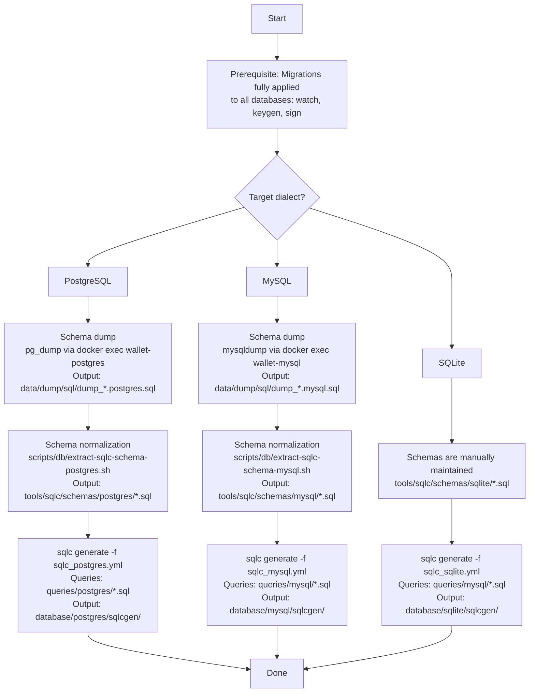

### Code Generation Flowchart

```mermaid
flowchart TD
  A[Start] --> B[Prerequisite: Migrations fully applied\nto all databases: watch, keygen, sign]

  B --> C{Target dialect?}

  C --> PG[PostgreSQL]
  C --> MY[MySQL]
  C --> SQ[SQLite]

  %% PostgreSQL path
  PG --> PG1[Schema dump\npg_dump via docker exec wallet-postgres\nOutput: data/dump/sql/dump_*.postgres.sql]

  %% MySQL path
  MY --> MY1[Schema dump\nmysqldump via docker exec wallet-mysql\nOutput: data/dump/sql/dump_*.mysql.sql]

  %% SQLite path
  SQ --> SQ1[Schemas are manually maintained\ntools/sqlc/schemas/sqlite/*.sql]

  %% Normalize per dialect
  PG1 --> NPG[Schema normalization\nscripts/db/extract-sqlc-schema-postgres.sh\nOutput: tools/sqlc/schemas/postgres/*.sql]
  MY1 --> NMY[Schema normalization\nscripts/db/extract-sqlc-schema-mysql.sh\nOutput: tools/sqlc/schemas/mysql/*.sql]

  %% sqlc generation per dialect
  NPG --> GPG[sqlc generate -f sqlc_postgres.yml\nQueries: queries/postgres/*.sql\nOutput: database/postgres/sqlcgen/]
  NMY --> GMY[sqlc generate -f sqlc_mysql.yml\nQueries: queries/mysql/*.sql\nOutput: database/mysql/sqlcgen/]
  SQ1 --> GSQ[sqlc generate -f sqlc_sqlite.yml\nQueries: queries/mysql/*.sql\nOutput: database/sqlite/sqlcgen/]

  GPG --> Z[Done]
  GMY --> Z
  GSQ --> Z
```
