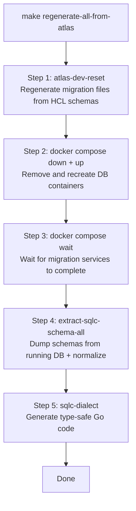

### Full Regeneration Workflow (`regenerate-all-from-atlas`)

```mermaid
flowchart TD
  A[make regenerate-all-from-atlas] --> B[Step 1: atlas-dev-reset\nRegenerate migration files from HCL schemas]
  B --> C[Step 2: docker compose down + up\nRemove and recreate DB containers]
  C --> D[Step 3: docker compose wait\nWait for migration services to complete]
  D --> E[Step 4: extract-sqlc-schema-all\nDump schemas from running DB + normalize]
  E --> F[Step 5: sqlc-dialect\nGenerate type-safe Go code]
  F --> G[Done]
```
