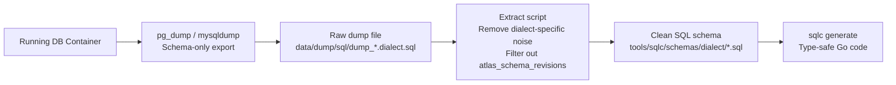

### Schema Extraction Pipeline

The extract scripts transform raw database dumps into clean SQL that SQLC can parse:

**What the extract scripts do:**

1. Read raw database dump file
2. Extract only `CREATE TABLE` statements
3. Exclude internal tables (`atlas_schema_revisions`; for `sign` schema, also excludes `seed` and `musig2_nonces`)
4. Remove dialect-specific noise (PostgreSQL: `SET`, `SELECT`, `ALTER TABLE OWNER`; MySQL: `DROP TABLE`, conditional comments)
5. Remove schema prefixes (`public.` for PostgreSQL, backticks for MySQL)
6. Add `DO NOT EDIT` comment header
7. Output formatted SQL for SQLC consumption
